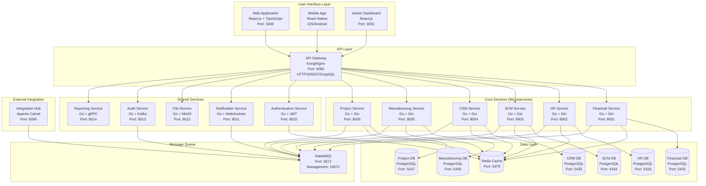
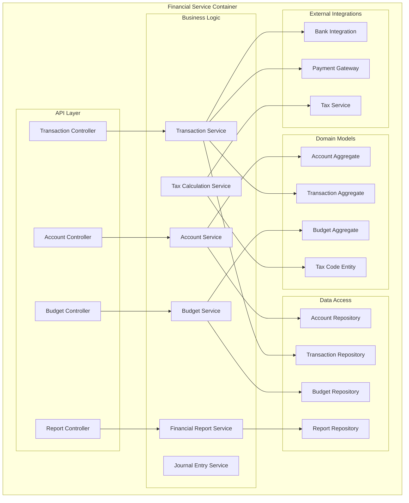
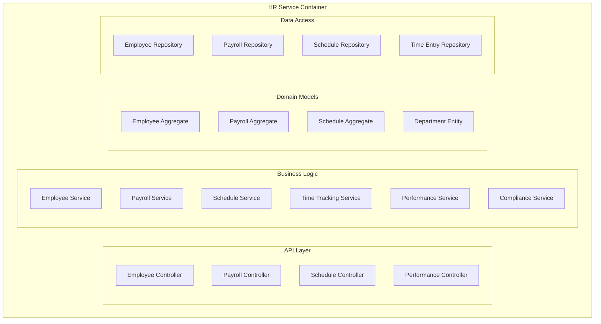
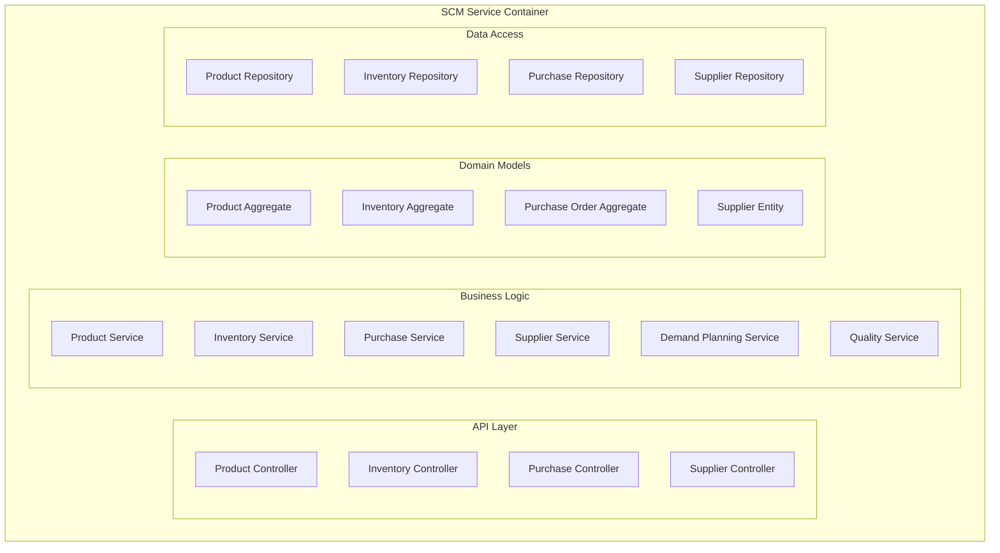

# ERP System - C4 Architecture Model

## Overview
This document presents a comprehensive C4 architecture model for a modern ERP system serving six core business domains: Financial Management (FIN), Human Resources Management (HRM), Supply Chain Management (SCM), Customer Relationship Management (CRM), Manufacturing (MFG), and Project Management (PRJ).

---

## LEVEL 1 - System Context Diagram

### System Boundaries

The ERP system serves as a unified business management platform with clear boundaries separating internal business operations from external systems and users.

```mermaid
graph TB
    subgraph "External Users"
        EU1[Business Owner/CEO]
        EU2[Finance Manager]
        EU3[HR Manager]
        EU4[Operations Manager]
        EU5[Sales Manager]
        EU6[Production Manager]
        EU7[Project Manager]
        EU8[Employees]
        EU9[Customers]
        EU10[Suppliers]
    end
    
    subgraph "ERP System Boundary"
        ERP[Modern ERP System<br/>Integrated Business Management Platform<br/>FIN | HRM | SCM | CRM | MFG | PRJ]
    end
    
    subgraph "External Systems"
        ES1[Banking Systems]
        ES2[Payment Gateways]
        ES3[Government/Tax Systems]
        ES4[Supplier EDI Systems]
        ES5[E-commerce Platforms]
        ES6[Email/SMS Services]
        ES7[Document Management]
        ES8[Business Intelligence Tools]
        ES9[Backup & Recovery]
        ES10[Identity Provider]
    end
    
    %% User Interactions
    EU1 --> ERP
    EU2 --> ERP
    EU3 --> ERP
    EU4 --> ERP
    EU5 --> ERP
    EU6 --> ERP
    EU7 --> ERP
    EU8 --> ERP
    EU9 --> ERP
    EU10 --> ERP
    
    %% System Interactions
    ERP <--> ES1
    ERP <--> ES2
    ERP --> ES3
    ERP <--> ES4
    ERP <--> ES5
    ERP --> ES6
    ERP <--> ES7
    ERP --> ES8
    ERP --> ES9
    ERP <--> ES10
```

### Key System Boundaries

**Internal Boundary**: 
- All core business processes (FIN, HRM, SCM, CRM, MFG, PRJ)
- User management and authentication
- Business logic and workflow engines
- Data storage and processing
- Internal reporting and analytics

**External Boundary**:
- Third-party integrations
- External user interfaces (customer portals, supplier portals)
- Government and regulatory systems
- Cloud services and infrastructure

### External Users & Their Interactions

| User Type | Primary Functions | Key Interactions |
|-----------|-------------------|------------------|
| **Business Owner/CEO** | Strategic oversight, performance monitoring | Executive dashboards, KPI reports, budget approvals |
| **Finance Manager** | Financial planning, reporting, compliance | GL management, financial reports, budget control |
| **HR Manager** | Workforce management, payroll, compliance | Employee records, payroll processing, performance tracking |
| **Operations Manager** | Supply chain, inventory, logistics | Inventory management, supplier relations, order fulfillment |
| **Sales Manager** | Customer relations, sales pipeline | CRM, sales orders, customer service, pricing |
| **Production Manager** | Manufacturing planning, quality control | Production scheduling, BOM management, quality tracking |
| **Project Manager** | Project delivery, resource allocation | Project planning, time tracking, resource management |
| **Employees** | Daily operations, time tracking | Self-service portal, time entry, task management |
| **Customers** | Orders, support, account management | Customer portal, order tracking, invoice access |
| **Suppliers** | Purchase orders, invoicing, delivery | Supplier portal, PO management, delivery scheduling |

### External Systems Integration

**Financial Systems**:
- **Banking APIs**: Real-time account balances, transaction processing, ACH/wire transfers
- **Payment Gateways**: Credit card processing, online payments, recurring billing
- **Tax Systems**: Automated tax filing, compliance reporting, rate updates

**Operational Systems**:
- **Supplier EDI**: Electronic data interchange for purchase orders, invoices, shipping notices
- **E-commerce Platforms**: Inventory synchronization, order import, customer data sync
- **Shipping Carriers**: Rate calculation, label generation, tracking updates

**Infrastructure Systems**:
- **Identity Providers**: Single sign-on (SSO), multi-factor authentication, user provisioning
- **Document Management**: Contract storage, compliance documents, audit trails
- **Communication Services**: Email notifications, SMS alerts, workflow communications

---

## LEVEL 2 - Container Diagram

### Application Architecture



### Container Specifications

#### **User Interface Containers**

**Web Application (Port 3000)**
- **Technology**: React.js with TypeScript, Material-UI/Ant Design
- **Purpose**: Primary user interface for desktop users
- **Features**: Responsive design, real-time updates, offline capabilities
- **Communication**: HTTPS REST API calls, WebSocket for real-time features

**Mobile Application**
- **Technology**: React Native for iOS/Android
- **Purpose**: Mobile access for field employees and managers
- **Features**: Offline sync, push notifications, barcode scanning
- **Communication**: HTTPS REST API, background sync

**Admin Dashboard (Port 3001)**
- **Technology**: React.js with advanced analytics libraries
- **Purpose**: Administrative interface and advanced reporting
- **Features**: System monitoring, user management, configuration
- **Communication**: Direct API calls, real-time monitoring dashboards

#### **API Layer**

**API Gateway (Port 8080)**
- **Technology**: Kong or Nginx with Lua scripting
- **Purpose**: Single entry point, routing, security, rate limiting
- **Features**: 
  - Request routing and load balancing
  - Authentication and authorization
  - Rate limiting and throttling
  - API versioning and documentation
  - Request/response transformation
- **Protocols**: HTTPS, REST, GraphQL
- **Security**: JWT validation, OAuth 2.0, API key management

#### **Core Microservices**

Each service follows identical architectural patterns:

**Technology Stack per Service**:
- **Runtime**: Go 1.21+ with Gin web framework
- **Database**: PostgreSQL 15+ with GORM ORM
- **Caching**: Redis integration for session and data caching
- **Messaging**: RabbitMQ for asynchronous communication
- **Monitoring**: Prometheus metrics, structured logging (logrus)
- **Testing**: Unit tests (testify), integration tests, API tests

**Service Specifications**:

| Service | Port | Database | Primary Responsibilities |
|---------|------|----------|-------------------------|
| **Financial Service** | 8001 | PostgreSQL (5432) | GL, AP, AR, budgeting, financial reporting |
| **HR Service** | 8002 | PostgreSQL (5433) | Employee management, payroll, time tracking |
| **SCM Service** | 8003 | PostgreSQL (5434) | Inventory, purchasing, supplier management |
| **CRM Service** | 8004 | PostgreSQL (5435) | Customer management, sales, marketing |
| **Manufacturing Service** | 8005 | PostgreSQL (5436) | Production planning, BOM, quality control |
| **Project Service** | 8006 | PostgreSQL (5437) | Project management, time tracking, billing |

#### **Shared Services**

**Authentication Service (Port 8010)**
- **Technology**: Go with JWT, bcrypt, OAuth 2.0
- **Purpose**: Centralized authentication and authorization
- **Features**: User management, role-based access control, SSO integration

**Notification Service (Port 8011)**
- **Technology**: Go with WebSockets, email/SMS integrations
- **Purpose**: Real-time notifications and communication
- **Features**: Push notifications, email campaigns, system alerts

**File Service (Port 8012)**
- **Technology**: Go with MinIO object storage
- **Purpose**: Document and file management
- **Features**: File upload/download, document versioning, access control

**Audit Service (Port 8013)**
- **Technology**: Go with Kafka for event streaming
- **Purpose**: Audit trail and compliance logging
- **Features**: Event capture, compliance reporting, data lineage

**Reporting Service (Port 8014)**
- **Technology**: Go with gRPC, report generation libraries
- **Purpose**: Advanced reporting and analytics
- **Features**: Custom reports, scheduled reports, data export

#### **Data Storage**

**PostgreSQL Databases**
- **Version**: PostgreSQL 15+ with high availability setup
- **Configuration**: Master-slave replication, connection pooling
- **Backup**: Automated daily backups with point-in-time recovery
- **Monitoring**: Query performance monitoring, slow query analysis

**Redis Cache (Port 6379)**
- **Purpose**: Session storage, application caching, rate limiting
- **Configuration**: Redis Cluster for high availability
- **Usage**: User sessions, frequently accessed data, temporary data

#### **Message Queue**

**RabbitMQ (Port 5672)**
- **Purpose**: Asynchronous communication between services
- **Features**: Message persistence, dead letter queues, retry mechanisms
- **Exchanges**: Topic-based routing for domain events
- **Monitoring**: Management UI (Port 15672) for queue monitoring

### Communication Protocols

**Synchronous Communication**:
- **REST APIs**: HTTPS with JSON payloads for standard operations
- **GraphQL**: For complex data queries and real-time subscriptions
- **gRPC**: For high-performance inter-service communication

**Asynchronous Communication**:
- **Message Queues**: RabbitMQ for event-driven architecture
- **Event Streaming**: Kafka for audit logs and real-time data processing
- **WebSockets**: For real-time UI updates and notifications

**Security Protocols**:
- **TLS 1.3**: All external communications
- **mTLS**: Inter-service communication in production
- **JWT**: Stateless authentication tokens
- **OAuth 2.0**: Third-party integrations

---

## LEVEL 3 - Component Diagram

### Financial Service Components



#### **Component Responsibilities**

**API Controllers**:
- **Account Controller**: Chart of accounts management, account hierarchies
- **Transaction Controller**: Journal entries, transaction processing, reconciliation
- **Report Controller**: Financial statements, custom reports, dashboards
- **Budget Controller**: Budget creation, variance analysis, forecasting

**Business Services**:
- **Account Service**: Account validation, hierarchy management, account rules
- **Transaction Service**: Transaction validation, posting rules, audit trail
- **Journal Entry Service**: Automated journal entries, period closing
- **Budget Service**: Budget calculations, variance analysis, approval workflows
- **Tax Calculation Service**: Multi-jurisdiction tax calculations, compliance
- **Financial Report Service**: Report generation, data aggregation, formatting

**Domain Models**:
- **Account Aggregate**: Account entity with child accounts, balances, restrictions
- **Transaction Aggregate**: Transaction header with multiple line items
- **Budget Aggregate**: Budget with line items, periods, approval status
- **Tax Code Entity**: Tax rates, jurisdictions, calculation rules

### HR Service Components



### Supply Chain Service Components



### Integration Components

Each service includes standardized integration components:

**Event Publishing**:
- **Domain Event Publisher**: Publishes domain events to message queue
- **Event Handlers**: Processes incoming events from other services
- **Saga Coordinator**: Manages distributed transactions

**Cross-Cutting Concerns**:
- **Logging Service**: Structured logging with correlation IDs
- **Metrics Collector**: Business and technical metrics
- **Health Check**: Service health monitoring and diagnostics
- **Configuration Manager**: Dynamic configuration management

---

## LEVEL 4 - Code Level Architecture

### High-Level Code Structure

#### **Go Service Template Structure**

```
/financial-service
├── /cmd
│   └── /server
│       └── main.go                 # Application entry point
├── /internal
│   ├── /api
│   │   ├── /handlers              # HTTP request handlers
│   │   ├── /middleware            # Custom middleware
│   │   └── /routes                # Route definitions
│   ├── /business
│   │   ├── /services              # Business logic services
│   │   ├── /domain                # Domain models and rules
│   │   └── /events                # Domain events
│   ├── /data
│   │   ├── /repositories          # Data access layer
│   │   ├── /models               # Database models
│   │   └── /migrations           # Database migrations
│   ├── /infrastructure
│   │   ├── /database             # Database connections
│   │   ├── /messaging            # Message queue integration
│   │   ├── /cache                # Redis integration
│   │   └── /external             # External API clients
│   └── /config
│       └── config.go             # Configuration management
├── /pkg
│   ├── /shared                   # Shared utilities
│   └── /proto                    # Protocol buffer definitions
├── /test
│   ├── /unit                     # Unit tests
│   ├── /integration             # Integration tests
│   └── /fixtures                # Test data
├── /deployments
│   ├── Dockerfile
│   ├── docker-compose.yml
│   └── /k8s                     # Kubernetes manifests
├── go.mod
├── go.sum
└── Makefile
```

#### **Key Code Patterns and Classes**

**Domain Aggregate Example (Go)**:
```go
// Account Aggregate Root
type Account struct {
    ID              string
    AccountNumber   string
    Name            string
    Type            AccountType
    ParentID        *string
    Balance         decimal.Decimal
    IsActive        bool
    Children        []Account
    Transactions    []Transaction
    
    // Domain Methods
    func (a *Account) Debit(amount decimal.Decimal) error
    func (a *Account) Credit(amount decimal.Decimal) error
    func (a *Account) CalculateBalance() decimal.Decimal
    func (a *Account) Validate() error
}

// Transaction Aggregate
type Transaction struct {
    ID              string
    Reference       string
    Date            time.Time
    Description     string
    Status          TransactionStatus
    Lines           []TransactionLine
    
    // Domain Methods
    func (t *Transaction) AddLine(accountID string, amount decimal.Decimal, isDebit bool) error
    func (t *Transaction) Post() error
    func (t *Transaction) IsBalanced() bool
}
```

**Service Layer Pattern**:
```go
type AccountService interface {
    CreateAccount(ctx context.Context, req CreateAccountRequest) (*Account, error)
    GetAccount(ctx context.Context, id string) (*Account, error)
    UpdateAccount(ctx context.Context, account *Account) error
    DeleteAccount(ctx context.Context, id string) error
}

type accountService struct {
    repo      AccountRepository
    validator AccountValidator
    events    EventPublisher
    logger    Logger
}

func (s *accountService) CreateAccount(ctx context.Context, req CreateAccountRequest) (*Account, error) {
    // Business logic implementation
    account := &Account{...}
    
    if err := s.validator.Validate(account); err != nil {
        return nil, err
    }
    
    if err := s.repo.Save(ctx, account); err != nil {
        return nil, err
    }
    
    s.events.Publish(AccountCreatedEvent{AccountID: account.ID})
    return account, nil
}
```

**Repository Pattern**:
```go
type AccountRepository interface {
    Save(ctx context.Context, account *Account) error
    FindByID(ctx context.Context, id string) (*Account, error)
    FindByNumber(ctx context.Context, number string) (*Account, error)
    FindChildren(ctx context.Context, parentID string) ([]Account, error)
}

type postgresAccountRepository struct {
    db     *gorm.DB
    logger Logger
}
```

**Event-Driven Architecture**:
```go
// Domain Event
type AccountCreatedEvent struct {
    AccountID   string    `json:"account_id"`
    AccountType string    `json:"account_type"`
    CreatedAt   time.Time `json:"created_at"`
}

// Event Publisher
type EventPublisher interface {
    Publish(event interface{}) error
}

// Event Handler
type AccountEventHandler struct {
    financialService FinancialService
    logger          Logger
}

func (h *AccountEventHandler) HandleAccountCreated(event AccountCreatedEvent) error {
    // Handle the event
    return h.financialService.InitializeAccountBalances(event.AccountID)
}
```

### React Frontend Component Structure

```typescript
// Component Structure
/src
├── /components
│   ├── /common              // Shared components
│   ├── /financial           // Financial domain components
│   ├── /hr                  // HR domain components
│   └── /layout              // Layout components
├── /hooks                   // Custom React hooks
├── /services               // API service clients
├── /store                  // State management (Redux/Zustand)
├── /types                  // TypeScript type definitions
├── /utils                  // Utility functions
└── App.tsx

// Example Component
interface AccountFormProps {
  account?: Account;
  onSave: (account: Account) => void;
  onCancel: () => void;
}

const AccountForm: React.FC<AccountFormProps> = ({ account, onSave, onCancel }) => {
  const [formData, setFormData] = useState<AccountFormData>(initialData);
  const { mutate: saveAccount, isLoading } = useSaveAccount();
  
  const handleSubmit = (data: AccountFormData) => {
    saveAccount(data, {
      onSuccess: (savedAccount) => onSave(savedAccount),
      onError: (error) => showError(error.message)
    });
  };

  return (
    <Form onSubmit={handleSubmit}>
      {/* Form implementation */}
    </Form>
  );
};
```

---

## Technology Recommendations

### Development Stack

**Backend Technologies**:
- **Language**: Go 1.21+ (performance, concurrency, strong typing)
- **Web Framework**: Gin (lightweight, fast, middleware support)
- **ORM**: GORM (Go-friendly, migration support)
- **Database**: PostgreSQL 15+ (ACID compliance, JSON support, performance)
- **Cache**: Redis 7+ (in-memory, persistence, clustering)
- **Message Queue**: RabbitMQ (reliability, routing, management)

**Frontend Technologies**:
- **Framework**: React 18+ with TypeScript (component-based, strong typing)
- **UI Library**: Material-UI or Ant Design (consistent design, accessibility)
- **State Management**: Zustand or Redux Toolkit (predictable state)
- **API Client**: React Query + Axios (caching, synchronization)
- **Build Tool**: Vite (fast development, optimized builds)

**Mobile Technologies**:
- **Framework**: React Native (code sharing, native performance)
- **Navigation**: React Navigation (declarative routing)
- **State**: Same as web (shared business logic)

### Infrastructure & DevOps

**Containerization**:
- **Runtime**: Docker with multi-stage builds
- **Orchestration**: Kubernetes with Helm charts
- **Registry**: Docker Hub or AWS ECR

**CI/CD Pipeline**:
- **Version Control**: Git with GitFlow branching strategy
- **CI/CD**: GitHub Actions or GitLab CI
- **Testing**: Unit tests, integration tests, e2e tests
- **Quality Gates**: Code coverage, security scanning, performance tests

**Monitoring & Observability**:
- **Metrics**: Prometheus + Grafana
- **Logging**: ELK Stack (Elasticsearch, Logstash, Kibana)
- **Tracing**: Jaeger for distributed tracing
- **APM**: Application Performance Monitoring

**Security**:
- **Authentication**: JWT with refresh tokens
- **Authorization**: Role-Based Access Control (RBAC)
- **API Security**: Rate limiting, input validation, CORS
- **Data Protection**: Encryption at rest and in transit
- **Vulnerability Scanning**: Regular security audits

### Cloud Architecture

**AWS Deployment Example**:
- **Compute**: EKS (Kubernetes), EC2 instances
- **Database**: RDS PostgreSQL with read replicas
- **Cache**: ElastiCache Redis
- **Storage**: S3 for file storage, EBS for databases
- **Load Balancer**: ALB with SSL termination
- **CDN**: CloudFront for static assets
- **Monitoring**: CloudWatch integration

**Scalability Considerations**:
- **Horizontal Scaling**: Service replication, load balancing
- **Database Scaling**: Read replicas, connection pooling
- **Caching Strategy**: Multi-level caching, cache invalidation
- **Auto-scaling**: Kubernetes HPA, cluster auto-scaling

This C4 architecture model provides a comprehensive blueprint for building a scalable, maintainable ERP system that can grow with business needs while maintaining clean separation of concerns and modern development practices.