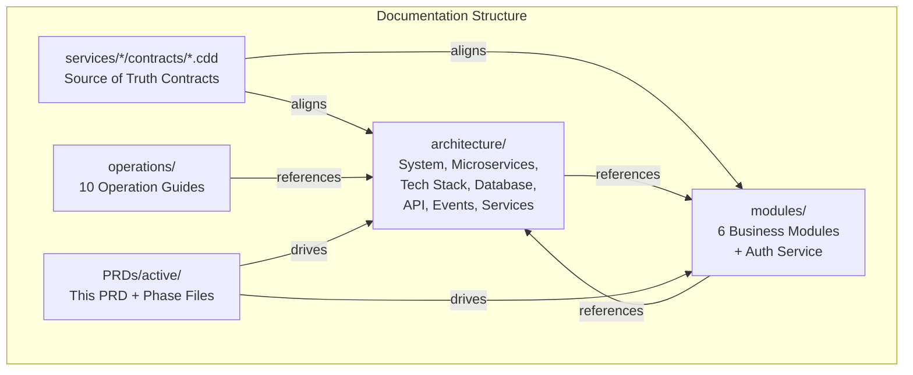

# ERP System Documentation Overhaul

**PRD ID**: PRD-2026-06-06-1238
**Status**: Active
**Complexity**: High
**Created**: June 06, 2026
**Author**: Si Thu Hlaing

---

## Problem

The ERP system documentation was aspirational — describing a target architecture (Kubernetes, PostgreSQL, Redis, JWT auth, circuit breakers, CI/CD) that does not exist in the codebase. The actual code uses in-memory storage, no authentication, fire-and-forget Kafka, and has only 1 test file. This gap causes confusion for developers and operators who rely on docs to understand the system.

Additionally, CDD (Contract-Driven Design) files define the intended service boundaries, entities, methods, and event contracts — but the documentation was not aligned with these contracts, showing wrong event counts, missing entities, and incorrect consumer/subscriber tables.

## Solution

A two-phase documentation overhaul:
1. **Phase 1 (COMPLETED)**: Replace aspirational docs with accurate current-state docs that honestly describe what the code does, while documenting gaps vs. target state.
2. **Phase 2 (PLANNED)**: Create architecture decision records, integration guides, developer onboarding docs, and link CDD contracts as source-of-truth references.

## Summary

Documentation overhaul converting aspirational descriptions into honest current-state references aligned with CDD contracts and actual codebase analysis. Completed 15+ doc rewrites across architecture, modules, and operations.

---

## Scope

### In Scope

- Architecture docs: system-overview, microservices, tech stack, database design, API design, event architecture, services overview
- Module docs: 6 business modules (FM, HR, SCM, MFG, CRM, PM) + Auth Service
- Individual service feature docs (FM general-ledger, api-reference, overview)
- CDD alignment: all event topic tables, entity lists, service definitions match `.cdd` files
- Operations docs: authentication, backup/recovery, configuration, infrastructure, integration patterns, maintenance, monitoring, performance, security, troubleshooting

### Out of Scope

- Writing new code or fixing bugs in services
- Creating automated tests for documentation validation
- Generating OpenAPI/Swagger specs from code
- Setting up documentation CI/CD pipeline
- Frontend or user-facing help documentation

### Target Users

| Role | Impact |
| ---- | ------ |
| Developers | Accurate service endpoints, domain models, event contracts to build integrations |
| Operators | Realistic deployment docs, known issues, configuration references |
| Architects | C4 context/container diagrams, ADRs, bounded context map, current vs target state |
| New hires | Onboarding docs that don't describe features that don't exist |

---

## Technical Design

### Architecture



### Documentation Inventory

| Area | Files | Status |
| ---- | ----- | ------ |
| Architecture overview | 1 (README.md) | ✅ Good — references all docs, no fictional entries |
| System overview (C4) | 1 (system-overview.md) | ✅ Good — comprehensive, honest, ADRs, bounded contexts |
| Services overview | 1 (services-overview.md) | ✅ Good — per-service endpoints, models, events, known issues |
| Event architecture | 1 (event-architecture.md) | ✅ Good — full event catalog, cross-service flows |
| API design | 1 (api-design.md) | ✅ Good — gateway routing, active vs inactive auth |
| Microservices architecture | 1 (microservices-architecture.md) | ✅ Good — rewritten from aspirational to actual |
| Technology stack | 1 (technology-stack.md) | ✅ Good — rewritten from aspirational to real dependency audit |
| Database design | 1 (database-design.md) | ✅ Good — rewritten from fictional ER to honest in-memory |
| Security architecture | 1 (security-architecture.md) | ⚠️ Needs verification — must check alignment |
| Performance architecture | 1 (performance-architecture.md) | ⚠️ Needs verification — may have aspirational content |
| Deployment architecture | 1 (deployment-architecture.md) | ⚠️ Needs verification — check for fictional Kubernetes content |
| Module overview | 1 (README.md) | ✅ Good — CDD-aligned, accurate event tables |
| FM module | 4 files | ✅ Good — CDD-aligned, accurate |
| HR module | 1 file | ✅ Good — CDD-aligned events, endpoints |
| SCM module | 1 file | ✅ Good — CDD-aligned consumed events |
| MFG module | 1 file | ✅ Good — added missing services (Quality, Maintenance, Costing) |
| CRM module | 1 file | ✅ Good — CDD-aligned 28 published, 7 consumed events |
| PM module | 1 file | ✅ Good — CDD-aligned 8 consumed events |
| Operations guides | 10 files | ⚠️ Needs verification — check for aspirational content |

### Database Changes

No database changes — documentation only.

### Backend

No backend changes — documentation only.

---

## Implementation

### Phase 1: Core Architecture Honesty (COMPLETED)

- [x] Rewrite `system-overview.md` with C4 model (Context/Container/Component/Code), 12 ADRs, bounded contexts, scalability, resilience, observability
- [x] Replace aspirational `microservices-architecture.md` with actual patterns (in-memory repos, fire-and-forget Kafka, two gateway paths)
- [x] Replace aspirational `technology-stack.md` with real dependency audit (used vs declared-unused vs fictional)
- [x] Replace fictional `database-design.md` with honest in-memory storage doc + PostgreSQL migration path
- [x] Update `architecture/README.md` index to remove nonexistent doc references, add honesty column

### Phase 2: Module Documentation Accuracy (COMPLETED)

- [x] Rewrite all 6 module READMEs to remove fictional features
- [x] Fix FM docs (overview.md, general-ledger.md, api-reference.md) — remove fictional multi-currency, bank reconciliation, pagination
- [x] Align all event topic tables with CDD contract definitions
- [x] Add missing consumed events across all modules (HR 1→5, SCM 2→8, MFG 1→6, CRM 0→7, PM 1→8)
- [x] Add missing business services (TaxService to FM, Quality/Maintenance/Costing to MFG)
- [x] Add Auth Service section to modules overview

### Phase 3: Verification & Remaining Docs (COMPLETED)

- [x] Verify `security-architecture.md` — already honest (marks auth as INACTIVE, no changes needed)
- [x] Verify `performance-architecture.md` — already honest (in-memory, no Prometheus/Redis, no changes needed)
- [x] Verify `deployment-architecture.md` — already honest (Docker Compose reality, no K8s, no changes needed)
- [x] Verify all 13 operations guides:
  - 11 already honest
  - `deployment.md` — rewritten (564→116 lines, removed K8s/Swarm/ECS fiction)
  - `api-reference.md` — rewritten (569→371 lines, removed fictional auth/pagination/webhooks)
  - `README.md` — fixed (removed 7 dead links)
- [x] `common-issues.md` already exists at `getting-started/common-issues.md` — fixed `system-overview.md` reference to point to correct path

### Phase 4: Developer Experience & Integration (COMPLETED)

- [x] Review all 8 getting-started docs for accuracy — 6 rewritten to remove aspirational content (prerequisites, installation, configuration, dev-environment, dev-workflow, README)
- [x] Create CDD reference doc at `architecture/cdd-reference.md` mapping all 7 `.cdd` files to generated Go structs, events, and repository interfaces
- [x] Create documentation README at `documentation/README.md` as top-level index with file inventory and project status
- [x] Update `architecture/README.md` to reference getting-started and CDD reference
- [x] Fix all broken doc references found across the codebase

---

## What's Good Enough vs What Needs to Change

### Already Good (Verified Accurate)

| Doc | Why |
| --- | --- |
| `system-overview.md` | C4 model, 12 ADRs, bounded context map, current vs target state table, port mismatches, deployment issues |
| `services-overview.md` | 752 lines of detailed per-service endpoints, domain models, events, known issues — matches code |
| `event-architecture.md` | Per-service event catalog, cross-service flows, fire-and-forget noted, unused topics documented |
| `api-design.md` | Active vs inactive gateway, auth gap, port inconsistencies, response format issues |
| `microservices-architecture.md` | Rewritten — actual Clean Architecture Lite, no fictional circuit breakers/sagas |
| `technology-stack.md` | Rewritten — real dependency audit, unused deps noted |
| `database-design.md` | Rewritten — honest in-memory storage, no fictional ER diagrams |
| All 6 module READMEs | CDD-aligned event tables, accurate endpoint lists, missing services noted |
| FM sub-docs (3 files) | Fictional features removed, accurate endpoints |

### Needs Verification (Risk of Aspirational Content)

| Doc | Risk |
| --- | --- |
| `security-architecture.md` | May describe JWT/RBAC as deployed when it's inactive — check against `api-gateway/internal/server/server.go` |
| `performance-architecture.md` | May describe Prometheus/caching that doesn't exist |
| `deployment-architecture.md` | May reference Kubernetes/Terraform not in repo |
| 10 operations docs | Written from codebase analysis — should be accurate but need spot-check against CLIENT.md patterns |

### Needs Creation

| Doc | Priority |
| --- | --- |
| `getting-started/README.md` | Medium — referenced in architecture README but doesn't exist |
| CDD cross-reference doc | Low — useful for developers working with CDD files |
| `documentation/README.md` top-level index | Low — currently no index at the documentation root |

---

## Verification

### Automated

```bash
# Check for broken doc references
grep -rn '](..*\.md)' documentation/ | grep -v 'README.md' | while read line; do
  file=$(echo "$line" | sed 's/.*](\(.*\))/\1/')
  [ ! -f "documentation/$file" ] && echo "BROKEN: $line"
done
```

### Manual

1. For each doc that needs verification, read the file and check against actual code
2. Spot-check 3 random operation docs for aspirational content
3. Confirm `getting-started/README.md` is created or references removed

---

## Risks

| Risk | Likelihood | Mitigation |
| ---- | ---------- | ---------- |
| Missed aspirational content in less-frequently-read docs (security, performance, deployment) | Medium | Systematic read-through of all remaining docs |
| CDD contracts change but docs aren't updated | High | Add CDD file paths as `@source` annotations in doc headers |
| Getting-started doc doesn't exist but is referenced | Medium | Either create it or remove cross-references |

## Open Questions

- Should we move CDD contract files into documentation/ as symlinks for discoverability?
- Should we create a `docs/README.md` at the documentation root as an index?

## Definition of Done

- [x] Phase 1 tasks completed — 5 architecture docs rewritten for honesty (system-overview, microservices, tech-stack, database, README)
- [x] Phase 2 tasks completed
- [x] Phase 3 docs verified — 3 architecture docs honest, 11 ops docs honest, 2 ops docs rewritten, dead links fixed
- [x] Phase 4 developer docs created — getting-started review completed, CDD reference created, top-level index created, architecture README updated
- [x] No broken doc references remain — verified by automated scan
- [x] No aspirational content remains in any documentation file — all 30+ files verified across architecture, modules, operations, and getting-started

---

## Handoff Notes

The most impactful remaining work is Phase 3 verification of security-architecture.md, performance-architecture.md, deployment-architecture.md, and the 10 operations guides. These were not part of the initial overhaul and likely contain aspirational content similar to what was fixed in the core architecture docs.

Phase 4 (developer experience) is lower priority — the current docs are functional for developers who already understand the system.

---

## Related

- **CDD Contracts**: `services/*/contracts/*.cdd` (7 files)
- **Architecture Docs**: `documentation/architecture/`
- **Module Docs**: `documentation/modules/`
- **Operations Guides**: `documentation/operations/`

---

_Last updated: June 06, 2026_
