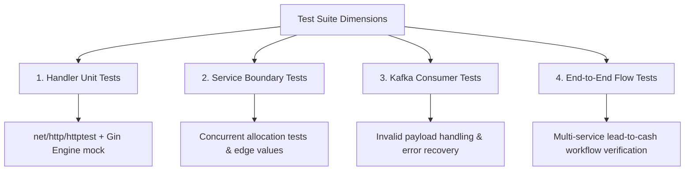

# PRD: Comprehensive Test Coverage Overhaul

**Date**: 2026-06-07  
**Status**: Draft (Proposal)  
**Parent Initiative**: ERP Quality & Reliability Hardening  
**Estimated Effort**: 4-5 days  
**Target Coverage**: >= 80% code coverage across all core business and api layers

---

## 1. Problem Statement

While the current Go microservice codebase passes the high-level API smoke tests via the Gateway (`make test`) and compiles cleanly, the overall unit and integration test coverage is insufficient for production stability. 

Currently, the following critical test gaps exist:
1. **API Handler Gaps**: The Gin HTTP controllers (`handlers/`) lack dedicated unit tests. Request binding validation, custom error mapping, status codes, and mock-service integrations are untested at the unit level.
2. **Kafka Consumer Gaps**: Message consumer functions (e.g. in SCM, Manufacturing, and Auth services) lack structural unit tests checking payload parsing, validation, message serialization, and failure/retry pathways.
3. **Boundary & Edge-Case Testing**: Business services (`service/`) have basic happy-path coverage, but lack stress-tests for race conditions (e.g. concurrent inventory reservations), invalid formats, and boundary inputs.
4. **End-to-End Flow Coverage**: There is no end-to-end (E2E) verification of multi-service transactions (e.g., converting a Lead in CRM, checking stock in SCM, executing production in Manufacturing, invoicing in FM, and receiving payment) in a single unified test environment.
5. **Contract Compliance**: There is no automated assertion that HTTP responses or event payloads exactly match their structural definitions inside the `.cdd` contract files.

---

## 2. Testing Strategy & Dimensions

We will expand our test suite across four specific dimensions:

### 2.1 API Handler Unit Tests (Target: >= 80% Handler Coverage)
For each service, we will create `_test.go` files inside `internal/api/handlers/` to verify:
* **Request Parsing & Validation**: Checking that invalid JSON or missing required fields return `400 Bad Request`.
* **Correct Error Code Mapping**: Checking that domain errors map to correct status codes (e.g. `domain.ErrJournalEntryNotMutable` maps to `409 Conflict`, missing records to `404 Not Found`).
* **Response Shapes**: Confirming payload schemas match CDD definitions.

### 2.2 Business Service Hardening
We will write additional test cases in existing `service/*_test.go` suites:
* **Race Conditions**: Parallel tests verifying concurrent requests (e.g. 10 goroutines reserving the same inventory items simultaneously).
* **Database Invariants**: Ensuring business rules (like account balances or leave limits) remain consistent under invalid transaction states.

### 2.3 Kafka Consumer Tests
We will mock Kafka readers and test:
* Happy-path ingestion and parsing.
* Error cases (malformed JSON payload, invalid IDs).
* Handlers returning database/business failures and ensuring they log or return errors correctly (paving the way for DLQs).

### 2.4 End-to-End (E2E) Flow Tests
We will build a dedicated, multi-service integration flow test. This will run within the docker environment or a local Go orchestrator, simulating a complete ERP customer lifecycle:
1. **Lead Conversion**: Create a CRM Lead -> Convert to Customer & Opportunity.
2. **Sales Order**: Confirm Sales Order -> check that CRM publishes `crm.sales.order.confirmed` event.
3. **SCM Reservation**: Verify SCM consumes the event, reserves inventory, and logs the movement.
4. **Manufacturing**: Trigger a production run if stock is insufficient, complete production, and release finished goods to SCM.
5. **Invoicing**: Generate an Invoice (FM) from SCM shipment -> Process payment -> Verify GL account balances change.

---

## 3. Definition of Done

- [ ] **API Handler Tests**: Unit tests exist for Gin handlers in `auth`, `fm`, `hr`, `scm`, `m`, `crm`, `pm` services.
- [ ] **Kafka Consumer Tests**: Ingestion tests exist for consumers in `scm`, `auth`, `m`, `crm`, `pm` services.
- [ ] **E2E Workflow Test Suite**: A standalone, repeatable shell script or Go test executes a full multi-service business loop.
- [ ] **Code Coverage Targets**: Core business logic and HTTP handler packages achieve `go test -cover` >= 80% coverage.
- [ ] **Validation Integrity**: All tests pass cleanly during local execution (`go test ./...`) and inside Docker containers.

---

## 4. Priority-Ordered Execution Plan

### Phase 1: Service API Handler Unit Testing (P0)
Write controller unit tests for all REST endpoints in the 7 microservices using `httptest` recorders.

| Step | Target Service | Est. Effort | Focus |
|:---:|:---|:---:|:---|
| 1 | `crm-service` Handlers | 0.5d | Leads, Customers, Opportunities, Sales Orders, Customer Interactions. |
| 2 | `fm-service` Handlers | 0.5d | Accounts, Invoices, Payments, Journal Entries. |
| 3 | `hr-service` Handlers | 0.5d | Employees, Departments, Positions, Leaves. |
| 4 | Remaining Services (`scm`, `m`, `pm`, `auth`) | 1.0d | Products, Inventory, BOMs, Projects, User profile/login endpoints. |

### Phase 2: Kafka Consumer Test Coverage (P1)
Introduce unit tests specifically targeting the background Kafka message consumers.

| Step | Target Service | Est. Effort | Focus |
|:---:|:---|:---:|:---|
| 5 | SCM Consumer Tests | 0.5d | Reacting to CRM sales order confirmation, Manufacturing goods completions. |
| 6 | Auth Consumer Tests | 0.25d | Reacting to HR employee termination. |
| 7 | Manufacturing / PM Consumer Tests | 0.5d | Consuming procurement receipts and project material allocations. |

### Phase 3: E2E ERP Workflow Integration Suite (P1)
Create the multi-service orchestration test executing the complete sales-to-cash business process.

| Step | Task | Est. Effort | Focus |
|:---:|:---|:---:|:---|
| 8 | E2E Integration Orchestrator | 1.0d | Implement a Go-based E2E script that drives multiple services in order and asserts state transitions. |

### Phase 4: Business Edge Cases & Coverage Verification (P2)
Tackle boundary conditions and assert code coverage metrics are met.

| Step | Task | Est. Effort | Focus |
|:---:|:---|:---:|:---|
| 9 | Boundary & Concurrency Tests | 0.5d | Race condition test cases for SCM inventory and FM accounts. |
| 10 | Coverage Auditing | 0.25d | Audit overall coverage logs, ensuring all core packages reach the >= 80% goal. |

---

## 5. CDD Contract Compliance Verification (Optional/P2)
To ensure the backend does not drift from the CDD contracts, we can add simple JSON schema checks to the integration suite, automatically validating API response payloads against CDD-declared entity properties.
