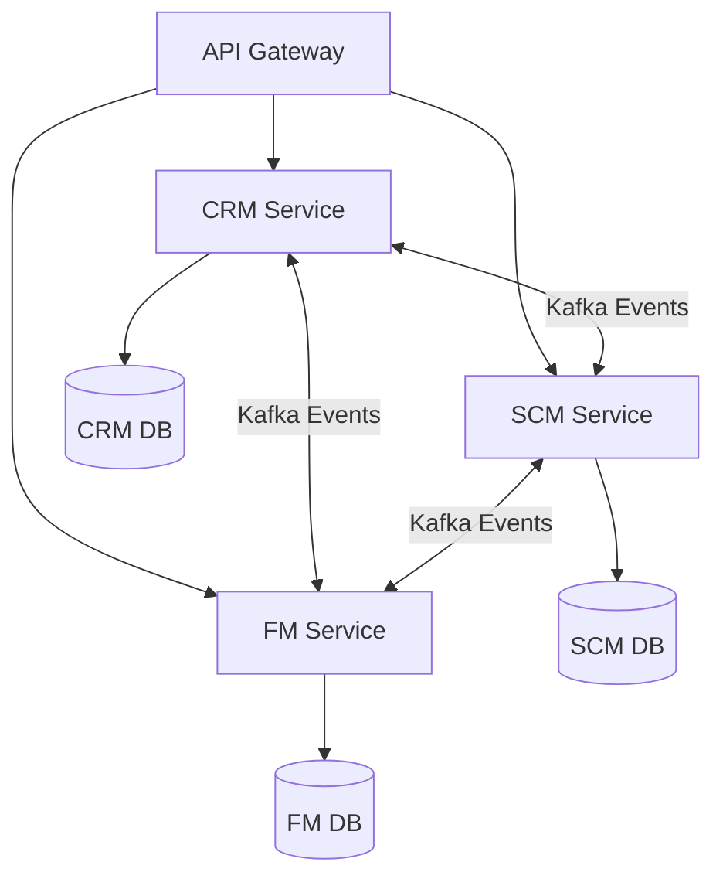

# CDD to Implementation Sync

**PRD ID**: PRD-2026-06-10-1428
**Status**: Draft
**Complexity**: High
**Created**: June 10, 2026
**Author**: google-labs-jules[bot]

---

## Problem

The ERP system has recently undergone a major architectural shift where the scope has been descoped from 9 microservices down to 3 core "Lifeline" microservices: CRM, SCM, and FM. In addition to this, the `.cdd` (Contract-Driven Development) files have been updated to represent the single source of truth for the system's architecture. Currently, the Go implementation (domain structs, repositories, handlers, API routes, and event consumers/producers) does not accurately reflect these latest CDD updates.

## Solution

We need to perform a comprehensive synchronization between the active `.cdd` files and the Go codebase. This involves removing the 6 deprecated services (MFG, PLM, HR, PRJ, EAM, QMS) from the repository, and then strictly enforcing the CDD contracts for the remaining 3 services (CRM, SCM, FM). This means aligning database schemas, updating domain structs, refactoring repositories, aligning HTTP handlers and routes, and ensuring all producer/consumer events match the contracts.

## Summary

Synchronized the Go implementation with the latest CDD contracts by strictly enforcing CRM, SCM, and FM contracts, while removing deprecated service modules.

---

## Scope

### In Scope

- Removal of deprecated modules (MFG, PLM, HR, PRJ, EAM, QMS).
- Synchronization of domain structs for CRM, SCM, and FM with their `.cdd` definitions.
- Alignment of repository interfaces and implementations (Memory/SQL) with the CDD.
- Refactoring of business logic and handlers to match the defined service interfaces and methods in the CDD.
- Alignment of Kafka event producers and consumers to match the `events Emitters` section of the CDD.
- API Gateway routing updates to only expose the active services.

### Out of Scope

- Adding new business features not defined in the `.cdd` files.
- Modifying the frontend application.

### Target Users

| Role | Impact |
| --- | --- |
| Developers | Simpler, more coherent, and strictly-typed codebase that matches the official architecture contracts. |
| DevOps | Fewer services to build, deploy, monitor, and maintain. |

---

## Technical Design

### Architecture



### Database Changes

| Table | Change | Reason |
| --- | --- | --- |
| MFG, PLM, HR, PRJ, EAM, QMS Tables | remove | Services are deprecated |
| CRM, SCM, FM Tables | modify | Align with updated CDD entities |

### Backend

| Component | Changes |
| --- | --- |
| Services | Delete `mfg-service`, `plm-service`, `hr-service`, `prj-service`, `eam-service`, `qms-service` |
| Models | Update domain structs in CRM, SCM, FM to match `@table` and `entity` definitions |
| Services/Handlers | Update methods to match `interface` definitions in `.cdd` |
| Events | Update Kafka publishers/consumers to match `events Emitters` definitions |

### Frontend

| Component | Changes |
| --- | --- |
| Pages | N/A |
| Components | N/A |
| Types | N/A |

---

## Implementation

### Phase 1: Architectural Pruning

- [ ] Delete directories for the 6 deprecated services.
- [ ] Remove the 6 deprecated services from `docker-compose.yml`, `Makefile`, and CI/CD pipelines.
- [ ] Remove proxy routes for the 6 deprecated services from the API Gateway.

### Phase 2: CDD Alignment (CRM, SCM, FM)

- [ ] Parse `crm.cdd`, `scm.cdd`, and `fm.cdd` to extract entities, interfaces, and events.
- [ ] Update Go domain structs (`internal/business/domain/*.go`) to match CDD entities.
- [ ] Update repository interfaces and their Memory/SQL implementations.
- [ ] Update database migration scripts (`schema.sql`) to match CDD `@table` definitions.

### Phase 3: Business Logic & Event Sync

- [ ] Refactor Go service interfaces (`internal/business/service/*.go`) to exactly match CDD `interface` methods.
- [ ] Update HTTP handlers and routes to expose the aligned service methods.
- [ ] Refactor Kafka producers to only publish events defined in the `producer_events` section of the CDD.
- [ ] Refactor Kafka consumers to only listen to events defined in the `consumer_events` section of the CDD, removing stale cross-service dependencies.

---

## Security

| Concern | Mitigation |
| --- | --- |
| Authorization | API Gateway handles JWT validation and RBAC for the 3 active services. |
| Input validation | Ensure handlers correctly validate inputs based on CDD types. |
| Data exposure | Ensure removed services are completely inaccessible. |

---

## Testing

**Automated:**

```bash
make test
```

**Manual Verification:**

1. Run `make run` to boot up the API Gateway and the 3 active services.
2. Verify API endpoints for CRM, SCM, and FM return 200 OK.
3. Verify that requests to deprecated services return 404 Not Found at the API Gateway.

---

## Risks

| Risk | Likelihood | Mitigation |
| --- | --- | --- |
| Broken dependencies | High | Removing 6 services will likely break internal API calls or event consumers. We must meticulously clean up consumers in Phase 3. |
| Data loss | Low | Local databases will be recreated via schema scripts. |

---

## Definition of Done

- [ ] Implementation complete
- [ ] Tests passing
- [ ] Security verified
- [ ] Lint / type checks clean
- [ ] PR approved and merged

---

## Files Changed

| Category | Files | Description |
| --- | --- | --- |
| Backend | `/services/` | Pruning and aligning services |
| Backend | `/api-gateway/` | Removing dead routes |
| Database | `/services/*/migrations/` | Aligning schemas |
| Tests | `/services/*/tests/` | Updating test coverage |

---

## Related

- **Issues**: N/A
- **PRs**: N/A
- **Docs**: `docs/PRDs/active/2026-06-07-0215-service-integration-consistency.md`

---

_Last updated: June 10, 2026_
