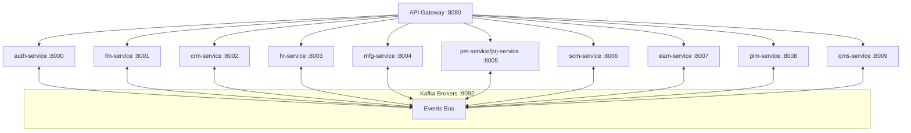

# PRD: Scaling ERP Architecture to 10 Microservices (9 Business Modules + Auth)

**Date**: 2026-06-12  
**Status**: Approved & Implemented  
**Parent Initiative**: ERP Complete Architecture Expansion  
**PRD ID**: PRD-2026-06-12-0921  
**Estimated Effort**: 5-7 days  
**Target Coverage**: >= 80% code coverage on all new microservice layers  

---

## 1. Objective & Problem Statement

Currently, the ERP system is configured to run and deploy **7 modules** in `docker-compose.yml` and the root `Makefile`:
1. `auth-service` (Core Identity & Auth)
2. `fm-service` (Financial Management)
3. `hr-service` (Human Resources)
4. `scm-service` (Supply Chain Management)
5. `mfg-service` (Manufacturing)
6. `crm-service` (Customer Relationship Management)
7. `pm-service` / `prj-service` (Project Management)

While Contract-Driven Development (`.cdd`) files exist for the three remaining modules under `/contracts`:
- **Enterprise Asset Management (EAM)** (`eam.cdd`)
- **Product Lifecycle Management (PLM)** (`plm.cdd`)
- **Quality Management System (QMS)** (`qms.cdd`)

These three modules do not have any Go implementations (models, repositories, services, HTTP routes/handlers) or event messaging definitions. To scale the ERP system to the full target of **9 core business modules** (10 total microservices including Auth), we need to implement these three modules from their CDD contracts, integrate them with the API Gateway, configure Kafka event exchanges, and establish their database migrations.

---

## 2. System Architecture (10 Services Topology)

The updated system architecture exposes 9 business services and the Auth Gateway:



### Routing Matrix

| Route Prefix | Service Name | Internal Port | External Proxy |
| --- | --- | --- | --- |
| `/api/v1/auth/*` | `auth-service` | 8000 | Port 8080 |
| `/api/v1/fm/*` | `fm-service` | 8001 | Port 8080 |
| `/api/v1/crm/*` | `crm-service` | 8002 | Port 8080 |
| `/api/v1/hr/*` | `hr-service` | 8003 | Port 8080 |
| `/api/v1/mfg/*` | `mfg-service` | 8004 | Port 8080 |
| `/api/v1/pm/*` | `prj-service` | 8005 | Port 8080 |
| `/api/v1/scm/*` | `scm-service` | 8006 | Port 8080 |
| `/api/v1/eam/*` | `eam-service` | 8007 | Port 8080 |
| `/api/v1/plm/*` | `plm-service` | 8008 | Port 8080 |
| `/api/v1/qms/*` | `qms-service` | 8009 | Port 8080 |

---

## 3. Module Specifications & Parity Mapping

For each new service, the models, interfaces, and Kafka event boundaries will be derived from their `.cdd` contracts.

### 3.1 Enterprise Asset Management (EAM) — Port 8007

* **CDD Source**: `services/eam-service/contracts/eam.cdd`
* **Core Entities**:
  * `Facility` (`eam_facilities`): Handles legal entity physical facilities.
  * `Equipment` (`eam_equipment`): Tracks physical machinery and status (ONLINE, OFFLINE_BROKEN, IN_MAINTENANCE, DECOMMISSIONED).
  * `MaintenanceWorkOrder` (`eam_work_orders`): Incident tracking and repair work orders.
  * `PreventativeSchedule` (`eam_pm_schedules`): Interval-based scheduled maintenance checks.
  * `TelemetryIngestBuffer` (`eam_telemetry_ingest_buffer`): Buffers incoming high-volume telemetry sensor readings.
  * `TransactionalOutbox` / `KafkaEventInbox`: Assures multi-tenant event delivery.
* **Service Interfaces**:
  * `EquipmentService`: `CreateFacility`, `RegisterEquipment`, `UpdateEquipmentStatus`, `AssociateFinancialAsset`, `FetchTargetTenantAssets`.
  * `MaintenanceService`: `FileMachineIncident`, `RouteToTechnician`, `TransitionToActiveState`, `FinalizeResolution`, `ProcessCronSchedulerLookups`.
  * `TelemetryIngestionService`: `QueueSensorMetrics`, `FlushStagedMetricsToTimeSeriesStore`.
* **Kafka Event Boundary**:
  * **Produces**:
    * `eam.machine.offline`: Fired when equipment status transitions to `OFFLINE_BROKEN`.
    * `eam.machine.online`: Fired when repairs resolve and status is set back to `ONLINE`.
    * `eam.workorder.spares_requested`: Emitted when repairs need materials from Supply Chain.
  * **Consumes**:
    * `scm.asset.received`: Triggers registration of new equipment upon delivery receipt.
    * `fm.asset.capitalized`: Associates capital asset tags from Finance.
    * `hr.employee.created`: Syncs employee details for assigning techs.

### 3.2 Product Lifecycle Management (PLM) — Port 8008

* **CDD Source**: `services/plm-service/contracts/plm.cdd`
* **Core Entities**:
  * `MaterialMaster` (`plm_materials`): Central inventory catalog (MAKE, BUY, ASSEMBLE).
  * `BomHeader` (`plm_bom_headers`): Recipe structure headers for assembly version control.
  * `BomLine` (`plm_bom_lines`): Individual components in a BOM with scrap ratios.
  * `EngineeringChangeOrder` (`plm_engineering_change_orders`): Workflow auditing changes.
* **Service Interfaces**:
  * `MaterialService`: `CreateMaterial`, `UpdateTechnicalSpecs`, `TransitionStatus`.
  * `BomService`: `EstablishBomHeader`, `ReleaseBom`, `ExplodeBillOfMaterials`.
  * `EngineeringChangeService`: `InitiateChangeRequest`, `ProcessApprovalAction`.
* **Kafka Event Boundary**:
  * **Produces**:
    * `plm.material.released`: Fired when new materials are approved for production.
    * `plm.material.obsoleted`: Emitted when material status changes to `OBSOLETE`.
    * `plm.bom.released`: Emitted when assembly recipes are locked and versioned.
    * `plm.eco.implemented`: Published on approval of change requests.
  * **Consumes**:
    * `scm.receipt.staged`: Notifies of incoming component stocks.
    * `mfg.material.consumed`: Tracks consumption cycles to adjust lifespan limits.
    * `hr.employee.created`: Syncs credentials for engineering review teams.

### 3.3 Quality Management System (QMS) — Port 8009

* **CDD Source**: `services/qms-service/contracts/qms.cdd`
* **Core Entities**:
  * `InspectionPlan` (`qms_inspection_plans`): Testing templates linked to material SKUs.
  * `InspectionMetricDefinition` (`qms_inspection_metric_definitions`): Parameters to check (Numeric bounds, Boolean checks).
  * `QualityInspection` (`qms_quality_inspections`): Actual inspection executions (INBOUND_RECEIPT, PRODUCTION_YIELD).
  * `InspectionResultLine` (`qms_inspection_results`): Logged samples (supports monthly database partitioning).
  * `NonConformanceLog` (`qms_non_conformances`): Tracks defective batches, quarantine states, and disposition actions.
* **Service Interfaces**:
  * `InspectionPlanService`: `ConfigurePlan`, `RegisterPlanMetric`.
  * `InspectionExecutionService`: `StageInspection`, `AssignInspector`, `RecordBulkMeasurements`.
  * `NonConformanceService`: `LogFailureIncident`, `ExecuteDisposition`.
* **Kafka Event Boundary**:
  * **Produces**:
    * `qms.inspection.passed`: Notifies that product batch complies with plans.
    * `qms.inspection.failed`: Notifies of test failures, auto-quarantining items.
    * `qms.disposition.executed`: Broadcasts rework, scrap, or return-to-vendor actions.
  * **Consumes**:
    * `scm.receipt.staged`: Triggers incoming quality checks for received shipments.
    * `mfg.yield.produced`: Triggers manufacturing product quality verification inspections.
    * `hr.employee.created`: Syncs employee data for designated inspectors.

---

## 4. Priority-Ordered Execution Plan

### Phase 1: Service Scaffolding & Code Generation (P0)
Establish folders and run the `cdd-engine` to generate domain models and migration scripts.
* **Step 1**: Create empty directories: `services/eam-service`, `services/plm-service`, `services/qms-service` with `Dockerfile`, `go.mod`, and `Makefile`.
* **Step 2**: Execute `cdd-cli` generator to parse `.cdd` contracts and generate code:
  ```bash
  # Go models generation
  go run cdd-engine/main.go -cdd services/eam-service/contracts/eam.cdd -go-out services/eam-service/internal/business/domain
  go run cdd-engine/main.go -cdd services/plm-service/contracts/plm.cdd -go-out services/plm-service/internal/business/domain
  go run cdd-engine/main.go -cdd services/qms-service/contracts/qms.cdd -go-out services/qms-service/internal/business/domain

  # SQL migrations generation
  go run cdd-engine/main.go -cdd services/eam-service/contracts/eam.cdd -sql-out services/eam-service/internal/data/migrations
  go run cdd-engine/main.go -cdd services/plm-service/contracts/plm.cdd -sql-out services/plm-service/internal/data/migrations
  go run cdd-engine/main.go -cdd services/qms-service/contracts/qms.cdd -sql-out services/qms-service/internal/data/migrations
  ```

### Phase 2: Core Domain & Repository Services (P0)
Implement DB connection wrappers, GORM models, repository layers, and schema migrations.
* **Step 3**: Configure DB connections utilizing `shared/utils` and run schema migrations on startup.
* **Step 4**: Implement Repository interfaces (Memory and GORM/SQL) for EAM, PLM, and QMS.
* **Step 5**: Write GORM/PostgreSQL adapters matching entities (e.g. `plm_materials`, `eam_work_orders`).

### Phase 3: Business Logic Services & HTTP Handlers (P1)
Create Clean Architecture business logic services and map Gin routes.
* **Step 6**: Implement core logic handlers matching CDD interfaces (e.g., `EquipmentService`, `BomService`, `NonConformanceService`).
* **Step 7**: Code controller handlers inside `internal/api/handlers/` and bind route endpoints inside `internal/api/routes/`.
* **Step 8**: Add `/health` checks to each service to ensure compatibility with gateway health checks.

### Phase 4: Kafka Broker Event Producers & Consumers (P1)
Establish the reliable transactional outbox workers and message consumer listeners.
* **Step 9**: Setup Kafka event producers using `shared/kafka` to write to the outbox table.
* **Step 10**: Wire up event consumers in background worker threads that listen to target incoming topics:
  - `eam-service` listens to `scm.asset.received`, `fm.asset.capitalized`
  - `plm-service` listens to `scm.receipt.staged`, `mfg.material.consumed`
  - `qms-service` listens to `scm.receipt.staged`, `mfg.yield.produced`
* **Step 11**: Incorporate the `KafkaEventInbox` pattern to prevent double-processing and guarantee idempotency.

### Phase 5: Routing Gateway & Environment Integration (P2)
Expose the routes through the proxy gateway and register services in docker environment configs.
* **Step 12**: Update `api-gateway/internal/config` and routing middleware to proxy EAM (:8007), PLM (:8008), and QMS (:8009) requests.
* **Step 13**: Add services to `docker-compose.yml` with dependencies on `kafka` and `postgres`.
* **Step 14**: Append services to the root `Makefile` (`run`, `build`, `stop`, `health`, `test` rules).

---

## 5. Definition of Done

- [x] Skeletons for `eam-service`, `plm-service`, and `qms-service` compile cleanly without errors.
- [x] Database migrations successfully create tables (`eam_equipment`, `plm_materials`, etc.) on start.
- [x] Gin REST controllers expose required methods for equipment status updates, BOM explosions, and non-conformances.
- [x] Kafka consumers start in background threads and successfully process simulated incoming message envelopes.
- [x] Gateway forwards routes to ports 8007, 8008, 8009 correctly.
- [x] Unit tests cover service and handler layers with >= 80% coverage.
- [x] Integration checks pass successfully (`make test` completes with 200 OK responses).
