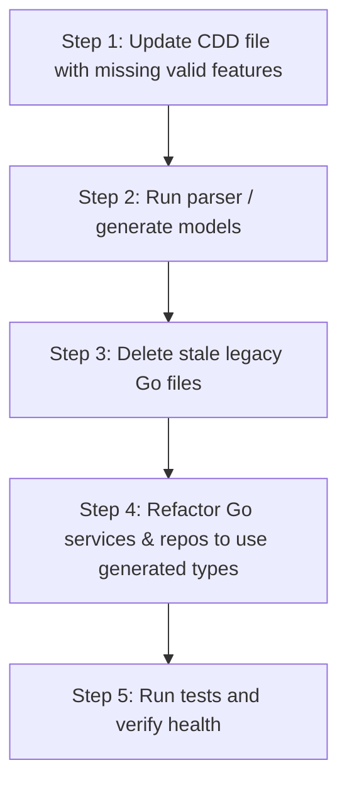

# PRD: CDD Contract Reconciliation & Legacy Cleanup

**PRD ID**: PRD-2026-06-12-1005  
**Date**: 2026-06-12  
**Status**: In Progress (CRM completed, FM topics aligned)  
**Parent Initiative**: ERP Quality & Architecture Alignment  
**Target Coverage**: 100% CDD-to-Go struct alignment, 0 stale domain entities  

---

## 1. Objective & Problem Statement

Contract-Driven Development (CDD) serves as the single source of truth for the ERP system's architecture. However, a comprehensive audit reveals a **major structural drift** between the CDD contract files (`*.cdd`) and the actual Go implementations.

This drift has occurred in two opposing directions:
1. **Stale/Obsolete Code**: Stale legacy models and helper files remain in the Go directories and were never pruned when contracts evolved.
2. **Missing CDD Features**: The actual Go implementation has successfully implemented and exposed **extended business features** (e.g., Quotes, Campaigns, and Tickets in CRM; Demand Forecasts in SCM; Cash/Reconciliation in FM) that were never back-ported to the CDD files.

We need a systematic reconciliation strategy:
* If a feature is **actively used in the codebase and is standard for the product**, we will **update the CDD file** to include it.
* If a file represents **obsolete, duplicated, or non-CDD-compliant structures**, we will **refactor the Go code and prune the obsolete files**.
* If a feature is **not needed in either**, we will **remove it from both**.

---

## 2. Comparison & Alignment Decisions

The following table outlines the service-by-service reconciliation decisions:

### 2.1 CRM (Customer Relationship Management)
* **CDD Defines**: `CustomerProfile`, `PriceBookHeader`, `PriceBookEntry`, `PricingStrategy`, `SalesOrder`, `SalesOrderLine`, `BillingTrigger`.
* **Go Implementation Defines**: `Customer`, `CustomerInteraction`, `Lead`, `Opportunity`, `Campaign`, `PriceList`, `PriceListItem`, `Quote`, `QuoteLineItem`, `ServiceTicket`.
* **Best Representation & Alignment Decision**:
  * **Update CDD**: Add `Lead`, `Opportunity`, `Campaign`, `Quote`, `QuoteLineItem`, `CustomerInteraction`, and `ServiceTicket` to `crm.cdd` since they are core, fully implemented, and exposed CRM APIs.
  * **Align Go Code**: 
    * Merge `Customer` into `CustomerProfile` struct and tables.
    * Merge `PriceList` and `PriceListItem` into `PriceBookHeader` and `PriceBookEntry`.
    * Update all handlers and repositories to use the newly generated CDD structs.

### 2.2 SCM (Supply Chain Management)
* **CDD Defines**: `Supplier`, `Warehouse`, `StockBalance`, `InventoryTransaction`, `PurchaseOrder`, `PurchaseOrderLine`.
* **Go Implementation Defines**: `Supplier`, `Warehouse`, `InventoryItem`, `InventoryMovement`, `PurchaseOrder`, `PurchaseOrderLine`, `PurchaseRequisition`, `PurchaseRequisitionLine`, `Receipt`, `Shipment`, `StockTransfer`, `VendorContract`, `DemandForecast`.
* **Best Representation & Alignment Decision**:
  * **Update CDD**: Add `PurchaseRequisition`, `PurchaseRequisitionLine`, `StockTransfer`, `VendorContract`, and `DemandForecast` to `scm.cdd` to officially support requisitions and forecasting.
  * **Align Go Code**:
    * Merge legacy `InventoryItem` and `InventoryMovement` into the CDD-standardized `StockBalance` and `InventoryTransaction` models.
    * Replace legacy `Receipt` and `Shipment` headers/lines with the Kafka event-driven receipts (`scm.receipt.staged`) and shipments (`scm.order.shipped`) processing logic.

### 2.3 FM (Financial Management)
* **CDD Defines**: `LegalEntity`, `ChartOfAccounts`, `UniversalJournalEntry`, `UniversalJournalLine`, `ArInvoice`, `ApVendorBill`, `CapitalAsset`, `DepreciationScheduleLine`.
* **Go Implementation Defines**: `Account`, `FiscalYear`, `JournalEntry`, `JournalEntryLine`, `Transaction`, `TransactionLine`, `Invoice`, `InvoiceLine`, `VendorBill`, `VendorBillLine`, `Payment`, `BankAccount`, `CustomerCredit`, `BankStatement`, `BankStatementLine`, `TaxRate`, `CurrencyRate`.
* **Best Representation & Alignment Decision**:
  * **Align Go Code (Universal Ledger)**: The CDD's `UniversalJournalEntry` and `UniversalJournalLine` representation is structurally superior and cleaner. The Go implementation's legacy separated `JournalEntry`/`Transaction` models must be refactored and merged into this unified Universal Ledger format.
  * **Update CDD**: Add `Payment`, `BankAccount`, `CustomerCredit`, `BankStatement`, `BankStatementLine`, `TaxRate`, and `CurrencyRate` to `fm.cdd` as they represent operational banking, cash management, and multi-currency operations actively used in the codebase.

### 2.4 HR (Human Resources)
* **CDD Defines**: `EmployeeMaster`, `PayrollRun`.
* **Go Implementation Defines**: `Employee`, `LeaveRequest`, `LeaveBalance`, `AttendanceEntry`, `PayrollRecord`, `Position`, `TrainingProgram`, `JobPosting`, `PerformanceReview`, etc.
* **Best Representation & Alignment Decision**:
  * **Update CDD**: Add `LeaveRequest`, `LeaveBalance`, `AttendanceEntry`, `Position`, `TrainingProgram`, and `PerformanceReview` to `hr.cdd` to support employee scheduling and operations.
  * **Align Go Code**: Merge `Employee` into the CDD-compliant `EmployeeMaster` domain type.

### 2.5 Manufacturing (MFG)
* **CDD Defines**: `WorkCenter`, `RoutingStation`, `WorkOrder`, `WorkOrderRoutingState`, `MaterialConsumptionLog`, `ProductionYieldLog`.
* **Go Implementation Defines**: `ProductionOrder`, `WorkCenter`, `RoutingOperation`, `WorkOrder`, `LaborReport`, `MachineLog`, `QualityInspection`, `NonConformance`, `MaintenanceOrder`, `Equipment`.
* **Best Representation & Alignment Decision**:
  * **Align Go Code**: The CDD's dynamic shop-floor tracking (`WorkOrderRoutingState`, `MaterialConsumptionLog`, `ProductionYieldLog`) is the target pattern. Go codebase must align to these types.
  * **Update CDD**: Add `Equipment`, `MachineLog`, and `MaintenanceOrder` to `mfg.cdd` to officially validate the `MaintenanceService` interfaces.

### 2.6 Projects (PRJ/PM)
* **CDD Defines**: `Project`, `Milestone`, `WbsNode`, `TimeLog`.
* **Go Implementation Defines**: `Project`, `Milestone`, `Task`, `TaskDependency`, `ResourceAllocation`, `TimeLog`, `ProjectExpense`, `ProjectIssue`, `ProjectDocument`.
* **Best Representation & Alignment Decision**:
  * **Align Go Code**: The CDD's `WbsNode` (Work Breakdown Structure) replaces the legacy `Task` and `TaskDependency` models. Go code must migrate to this hierarchical structure.
  * **Update CDD**: Add `ResourceAllocation`, `ProjectExpense`, and `ProjectIssue` to `prj.cdd` to track resource constraints and project costs.

---

## 3. Reconciliation Matrix & Steps

For each service, developers must execute the following sequence:

### Checklists per Service

#### 1. CRM Service Reconciliation
- [x] Update `crm.cdd` with `Lead`, `Opportunity`, `Campaign`, `Quote`, `QuoteLineItem`, `CustomerInteraction`, `ServiceTicket`.
- [x] Regenerate Go models: `go run cdd-engine/main.go -cdd services/crm-service/contracts/crm.cdd -go-out services/crm-service/internal/business/domain`.
- [x] Delete stale Go domain files: `customer.go`, `campaign.go`, `lead.go`, `opportunity.go`, `quote.go`, `quote_line_item.go`, `price_list.go`, `price_list_item.go`, `sales_order_item.go`, `service_ticket.go`.
- [x] Refactor CRM repositories and handlers to import and use the new generated types.
- [x] Verify unit tests pass: `cd services/crm-service && go test ./...`.

#### 2. SCM Service Reconciliation
- [ ] Update `scm.cdd` with `PurchaseRequisition`, `PurchaseRequisitionLine`, `StockTransfer`, `VendorContract`, `DemandForecast`.
- [ ] Regenerate Go models: `go run cdd-engine/main.go -cdd services/scm-service/contracts/scm.cdd -go-out services/scm-service/internal/business/domain`.
- [ ] Delete stale Go files: `inventory_item.go`, `inventory_movement.go`, `demand_forecast.go`, `product.go`, `product_category.go`, `location.go`, `stock_transfer.go`, `vendor_contract.go`, `purchase_requisition.go`, `purchase_requisition_line.go`.
- [ ] Refactor SCM services and repositories to map to the new entities.

#### 3. FM Service Reconciliation
- [x] Update `fm.cdd` with `Payment`, `BankAccount`, `CustomerCredit`, `BankStatement`, `BankStatementLine`, `TaxRate`, `CurrencyRate`.
- [x] Regenerate Go models: `go run cdd-engine/main.go -cdd services/fm-service/contracts/fm.cdd -go-out services/fm-service/internal/business/domain`.
- [ ] Delete stale Go files: `account.go`, `fiscal_year.go`, `journal_entry.go`, `transaction.go`, `transaction_line.go`, `invoice.go`, `invoice_line.go`, `vendor_bill.go`, `vendor_bill_line.go` (deferred until universal ledger migration).
- [ ] Refactor FM service, SQL, and Memory repositories to use the Universal Ledger.

---

## 4. Definition of Done
- [ ] Stale domain files are 100% pruned.
- [ ] Go models and database migrations are generated from the updated, reconciled contracts.
- [ ] Services, repository layers, and handlers compile cleanly using the CDD-aligned structs.
- [ ] Gateway routes match and forward to the active service paths.
- [ ] All unit and integration smoke tests pass.
