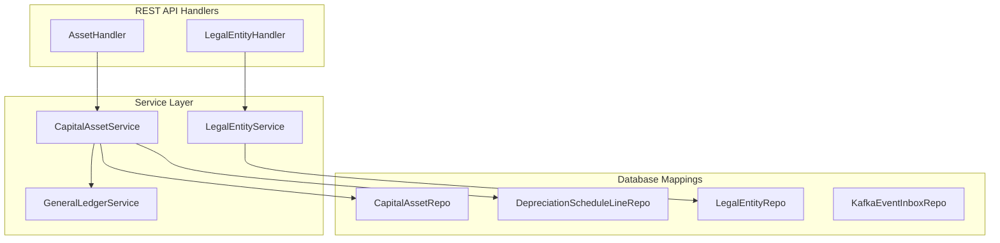

# PRD: FM Fixed Asset Management, Event Deduplication, and Tenant Expansion

**PRD ID**: PRD-2026-06-13-0126  
**Date**: 2026-06-13  
**Status**: Approved (Implemented)  
**Parent Initiative**: Financial Completeness & Integration Standardization  
**Target Coverage**: 100% CDD Interface Compliance, Event Deduplication, and Multi-tenant Setup  

---

## 1. Objective & Problem Statement

To achieve full completeness and alignment with the `fm.cdd` contract specification, the Financial Management (`fm-service`) microservice needs to address the following three remaining functional gaps:
1. **Fixed Asset Management**: The GORM structures and SQL schemas for `CapitalAsset` and `DepreciationScheduleLine` are defined, but the business services and REST routes do not implement capitalization or straight-line depreciation calculations.
2. **Event Deduplication (Idempotency)**: The consumer layer currently processes incoming Kafka messages directly. Without verifying if an event was already processed against a `KafkaEventInbox` store, the microservice is vulnerable to duplicate event delivery issues.
3. **Legal Entity CRUD Operations**: The database tables and foreign keys reference a multi-tenant `LegalEntityID` partitioning shield, but the API provides no endpoints to manage `LegalEntity` records, making it difficult to onboard new companies.

---

## 2. Technical Scope & Architecture

### 2.1 Fixed Asset Management (`CapitalAssetService`)
* **Capitalization (`capitalizeAsset`)**:
  * Creates a new `CapitalAsset` record.
  * Within the same database transaction, creates a corresponding General Ledger `UniversalJournalEntry` to record the acquisition (e.g., Debit: Equipment/Fixed Asset Account, Credit: Accounts Payable Clearing or Cash).
* **Schedule Generation (`generateDepreciationSchedule`)**:
  * Computes the straight-line monthly depreciation amount: $\text{Acquisition Cost} \div \text{Useful Life Months}$.
  * Inserts monthly `DepreciationScheduleLine` records for the asset's useful life.
* **Monthly Depreciation Posting (`postMonthlyStraightLineDepreciation`)**:
  * Scans all unposted `DepreciationScheduleLine` records matching a specific `financialPeriod` (e.g., `"2026-06"`).
  * Consolidates and creates General Ledger journal entries (Debit: Depreciation Expense, Credit: Accumulated Depreciation).
  * Marks the processed depreciation lines as `is_posted = true`.

### 2.2 Event Deduplication (`KafkaEventInbox`)
* Update [consumer.go](file:///Users/sithuhlaing/Projects/erp-system/services/fm-service/internal/data/kafka/consumer.go) to check for event existence in the `KafkaEventInbox` repository using `event_id` before processing.
* In a transaction:
  * Handle the incoming event and update service states.
  * Create a record in `KafkaEventInbox` with processing status `SUCCESS` or `FAILED`.

### 2.3 Legal Entity Management
* Expose standard CRUD operations for `LegalEntity` including company code, functional currency (strictly validating ISO 4217), and tax registration number.

---

## 3. Scope & Checklist

### Phase 1: Repositories & Database Schema Verification
- [x] Define repository interfaces in [repository.go](file:///Users/sithuhlaing/Projects/erp-system/services/fm-service/internal/business/domain/repository.go):
  - `LegalEntityRepository`
  - `CapitalAssetRepository`
  - `DepreciationScheduleLineRepository`
  - `KafkaEventInboxRepository`
- [x] Implement the repositories in [sql_repos.go](file:///Users/sithuhlaing/Projects/erp-system/services/fm-service/internal/data/sql/sql_repos.go) and [memory_repos.go](file:///Users/sithuhlaing/Projects/erp-system/services/fm-service/internal/data/memory/memory_repos.go).

### Phase 2: Core Services Implementation
- [x] Create `LegalEntityService` to handle company creation and functional currency validation.
- [x] Create `CapitalAssetService` containing the straight-line depreciation formula and GL posting integrations.
- [x] Update Kafka consumer handler loop to invoke the event inbox repository for idempotency checks.

### Phase 3: HTTP Handlers & API Routes
- [x] Create `LegalEntityHandler` and `AssetHandler` in the handlers directory.
- [x] Add the following HTTP route endpoints in [routes.go](file:///Users/sithuhlaing/Projects/erp-system/services/fm-service/internal/api/routes/routes.go):
  - `POST /api/v1/legal-entities`
  - `GET /api/v1/legal-entities`
  - `POST /api/v1/assets/capitalize`
  - `POST /api/v1/assets/:id/depreciation-schedule`
  - `POST /api/v1/assets/depreciate`
  - `GET /api/v1/assets/:id`
- [x] Wire the new handlers and services inside [main.go](file:///Users/sithuhlaing/Projects/erp-system/services/fm-service/cmd/main.go).

### Phase 4: Verification & Test Coverage
- [x] Write unit tests for asset capitalization and straight-line depreciation schedule generation.
- [x] Write integration tests for Kafka consumer idempotency (publishing the same event ID twice and verifying the second execution is discarded).
- [x] Ensure the entire service compiles and tests run with >80% code coverage.

---

## 4. Definition of Done
- [x] `CapitalAssetService` fully implements capitalization and straight-line depreciation.
- [x] All incoming Kafka events verify idempotency using the `KafkaEventInbox` store.
- [x] API exposes route endpoints for legal entities and capital assets.
- [x] All tests compile, execute successfully, and achieve 80%+ test coverage.
