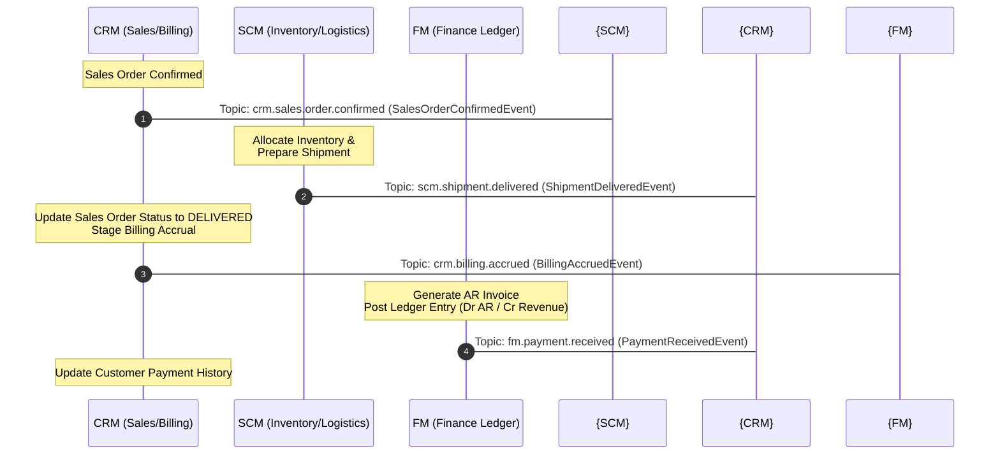

# PRD: CRM-SCM-FM "Order-to-Cash" Trinity Alignment & Integration Specification

**PRD ID**: PRD-2026-06-13-1000  
**Date**: 2026-06-13  
**Status**: Implemented  
**Parent Initiative**: Technical Documentation Sync & API Standard  
**Target Alignment**: 100% alignment, tracing, and reliability verification for the CRM-SCM-FM Order-to-Cash trinity.

---

## 1. Objective & Problem Statement

The "Order-to-Cash" lifecycle is the vital backbone of the enterprise ERP system. It spans three decoupled microservices interacting exclusively via asynchronous event streams:
1. **CRM (`crm-service`)**: Captures customer commitments (Sales Orders) and initiates billing events.
2. **SCM (`scm-service`)**: Allocates warehouse inventory and executes physical fulfillment (Shipments/Deliveries).
3. **FM (`fm-service`)**: Generates subledger invoices, manages Accounts Receivable (AR), processes cash receipt entries, and posts journal lines to the General Ledger.

Because these boundaries communicate across the network, delivery failures present critical business risks:
* A failed or lost event between CRM and SCM means a customer pays for an order that is never shipped.
* A failed or lost event between SCM and FM means goods leave the warehouse without revenue recognition, causing inventory write-offs and financial leakage.

This PRD establishes the unified integration specification and verification tasks to align and guarantee reliability across these services.

---

## 2. Integration Architecture & State Flow

The Order-to-Cash lifecycle operates on the following event-driven topology:

### Event Reliability Mechanics
* **Transactional Outbox**: All state mutations and outgoing events are written to the database atomically in a single local transaction, then relayed asynchronously to Kafka.
* **Idempotent Consumer (Inbox)**: Every receiving service tracks processed `event_id` values in a `kafka_event_inbox` table to guarantee exactly-once message processing.

---

## 3. Scope & Checklist

### Phase 1: Create Order-to-Cash Trinity Specification
- [x] Create `documentation/modules/customer-relationship-management/order-to-cash.md` detailing the Trinity relationship, event structures, failure mitigations, and data validation rules.

### Phase 2: Update CRM README & Documentation Linkages
- [x] Reference the Order-to-Cash Trinity in `documentation/modules/customer-relationship-management/README.md`.
- [x] Document the transactional guarantees (Outbox/Inbox) and cross-service decoupling criteria.

### Phase 3: Code Audit & Verification
- [x] Verify that `crm-service/internal/data/kafka/consumer.go` properly handles inbound SCM delivery events to advance order states.
- [x] Verify that FM payment event consumption is fully functional.

---

## 4. Definition of Done
- [x] Unified Order-to-Cash documentation is created and referenced from CRM README.
- [x] Code implementation (outbox, inbox, consumers) is reviewed and confirmed aligned.
