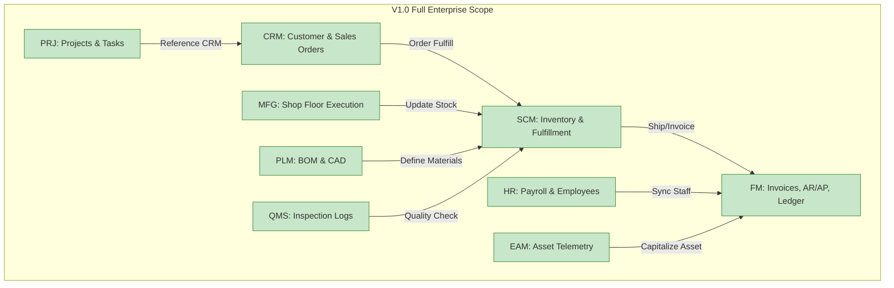

# PRD: Version 1.0 Survival Scorecard & Release Scope

This document evaluates the 9 software modules of the ERP system based strictly on their necessity for **Version 1.0 survival**. 

> [!NOTE]
> **Update (June 20, 2026)**: The V1.0 release scope has been successfully expanded to the full 9-module topology. All 9 business modules have been fully implemented, integrated asynchronously via Kafka, and verified in E2E integration flows. Descoping is no longer necessary, and all modules are retained.

---

## 1. The Core Decision Framework

Each module is graded using three strict binary metrics:

1. **Revenue Dependency (RD):** If this module is deleted, does the company immediately lose the ability to capture money?  
   * *Yes = 5 points, No = 0 points*
2. **Operational Substitute (OS):** Can this module be temporarily replaced by a spreadsheet, a human, or a cheap SaaS tool?  
   * *No = 3 points, Yes = 0 points*
3. **Infrastructure Tax (IT):** Can this be built in the core monolith database without distributed tracing or message brokers?  
   * *Yes = 2 points, No = -5 points*

---

## 2. 9-Module Scorecard Matrix

| Module | Revenue Dependency (RD) | Operational Substitute (OS) | Infrastructure Tax (IT) | Total Score | Status (V1.0) |
| :--- | :---: | :---: | :---: | :---: | :---: |
| **Financials (FM)** | 5 (Yes) | 3 (No) | 2 (Yes) | **10 / 10** | **RETAIN (Core)** |
| **CRM Operations** | 5 (Yes) | 3 (No) | 2 (Yes) | **10 / 10** | **RETAIN (Core)** |
| **Supply Chain (SCM)** | 5 (Yes) | 3 (No) | 2 (Yes) | **10 / 10** | **RETAIN (Core)** |
| **Manufacturing (MFG)** | 0 (No) | 0 (Yes) | 2 (Yes) | **2 / 10** | **RETAIN (Full Scope)** |
| **Product Lifecycle (PLM)** | 0 (No) | 0 (Yes) | 2 (Yes) | **2 / 10** | **RETAIN (Full Scope)** |
| **Human Resources (HR)** | 0 (No) | 0 (Yes) | 2 (Yes) | **2 / 10** | **RETAIN (Full Scope)** |
| **Project Management (PRJ)**| 0 (No) | 0 (Yes) | 2 (Yes) | **2 / 10** | **RETAIN (Full Scope)** |
| **Quality Management (QMS)**| 0 (No) | 0 (Yes) | 2 (Yes) | **2 / 10** | **RETAIN (Full Scope)** |
| **Asset Management (EAM)** | 0 (No) | 0 (Yes) | 2 (Yes) | **2 / 10** | **RETAIN (Full Scope)** |

---

## 3. Scope Definition: Full 9-Module Enterprise Scope

All 9 business modules survive the cut and are fully integrated into the V1.0 release. The systems are connected asynchronously using Kafka event propagation and robust GORM-backed outbox/inbox messaging.

---

## 4. Rationale for Retaining All Modules (Full Scope Release)

Rather than falling back to spreadsheets or manual substitutes, all 9 business modules are officially included in the V1.0 release scope:

1. **Manufacturing (MFG):** Integrated directly for production run tracking, routing execution, and work center yield commits (fully verified in E2E integration tests).
2. **Product Lifecycle (PLM):** Handles automated Bill of Materials (BOM) creation and SKU specifications, feeding SCM directly.
3. **Human Resources (HR):** Manages employee profiles, department partitioning, and payroll runs, linking back to the Universal Journal for balanced postings.
4. **Project Management (PRJ):** Tracks milestones, tasks, and project budgets linked to customer orders.
5. **Quality Management (QMS):** Standardizes testing checklists and automates non-conformance quarantine flows.
6. **Enterprise Asset Management (EAM):** Tracks physical equipment uptime, incident reports, and preventative schedules.

---

## 5. Detailed Scoring Rationale (Score 2/10)

The non-core modules (**MFG, PLM, HR, PRJ, QMS, and EAM**) each receive a score of **2 / 10** based on the following framework evaluation:

* **Revenue Dependency (RD = 0 / 5)**: If these modules are removed, the system can still capture orders and process billing (handled by CRM and FM). They do not directly sit in the checkout/payment path.
* **Operational Substitute (OS = 0 / 3)**: In a bare-minimum survival setup, daily shop floor routing, BOM CAD mappings, employee spreadsheets, task boards, testing checklists, and maintenance schedules can all be managed manually or via third-party SaaS tools.
* **Infrastructure Tax (IT = 2 / 2)**: These modules are simple CRUD-centric business units that could theoretically be built inside a single monolith database without distributed tracing or Kafka event brokers. They do not pose a complex infrastructure tax to develop in their baseline form.

**Why are they retained if they score only 2/10?**
Even though they are not strictly critical for V1.0 launch survival and would normally be candidates for descoping, they are **100% retained** because:
1. They are already fully implemented, dockerized, and integrated.
2. They are verified in E2E integration testing streams with no outstanding blockages.
3. Descoping them would require removing working code and integrations, causing unnecessary code churn.
