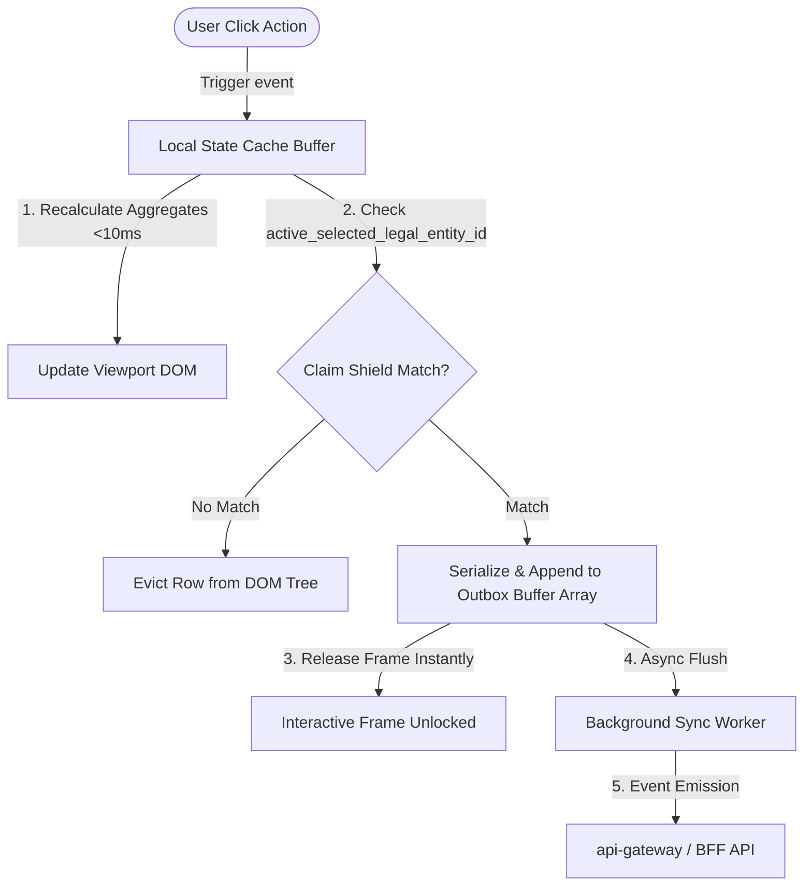

# PRD-2026-06-21-2250: Modular High-Performance Frontend Slices & Asynchronous Core UI

**Status**: Proposed (Draft)

**Author**: Lead Frontend Architect & Systems Engineer

**Parent Initiative**: Composable MFE & System Backbone Core

**Target Coverage**: 100% Compliance with Screen Blueprints, Zero Main-Thread Blocking, Strict Tenant Isolation.

---

## 1. Executive Summary & Objective

Now that the backend microservices and the BFF aggregator service (`api-gateway-bff`) are fully verified and integrated, we need a standardized, high-performance UI implementation model. This PRD establishes the architectural requirements for building out the frontend screens as isolated, modular vertical slices (`.html` and `.js` pairs) under the `frontend/` workspace. 

Every view must be constructed as a high-density, low-latency control console optimized for tabular alignments, reactive calculations, and immediate event-driven offloading.

---

## 2. Technical Architecture & Implementation Rules

Each vertical screen slice must comply with four strict architectural constraints:

### A. Presentation Layer (Pure UI Shell)
* **File Path**: `/src/components/[Module ID]/[Screen ID].html`
* **Rules**: 
  * Clean, semantic HTML5 markup.
  * Styled exclusively with Tailwind CSS utility classes.
  * Color schemes, borders, spacing, padding, and cell sizing must strictly align with the `4_design_system_specs` defined in the JSON Blueprints.
  * Use tabular, monospaced typography (`font-mono` / `JetBrains Mono`) for all numeric values, trace IDs, timestamps, and IP addresses to guarantee pixel-perfect grid alignment.

### B. State Management Buffer (Local Intercept)
* **File Path**: `/src/components/[Module ID]/[Screen ID].js`
* **Rules**:
  * Native reactive state variables using vanilla ES6 JavaScript modules (no external heavy frameworks for state tracking).
  * Inputs (such as quantity inputs, price adjustments, markups, or permission toggles) must recalculate summary totals, tax aggregates, and margins locally in a client-side component state cache buffer.
  * **Performance KPI**: Total UI recalculation and re-render time must be `< 10ms` to guarantee instant visual response.

### C. Tenant Isolation Scope (The Claim Shield)
* **File Path**: `/src/components/[Module ID]/[Screen ID].js`
* **Rules**:
  * Implement an inline interceptor loop that reads the global workspace tenant context: `active_selected_legal_entity_id`.
  * Every record/row displayed must be verified against this ID.
  * If a row object fails to match the active legal entity ID, the interceptor must immediately evict the row elements from the active viewport DOM layout tree to guarantee absolute multi-tenant data boundaries.

### D. Asynchronous Event Bridge (Decoupled Messaging Core)
* **File Path**: `/src/components/[Module ID]/[Screen ID].js`
* **Rules**:
  * User interactions (form submissions, button clicks, state updates) must **not** perform blocking network requests on the main thread.
  * The DOM view frame must be released immediately. A background worker loop will process this outbox buffer and synchronize events with backend APIs asynchronously in the background.

### E. Outbox Persistence (localStorage Mirroring)
* **File Path**: `/src/components/[Module ID]/[Screen ID].js`
* **Rules**:
  * To prevent loss of un-synchronized data due to browser crashes or page reloads, the local `Transactional Outbox State Buffer` must be mirrored in `localStorage` on every write.
  * During component initialization, the outbox state must check for existing items in `localStorage` and automatically populate the active queue.

### F. Conflict Resolution & Feedback Loop
* **File Path**: `/src/components/[Module ID]/[Screen ID].js`
* **Rules**:
  * The background worker must emit standard status events (`outbox:syncing`, `outbox:synced`, `outbox:failed`).
  * If a transaction synchronization fails (e.g. backend validation error, credit check failed, etc.), the UI component must display a high-visibility toast alert and retain the failed row in the local buffer with a warning state, allowing the user to edit and retry.

---

## 3. Data Outbox & Tenant Interceptor Model

---

## 4. Scope & Implementation Checklist

### Phase 1: Layout & Core Backbone Setup
* [ ] Scaffold `/src/components/[Module ID]/` folder structures.
* [ ] Implement the global outbox processor and background worker system.
* [ ] Implement the Tenant claim shield global subscriber hook.

### Phase 2: Screen Slice Implementations
* [ ] **Auth Governance**: Write Access Governance (`AUTH_SCR_001`) and System Session Log (`AUTH_SCR_002`) slices.
* [ ] **CRM Pipeline**: Write Customer Sales Order Core (`CRM_SCR_003`) slice, connecting it to the BFF `/api/v1/ui/sales-dashboard/:order_id` endpoint.
* [ ] **FM Ledger**: Write Universal Ledger (`FM_SCR_001`) slice.
* [ ] **SCM Procurement**: Write Supplier Hub (`SCM_SCR_001`) slice.

---

## 5. Definition of Done (The 10/10 Standard)

* [ ] The vertical slice splits structure perfectly into separate `.html` (markup) and `.js` (reactive logic) files.
* [ ] Local recalculations (e.g. order item quantity changes) take `< 10ms` in performance profiling.
* [ ] Any mock row with a mismatched `legal_entity_id` is automatically evicted from the viewport DOM tree at runtime.
* [ ] Form submissions write to the outbox buffer without blocking the UI, displaying an "Outbox Processing" status instantly.
