# Grocery Store ERP - UML Class Diagram

## Overview
This document presents the comprehensive UML class diagram for a Grocery Store ERP system using Mermaid notation. The system is designed around six core domains: Financial Management (FIN), Human Resources (HRM), Supply Chain Management (SCM), Sales & CRM, Manufacturing (Food Production), and Project Management.

## 1. Core Entity Model

### 1.1 Complete Domain Class Diagram

```mermaid
classDiagram
    %% ========================================
    %% CUSTOMER & SALES DOMAIN
    %% ========================================
    class Customer {
        +String customerId
        +String firstName
        +String lastName
        +String email
        +String phone
        +Address address
        +DateTime joinDate
        +LoyaltyStatus status
        +Integer loyaltyPoints
        +CustomerType type
        +placeOrder()
        +earnPoints(amount)
        +redeemRewards()
        +updateProfile()
    }
    
    class LoyaltyProgram {
        +String programId
        +String name
        +Integer pointsPerDollar
        +Integer rewardThreshold
        +DateTime startDate
        +DateTime endDate
        +Boolean isActive
        +calculatePoints(amount)
        +checkEligibility()
    }
    
    class Sale {
        +String saleId
        +DateTime timestamp
        +String customerId
        +String cashierId
        +String registerId
        +BigDecimal subtotal
        +BigDecimal taxAmount
        +BigDecimal discount
        +BigDecimal totalAmount
        +PaymentMethod paymentMethod
        +SaleStatus status
        +void()
        +refund()
        +addItem()
        +calculateTax()
    }
    
    class SaleLine {
        +String saleLineId
        +String saleId
        +String productId
        +Integer quantity
        +BigDecimal unitPrice
        +BigDecimal lineTotal
        +BigDecimal discount
        +String promotionId
        +calculateTotal()
        +applyDiscount()
        +applyPromotion()
    }
    
    class Payment {
        +String paymentId
        +String saleId
        +PaymentType type
        +BigDecimal amount
        +String referenceNumber
        +PaymentStatus status
        +DateTime processedAt
        +process()
        +refund()
        +authorize()
    }
    
    class Promotion {
        +String promotionId
        +String name
        +String description
        +PromotionType type
        +BigDecimal discountAmount
        +BigDecimal discountPercent
        +DateTime startDate
        +DateTime endDate
        +Boolean isActive
        +calculateDiscount(amount)
        +checkEligibility()
    }

    %% ========================================
    %% PRODUCT & INVENTORY DOMAIN
    %% ========================================
    class Product {
        +String productId
        +String upc
        +String plu
        +String name
        +String description
        +String categoryId
        +String brandId
        +BigDecimal price
        +BigDecimal cost
        +Integer shelfLife
        +Boolean isPerishable
        +Boolean requiresAgeVerification
        +String taxCodeId
        +updatePrice()
        +checkExpiration()
        +calculateMargin()
    }
    
    class Category {
        +String categoryId
        +String name
        +String description
        +String departmentId
        +BigDecimal targetMargin
        +String taxCodeId
        +Boolean requiresTemperatureControl
        +addProduct()
        +updateMargin()
    }
    
    class Brand {
        +String brandId
        +String name
        +String manufacturer
        +String contactInfo
        +Boolean isPrivateLabel
        +addProduct()
        +updateInfo()
    }
    
    class Inventory {
        +String inventoryId
        +String productId
        +String locationId
        +Integer onHandQuantity
        +Integer reservedQuantity
        +Integer reorderPoint
        +Integer maxStock
        +BigDecimal averageCost
        +DateTime lastUpdated
        +adjustStock(quantity)
        +checkReorderPoint()
        +calculateValue()
        +reserve(quantity)
    }
    
    class StockLocation {
        +String locationId
        +String name
        +LocationType type
        +String temperature
        +Integer capacity
        +String departmentId
        +Boolean isActive
        +checkCapacity()
        +monitorTemperature()
    }
    
    class StockMovement {
        +String movementId
        +String productId
        +String locationId
        +MovementType type
        +Integer quantity
        +String reason
        +String userId
        +DateTime timestamp
        +record()
        +audit()
    }

    %% ========================================
    %% EMPLOYEE & HR DOMAIN
    %% ========================================
    class Employee {
        +String employeeId
        +String firstName
        +String lastName
        +String email
        +String phone
        +String socialSecurityNumber
        +String positionId
        +String departmentId
        +BigDecimal hourlyRate
        +DateTime hireDate
        +EmployeeStatus status
        +Address address
        +clockIn()
        +clockOut()
        +requestTimeOff()
        +updateInfo()
    }
    
    class Position {
        +String positionId
        +String title
        +String description
        +BigDecimal minWage
        +BigDecimal maxWage
        +String[] requiredCertifications
        +String[] permissions
        +addEmployee()
        +updateWageRange()
    }
    
    class Department {
        +String deptId
        +String name
        +String description
        +String managerId
        +BigDecimal budget
        +Integer targetMargin
        +String locationArea
        +assignEmployee()
        +updateBudget()
        +calculatePerformance()
    }
    
    class Schedule {
        +String scheduleId
        +String employeeId
        +Date workDate
        +Time startTime
        +Time endTime
        +String departmentId
        +ScheduleStatus status
        +create()
        +modify()
        +approve()
    }
    
    class TimeEntry {
        +String timeEntryId
        +String employeeId
        +DateTime clockIn
        +DateTime clockOut
        +DateTime breakStart
        +DateTime breakEnd
        +BigDecimal hoursWorked
        +BigDecimal overtimeHours
        +calculate()
        +approve()
    }
    
    class Payroll {
        +String payrollId
        +String employeeId
        +Date payPeriodStart
        +Date payPeriodEnd
        +BigDecimal regularHours
        +BigDecimal overtimeHours
        +BigDecimal grossPay
        +BigDecimal taxes
        +BigDecimal deductions
        +BigDecimal netPay
        +calculate()
        +process()
    }

    %% ========================================
    %% SUPPLIER & PURCHASING DOMAIN
    %% ========================================
    class Supplier {
        +String supplierId
        +String name
        +String contactPerson
        +String email
        +String phone
        +Address address
        +PaymentTerms terms
        +SupplierStatus status
        +String taxId
        +createPO()
        +processInvoice()
        +updateTerms()
    }
    
    class PurchaseOrder {
        +String poId
        +String supplierId
        +DateTime orderDate
        +DateTime expectedDate
        +DateTime receivedDate
        +BigDecimal totalAmount
        +POStatus status
        +String approvedBy
        +approve()
        +receive()
        +addItem()
        +cancel()
    }
    
    class PurchaseOrderLine {
        +String poLineId
        +String poId
        +String productId
        +Integer orderedQuantity
        +Integer receivedQuantity
        +BigDecimal unitCost
        +BigDecimal lineTotal
        +receive(quantity)
        +calculateTotal()
    }
    
    class Receiving {
        +String receivingId
        +String poId
        +DateTime receivedDate
        +String receivedBy
        +ReceivingStatus status
        +String qualityNotes
        +process()
        +approve()
        +reject()
    }

    %% ========================================
    %% MANUFACTURING/FOOD PRODUCTION DOMAIN
    %% ========================================
    class Recipe {
        +String recipeId
        +String name
        +String description
        +Integer yield
        +String unit
        +Integer prepTime
        +String instructions
        +String allergens
        +BigDecimal cost
        +calculateCost()
        +scale(multiplier)
        +validate()
    }
    
    class RecipeIngredient {
        +String recipeIngredientId
        +String recipeId
        +String ingredientId
        +BigDecimal quantity
        +String unit
        +Boolean isOptional
        +substitute()
        +calculateCost()
    }
    
    class ProductionOrder {
        +String productionId
        +String recipeId
        +Integer quantity
        +DateTime scheduledDate
        +DateTime completedDate
        +String assignedTo
        +ProductionStatus status
        +BigDecimal actualCost
        +schedule()
        +start()
        +complete()
    }
    
    class QualityCheck {
        +String qualityId
        +String productId
        +String batchId
        +DateTime checkDate
        +String checkedBy
        +BigDecimal temperature
        +QualityStatus status
        +String notes
        +perform()
        +approve()
        +reject()
    }
    
    class Batch {
        +String batchId
        +String productId
        +String recipeId
        +Integer quantity
        +DateTime productionDate
        +DateTime expiryDate
        +BatchStatus status
        +track()
        +recall()
    }

    %% ========================================
    %% FINANCIAL DOMAIN
    %% ========================================
    class Account {
        +String accountId
        +String accountNumber
        +String name
        +AccountType type
        +BigDecimal balance
        +String parentAccountId
        +Boolean isActive
        +debit(amount)
        +credit(amount)
        +getBalance()
    }
    
    class Transaction {
        +String transactionId
        +DateTime transactionDate
        +String reference
        +String description
        +BigDecimal amount
        +TransactionType type
        +TransactionStatus status
        +post()
        +reverse()
        +audit()
    }
    
    class TransactionLine {
        +String transactionLineId
        +String transactionId
        +String accountId
        +BigDecimal debitAmount
        +BigDecimal creditAmount
        +String description
        +validate()
        +post()
    }
    
    class TaxCode {
        +String taxCodeId
        +String name
        +BigDecimal rate
        +TaxType type
        +Boolean isActive
        +String jurisdiction
        +calculateTax(amount)
        +updateRate()
    }

    %% ========================================
    %% PROJECT MANAGEMENT DOMAIN
    %% ========================================
    class StoreProject {
        +String projectId
        +String name
        +String description
        +DateTime startDate
        +DateTime endDate
        +BigDecimal budget
        +ProjectStatus status
        +String managerId
        +create()
        +updateStatus()
        +addTask()
    }
    
    class Task {
        +String taskId
        +String projectId
        +String name
        +String description
        +DateTime startDate
        +DateTime endDate
        +String assignedTo
        +TaskStatus status
        +Integer priority
        +assign()
        +complete()
        +updateProgress()
    }

    %% ========================================
    %% RELATIONSHIPS
    %% ========================================
    
    %% Customer & Sales Relationships
    Customer ||--o{ Sale : "places"
    Customer }o--|| LoyaltyProgram : "enrolled_in"
    Sale ||--o{ SaleLine : "contains"
    Sale ||--|| Payment : "paid_with"
    SaleLine }o--|| Product : "references"
    SaleLine }o--o| Promotion : "applies"
    
    %% Product & Inventory Relationships
    Product }o--|| Category : "belongs_to"
    Product }o--|| Brand : "manufactured_by"
    Product }o--|| TaxCode : "taxed_with"
    Product ||--o{ Inventory : "stocked_as"
    Inventory }o--|| StockLocation : "stored_in"
    Inventory ||--o{ StockMovement : "tracked_by"
    
    %% Employee & HR Relationships
    Employee }o--|| Position : "holds"
    Employee }o--|| Department : "works_in"
    Employee ||--o{ Schedule : "assigned_to"
    Employee ||--o{ TimeEntry : "records"
    Employee ||--|| Payroll : "receives"
    Department ||--o| Employee : "managed_by"
    
    %% Supplier & Purchasing Relationships
    Supplier ||--o{ PurchaseOrder : "receives"
    PurchaseOrder ||--o{ PurchaseOrderLine : "contains"
    PurchaseOrderLine }o--|| Product : "orders"
    PurchaseOrder ||--o| Receiving : "fulfilled_by"
    
    %% Manufacturing Relationships
    Recipe ||--o{ RecipeIngredient : "contains"
    RecipeIngredient }o--|| Product : "uses"
    Recipe ||--o{ ProductionOrder : "produces"
    ProductionOrder }o--|| Employee : "assigned_to"
    ProductionOrder ||--o{ Batch : "creates"
    Batch ||--o{ QualityCheck : "inspected_by"
    QualityCheck }o--|| Employee : "performed_by"
    
    %% Financial Relationships
    Transaction ||--o{ TransactionLine : "contains"
    TransactionLine }o--|| Account : "affects"
    Sale }o--|| TaxCode : "calculated_with"
    
    %% Project Relationships
    StoreProject ||--o{ Task : "contains"
    Task }o--|| Employee : "assigned_to"
    StoreProject }o--|| Employee : "managed_by"
```

## 2. Domain Aggregates

### 2.1 Aggregate Structure


## 3. Domain Services & Business Processes

### 3.1 Service Architecture


## 4. Event-Driven Architecture

### 4.1 Domain Events

```mermaid
sequenceDiagram
    participant C as Customer
    participant S as Sales Service
    participant I as Inventory Service
    participant L as Loyalty Service
    participant F as Financial Service
    participant N as Notification Service
    
    C->>S: Purchase Items
    S->>S: Create Sale
    S->>I: ProductSold Event
    S->>L: PointsEarned Event
    S->>F: TransactionRecorded Event
    
    I->>I: Update Stock Levels
    I->>S: StockUpdated Event
    
    L->>L: Update Customer Points
    L->>C: Points Notification
    
    F->>F: Record Revenue
    F->>N: SalesReported Event
    
    Note over I: Check Reorder Point
    I->>S: LowStockAlert Event
    S->>N: Manager Notification
```



### 4.2 Key Domain Events


## 5. Data Flow Patterns

### 5.1 Sales Transaction Flow


### 5.2 Inventory Management Flow


## 6. Implementation Guidelines

### 6.1 Microservice Boundaries


### 6.2 Database Schema Patterns


## 7. Technology Stack Recommendations

### 7.1 Architecture Components

- **Backend Services**: Go with Gin framework
- **Database**: PostgreSQL for transactional data, Redis for caching
- **Message Queue**: RabbitMQ or Apache Kafka
- **API Gateway**: Kong or Nginx with authentication
- **Containerization**: Docker with Kubernetes orchestration
- **Monitoring**: Prometheus + Grafana
- **Logging**: ELK Stack (Elasticsearch, Logstash, Kibana)

### 7.2 Data Storage Strategy

- **Sales Service**: PostgreSQL for transactions, Redis for session data
- **Inventory Service**: PostgreSQL for stock data, Redis for real-time levels
- **HR Service**: PostgreSQL for employee data, Redis for schedule caching
- **Financial Service**: PostgreSQL for accounting, time-series DB for metrics
- **Production Service**: PostgreSQL for recipes, Redis for batch tracking

This comprehensive UML class diagram provides the foundation for implementing a robust grocery store ERP system with clear domain boundaries, proper relationships, and scalable architecture patterns.