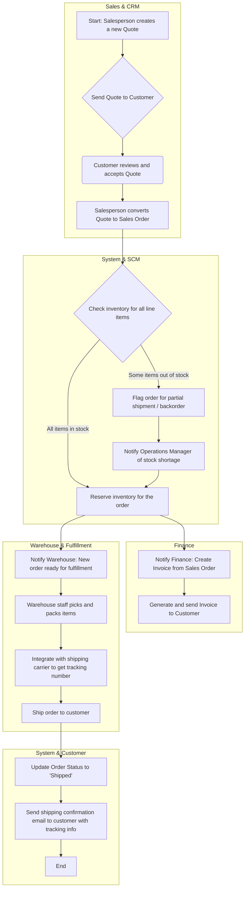

# Sales Order Flow

This diagram shows the end-to-end flow of a sales order, from initial customer quote to fulfillment and invoicing. It demonstrates the interaction between the Sales, Supply Chain, and Finance modules.

