# Financial Management (FIN) Module - C4 Architecture Model

## Introduction

This document presents the Financial Management (FIN) module architecture using the C4 model methodology. The FIN module serves as the **heart of the ERP system**, processing all financial transactions and providing the foundation for business decision-making.

## C4 Model Levels

1. **Level 1 - System Context**: High-level view of the FIN system and its relationships
2. **Level 2 - Container**: Major services and their interactions (Service-Level Architecture)
3. **Level 3 - Component**: Internal structure of core FIN services
4. **Level 4 - Code**: Implementation details and class structures

---

## Level 1: System Context Diagram

### Overview
The FIN system operates as the central financial hub, receiving data from all other ERP modules and providing financial insights to various stakeholders.


### System Context Details

#### Primary Users
- **CFO**: Strategic financial oversight, investor relations, risk management
- **Controller**: Daily financial operations, financial reporting, compliance
- **AP Clerk**: Vendor invoice processing, payment management
- **AR Clerk**: Customer billing, payment processing, collections
- **Department Managers**: Budget monitoring, cost control, performance analysis
- **External Auditors**: Financial verification, compliance testing

#### ERP Module Integrations (Bidirectional)
- **HR Service**: Employee costs → FIN, Budget data ← FIN
- **SCM Service**: Purchase costs → FIN, Payment confirmations ← FIN  
- **CRM Service**: Sales revenue → FIN, Customer credit info ← FIN
- **Manufacturing**: Production costs → FIN, Cost analysis ← FIN
- **Project Management**: Project costs → FIN, Profitability data ← FIN

#### External System Integrations
- **Banking Systems**: Electronic payments, bank reconciliation, cash management
- **Tax Authorities**: Tax reporting, compliance filings, regulatory updates
- **Audit Firms**: Audit trail access, compliance documentation
- **Payroll Providers**: Payroll expense integration, tax withholding management

---

## Level 2: Container Diagram (Service-Level Architecture)

### Overview
The FIN system is composed of specialized services that handle distinct financial domains while maintaining integration through shared data and events.

```mermaid
graph TB
    %% Users
    CFO[👤 CFO]
    Controller[👥 Controller]
    APClerk[💸 AP Clerk]
    ARClerk[💰 AR Clerk]
    
    %% Frontend Applications
    FinancePortal[🌐 Finance Portal<br/>React.js Application<br/>Financial operations interface]
    ExecutiveDashboard[📊 Executive Dashboard<br/>React.js Application<br/>Real-time financial KPIs]
    MobileApp[📱 Mobile Finance App<br/>React Native<br/>Approvals & reporting]
    
    %% API Gateway
    APIGateway[🚪 API Gateway<br/>Go/Gin Framework<br/>Authentication & routing]
    
    %% Core Financial Services
    GLService[📋 General Ledger Service<br/>Go Microservice<br/>Chart of accounts<br/>Journal entries<br/>Account balances]
    
    APService[💸 Accounts Payable Service<br/>Go Microservice<br/>Vendor invoices<br/>Payment processing<br/>Vendor management]
    
    ARService[💰 Accounts Receivable Service<br/>Go Microservice<br/>Customer invoices<br/>Payment receipts<br/>Collections]
    
    ReportingService[📊 Financial Reporting Service<br/>Go Microservice<br/>Balance Sheet<br/>Income Statement<br/>Cash Flow Statement]
    
    %% Supporting Services
    EventProcessor[📨 Event Processor<br/>Go Microservice<br/>ERP integration events<br/>Financial transaction creation]
    
    EventPublisher[📤 Event Publisher<br/>Go Microservice<br/>Financial event publishing<br/>Cross-module notifications]
    
    ValidationService[✅ Validation Service<br/>Go Microservice<br/>Business rules<br/>Data integrity checks]
    
    NumberGenerator[🔢 Number Generator<br/>Go Microservice<br/>Document numbering<br/>Sequential generation]
    
    %% Data Layer
    PostgresDB[(🗄️ PostgreSQL Database<br/>Financial transactions<br/>Account balances<br/>Vendor/Customer data)]
    
    RedisCache[(🔴 Redis Cache<br/>Account balances<br/>Exchange rates<br/>Frequent queries)]
    
    DocumentStorage[(📁 Document Storage<br/>S3/MinIO<br/>Invoices, receipts<br/>Supporting documents)]
    
    %% Message Queue
    MessageQueue[📨 RabbitMQ<br/>Event-driven communication<br/>Financial events]
    
    %% External APIs
    HRServiceAPI[👥 HR Service API]
    SCMServiceAPI[📦 SCM Service API]  
    CRMServiceAPI[📊 CRM Service API]
    BankAPI[🏦 Banking API]
    
    %% User to Frontend
    CFO --> ExecutiveDashboard
    Controller --> FinancePortal
    APClerk --> FinancePortal
    ARClerk --> FinancePortal
    
    %% Frontend to API Gateway
    FinancePortal --> APIGateway
    ExecutiveDashboard --> APIGateway
    MobileApp --> APIGateway
    
    %% API Gateway to Core Services
    APIGateway --> GLService
    APIGateway --> APService
    APIGateway --> ARService
    APIGateway --> ReportingService
    
    %% Service Dependencies
    APService --> GLService
    ARService --> GLService
    ReportingService --> GLService
    ReportingService --> APService
    ReportingService --> ARService
    
    %% Supporting Service Connections
    GLService --> ValidationService
    APService --> ValidationService
    ARService --> ValidationService
    
    GLService --> NumberGenerator
    APService --> NumberGenerator
    ARService --> NumberGenerator
    
    %% Event Processing
    EventProcessor --> MessageQueue
    MessageQueue --> GLService
    MessageQueue --> APService
    MessageQueue --> ARService
    
    GLService --> EventPublisher
    APService --> EventPublisher
    ARService --> EventPublisher
    EventPublisher --> MessageQueue
    
    %% Data Connections
    GLService --> PostgresDB
    APService --> PostgresDB
    ARService --> PostgresDB
    ReportingService --> PostgresDB
    
    GLService --> RedisCache
    APService --> RedisCache
    ARService --> RedisCache
    ReportingService --> RedisCache
    
    APService --> DocumentStorage
    ARService --> DocumentStorage
    
    %% External API Connections
    EventProcessor --> HRServiceAPI
    EventProcessor --> SCMServiceAPI
    EventProcessor --> CRMServiceAPI
    APService --> BankAPI
    ARService --> BankAPI
    
    %% Styling
    classDef userClass fill:#e1f5fe,stroke:#01579b,stroke-width:2px
    classDef frontendClass fill:#e8f5e8,stroke:#2e7d32,stroke-width:2px
    classDef coreServiceClass fill:#fff8e1,stroke:#f57f17,stroke-width:3px
    classDef supportServiceClass fill:#f3e5f5,stroke:#7b1fa2,stroke-width:2px
    classDef dataClass fill:#fce4ec,stroke:#c2185b,stroke-width:2px
    classDef externalClass fill:#f1f8e9,stroke:#388e3c,stroke-width:2px
    
    class CFO,Controller,APClerk,ARClerk userClass
    class FinancePortal,ExecutiveDashboard,MobileApp frontendClass
    class GLService,APService,ARService,ReportingService coreServiceClass
    class EventProcessor,EventPublisher,ValidationService,NumberGenerator supportServiceClass
    class PostgresDB,RedisCache,DocumentStorage,MessageQueue dataClass
    class HRServiceAPI,SCMServiceAPI,CRMServiceAPI,BankAPI externalClass
```



### Container Details

#### **Core Financial Services**

##### **General Ledger Service (Foundation)**
- **Responsibility**: Double-entry accounting engine
- **Key Functions**: Chart of accounts, journal entries, account balances
- **Dependencies**: Validation Service, Number Generator
- **Data**: Account master, journal entries, account balances

##### **Accounts Payable Service**
- **Responsibility**: Vendor invoice and payment management
- **Key Functions**: Invoice processing, payment execution, vendor management
- **Dependencies**: GL Service, Validation Service, Banking APIs
- **Data**: Vendor invoices, payments, vendor master data

##### **Accounts Receivable Service**
- **Responsibility**: Customer billing and collection management
- **Key Functions**: Invoice generation, payment processing, collections
- **Dependencies**: GL Service, Validation Service, Banking APIs
- **Data**: Customer invoices, payments, customer master data

##### **Financial Reporting Service**
- **Responsibility**: Financial statement generation and analytics
- **Key Functions**: Balance Sheet, Income Statement, Cash Flow, KPIs
- **Dependencies**: All core services for source data
- **Data**: Aggregated financial data, report definitions

#### **Supporting Services**

##### **Event Processor**
- **Responsibility**: Process incoming events from other ERP modules
- **Key Functions**: Event validation, transformation, routing
- **Integration**: HR, SCM, CRM, Manufacturing, Project Management
- **Output**: Financial transactions in core services

##### **Event Publisher** 
- **Responsibility**: Publish financial events to other ERP modules
- **Key Functions**: Event creation, formatting, delivery
- **Events**: Payment confirmations, budget alerts, financial updates
- **Integration**: All ERP modules that need financial data

##### **Validation Service**
- **Responsibility**: Business rule enforcement and data validation
- **Key Functions**: Double-entry validation, approval workflows, controls
- **Usage**: All core services use for data integrity
- **Rules**: Accounting principles, business policies, compliance

##### **Number Generator**
- **Responsibility**: Sequential document numbering
- **Key Functions**: Invoice numbers, journal entry numbers, transaction IDs
- **Features**: Thread-safe, gap-free, configurable formats
- **Usage**: All services that create numbered documents

---

## Level 3: Component Diagram

### General Ledger Service Components

```mermaid
graph TB
    subgraph "General Ledger Service Container"
        %% API Layer
        GLAPI[📋 GL API Controller<br/>Journal entries<br/>Account management]
        AccountAPI[🏢 Account API Controller<br/>Chart of accounts<br/>Account balances]
        
        %% Business Logic Layer
        JournalManager[📝 Journal Manager<br/>Journal entry processing<br/>Posting and validation]
        AccountManager[🏢 Account Manager<br/>Account lifecycle<br/>Balance calculations]
        ClosingManager[📊 Period Closing Manager<br/>Month-end processes<br/>Period controls]
        
        %% Domain Layer
        JournalDomain[📋 Journal Domain<br/>Double-entry logic<br/>Posting rules]
        AccountDomain[🏢 Account Domain<br/>Account hierarchy<br/>Balance calculations]
        
        %% Infrastructure Layer
        GLRepository[🗄️ GL Repository<br/>Journal entry data access<br/>Account data access]
        BalanceService[⚖️ Balance Service<br/>Real-time balance calc<br/>Balance history]
        
        %% External Integrations
        ValidationClient[✅ Validation Client<br/>Business rule validation<br/>Approval workflows]
        NumberClient[🔢 Number Client<br/>Document numbering<br/>Sequence management]
        EventClient[📨 Event Client<br/>Financial event publishing<br/>Integration notifications]
        
        %% Flow
        GLAPI --> JournalManager
        AccountAPI --> AccountManager
        
        JournalManager --> JournalDomain
        JournalManager --> ClosingManager
        AccountManager --> AccountDomain
        
        JournalDomain --> GLRepository
        AccountDomain --> GLRepository
        AccountManager --> BalanceService
        
        JournalManager --> ValidationClient
        JournalManager --> NumberClient
        JournalManager --> EventClient
    end
    
    %% External Dependencies
    PostgresDB[(🗄️ PostgreSQL)]
    RedisCache[(🔴 Redis)]
    MessageQueue[📨 Message Queue]
    
    GLRepository --> PostgresDB
    BalanceService --> RedisCache
    EventClient --> MessageQueue
```



### Accounts Payable Service Components

```mermaid
graph TB
    subgraph "Accounts Payable Service Container"
        %% API Layer
        APAPI[💸 AP Invoice API<br/>Invoice management<br/>Invoice workflows]
        PaymentAPI[💳 Payment API<br/>Payment processing<br/>Payment methods]
        VendorAPI[🏢 Vendor API<br/>Vendor management<br/>Vendor relationships]
        
        %% Business Logic Layer
        InvoiceManager[📄 Invoice Manager<br/>Invoice processing<br/>Three-way matching]
        PaymentManager[💳 Payment Manager<br/>Payment execution<br/>Payment scheduling]
        VendorManager[🏢 Vendor Manager<br/>Vendor lifecycle<br/>Vendor performance]
        
        %% Domain Layer
        APInvoiceDomain[📄 AP Invoice Domain<br/>Invoice validation<br/>Approval workflows]
        PaymentDomain[💳 Payment Domain<br/>Payment processing<br/>Cash application]
        VendorDomain[🏢 Vendor Domain<br/>Vendor relationships<br/>Terms management]
        
        %% Infrastructure Layer
        APRepository[🗄️ AP Repository<br/>Invoice data access<br/>Payment data access]
        
        %% External Integrations
        GLClient[📋 GL Client<br/>Journal entry creation<br/>Account posting]
        BankClient[🏦 Bank Client<br/>Electronic payments<br/>Bank integration]
        DocumentClient[📁 Document Client<br/>Invoice attachments<br/>Document storage]
        
        %% Flow
        APAPI --> InvoiceManager
        PaymentAPI --> PaymentManager
        VendorAPI --> VendorManager
        
        InvoiceManager --> APInvoiceDomain
        PaymentManager --> PaymentDomain
        VendorManager --> VendorDomain
        
        APInvoiceDomain --> APRepository
        PaymentDomain --> APRepository
        VendorDomain --> APRepository
        
        InvoiceManager --> GLClient
        PaymentManager --> GLClient
        PaymentManager --> BankClient
        InvoiceManager --> DocumentClient
    end
    
    PostgresDB[(🗄️ PostgreSQL)]
    DocumentStorage[(📁 Document Storage)]
    BankAPI[🏦 Banking API]
    
    APRepository --> PostgresDB
    DocumentClient --> DocumentStorage
    BankClient --> BankAPI
```



### Accounts Receivable Service Components

```mermaid
graph TB
    subgraph "Accounts Receivable Service Container"
        %% API Layer
        ARAPI[💰 AR Invoice API<br/>Customer invoicing<br/>Billing management]
        ReceiptAPI[💵 Receipt API<br/>Payment receipts<br/>Cash application]
        CustomerAPI[👤 Customer API<br/>Customer management<br/>Credit management]
        
        %% Business Logic Layer
        BillingManager[💰 Billing Manager<br/>Invoice generation<br/>Billing automation]
        ReceiptManager[💵 Receipt Manager<br/>Payment processing<br/>Cash application]
        CustomerManager[👤 Customer Manager<br/>Customer lifecycle<br/>Credit management]
        CollectionManager[📞 Collection Manager<br/>Aging analysis<br/>Collection workflows]
        
        %% Domain Layer
        ARInvoiceDomain[💰 AR Invoice Domain<br/>Billing logic<br/>Revenue recognition]
        ReceiptDomain[💵 Receipt Domain<br/>Payment application<br/>Cash matching]
        CustomerDomain[👤 Customer Domain<br/>Customer relationships<br/>Credit analysis]
        
        %% Infrastructure Layer
        ARRepository[🗄️ AR Repository<br/>Invoice data access<br/>Receipt data access]
        CreditService[📊 Credit Service<br/>Credit scoring<br/>Risk analysis]
        
        %% External Integrations
        GLClient[📋 GL Client<br/>Revenue recognition<br/>Cash posting]
        TaxClient[📋 Tax Client<br/>Sales tax calculation<br/>Tax compliance]
        
        %% Flow
        ARAPI --> BillingManager
        ReceiptAPI --> ReceiptManager
        CustomerAPI --> CustomerManager
        
        BillingManager --> ARInvoiceDomain
        ReceiptManager --> ReceiptDomain
        CustomerManager --> CustomerDomain
        CustomerManager --> CollectionManager
        
        ARInvoiceDomain --> ARRepository
        ReceiptDomain --> ARRepository
        CustomerDomain --> ARRepository
        
        CustomerManager --> CreditService
        BillingManager --> GLClient
        ReceiptManager --> GLClient
        BillingManager --> TaxClient
    end
    
    PostgresDB[(🗄️ PostgreSQL)]
    TaxAPI[📋 Tax Service API]
    
    ARRepository --> PostgresDB
    TaxClient --> TaxAPI
```



### Financial Reporting Service Components

```mermaid
graph TB
    subgraph "Financial Reporting Service Container"
        %% API Layer
        ReportAPI[📊 Report API<br/>Standard reports<br/>Custom reports]
        AnalyticsAPI[📈 Analytics API<br/>Financial KPIs<br/>Performance metrics]
        
        %% Business Logic Layer
        ReportManager[📊 Report Manager<br/>Report generation<br/>Report scheduling]
        AnalyticsManager[📈 Analytics Manager<br/>Financial analysis<br/>Trend analysis]
        KPIManager[🎯 KPI Manager<br/>Key metrics<br/>Performance tracking]
        
        %% Domain Layer
        ReportDomain[📊 Report Domain<br/>Report logic<br/>Data aggregation]
        AnalyticsDomain[📈 Analytics Domain<br/>Calculation logic<br/>Trend analysis]
        
        %% Infrastructure Layer
        ReportRepository[🗄️ Report Repository<br/>Report data access<br/>Historical data]
        CacheService[🔴 Cache Service<br/>Report caching<br/>Performance optimization]
        
        %% External Integrations
        GLClient[📋 GL Client<br/>Account balances<br/>Transaction data]
        APClient[💸 AP Client<br/>Payable data<br/>Vendor analytics]
        ARClient[💰 AR Client<br/>Receivable data<br/>Customer analytics]
        
        %% Flow
        ReportAPI --> ReportManager
        AnalyticsAPI --> AnalyticsManager
        AnalyticsAPI --> KPIManager
        
        ReportManager --> ReportDomain
        AnalyticsManager --> AnalyticsDomain
        
        ReportDomain --> ReportRepository
        AnalyticsDomain --> ReportRepository
        
        ReportManager --> CacheService
        ReportManager --> GLClient
        ReportManager --> APClient
        ReportManager --> ARClient
    end
    
    PostgresDB[(🗄️ PostgreSQL)]
    RedisCache[(🔴 Redis)]
    
    ReportRepository --> PostgresDB
    CacheService --> RedisCache
```



---

## Level 4: Code Structure

### Go Service Directory Structure

```
services/fin-service/
├── cmd/
│   └── server/
│       └── main.go                    # Application entry point
├── internal/
│   ├── api/
│   │   ├── handlers/
│   │   │   ├── gl_handler.go          # General ledger endpoints
│   │   │   ├── ap_handler.go          # Accounts payable endpoints
│   │   │   ├── ar_handler.go          # Accounts receivable endpoints
│   │   │   └── reporting_handler.go   # Financial reporting endpoints
│   │   ├── middleware/
│   │   │   ├── auth.go                # Authentication middleware
│   │   │   ├── validation.go          # Request validation
│   │   │   └── audit.go               # Audit logging
│   │   └── routes/
│   │       └── routes.go              # Route definitions
│   ├── business/
│   │   ├── managers/
│   │   │   ├── journal_manager.go     # Journal entry business logic
│   │   │   ├── account_manager.go     # Account management logic
│   │   │   ├── invoice_manager.go     # Invoice processing logic
│   │   │   └── payment_manager.go     # Payment processing logic
│   │   └── services/
│   │       ├── validation_service.go  # Business rule validation
│   │       ├── balance_service.go     # Balance calculations
│   │       └── closing_service.go     # Period closing logic
│   ├── domain/
│   │   ├── models/
│   │   │   ├── account.go             # Account domain entity
│   │   │   ├── journal_entry.go       # Journal entry domain entity
│   │   │   ├── ap_invoice.go          # AP invoice domain entity
│   │   │   ├── ar_invoice.go          # AR invoice domain entity
│   │   │   └── payment.go             # Payment domain entity
│   │   ├── aggregates/
│   │   │   ├── gl_aggregate.go        # GL domain aggregate
│   │   │   ├── ap_aggregate.go        # AP domain aggregate
│   │   │   └── ar_aggregate.go        # AR domain aggregate
│   │   └── events/
│   │       ├── gl_events.go           # GL domain events
│   │       ├── ap_events.go           # AP domain events
│   │       └── ar_events.go           # AR domain events
│   ├── infrastructure/
│   │   ├── repositories/
│   │   │   ├── gl_repository.go       # GL data access layer
│   │   │   ├── ap_repository.go       # AP data access layer
│   │   │   ├── ar_repository.go       # AR data access layer
│   │   │   └── vendor_repository.go   # Vendor data access layer
│   │   ├── external/
│   │   │   ├── bank_client.go         # Banking API client
│   │   │   ├── tax_client.go          # Tax service client
│   │   │   └── hr_client.go           # HR service client
│   │   ├── cache/
│   │   │   └── redis_cache.go         # Caching implementation
│   │   └── messaging/
│   │       ├── event_processor.go     # Incoming event processor
│   │       └── event_publisher.go     # Outgoing event publisher
│   └── config/
│       └── config.go                  # Service configuration
├── pkg/
│   ├── errors/
│   │   └── errors.go                  # Custom error types
│   └── utils/
│       ├── decimal.go                 # Financial decimal utilities
│       └── validator.go               # Financial validation utilities
├── migrations/
│   ├── 001_initial_schema.sql         # Database migrations
│   ├── 002_add_ap_tables.sql
│   ├── 003_add_ar_tables.sql
│   └── 004_add_reporting_views.sql
├── tests/
│   ├── unit/                          # Unit tests
│   ├── integration/                   # Integration tests
│   └── fixtures/                      # Test data and fixtures
├── go.mod
├── go.sum
├── Dockerfile
└── README.md
```

### Key Go Interfaces

#### General Ledger Domain Interface

```go
// internal/domain/models/account.go
type Account struct {
    ID            uuid.UUID       `json:"id" db:"id"`
    AccountCode   string          `json:"account_code" db:"account_code"`
    AccountName   string          `json:"account_name" db:"account_name"`
    AccountType   AccountType     `json:"account_type" db:"account_type"`
    ParentID      *uuid.UUID      `json:"parent_id" db:"parent_id"`
    Balance       decimal.Decimal `json:"balance" db:"current_balance"`
    DebitBalance  decimal.Decimal `json:"debit_balance" db:"debit_balance"`
    CreditBalance decimal.Decimal `json:"credit_balance" db:"credit_balance"`
    IsActive      bool            `json:"is_active" db:"is_active"`
    CreatedAt     time.Time       `json:"created_at" db:"created_at"`
    UpdatedAt     time.Time       `json:"updated_at" db:"updated_at"`
}

type JournalEntry struct {
    ID          uuid.UUID       `json:"id" db:"id"`
    EntryNumber string          `json:"entry_number" db:"entry_number"`
    EntryDate   time.Time       `json:"entry_date" db:"entry_date"`
    Description string          `json:"description" db:"description"`
    Reference   string          `json:"reference" db:"reference"`
    TotalAmount decimal.Decimal `json:"total_amount" db:"total_amount"`
    Status      EntryStatus     `json:"status" db:"status"`
    Lines       []JournalLine   `json:"lines"`
    CreatedAt   time.Time       `json:"created_at" db:"created_at"`
    CreatedBy   uuid.UUID       `json:"created_by" db:"created_by"`
}

type GLRepository interface {
    CreateAccount(ctx context.Context, account *Account) error
    GetAccountByID(ctx context.Context, id uuid.UUID) (*Account, error)
    GetAccountByCode(ctx context.Context, code string) (*Account, error)
    UpdateAccountBalance(ctx context.Context, accountID uuid.UUID, amount decimal.Decimal) error
    
    CreateJournalEntry(ctx context.Context, entry *JournalEntry) error
    GetJournalEntry(ctx context.Context, id uuid.UUID) (*JournalEntry, error)
    PostJournalEntry(ctx context.Context, id uuid.UUID) error
    GetTrialBalance(ctx context.Context, asOfDate time.Time) ([]*Account, error)
}

type GLService interface {
    CreateJournalEntry(ctx context.Context, req CreateJournalEntryRequest) (*JournalEntry, error)
    PostJournalEntry(ctx context.Context, id uuid.UUID) error
    GetAccountBalance(ctx context.Context, accountID uuid.UUID) (decimal.Decimal, error)
    GetTrialBalance(ctx context.Context, asOfDate time.Time) ([]*Account, error)
    CreateAccount(ctx context.Context, req CreateAccountRequest) (*Account, error)
}
```

#### Accounts Payable Domain Interface

```go
// internal/domain/models/ap_invoice.go
type APInvoice struct {
    ID                  uuid.UUID       `json:"id" db:"id"`
    InvoiceNumber       string          `json:"invoice_number" db:"invoice_number"`
    VendorInvoiceNumber string          `json:"vendor_invoice_number" db:"vendor_invoice_number"`
    VendorID            uuid.UUID       `json:"vendor_id" db:"vendor_id"`
    InvoiceDate         time.Time       `json:"invoice_date" db:"invoice_date"`
    DueDate             time.Time       `json:"due_date" db:"due_date"`
    TotalAmount         decimal.Decimal `json:"total_amount" db:"total_amount"`
    PaidAmount          decimal.Decimal `json:"paid_amount" db:"paid_amount"`
    OutstandingAmount   decimal.Decimal `json:"outstanding_amount" db:"outstanding_amount"`
    Status              InvoiceStatus   `json:"status" db:"status"`
    JournalEntryID      *uuid.UUID      `json:"journal_entry_id" db:"journal_entry_id"`
    CreatedAt           time.Time       `json:"created_at" db:"created_at"`
}

type Payment struct {
    ID             uuid.UUID       `json:"id" db:"id"`
    PaymentNumber  string          `json:"payment_number" db:"payment_number"`
    PaymentDate    time.Time       `json:"payment_date" db:"payment_date"`
    PaymentMethod  PaymentMethod   `json:"payment_method" db:"payment_method"`
    EntityType     EntityType      `json:"entity_type" db:"entity_type"`
    EntityID       uuid.UUID       `json:"entity_id" db:"entity_id"`
    Amount         decimal.Decimal `json:"amount" db:"amount"`
    Reference      string          `json:"reference" db:"reference"`
    Status         PaymentStatus   `json:"status" db:"status"`
    JournalEntryID *uuid.UUID      `json:"journal_entry_id" db:"journal_entry_id"`
    CreatedAt      time.Time       `json:"created_at" db:"created_at"`
}

type APService interface {
    CreateInvoice(ctx context.Context, req CreateInvoiceRequest) (*APInvoice, error)
    ProcessPayment(ctx context.Context, req ProcessPaymentRequest) (*Payment, error)
    GetVendorBalance(ctx context.Context, vendorID uuid.UUID) (decimal.Decimal, error)
    GetAPAging(ctx context.Context, asOfDate time.Time) ([]*APAging, error)
    ApproveInvoice(ctx context.Context, invoiceID uuid.UUID, approverID uuid.UUID) error
}
```

---

## Event-Driven Architecture

### Financial Events

```go
// internal/domain/events/financial_events.go
type JournalEntryPostedEvent struct {
    EventID        uuid.UUID       `json:"event_id"`
    JournalEntryID uuid.UUID       `json:"journal_entry_id"`
    EntryNumber    string          `json:"entry_number"`
    PostingDate    time.Time       `json:"posting_date"`
    TotalAmount    decimal.Decimal `json:"total_amount"`
    AccountsAffected []AccountEffect `json:"accounts_affected"`
    CreatedAt      time.Time       `json:"created_at"`
}

type PaymentProcessedEvent struct {
    EventID       uuid.UUID       `json:"event_id"`
    PaymentID     uuid.UUID       `json:"payment_id"`
    PaymentNumber string          `json:"payment_number"`
    EntityType    string          `json:"entity_type"`
    EntityID      uuid.UUID       `json:"entity_id"`
    Amount        decimal.Decimal `json:"amount"`
    PaymentMethod string          `json:"payment_method"`
    ProcessedAt   time.Time       `json:"processed_at"`
}

type BudgetVarianceEvent struct {
    EventID            uuid.UUID       `json:"event_id"`
    AccountID          uuid.UUID       `json:"account_id"`
    AccountCode        string          `json:"account_code"`
    BudgetAmount       decimal.Decimal `json:"budget_amount"`
    ActualAmount       decimal.Decimal `json:"actual_amount"`
    VarianceAmount     decimal.Decimal `json:"variance_amount"`
    VariancePercentage decimal.Decimal `json:"variance_percentage"`
    AlertLevel         string          `json:"alert_level"`
    PeriodEnd          time.Time       `json:"period_end"`
}
```

### Message Queue Integration

```go
// internal/infrastructure/messaging/event_publisher.go
type EventPublisher interface {
    PublishJournalEntryPosted(ctx context.Context, event JournalEntryPostedEvent) error
    PublishPaymentProcessed(ctx context.Context, event PaymentProcessedEvent) error
    PublishBudgetVariance(ctx context.Context, event BudgetVarianceEvent) error
}

type RabbitMQPublisher struct {
    connection *amqp.Connection
    channel    *amqp.Channel
    exchange   string
}

func (p *RabbitMQPublisher) PublishPaymentProcessed(ctx context.Context, event PaymentProcessedEvent) error {
    body, err := json.Marshal(event)
    if err != nil {
        return fmt.Errorf("failed to marshal event: %w", err)
    }
    
    routingKey := fmt.Sprintf("finance.payment.%s", strings.ToLower(event.EntityType))
    
    return p.channel.Publish(
        p.exchange,     // exchange
        routingKey,     // routing key
        false,          // mandatory
        false,          // immediate
        amqp.Publishing{
            ContentType: "application/json",
            Body:        body,
            MessageId:   event.EventID.String(),
            Timestamp:   time.Now(),
        },
    )
}
```

---

## Security Architecture

### Financial Data Protection


### Role-Based Financial Access

```go
// internal/api/middleware/financial_auth.go
func FinancialAuthMiddleware(authService AuthService) gin.HandlerFunc {
    return func(c *gin.Context) {
        userContext := GetUserFromContext(c)
        
        // Check if user has financial access
        if !userContext.HasRole("FINANCE_USER") {
            c.JSON(http.StatusForbidden, gin.H{
                "error": "Financial access required",
            })
            c.Abort()
            return
        }
        
        // Apply data-level security based on role
        switch {
        case userContext.HasRole("CFO"):
            // Full access to all financial data
            c.Set("financial_access_level", "FULL")
        case userContext.HasRole("CONTROLLER"):
            // Access to all operational financial data
            c.Set("financial_access_level", "OPERATIONAL")
        case userContext.HasRole("AP_CLERK"):
            // Access only to AP data
            c.Set("financial_access_level", "AP_ONLY")
        case userContext.HasRole("AR_CLERK"):
            // Access only to AR data
            c.Set("financial_access_level", "AR_ONLY")
        default:
            // Basic financial read access
            c.Set("financial_access_level", "READ_ONLY")
        }
        
        c.Next()
    }
}

// Row-level security for financial data
func (r *GLRepository) GetAccountBalance(ctx context.Context, accountID uuid.UUID) (decimal.Decimal, error) {
    user := GetUserFromContext(ctx)
    accessLevel := user.FinancialAccessLevel
    
    query := `
        SELECT current_balance 
        FROM accounts 
        WHERE id = $1`
    
    // Apply access restrictions based on role
    switch accessLevel {
    case "AP_ONLY":
        query += " AND account_type IN ('LIABILITY', 'EXPENSE')"
    case "AR_ONLY":
        query += " AND account_type IN ('ASSET', 'REVENUE')"
    case "READ_ONLY":
        query += " AND account_type NOT IN ('CASH', 'BANK')" // No cash access
    }
    
    var balance decimal.Decimal
    err := r.db.GetContext(ctx, &balance, query, accountID)
    
    // Log financial data access for audit
    r.auditLogger.LogFinancialAccess(user.UserID, accountID, "BALANCE_QUERY")
    
    return balance, err
}
```

This C4 architecture model provides a comprehensive view of the Financial Management system at all levels, demonstrating how it serves as the **critical foundation** for the entire ERP ecosystem while maintaining clean service boundaries, robust security, and seamless integration capabilities.