# HR/HCM Module - C4 Architecture Model

## Introduction

This document presents the HR/HCM (Human Resources/Human Capital Management) module architecture using the C4 model methodology. The C4 model provides a hierarchical way to visualize software architecture at different levels of abstraction.

## C4 Model Levels

1. **Level 1 - System Context**: High-level view of the HR system and its users
2. **Level 2 - Container**: Major components and their interactions
3. **Level 3 - Component**: Internal structure of the HR service
4. **Level 4 - Code**: Implementation details and class structures

---

## Level 1: System Context Diagram

### Overview
The HR system operates within the broader ERP ecosystem, serving multiple user types and integrating with various external systems.

```mermaid
graph TB
    %% Users
    Employee[👤 Employee<br/>Self-service access]
    Manager[👥 Manager<br/>Team management]
    HRAdmin[🏢 HR Administrator<br/>System administration]
    Payroll[💰 Payroll Processor<br/>Payroll operations]
    
    %% Main System
    HRSystem[🏗️ HR/HCM System<br/>Employee lifecycle management<br/>Time & attendance<br/>Leave management<br/>Organizational structure]
    
    %% External Systems
    FinancialSystem[💼 Financial Service<br/>Accounting & budgeting]
    ProjectSystem[📊 Project Management<br/>Resource allocation]
    SCMSystem[📦 Supply Chain<br/>Workforce planning]
    AuthSystem[🔐 Authentication Service<br/>User authentication]
    EmailSystem[📧 Email Service<br/>Notifications]
    DocumentStorage[📁 Document Storage<br/>Employee documents]
    
    %% User Interactions
    Employee --> HRSystem
    Manager --> HRSystem
    HRAdmin --> HRSystem
    Payroll --> HRSystem
    
    %% System Integrations
    HRSystem --> FinancialSystem
    HRSystem --> ProjectSystem
    HRSystem --> SCMSystem
    HRSystem --> AuthSystem
    HRSystem --> EmailSystem
    HRSystem --> DocumentStorage
    
    %% Styling
    classDef userClass fill:#e1f5fe,stroke:#01579b,stroke-width:2px
    classDef systemClass fill:#f3e5f5,stroke:#4a148c,stroke-width:3px
    classDef externalClass fill:#fff3e0,stroke:#e65100,stroke-width:2px
    
    class Employee,Manager,HRAdmin,Payroll userClass
    class HRSystem systemClass
    class FinancialSystem,ProjectSystem,SCMSystem,AuthSystem,EmailSystem,DocumentStorage externalClass
```



### System Context Details

#### Primary Users
- **Employee**: Self-service access to personal information, time tracking, leave requests
- **Manager**: Team oversight, approval workflows, basic reporting
- **HR Administrator**: Complete system administration, employee lifecycle management
- **Payroll Processor**: Access to payroll-related data and processing

#### External System Integrations
- **Financial Service**: Real-time employee cost allocation and budget updates
- **Project Management**: Resource availability and time allocation
- **Supply Chain**: Workforce capacity planning
- **Authentication Service**: Single sign-on and security
- **Email Service**: Automated notifications and communications
- **Document Storage**: Secure employee document management

---

## Level 2: Container Diagram

### Overview
The HR system is composed of multiple containers (applications/services) that work together to provide comprehensive HR functionality.

```mermaid
graph TB
    %% Users
    Employee[👤 Employee]
    Manager[👥 Manager]
    HRAdmin[🏢 HR Admin]
    
    %% Frontend Applications
    WebPortal[🌐 Employee Web Portal<br/>React.js Application<br/>Self-service interface]
    MobileApp[📱 Mobile App<br/>React Native<br/>Time tracking & requests]
    AdminPanel[⚙️ Admin Panel<br/>React.js Application<br/>HR administration]
    
    %% API Gateway
    APIGateway[🚪 API Gateway<br/>Go/Gin Framework<br/>Authentication & routing]
    
    %% Core Services
    EmployeeService[👥 Employee Service<br/>Go Microservice<br/>Employee CRUD operations]
    TimeService[⏰ Time & Attendance Service<br/>Go Microservice<br/>Time tracking & approvals]
    LeaveService[🏖️ Leave Management Service<br/>Go Microservice<br/>Leave requests & balances]
    DocumentService[📄 Document Service<br/>Go Microservice<br/>Document management]
    
    %% Data Layer
    PostgresDB[(🗄️ PostgreSQL Database<br/>Employee data<br/>Time entries<br/>Leave records)]
    RedisCache[(🔴 Redis Cache<br/>Session data<br/>Frequent queries)]
    FileStorage[(📁 File Storage<br/>S3/MinIO<br/>Employee documents)]
    
    %% Message Queue
    MessageQueue[📨 RabbitMQ<br/>Event-driven communication]
    
    %% External Services
    FinancialAPI[💼 Financial Service API]
    ProjectAPI[📊 Project Service API]
    EmailAPI[📧 Email Service API]
    AuthAPI[🔐 Auth Service API]
    
    %% User to Frontend
    Employee --> WebPortal
    Employee --> MobileApp
    Manager --> WebPortal
    HRAdmin --> AdminPanel
    
    %% Frontend to API Gateway
    WebPortal --> APIGateway
    MobileApp --> APIGateway
    AdminPanel --> APIGateway
    
    %% API Gateway to Services
    APIGateway --> EmployeeService
    APIGateway --> TimeService
    APIGateway --> LeaveService
    APIGateway --> DocumentService
    
    %% Services to Data
    EmployeeService --> PostgresDB
    TimeService --> PostgresDB
    LeaveService --> PostgresDB
    DocumentService --> PostgresDB
    
    EmployeeService --> RedisCache
    TimeService --> RedisCache
    LeaveService --> RedisCache
    
    DocumentService --> FileStorage
    
    %% Event-driven Communication
    EmployeeService --> MessageQueue
    TimeService --> MessageQueue
    LeaveService --> MessageQueue
    
    MessageQueue --> FinancialAPI
    MessageQueue --> ProjectAPI
    
    %% External API Calls
    APIGateway --> AuthAPI
    EmployeeService --> EmailAPI
    TimeService --> EmailAPI
    LeaveService --> EmailAPI
    
    %% Styling
    classDef userClass fill:#e1f5fe,stroke:#01579b,stroke-width:2px
    classDef frontendClass fill:#e8f5e8,stroke:#2e7d32,stroke-width:2px
    classDef serviceClass fill:#fff8e1,stroke:#f57f17,stroke-width:2px
    classDef dataClass fill:#fce4ec,stroke:#c2185b,stroke-width:2px
    classDef externalClass fill:#f3e5f5,stroke:#7b1fa2,stroke-width:2px
    
    class Employee,Manager,HRAdmin userClass
    class WebPortal,MobileApp,AdminPanel frontendClass
    class APIGateway,EmployeeService,TimeService,LeaveService,DocumentService serviceClass
    class PostgresDB,RedisCache,FileStorage,MessageQueue dataClass
    class FinancialAPI,ProjectAPI,EmailAPI,AuthAPI externalClass
```



### Container Details

#### Frontend Applications
- **Employee Web Portal**: Self-service interface for employees
- **Mobile App**: Time tracking and basic HR functions on mobile
- **Admin Panel**: Comprehensive HR administration interface

#### Core Services
- **Employee Service**: Central employee information management
- **Time & Attendance Service**: Time tracking, timesheets, approvals
- **Leave Management Service**: Leave requests, balances, approvals
- **Document Service**: Secure document storage and management

#### Data Storage
- **PostgreSQL**: Primary relational database for structured HR data
- **Redis**: Caching layer for performance optimization
- **File Storage**: Object storage for employee documents and files

#### Integration Layer
- **API Gateway**: Single entry point, authentication, request routing
- **Message Queue**: Asynchronous event-driven communication

---

## Level 3: Component Diagram

### HR Employee Service Components

```mermaid
graph TB
    subgraph "Employee Service Container"
        %% API Layer
        EmployeeAPI[📋 Employee API Controller<br/>REST endpoints<br/>Request validation]
        DepartmentAPI[🏢 Department API Controller<br/>Organizational structure<br/>Hierarchy management]
        PositionAPI[👔 Position API Controller<br/>Job roles & compensation<br/>Career progression]
        
        %% Business Logic Layer
        EmployeeManager[👥 Employee Manager<br/>Business rules<br/>Lifecycle orchestration]
        OrgManager[🏗️ Organization Manager<br/>Department hierarchy<br/>Reporting relationships]
        ValidationService[✅ Validation Service<br/>Data validation<br/>Business rule enforcement]
        
        %% Domain Layer
        EmployeeDomain[👤 Employee Domain<br/>Employee aggregate<br/>Business logic]
        DepartmentDomain[🏢 Department Domain<br/>Department aggregate<br/>Hierarchy logic]
        PositionDomain[👔 Position Domain<br/>Position aggregate<br/>Compensation logic]
        
        %% Infrastructure Layer
        EmployeeRepo[🗄️ Employee Repository<br/>Data access<br/>CRUD operations]
        CacheService[🔴 Cache Service<br/>Redis integration<br/>Performance optimization]
        EventPublisher[📨 Event Publisher<br/>Domain events<br/>Integration events]
        AuditService[📊 Audit Service<br/>Change tracking<br/>Compliance logging]
        
        %% External Integrations
        EmailClient[📧 Email Client<br/>Notification service<br/>SMTP integration]
        
        %% API to Business
        EmployeeAPI --> EmployeeManager
        DepartmentAPI --> OrgManager
        PositionAPI --> OrgManager
        
        %% Business to Domain
        EmployeeManager --> EmployeeDomain
        EmployeeManager --> ValidationService
        OrgManager --> DepartmentDomain
        OrgManager --> PositionDomain
        
        %% Domain to Infrastructure
        EmployeeDomain --> EmployeeRepo
        DepartmentDomain --> EmployeeRepo
        PositionDomain --> EmployeeRepo
        
        EmployeeManager --> CacheService
        EmployeeManager --> EventPublisher
        EmployeeManager --> AuditService
        
        %% External Communications
        EmployeeManager --> EmailClient
        EventPublisher --> MessageQueue[📨 Message Queue]
    end
    
    %% External Dependencies
    PostgresDB[(🗄️ PostgreSQL)]
    RedisCache[(🔴 Redis)]
    
    EmployeeRepo --> PostgresDB
    CacheService --> RedisCache
    
    %% Styling
    classDef apiClass fill:#e3f2fd,stroke:#1976d2,stroke-width:2px
    classDef businessClass fill:#f1f8e9,stroke:#388e3c,stroke-width:2px
    classDef domainClass fill:#fff3e0,stroke:#f57c00,stroke-width:2px
    classDef infraClass fill:#fce4ec,stroke:#c2185b,stroke-width:2px
    classDef externalClass fill:#f3e5f5,stroke:#7b1fa2,stroke-width:2px
    
    class EmployeeAPI,DepartmentAPI,PositionAPI apiClass
    class EmployeeManager,OrgManager,ValidationService businessClass
    class EmployeeDomain,DepartmentDomain,PositionDomain domainClass
    class EmployeeRepo,CacheService,EventPublisher,AuditService,EmailClient infraClass
    class PostgresDB,RedisCache,MessageQueue externalClass
```



### Time & Attendance Service Components

```mermaid
graph TB
    subgraph "Time & Attendance Service Container"
        %% API Layer
        TimeAPI[⏰ Time Entry API<br/>Clock in/out endpoints<br/>Timesheet management]
        ApprovalAPI[✅ Approval API<br/>Manager approvals<br/>Workflow management]
        
        %% Business Logic Layer
        TimeManager[⏱️ Time Manager<br/>Time calculation<br/>Overtime rules]
        ApprovalManager[👥 Approval Manager<br/>Approval workflows<br/>Notification handling]
        PolicyEngine[📋 Policy Engine<br/>Company policies<br/>Rule enforcement]
        
        %% Domain Layer
        TimeEntryDomain[⏰ Time Entry Domain<br/>Time tracking logic<br/>Calculation rules]
        ApprovalDomain[✅ Approval Domain<br/>Workflow logic<br/>State management]
        
        %% Infrastructure Layer
        TimeRepo[🗄️ Time Repository<br/>Time data access<br/>Query optimization]
        NotificationService[📬 Notification Service<br/>Email/SMS alerts<br/>Approval reminders]
        
        %% Flow
        TimeAPI --> TimeManager
        ApprovalAPI --> ApprovalManager
        
        TimeManager --> TimeEntryDomain
        TimeManager --> PolicyEngine
        ApprovalManager --> ApprovalDomain
        ApprovalManager --> NotificationService
        
        TimeEntryDomain --> TimeRepo
        ApprovalDomain --> TimeRepo
    end
    
    PostgresDB[(🗄️ PostgreSQL)]
    TimeRepo --> PostgresDB
```



### Leave Management Service Components

```mermaid
graph TB
    subgraph "Leave Management Service Container"
        %% API Layer
        LeaveAPI[🏖️ Leave Request API<br/>Request submission<br/>Balance queries]
        BalanceAPI[⚖️ Balance API<br/>Accrual calculations<br/>Balance tracking]
        
        %% Business Logic Layer
        LeaveManager[🏖️ Leave Manager<br/>Request processing<br/>Approval routing]
        AccrualEngine[⚖️ Accrual Engine<br/>Balance calculations<br/>Policy application]
        CalendarService[📅 Calendar Service<br/>Holiday management<br/>Blackout periods]
        
        %% Domain Layer
        LeaveRequestDomain[🏖️ Leave Request Domain<br/>Request logic<br/>Validation rules]
        LeaveBalanceDomain[⚖️ Leave Balance Domain<br/>Accrual logic<br/>Balance management]
        
        %% Infrastructure Layer
        LeaveRepo[🗄️ Leave Repository<br/>Leave data access<br/>Balance calculations]
        
        %% Flow
        LeaveAPI --> LeaveManager
        BalanceAPI --> AccrualEngine
        
        LeaveManager --> LeaveRequestDomain
        LeaveManager --> CalendarService
        AccrualEngine --> LeaveBalanceDomain
        
        LeaveRequestDomain --> LeaveRepo
        LeaveBalanceDomain --> LeaveRepo
    end
    
    PostgresDB[(🗄️ PostgreSQL)]
    LeaveRepo --> PostgresDB
```



---

## Level 4: Code Structure

### Go Service Directory Structure

```
services/hr-service/
├── cmd/
│   └── server/
│       └── main.go                 # Application entry point
├── internal/
│   ├── api/
│   │   ├── handlers/
│   │   │   ├── employee_handler.go    # HTTP request handlers
│   │   │   ├── department_handler.go
│   │   │   ├── time_handler.go
│   │   │   └── leave_handler.go
│   │   ├── middleware/
│   │   │   ├── auth.go               # Authentication middleware
│   │   │   ├── validation.go         # Request validation
│   │   │   └── audit.go              # Audit logging
│   │   └── routes/
│   │       └── routes.go             # Route definitions
│   ├── business/
│   │   ├── managers/
│   │   │   ├── employee_manager.go   # Business logic orchestration
│   │   │   ├── time_manager.go
│   │   │   └── leave_manager.go
│   │   └── services/
│   │       ├── validation_service.go  # Business rule validation
│   │       ├── policy_engine.go       # Company policy enforcement
│   │       └── notification_service.go # Event notifications
│   ├── domain/
│   │   ├── models/
│   │   │   ├── employee.go           # Domain entities
│   │   │   ├── department.go
│   │   │   ├── time_entry.go
│   │   │   └── leave_request.go
│   │   ├── aggregates/
│   │   │   ├── employee_aggregate.go  # Domain aggregates
│   │   │   └── time_aggregate.go
│   │   └── events/
│   │       ├── employee_events.go     # Domain events
│   │       └── time_events.go
│   ├── infrastructure/
│   │   ├── repositories/
│   │   │   ├── employee_repository.go # Data access layer
│   │   │   ├── time_repository.go
│   │   │   └── leave_repository.go
│   │   ├── external/
│   │   │   ├── email_client.go        # External service clients
│   │   │   └── document_client.go
│   │   ├── cache/
│   │   │   └── redis_cache.go         # Caching implementation
│   │   └── messaging/
│   │       └── event_publisher.go     # Message queue integration
│   └── config/
│       └── config.go                  # Service configuration
├── pkg/
│   ├── errors/
│   │   └── errors.go                  # Custom error types
│   └── utils/
│       ├── logger.go                  # Logging utilities
│       └── validator.go               # Validation utilities
├── migrations/
│   ├── 001_initial_schema.sql         # Database migrations
│   ├── 002_add_time_tracking.sql
│   └── 003_add_leave_management.sql
├── tests/
│   ├── unit/                          # Unit tests
│   ├── integration/                   # Integration tests
│   └── fixtures/                      # Test data
├── go.mod
├── go.sum
├── Dockerfile
└── README.md
```

### Key Go Interfaces

#### Employee Domain Interface

```go
// internal/domain/models/employee.go
type Employee struct {
    ID           uuid.UUID `json:"id" db:"id"`
    EmployeeID   string    `json:"employee_id" db:"employee_id"`
    FirstName    string    `json:"first_name" db:"first_name"`
    LastName     string    `json:"last_name" db:"last_name"`
    Email        string    `json:"email" db:"email"`
    HireDate     time.Time `json:"hire_date" db:"hire_date"`
    Status       Status    `json:"status" db:"employment_status"`
    DepartmentID uuid.UUID `json:"department_id" db:"department_id"`
    ManagerID    *uuid.UUID `json:"manager_id" db:"manager_id"`
    CreatedAt    time.Time `json:"created_at" db:"created_at"`
    UpdatedAt    time.Time `json:"updated_at" db:"updated_at"`
}

type EmployeeRepository interface {
    Create(ctx context.Context, employee *Employee) error
    GetByID(ctx context.Context, id uuid.UUID) (*Employee, error)
    GetByEmployeeID(ctx context.Context, employeeID string) (*Employee, error)
    Update(ctx context.Context, employee *Employee) error
    Delete(ctx context.Context, id uuid.UUID) error
    Search(ctx context.Context, filters SearchFilters) ([]*Employee, error)
}

type EmployeeService interface {
    CreateEmployee(ctx context.Context, req CreateEmployeeRequest) (*Employee, error)
    GetEmployee(ctx context.Context, id uuid.UUID) (*Employee, error)
    UpdateEmployee(ctx context.Context, id uuid.UUID, req UpdateEmployeeRequest) error
    SearchEmployees(ctx context.Context, filters SearchFilters) ([]*Employee, error)
    TerminateEmployee(ctx context.Context, id uuid.UUID, terminationDate time.Time) error
}
```

#### Time Management Interface

```go
// internal/domain/models/time_entry.go
type TimeEntry struct {
    ID           uuid.UUID  `json:"id" db:"id"`
    EmployeeID   uuid.UUID  `json:"employee_id" db:"employee_id"`
    Date         time.Time  `json:"date" db:"entry_date"`
    ClockIn      *time.Time `json:"clock_in" db:"clock_in_time"`
    ClockOut     *time.Time `json:"clock_out" db:"clock_out_time"`
    TotalHours   float64    `json:"total_hours" db:"total_hours"`
    OvertimeHours float64   `json:"overtime_hours" db:"overtime_hours"`
    Status       ApprovalStatus `json:"status" db:"approval_status"`
    ApprovedBy   *uuid.UUID `json:"approved_by" db:"approved_by"`
}

type TimeService interface {
    ClockIn(ctx context.Context, employeeID uuid.UUID, location string) error
    ClockOut(ctx context.Context, employeeID uuid.UUID) error
    GetTimeEntries(ctx context.Context, employeeID uuid.UUID, dateRange DateRange) ([]*TimeEntry, error)
    ApproveTimesheet(ctx context.Context, managerID uuid.UUID, entries []uuid.UUID) error
    CalculatePayrollHours(ctx context.Context, employeeID uuid.UUID, payPeriod PayPeriod) (*PayrollHours, error)
}
```

---

## Event-Driven Architecture

### Domain Events

```go
// internal/domain/events/employee_events.go
type EmployeeCreatedEvent struct {
    EventID      uuid.UUID `json:"event_id"`
    EmployeeID   uuid.UUID `json:"employee_id"`
    EmployeeCode string    `json:"employee_code"`
    FirstName    string    `json:"first_name"`
    LastName     string    `json:"last_name"`
    DepartmentID uuid.UUID `json:"department_id"`
    BaseSalary   decimal.Decimal `json:"base_salary"`
    HireDate     time.Time `json:"hire_date"`
    CreatedAt    time.Time `json:"created_at"`
}

type EmployeeTerminatedEvent struct {
    EventID         uuid.UUID `json:"event_id"`
    EmployeeID      uuid.UUID `json:"employee_id"`
    TerminationDate time.Time `json:"termination_date"`
    Reason          string    `json:"reason"`
    CreatedAt       time.Time `json:"created_at"`
}

type SalaryChangedEvent struct {
    EventID       uuid.UUID `json:"event_id"`
    EmployeeID    uuid.UUID `json:"employee_id"`
    OldSalary     decimal.Decimal `json:"old_salary"`
    NewSalary     decimal.Decimal `json:"new_salary"`
    EffectiveDate time.Time `json:"effective_date"`
    CreatedAt     time.Time `json:"created_at"`
}
```

### Message Queue Integration

```go
// internal/infrastructure/messaging/event_publisher.go
type EventPublisher interface {
    PublishEmployeeCreated(ctx context.Context, event EmployeeCreatedEvent) error
    PublishEmployeeTerminated(ctx context.Context, event EmployeeTerminatedEvent) error
    PublishSalaryChanged(ctx context.Context, event SalaryChangedEvent) error
}

type RabbitMQPublisher struct {
    connection *amqp.Connection
    channel    *amqp.Channel
    exchange   string
}

func (p *RabbitMQPublisher) PublishEmployeeCreated(ctx context.Context, event EmployeeCreatedEvent) error {
    body, err := json.Marshal(event)
    if err != nil {
        return fmt.Errorf("failed to marshal event: %w", err)
    }
    
    return p.channel.Publish(
        p.exchange,              // exchange
        "employee.created",      // routing key
        false,                   // mandatory
        false,                   // immediate
        amqp.Publishing{
            ContentType: "application/json",
            Body:        body,
            MessageId:   event.EventID.String(),
            Timestamp:   time.Now(),
        },
    )
}
```

---

## API Architecture

### REST API Design

```go
// internal/api/handlers/employee_handler.go
type EmployeeHandler struct {
    employeeService business.EmployeeService
    logger          *zap.Logger
}

// POST /api/v1/employees
func (h *EmployeeHandler) CreateEmployee(c *gin.Context) {
    var req CreateEmployeeRequest
    if err := c.ShouldBindJSON(&req); err != nil {
        c.JSON(http.StatusBadRequest, gin.H{"error": err.Error()})
        return
    }
    
    employee, err := h.employeeService.CreateEmployee(c.Request.Context(), req)
    if err != nil {
        h.logger.Error("Failed to create employee", zap.Error(err))
        c.JSON(http.StatusInternalServerError, gin.H{"error": "Internal server error"})
        return
    }
    
    c.JSON(http.StatusCreated, employee)
}

// GET /api/v1/employees/:id
func (h *EmployeeHandler) GetEmployee(c *gin.Context) {
    idParam := c.Param("id")
    id, err := uuid.Parse(idParam)
    if err != nil {
        c.JSON(http.StatusBadRequest, gin.H{"error": "Invalid employee ID"})
        return
    }
    
    employee, err := h.employeeService.GetEmployee(c.Request.Context(), id)
    if err != nil {
        if errors.Is(err, ErrEmployeeNotFound) {
            c.JSON(http.StatusNotFound, gin.H{"error": "Employee not found"})
            return
        }
        h.logger.Error("Failed to get employee", zap.Error(err))
        c.JSON(http.StatusInternalServerError, gin.H{"error": "Internal server error"})
        return
    }
    
    c.JSON(http.StatusOK, employee)
}
```

---

## Security Architecture

### Authentication & Authorization Flow


### Data Security Implementation

```go
// internal/api/middleware/auth.go
func AuthMiddleware(authService AuthService) gin.HandlerFunc {
    return func(c *gin.Context) {
        token := extractToken(c.GetHeader("Authorization"))
        if token == "" {
            c.JSON(http.StatusUnauthorized, gin.H{"error": "Missing authorization token"})
            c.Abort()
            return
        }
        
        userContext, err := authService.ValidateToken(c.Request.Context(), token)
        if err != nil {
            c.JSON(http.StatusUnauthorized, gin.H{"error": "Invalid token"})
            c.Abort()
            return
        }
        
        // Add user context to request
        c.Set("user", userContext)
        c.Next()
    }
}

// Row-level security for employee data
func (r *EmployeeRepository) GetByID(ctx context.Context, id uuid.UUID) (*Employee, error) {
    user := GetUserFromContext(ctx)
    
    query := `
        SELECT * FROM employees 
        WHERE id = $1 
        AND (
            $2 = true OR                    -- HR Admin can see all
            id = $3 OR                      -- Employee can see self
            manager_id = $4                 -- Manager can see direct reports
        )
        AND deleted_at IS NULL`
    
    var employee Employee
    err := r.db.GetContext(ctx, &employee, query, 
        id, 
        user.IsHRAdmin, 
        user.EmployeeID, 
        user.EmployeeID,
    )
    
    return &employee, err
}
```

This C4 architecture model provides a comprehensive view of the HR/HCM system at all levels, from high-level system context down to detailed code implementation. It demonstrates how the system integrates with the broader ERP ecosystem while maintaining clean separation of concerns and following microservices best practices.