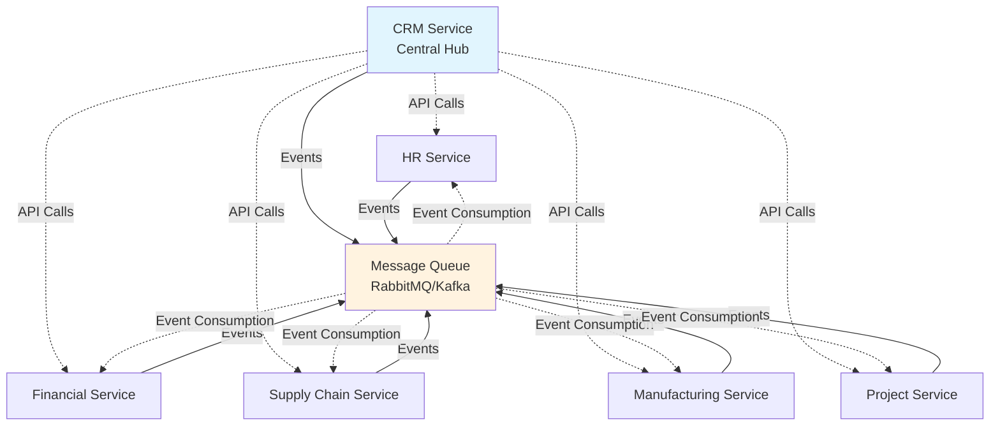
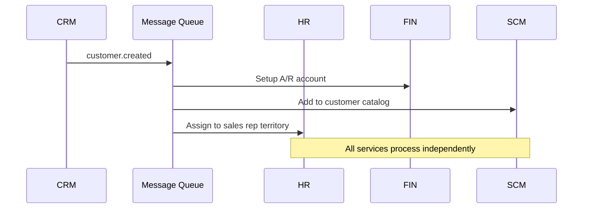
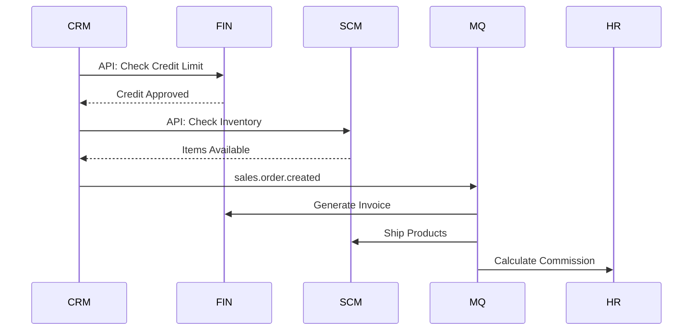
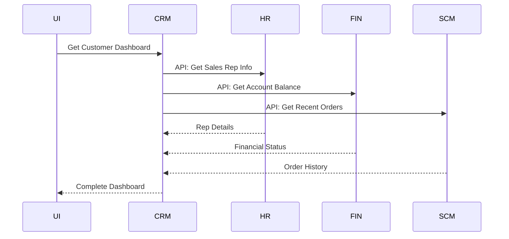

# CRM-Centric Communication Strategy: Messaging vs API

## 🎯 **Architecture Overview: CRM as Central Hub**

## 📡 **Communication Patterns by Use Case**

### 🔥 **Use Message Queue (Async Events) For:**

### **Business Process Workflows**

- **Customer Lifecycle**: Customer creation, status changes, deactivation
- **Sales Process**: Lead qualification → Opportunity → Quote → Order → Fulfillment
- **Order Fulfillment**: Order creation → Inventory check → Production → Shipping → Invoice
- **Financial Transactions**: Order → Invoice → Payment → Commission calculation
- **Employee Changes**: Hire/fire → Territory assignment → Commission structure updates

### **Data Synchronization**

- **Master Data Updates**: Customer info changes, product catalog updates
- **Status Broadcasting**: Order status, inventory levels, employee status
- **Audit Trail Creation**: All financial transactions, customer interactions
- **Reporting Triggers**: End-of-day summaries, monthly reports, KPI updates

### **Cross-Service Workflows**

- **Commission Processing**: Sales completed → HR calculates commission → Finance pays
- **Project Billing**: Project milestones → Time tracking → Invoice generation
- **Inventory Replenishment**: Low stock → Purchase orders → Manufacturing requests

### ⚡ **Use Direct API Calls For:**

### **Real-Time Validations**

- **Credit Checks**: Before approving large orders
- **Inventory Availability**: During order creation
- **Employee Authorization**: Access permissions, territory validation
- **Pricing Calculations**: Real-time quote generation

### **User Interface Interactions**

- **Search Functions**: Customer search, product lookup, employee directory
- **Dropdown Population**: Sales rep lists, customer lists, product catalogs
- **Dashboard Data**: Real-time metrics, current status displays
- **Autocomplete**: Customer names, product codes, employee names

### **Immediate Data Retrieval**

- **Customer Details**: When viewing customer profile
- **Order Status**: Current order information
- **Employee Information**: Contact details, territory assignments
- **Financial Status**: Current balances, payment status

## 🏗️ **Detailed Communication Matrix**

### **CRM ↔ HR Service**

| Scenario | Method | Direction | Purpose |
| --- | --- | --- | --- |
| **Employee Onboarding** | 🔥 **Events** | HR → CRM | Create sales rep profile, assign territory |
| **Sales Rep Termination** | 🔥 **Events** | HR → CRM | Reassign customers, close access |
| **Commission Calculation** | 🔥 **Events** | CRM → HR | Sales completed, calculate commission |
| **Commission Payment** | 🔥 **Events** | HR → CRM | Commission paid, update rep status |
| **Get Employee Details** | ⚡ **API** | CRM → HR | Real-time employee info for UI |
| **Validate Sales Rep** | ⚡ **API** | CRM → HR | Check if employee can handle customers |
| **Territory Assignment** | ⚡ **API** | CRM → HR | Get/update territory boundaries |

### **CRM ↔ Financial Service**

| Scenario | Method | Direction | Purpose |
| --- | --- | --- | --- |
| **Customer Account Setup** | 🔥 **Events** | CRM → FIN | New customer, create A/R account |
| **Sales Order Created** | 🔥 **Events** | CRM → FIN | Generate invoice, update receivables |
| **Payment Received** | 🔥 **Events** | FIN → CRM | Update customer status, credit history |
| **Credit Limit Changes** | 🔥 **Events** | FIN → CRM | Risk assessment updates |
| **Customer Credit Check** | ⚡ **API** | CRM → FIN | Real-time credit validation |
| **Current Balance Inquiry** | ⚡ **API** | CRM → FIN | Show customer financial status |
| **Payment History** | ⚡ **API** | CRM → FIN | Customer profile information |

### **CRM ↔ Supply Chain Service**

| Scenario | Method | Direction | Purpose |
| --- | --- | --- | --- |
| **Order Fulfillment** | 🔥 **Events** | CRM → SCM | Process sales order, ship products |
| **Shipment Tracking** | 🔥 **Events** | SCM → CRM | Update customer on delivery status |
| **Product Catalog Updates** | 🔥 **Events** | SCM → CRM | New products, price changes |
| **Inventory Adjustments** | 🔥 **Events** | SCM → CRM | Stock levels for sales planning |
| **Product Availability** | ⚡ **API** | CRM → SCM | Real-time inventory check |
| **Delivery Estimates** | ⚡ **API** | CRM → SCM | Customer delivery promises |
| **Product Information** | ⚡ **API** | CRM → SCM | Specs, pricing for quotes |

### **CRM ↔ Manufacturing Service**

| Scenario | Method | Direction | Purpose |
| --- | --- | --- | --- |
| **Custom Order Request** | 🔥 **Events** | CRM → MFG | Special product requirements |
| **Production Completion** | 🔥 **Events** | MFG → CRM | Custom order ready for delivery |
| **Capacity Planning** | 🔥 **Events** | MFG → CRM | Production schedules for sales planning |
| **Quality Issues** | 🔥 **Events** | MFG → CRM | Product defects, customer notifications |
| **Production Status** | ⚡ **API** | CRM → MFG | Customer inquiries about custom orders |
| **Capacity Availability** | ⚡ **API** | CRM → MFG | Can we accept rush orders? |
| **Custom Product Pricing** | ⚡ **API** | CRM → MFG | Cost estimates for quotes |

### **CRM ↔ Project Service**

| Scenario | Method | Direction | Purpose |
| --- | --- | --- | --- |
| **Project-Based Sale** | 🔥 **Events** | CRM → PRJ | Convert opportunity to project |
| **Project Milestones** | 🔥 **Events** | PRJ → CRM | Trigger billing, customer updates |
| **Project Completion** | 🔥 **Events** | PRJ → CRM | Close project, customer satisfaction |
| **Resource Allocation** | 🔥 **Events** | PRJ → CRM | Team assignments for customer contact |
| **Project Status** | ⚡ **API** | CRM → PRJ | Real-time status for customer inquiries |
| **Resource Availability** | ⚡ **API** | CRM → PRJ | Can we take on new projects? |
| **Project Team Info** | ⚡ **API** | CRM → PRJ | Customer contact information |

## 🎭 **Event Flow Examples**

### **Scenario 1: New Customer Acquisition**

### **Scenario 2: Sales Order Processing**

### **Scenario 3: Customer Service Dashboard**

## 🎯 **Decision Guidelines**

### **Use Events When:**

- ✅ **Business Process**: Multi-step workflows
- ✅ **Data Consistency**: Multiple services need same data
- ✅ **Audit Trail**: Financial or compliance requirements
- ✅ **Loose Coupling**: Services can process independently
- ✅ **Batch Processing**: End-of-day operations

### **Use API Calls When:**

- ⚡ **Real-Time**: User waiting for immediate response
- ⚡ **Validation**: Before committing transactions
- ⚡ **Query Operations**: Reading current state
- ⚡ **User Interface**: Interactive elements
- ⚡ **Simple Lookups**: Direct data retrieval

## 🚀 **Implementation Priority**

### **Phase 1: Core API Integrations**

1. **CRM ↔ Financial**: Credit checks, customer setup
2. **CRM ↔ HR**: Employee validation, basic info
3. **CRM ↔ SCM**: Product availability, basic orders

### **Phase 2: Event-Driven Workflows**

1. **Order Processing**: CRM → All services
2. **Customer Lifecycle**: Create/update/deactivate
3. **Commission Processing**: Sales → HR → Finance

### **Phase 3: Advanced Integration**

1. **Manufacturing Integration**: Custom orders
2. **Project Integration**: Service-based sales
3. **Advanced Analytics**: Cross-service reporting

This approach ensures **CRM drives business processes** while maintaining **responsive user interfaces** and **reliable data consistency** across all services.