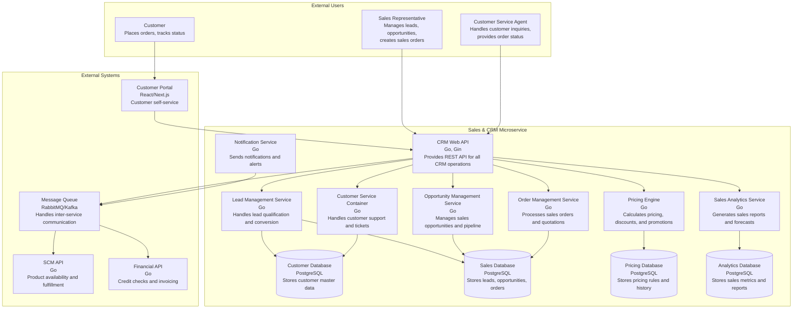

# Comprehensive CRM Specification

## Table of Contents
1. [System Overview](#system-overview)
2. [Core Features](#core-features)
3. [Architecture Design](#architecture-design)
4. [Data Models](#data-models)
5. [REST APIs](#rest-apis)
6. [Message Queue Events](#message-queue-events)
7. [Feature Implementation Details](#feature-implementation-details)
8. [Integration Requirements](#integration-requirements)
9. [Non-Functional Requirements](#non-functional-requirements)

---

## System Overview

The Customer Relationship Management (CRM) system serves as the central hub for managing customer interactions, sales processes, and customer service operations within the ERP ecosystem. It provides comprehensive customer relationship management capabilities including lead management, opportunity tracking, sales order processing, and customer service.

### Business Objectives
- **Customer Relationship Management**: Maintain comprehensive customer interaction history
- **Sales Support**: Provide sales teams with customer insights and communication tools
- **Service Excellence**: Enable effective customer service and support operations
- **Revenue Optimization**: Streamline sales processes from lead to order fulfillment
- **Data Quality Assurance**: Ensure accurate, complete, and consistent customer records

---

## Core Features

### 1. Customer Master Data Management
**Single source of truth for all customer information across the ERP system**

#### Customer Profile Management
- Customer Registration with validation and approval workflows
- Profile Updates with multi-level approval for critical changes
- Customer Classification (B2B, B2C, Partner, Distributor)
- Status Management (Prospect, Active, Inactive, Suspended)
- Duplicate Detection and merge capabilities

#### Customer Information Domains
- **Basic Information**: Company/Individual details, registration numbers, classification
- **Contact Information**: Multiple addresses, communication details, preferences
- **Business Relationship Data**: Customer hierarchy, account managers, territories
- **Financial Information**: Credit limits, payment terms, currency preferences

### 2. Lead Management
**Comprehensive lead capture, qualification, and conversion system**

- Lead Capture from multiple channels (web, phone, email, events)
- Lead Qualification with scoring algorithms
- Lead Nurturing campaigns and automated follow-ups
- Lead-to-Opportunity conversion workflows
- Campaign tracking and ROI analysis

### 3. Opportunity Management
**Sales pipeline management and forecasting**

- Sales Pipeline visualization and tracking
- Opportunity Scoring and probability assessment
- Sales Forecasting with confidence intervals
- Win/Loss Analysis and competitive intelligence
- Deal progression tracking with milestone management

### 4. Sales Order Processing
**Complete order lifecycle management from quote to fulfillment**

#### Order Creation and Management
- Multi-channel Order Entry (web, mobile, phone, email, EDI, API)
- Quote-to-Order Conversion with approval workflows
- Recurring Order Management for subscriptions
- Rush Order Processing with expedited handling

#### Order Validation and Processing
- Customer Validation (status, credit worthiness)
- Product Validation (availability, configuration)
- Pricing Validation (discounts, promotions, contract pricing)
- Inventory Integration with real-time availability

### 5. Customer Service Management
**Comprehensive customer support and service operations**

- Service Ticket creation and management
- Multi-channel support (phone, email, chat, portal)
- Knowledge Base with searchable solutions
- SLA management and escalation procedures
- Customer satisfaction tracking

### 6. Pricing Management
**Dynamic pricing engine with flexible rules**

- Price Lists with customer-specific pricing
- Discount Management with approval workflows
- Promotional Pricing campaigns
- Contract Pricing for enterprise customers
- Real-time pricing calculations

---

## Architecture Design

### C4 Level 2: Container Diagram



---

## Data Models

### Customer Model
```go
type Customer struct {
    ID                 string    `json:"id" db:"id"`
    CustomerNumber     string    `json:"customer_number" db:"customer_number"`
    Name               string    `json:"name" db:"name"`
    LegalName          string    `json:"legal_name,omitempty" db:"legal_name"`
    Type               string    `json:"type" db:"type"` // B2B, B2C, Partner
    Status             string    `json:"status" db:"status"` // Active, Inactive, Prospect
    Industry           string    `json:"industry,omitempty" db:"industry"`
    TaxID              string    `json:"tax_id,omitempty" db:"tax_id"`
    CreditLimit        float64   `json:"credit_limit" db:"credit_limit"`
    PaymentTerms       string    `json:"payment_terms" db:"payment_terms"`
    Currency           string    `json:"currency" db:"currency"`
    AccountManagerID   string    `json:"account_manager_id,omitempty" db:"account_manager_id"`
    CreatedAt          time.Time `json:"created_at" db:"created_at"`
    UpdatedAt          time.Time `json:"updated_at" db:"updated_at"`
    
    // Embedded structs for related data
    BillingAddress     Address   `json:"billing_address"`
    ShippingAddress    Address   `json:"shipping_address"`
    PrimaryContact     Contact   `json:"primary_contact"`
}
```

### Lead Model
```go
type Lead struct {
    ID               string    `json:"id" db:"id"`
    FirstName        string    `json:"first_name" db:"first_name"`
    LastName         string    `json:"last_name" db:"last_name"`
    Company          string    `json:"company,omitempty" db:"company"`
    Email            string    `json:"email" db:"email"`
    Phone            string    `json:"phone,omitempty" db:"phone"`
    Source           string    `json:"source" db:"source"`
    Status           string    `json:"status" db:"status"` // New, Qualified, Converted, Lost
    Score            int       `json:"score" db:"score"`
    AssignedTo       string    `json:"assigned_to,omitempty" db:"assigned_to"`
    CampaignID       string    `json:"campaign_id,omitempty" db:"campaign_id"`
    ConvertedAt      *time.Time `json:"converted_at,omitempty" db:"converted_at"`
    OpportunityID    string    `json:"opportunity_id,omitempty" db:"opportunity_id"`
    CreatedAt        time.Time `json:"created_at" db:"created_at"`
    UpdatedAt        time.Time `json:"updated_at" db:"updated_at"`
}
```

### Opportunity Model
```go
type Opportunity struct {
    ID               string    `json:"id" db:"id"`
    Name             string    `json:"name" db:"name"`
    CustomerID       string    `json:"customer_id" db:"customer_id"`
    LeadID           string    `json:"lead_id,omitempty" db:"lead_id"`
    Stage            string    `json:"stage" db:"stage"`
    Probability      int       `json:"probability" db:"probability"`
    Value            float64   `json:"value" db:"value"`
    Currency         string    `json:"currency" db:"currency"`
    ExpectedCloseDate time.Time `json:"expected_close_date" db:"expected_close_date"`
    ActualCloseDate  *time.Time `json:"actual_close_date,omitempty" db:"actual_close_date"`
    SalesRepID       string    `json:"sales_rep_id" db:"sales_rep_id"`
    Source           string    `json:"source,omitempty" db:"source"`
    CompetitorInfo   string    `json:"competitor_info,omitempty" db:"competitor_info"`
    LossReason       string    `json:"loss_reason,omitempty" db:"loss_reason"`
    CreatedAt        time.Time `json:"created_at" db:"created_at"`
    UpdatedAt        time.Time `json:"updated_at" db:"updated_at"`
}
```

### Sales Order Model
```go
type SalesOrder struct {
    ID               string    `json:"id" db:"id"`
    OrderNumber      string    `json:"order_number" db:"order_number"`
    CustomerID       string    `json:"customer_id" db:"customer_id"`
    OpportunityID    string    `json:"opportunity_id,omitempty" db:"opportunity_id"`
    Status           string    `json:"status" db:"status"`
    OrderDate        time.Time `json:"order_date" db:"order_date"`
    RequiredDate     time.Time `json:"required_date" db:"required_date"`
    ShippedDate      *time.Time `json:"shipped_date,omitempty" db:"shipped_date"`
    Subtotal         float64   `json:"subtotal" db:"subtotal"`
    TaxAmount        float64   `json:"tax_amount" db:"tax_amount"`
    DiscountAmount   float64   `json:"discount_amount" db:"discount_amount"`
    TotalAmount      float64   `json:"total_amount" db:"total_amount"`
    Currency         string    `json:"currency" db:"currency"`
    SalesRepID       string    `json:"sales_rep_id" db:"sales_rep_id"`
    CreatedAt        time.Time `json:"created_at" db:"created_at"`
    UpdatedAt        time.Time `json:"updated_at" db:"updated_at"`
    
    OrderLines       []SalesOrderLine `json:"order_lines"`
}
```

---

## REST APIs

### Customer Management
```go
// Customer CRUD Operations
GET    /api/v1/customers                    // List all customers with pagination
POST   /api/v1/customers                    // Create new customer
GET    /api/v1/customers/{id}               // Get customer details
PUT    /api/v1/customers/{id}               // Update customer
DELETE /api/v1/customers/{id}               // Delete customer
GET    /api/v1/customers/{id}/orders        // Get customer order history
GET    /api/v1/customers/{id}/interactions  // Get customer interaction history
```

### Lead Management
```go
// Lead Operations
GET    /api/v1/leads                        // List leads with filtering
POST   /api/v1/leads                        // Create new lead
GET    /api/v1/leads/{id}                   // Get lead details
PUT    /api/v1/leads/{id}                   // Update lead
DELETE /api/v1/leads/{id}                   // Delete lead
POST   /api/v1/leads/{id}/convert           // Convert lead to opportunity
PUT    /api/v1/leads/{id}/assign            // Assign lead to sales rep
POST   /api/v1/leads/{id}/score             // Update lead score
```

### Opportunity Management
```go
// Opportunity Operations
GET    /api/v1/opportunities                // List opportunities
POST   /api/v1/opportunities                // Create new opportunity
GET    /api/v1/opportunities/{id}           // Get opportunity details
PUT    /api/v1/opportunities/{id}           // Update opportunity
DELETE /api/v1/opportunities/{id}           // Delete opportunity
POST   /api/v1/opportunities/{id}/win       // Mark opportunity as won
POST   /api/v1/opportunities/{id}/lose      // Mark opportunity as lost
PUT    /api/v1/opportunities/{id}/stage     // Update opportunity stage
```

### Sales Orders
```go
// Sales Order Operations
GET    /api/v1/sales-orders                 // List sales orders
POST   /api/v1/sales-orders                 // Create new sales order
GET    /api/v1/sales-orders/{id}            // Get sales order details
PUT    /api/v1/sales-orders/{id}            // Update sales order
DELETE /api/v1/sales-orders/{id}            // Delete sales order
POST   /api/v1/sales-orders/{id}/confirm    // Confirm sales order
POST   /api/v1/sales-orders/{id}/cancel     // Cancel sales order
GET    /api/v1/sales-orders/{id}/status     // Get order status
```

### Customer Service
```go
// Service Ticket Operations
GET    /api/v1/service-tickets              // List service tickets
POST   /api/v1/service-tickets              // Create service ticket
GET    /api/v1/service-tickets/{id}         // Get ticket details
PUT    /api/v1/service-tickets/{id}         // Update ticket
DELETE /api/v1/service-tickets/{id}         // Delete ticket
POST   /api/v1/service-tickets/{id}/assign  // Assign ticket
POST   /api/v1/service-tickets/{id}/close   // Close ticket
```

---

## Message Queue Events

### Published Events

#### Customer Events
```go
crm.customer.created              // New customer registered
crm.customer.updated              // Customer information changed
crm.customer.activated            // Customer status activated
crm.customer.deactivated          // Customer status deactivated
crm.customer.credit.limit.changed // Credit limit modified
```

#### Lead Events
```go
crm.lead.created                  // New lead captured
crm.lead.qualified                // Lead qualified for sales
crm.lead.converted                // Lead converted to opportunity
crm.lead.lost                     // Lead marked as lost
crm.lead.assigned                 // Lead assigned to sales rep
```

#### Opportunity Events
```go
crm.opportunity.created           // New opportunity created
crm.opportunity.updated           // Opportunity details changed
crm.opportunity.stage.changed     // Opportunity stage progressed
crm.opportunity.won               // Opportunity closed as won
crm.opportunity.lost              // Opportunity closed as lost
```

#### Sales Order Events
```go
crm.sales.order.created           // New sales order created
crm.sales.order.updated           // Sales order modified
crm.sales.order.confirmed         // Sales order confirmed
crm.sales.order.cancelled         // Sales order cancelled
crm.sales.order.shipped           // Sales order shipped
crm.sales.order.delivered         // Sales order delivered
```

### Consumed Events

```go
// From SCM Module
scm.inventory.available           // Update product availability
scm.shipment.delivered            // Update order status

// From Financial Module
fin.payment.received              // Update customer payment status
fin.credit.check.completed        // Update customer credit status
fin.invoice.generated             // Link invoice to sales order

// From Manufacturing Module
mfg.production.completed          // Update product availability

// From Project Module
prj.project.completed             // Update project-based orders

// From HR Module
hr.employee.performance           // Update sales rep performance
```

---

## Feature Implementation Details

### Customer Master Data Implementation
- **Data Validation Rules**: Configurable validation for customer data fields
- **Approval Workflows**: Multi-level approval for critical data changes
- **Data History Tracking**: Complete audit trail of all customer data changes
- **Duplicate Detection**: Automated algorithms to identify potential duplicates
- **Data Quality Scoring**: Real-time data completeness and accuracy metrics

### Sales Order Processing Implementation
- **Multi-channel Order Entry**: Support for web, mobile, phone, email, EDI, API
- **Real-time Inventory Integration**: Live inventory availability checks
- **Pricing Engine Integration**: Dynamic pricing with discounts and promotions
- **Workflow Management**: Configurable approval workflows for orders
- **Fulfillment Coordination**: Integration with warehouse and shipping systems

### Customer Service Implementation
- **Omnichannel Support**: Unified customer service across all channels
- **SLA Management**: Automated SLA tracking and escalation
- **Knowledge Base**: Searchable repository of solutions and procedures
- **Performance Analytics**: Real-time service metrics and reporting

---

## Integration Requirements

### Internal ERP Integrations
- **Financial Management**: Customer credit checks, invoicing, payment processing
- **Supply Chain Management**: Inventory availability, order fulfillment
- **Human Resources**: Sales rep assignments, performance tracking
- **Manufacturing**: Custom order production, delivery scheduling
- **Project Management**: Project-based customer orders and billing

### External System Integrations
- **Customer Portal**: Self-service capabilities for customers
- **Payment Gateways**: Payment processing for orders
- **Email Systems**: Automated customer communications
- **Marketing Automation**: Lead nurturing and campaign management
- **Shipping Carriers**: Shipping integration and tracking

---

## Non-Functional Requirements

### Performance Requirements
- **Response Time**: Sub-second response for customer lookups (< 200ms for 95% of requests)
- **Throughput**: Process 1000+ orders per hour during peak times
- **Scalability**: Support for millions of customer records
- **Concurrent Users**: Support 500+ concurrent users

### Reliability Requirements
- **Availability**: 99.9% uptime with failover capabilities
- **Data Integrity**: 99.95% order processing accuracy
- **Backup & Recovery**: Real-time data replication and point-in-time recovery

### Security Requirements
- **Authentication**: Multi-factor authentication for all users
- **Authorization**: Role-based access control with fine-grained permissions
- **Data Encryption**: Encryption at rest and in transit
- **Audit Trail**: Complete audit logging of all system activities
- **Compliance**: GDPR-compliant data handling and retention policies

### Success Metrics
- Customer data completeness score > 95%
- Order processing time < 2 hours for standard orders
- Customer satisfaction score > 4.5/5.0
- Sales conversion rate improvement > 15%
- Service ticket resolution rate > 90% within SLA
- Customer retention rate improvement > 5% annually