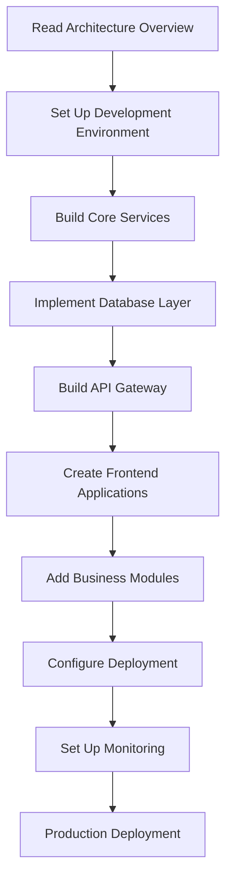

# ERP System Documentation

A modern, microservices-based Enterprise Resource Planning system built with Go, React, and cloud-native technologies.

## What is This System?

The ERP System is a comprehensive business management platform that handles:
- **Financial Management**: General ledger, accounts payable/receivable, budgeting
- **Human Resources**: Employee management, payroll, time tracking
- **Supply Chain**: Inventory management, procurement, supplier relations
- **Customer Relations**: Sales pipeline, customer support, marketing campaigns
- **Manufacturing**: Production planning, quality control, bill of materials
- **Project Management**: Resource allocation, time tracking, project billing

## Quick Start

New to the system? Start here:

1. **[🚀 Getting Started](getting-started.md)** - Set up your development environment (15 minutes)
2. **[🏗️ Architecture Overview](architecture-overview.md)** - Understand the system design
3. **[⚡ First Implementation](first-implementation.md)** - Build and run your first service

## Documentation Structure

This documentation follows a **top-down implementation flow** - from high-level concepts to specific code examples:

### 📚 Foundation Knowledge
Start here to understand the system before implementing:

- **[Architecture Overview](architecture-overview.md)** - System design, components, and data flow
- **[Technology Stack](technology-stack.md)** - Technologies used and why
- **[Development Environment](development-environment.md)** - Tools and setup requirements

### 🔨 Implementation Guides
Step-by-step instructions for building the system:

- **[Getting Started](getting-started.md)** - Prerequisites and first setup
- **[Backend Services](backend-implementation.md)** - Build Go microservices
- **[Frontend Application](frontend-implementation.md)** - Build React applications
- **[Database Setup](database-implementation.md)** - Configure PostgreSQL and Redis
- **[API Integration](api-integration.md)** - Connect services and external systems

### 🏢 Business Modules
Module-specific implementation details:

- **[Financial Management](modules/financial-implementation.md)** - Accounting and financial features
- **[Human Resources](modules/hr-implementation.md)** - Employee and payroll features
- **[Supply Chain](modules/supply-chain-implementation.md)** - Inventory and procurement features
- **[Customer Relations](modules/crm-implementation.md)** - Sales and customer features

### 🚀 Deployment & Operations
Production deployment and maintenance:

- **[Deployment Guide](deployment.md)** - Deploy to production environments
- **[Configuration Management](configuration.md)** - Environment-specific settings
- **[Monitoring & Logging](monitoring.md)** - Observability and debugging
- **[Troubleshooting](troubleshooting.md)** - Common issues and solutions

### 📖 Reference Materials
Quick reference for ongoing development:

- **[API Reference](api-reference.md)** - All endpoints and data formats
- **[Database Schema](database-schema.md)** - Complete data model
- **[Glossary](glossary.md)** - Terms and definitions
- **[FAQ](faq.md)** - Frequently asked questions

## Implementation Flow

Follow this sequence for building the complete system:

## For Different Audiences

### 👨‍💻 Developers
Start with:
1. [Getting Started](getting-started.md)
2. [Architecture Overview](architecture-overview.md)
3. [Backend Implementation](backend-implementation.md)
4. [API Reference](api-reference.md)

### 🏢 Business Stakeholders
Focus on:
1. [Architecture Overview](architecture-overview.md) (business sections)
2. [Financial Management](modules/financial-implementation.md)
3. [Human Resources](modules/hr-implementation.md)
4. [Deployment Guide](deployment.md) (overview sections)

### 🔧 System Administrators
Begin with:
1. [Architecture Overview](architecture-overview.md)
2. [Technology Stack](technology-stack.md)
3. [Deployment Guide](deployment.md)
4. [Monitoring & Logging](monitoring.md)
5. [Troubleshooting](troubleshooting.md)

## System Requirements

### Minimum Development Environment
- **Go**: 1.21 or later
- **Node.js**: 18.0 or later
- **Docker**: 20.10 or later
- **PostgreSQL**: 15.0 or later
- **Redis**: 7.0 or later

### Production Environment
- **Kubernetes**: 1.25 or later
- **Cloud Provider**: AWS, GCP, or Azure
- **Load Balancer**: With SSL termination
- **Monitoring**: Prometheus and Grafana

## Contributing

This documentation follows specific principles:

1. **Top-Down Flow**: Start with overview, end with specific implementation
2. **Implementation-Ready**: Every guide includes working code examples
3. **Active Voice**: Use direct, actionable language
4. **Visual Aids**: Include Mermaid diagrams for complex concepts
5. **Consistency**: Maintain uniform formatting and terminology

When updating documentation:
- Follow the established structure and flow
- Include working code examples
- Add Mermaid diagrams for complex processes
- Test all instructions on a fresh environment
- Update related sections for consistency

## Getting Help

1. **Start with [FAQ](faq.md)** - Common questions and answers
2. **Check [Troubleshooting](troubleshooting.md)** - Known issues and solutions
3. **Review [API Reference](api-reference.md)** - Technical specifications
4. **Consult module-specific guides** - Detailed implementation help

---

**Ready to start?** → [🚀 Getting Started](getting-started.md)

**Need architecture context first?** → [🏗️ Architecture Overview](architecture-overview.md)