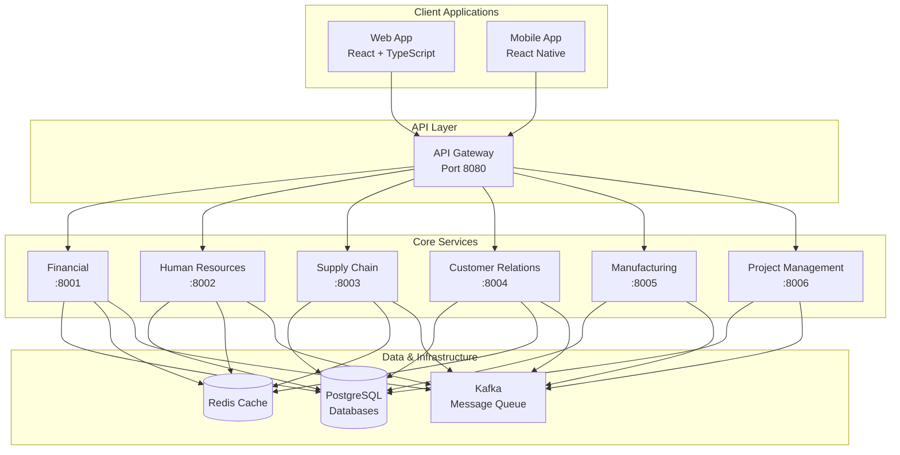

# ERP System Documentation

A modern, microservices-based Enterprise Resource Planning system built with Go, React, and cloud-native technologies.

## What is This System?

The ERP System is a comprehensive business management platform that handles financial management, human resources, supply chain, customer relations, manufacturing, and project management through integrated microservices.

## Documentation Structure

This documentation is organized into focused, digestible sections. Each section contains topic-specific files of 800-1000 words for optimal readability.

## 📚 Getting Started

Everything you need to get the system running:

### Quick Setup
- [Prerequisites](getting-started/prerequisites.md) - Required software and system requirements
- [Installation](getting-started/installation.md) - Get running in 15 minutes
- [Configuration](getting-started/configuration.md) - Environment setup and customization

### Development
- [Development Environment](getting-started/development-environment.md) - IDE setup and local development
- [Development Workflow](getting-started/development-workflow.md) - Daily development practices
- [Testing and Verification](getting-started/testing-verification.md) - Ensure everything works
- [Common Setup Issues](getting-started/common-issues.md) - Solutions to frequent problems

## 🏗️ System Architecture

Complete technical overview and design decisions:

### Architecture Overview
- [System Overview](architecture/system-overview.md) - High-level architecture and components
- [Technology Stack](architecture/technology-stack.md) - Technologies, frameworks, and tools
- [Microservices Architecture](architecture/microservices-architecture.md) - Service design patterns

### Data and Integration
- [Database Design](architecture/database-design.md) - Data modeling and schemas
- [Event-Driven Architecture](architecture/event-architecture.md) - Asynchronous communication
- [API Design](architecture/api-design.md) - REST API standards and conventions

### Security and Performance
- [Security Architecture](architecture/security-architecture.md) - Authentication and data protection
- [Performance Architecture](architecture/performance-architecture.md) - Caching and optimization
- [Deployment Architecture](architecture/deployment-architecture.md) - Container orchestration

## 🏢 Business Modules

All business functionality and features:

### Core Modules
- [Financial Management](modules/financial-management/) - Accounting and financial operations
- [Human Resources](modules/human-resources/) - Employee lifecycle and payroll management
- [Supply Chain Management](modules/supply-chain-management/) - Inventory and procurement
- [Customer Relationship Management](modules/customer-relationship-management/) - Sales and customer management
- [Manufacturing](modules/manufacturing/) - Production planning and execution
- [Project Management](modules/project-management/) - Project planning and resource management

### Integration
All modules are fully integrated, sharing data through:
- Real-time event-driven communication
- Shared customer and employee data
- Unified financial reporting
- Cross-module business process workflows

## 🔧 Operations

Production deployment and maintenance:

### Deployment
- [Production Deployment](operations/deployment.md) - Deploy to Kubernetes, Docker Swarm, cloud platforms
- [Infrastructure Setup](operations/infrastructure.md) - Database, caching, and message queues
- [Configuration Management](operations/configuration.md) - Environment-specific settings

### API and Integration
- [API Reference](operations/api-reference.md) - Complete REST API documentation
- [Authentication](operations/authentication.md) - JWT tokens, user management, security
- [Integration Patterns](operations/integration-patterns.md) - External system integration

### Monitoring and Maintenance
- [Monitoring and Alerting](operations/monitoring.md) - Metrics, dashboards, alerting setup
- [Troubleshooting](operations/troubleshooting.md) - Log analysis and problem resolution
- [Performance Optimization](operations/performance.md) - Tuning for speed and scalability

### Security and Data Protection
- [Security Configuration](operations/security.md) - SSL/TLS, encryption, hardening
- [Backup and Recovery](operations/backup-recovery.md) - Data protection and disaster recovery
- [System Maintenance](operations/maintenance.md) - Routine tasks and health checks

## System Overview Diagram

## Quick Navigation

### For New Users
1. **[Prerequisites](getting-started/prerequisites.md)** - Install required software
2. **[Installation](getting-started/installation.md)** - Get the system running
3. **[System Overview](architecture/system-overview.md)** - Understand the architecture
4. **[Business Modules](modules/README.md)** - Explore the features

### For Developers  
1. **[Development Environment](getting-started/development-environment.md)** - Set up your workspace
2. **[Development Workflow](getting-started/development-workflow.md)** - Learn daily practices
3. **[Microservices Architecture](architecture/microservices-architecture.md)** - Understand service design
4. **[API Reference](operations/api-reference.md)** - Integration specifications

### For System Administrators
1. **[Production Deployment](operations/deployment.md)** - Deploy to production
2. **[Security Configuration](operations/security.md)** - Secure your deployment
3. **[Monitoring](operations/monitoring.md)** - Set up monitoring and alerting
4. **[Troubleshooting](operations/troubleshooting.md)** - Resolve issues

### For Business Users
1. **[Financial Management](modules/financial-management/)** - Accounting features
2. **[Human Resources](modules/human-resources/)** - Employee management
3. **[Supply Chain](modules/supply-chain-management/)** - Inventory operations
4. **[Customer Relations](modules/customer-relationship-management/)** - Sales management

## Key Features

- **Microservices Architecture**: Independent, scalable services
- **Event-Driven Design**: Real-time data synchronization  
- **Cloud-Native**: Container-based deployment with Kubernetes support
- **Modern Tech Stack**: Go backend, React frontend, PostgreSQL database
- **Complete Business Coverage**: All major ERP functions included
- **API-First**: Comprehensive REST APIs for integration
- **Security-Focused**: JWT authentication, role-based access, data encryption

## Business Process Integration

### Order-to-Cash Process
**CRM → SCM → Manufacturing → Financial**
1. Lead qualification and opportunity management (CRM)
2. Inventory allocation and fulfillment (SCM)
3. Production scheduling if needed (Manufacturing)
4. Invoicing and payment collection (Financial)

### Procure-to-Pay Process
**SCM → Financial → HR**
1. Purchase requisition and approval (SCM)
2. Purchase order creation and approval (SCM)
3. Goods receipt and inspection (SCM)
4. Invoice processing and payment (Financial)
5. Expense allocation (HR/Projects)

### Hire-to-Retire Process
**HR → Project → Financial**
1. Recruitment and onboarding (HR)
2. Resource allocation to projects (Project)
3. Time tracking and performance (HR/Project)
4. Payroll processing and benefits (HR)
5. Financial reporting and analysis (Financial)

## Getting Help

### Documentation Hierarchy
1. **Start Here**: [Getting Started](getting-started/README.md)
2. **Technical Issues**: [Troubleshooting](operations/troubleshooting.md)
3. **API Questions**: [API Reference](operations/api-reference.md)
4. **Architecture Questions**: [System Overview](architecture/system-overview.md)

### Support Resources
- **Setup Problems**: [Common Setup Issues](getting-started/common-issues.md)
- **Performance Issues**: [Performance Optimization](operations/performance.md)
- **Security Questions**: [Security Configuration](operations/security.md)
- **Deployment Help**: [Production Deployment](operations/deployment.md)

---

## Ready to Begin?

Choose your path:
- **🚀 Just want to see it work?** → [Installation Guide](getting-started/installation.md)
- **💻 Planning to develop?** → [Development Environment](getting-started/development-environment.md)  
- **🏗️ Want to understand the design?** → [System Overview](architecture/system-overview.md)
- **📋 Need to deploy to production?** → [Production Deployment](operations/deployment.md)
- **🏢 Interested in business features?** → [Business Modules](modules/README.md)