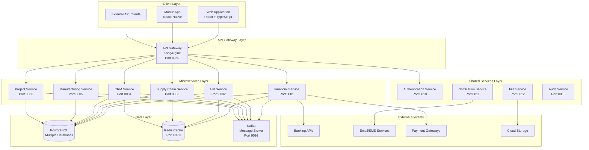
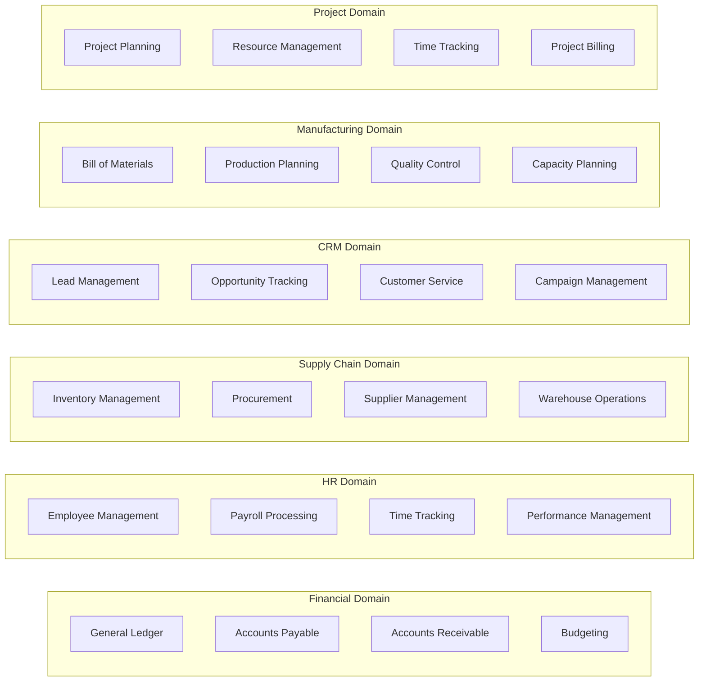
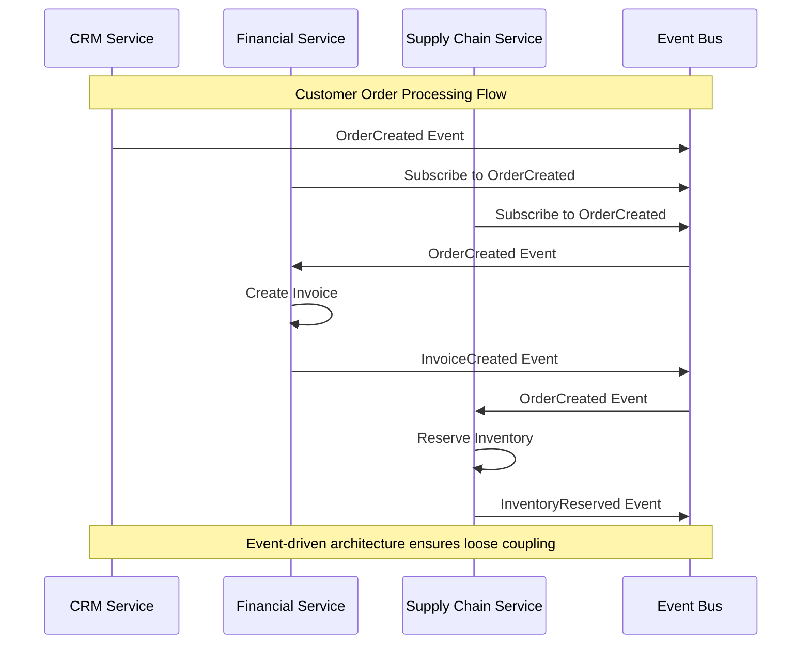
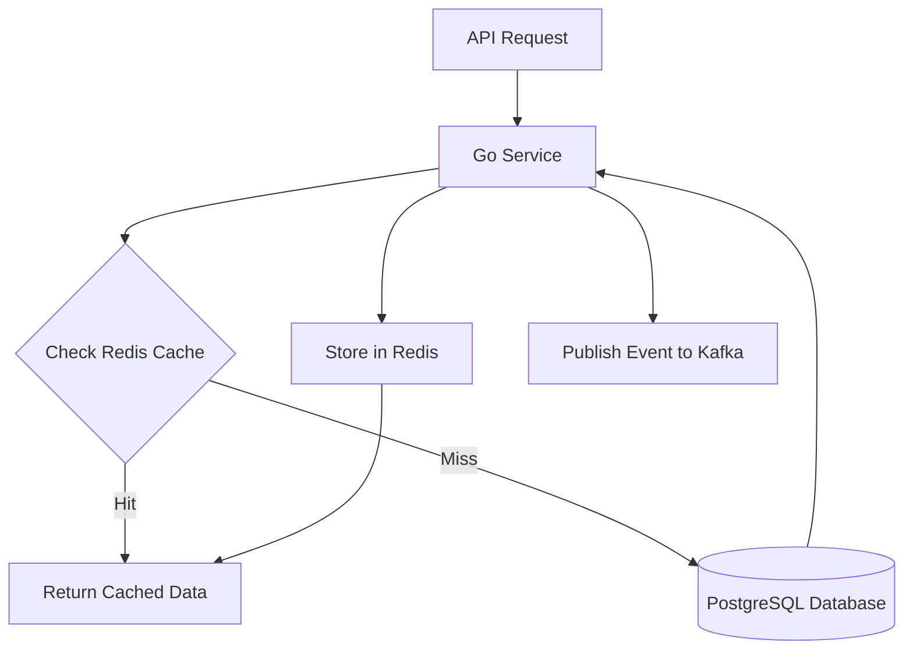
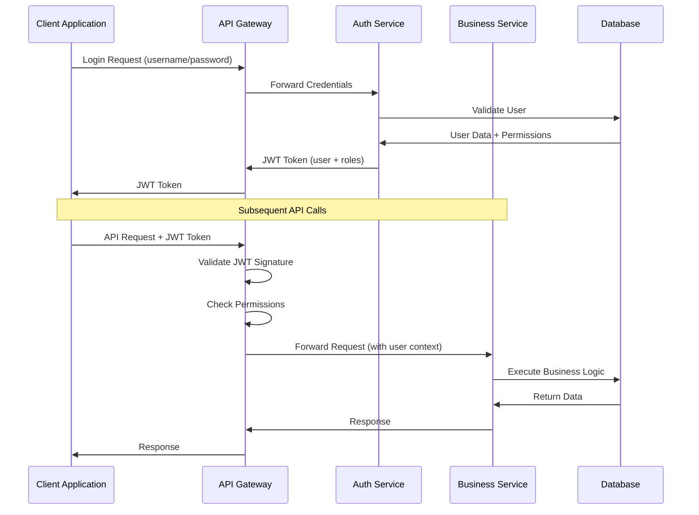

# Architecture Overview

This document provides a comprehensive understanding of the ERP system architecture, from high-level business concepts to technical implementation details.

## System Purpose and Scope

The ERP system is designed to manage all core business operations for medium to large enterprises through an integrated platform that handles:

- **Financial Operations**: Complete accounting, budgeting, and financial reporting
- **Human Resources**: Employee lifecycle, payroll, and performance management
- **Supply Chain**: Procurement, inventory, and supplier relationship management
- **Customer Relations**: Sales pipeline, customer support, and marketing automation
- **Manufacturing**: Production planning, quality control, and bill of materials
- **Project Management**: Resource allocation, time tracking, and project billing

## High-Level System Architecture

The system follows a **microservices architecture** with clear separation of business domains:



## Business Domain Architecture

Each microservice represents a distinct business domain with its own data and business logic:

### Domain Boundaries



### Cross-Domain Integration

Services communicate through well-defined interfaces and events:



## Technical Architecture Layers

### 1. Client Layer
**Purpose**: User interfaces and external system integration points

**Components**:
- **Web Application**: React-based SPA with TypeScript
- **Mobile Application**: React Native for iOS and Android
- **API Clients**: External system integrations

**Implementation Details**:
```typescript
// Example React component structure
interface DashboardProps {
  userRole: UserRole;
  modules: ModulePermissions[];
}

const Dashboard: React.FC<DashboardProps> = ({ userRole, modules }) => {
  return (
    <Layout>
      <Navigation modules={modules} />
      <MainContent>
        {modules.map(module => (
          <ModuleWidget key={module.id} module={module} />
        ))}
      </MainContent>
    </Layout>
  );
};
```

### 2. API Gateway Layer
**Purpose**: Single entry point for all client requests with cross-cutting concerns

**Responsibilities**:
- Request routing and load balancing
- Authentication and authorization
- Rate limiting and throttling
- Request/response transformation
- API versioning and documentation

**Configuration Example**:
```yaml
# Kong Gateway Configuration
services:
  - name: financial-service
    url: http://fm-service:8001
    routes:
      - name: financial-routes
        paths: ["/api/v1/finance"]
        
plugins:
  - name: jwt
    config:
      key_claim_name: kid
  - name: rate-limiting
    config:
      minute: 1000
      hour: 10000
```

### 3. Microservices Layer
**Purpose**: Business logic implementation with domain-specific responsibilities

**Service Structure** (using Clean Architecture):
```
services/fm-service/
├── cmd/
│   └── server/main.go          # Application entry point
├── internal/
│   ├── api/
│   │   ├── handlers/           # HTTP request handlers
│   │   └── routes/             # Route definitions
│   ├── business/
│   │   ├── services/           # Business logic services
│   │   └── domain/             # Domain models and rules
│   ├── data/
│   │   ├── repositories/       # Data access layer
│   │   └── migrations/         # Database schema changes
│   └── config/                 # Service configuration
└── Dockerfile                  # Container definition
```

**Example Service Implementation**:
```go
// Domain Model
type Account struct {
    ID           string          `json:"id"`
    AccountCode  string          `json:"account_code"`
    Name         string          `json:"name"`
    Type         AccountType     `json:"type"`
    Balance      decimal.Decimal `json:"balance"`
}

// Business Service
type AccountService interface {
    CreateAccount(ctx context.Context, req CreateAccountRequest) (*Account, error)
    GetAccountBalance(ctx context.Context, id string) (decimal.Decimal, error)
}

// HTTP Handler
func (h *AccountHandler) CreateAccount(c *gin.Context) {
    var req CreateAccountRequest
    if err := c.ShouldBindJSON(&req); err != nil {
        c.JSON(400, gin.H{"error": err.Error()})
        return
    }
    
    account, err := h.accountService.CreateAccount(c.Request.Context(), req)
    if err != nil {
        c.JSON(500, gin.H{"error": err.Error()})
        return
    }
    
    c.JSON(201, account)
}
```

### 4. Data Layer
**Purpose**: Persistent data storage and caching with consistency guarantees

**Database Strategy**:
- **Database per Service**: Each microservice owns its data
- **PostgreSQL**: Primary data storage with ACID guarantees
- **Redis**: Caching and session management
- **Kafka**: Event streaming and asynchronous communication

**Data Flow Example**:


## Service Communication Patterns

### Synchronous Communication
Used for real-time operations requiring immediate response:

```go
// HTTP client for inter-service communication
type FinancialClient struct {
    baseURL string
    client  *http.Client
}

func (c *FinancialClient) CreateInvoice(ctx context.Context, invoice Invoice) error {
    data, _ := json.Marshal(invoice)
    req, _ := http.NewRequestWithContext(ctx, "POST", 
        c.baseURL+"/invoices", bytes.NewBuffer(data))
    
    resp, err := c.client.Do(req)
    if err != nil {
        return err
    }
    defer resp.Body.Close()
    
    if resp.StatusCode != 201 {
        return fmt.Errorf("failed to create invoice: %d", resp.StatusCode)
    }
    
    return nil
}
```

### Asynchronous Communication
Used for event-driven workflows and eventual consistency:

```go
// Event Publisher
type EventPublisher struct {
    producer sarama.SyncProducer
}

func (p *EventPublisher) PublishOrderCreated(order Order) error {
    event := OrderCreatedEvent{
        OrderID:    order.ID,
        CustomerID: order.CustomerID,
        Amount:     order.Total,
        CreatedAt:  time.Now(),
    }
    
    data, _ := json.Marshal(event)
    msg := &sarama.ProducerMessage{
        Topic: "order-events",
        Key:   sarama.StringEncoder(order.ID),
        Value: sarama.ByteEncoder(data),
    }
    
    _, _, err := p.producer.SendMessage(msg)
    return err
}

// Event Consumer
func (c *OrderEventConsumer) HandleOrderCreated(event OrderCreatedEvent) error {
    // Business logic for handling order creation
    invoice := c.createInvoiceFromOrder(event)
    return c.invoiceService.CreateInvoice(context.Background(), invoice)
}
```

## Data Architecture

### Database Design Principles

1. **Domain-Driven Design**: Each service has its own database schema
2. **Event Sourcing**: Critical events are stored for audit and replay
3. **CQRS**: Separate read and write models for complex queries
4. **Eventual Consistency**: Accept temporary inconsistency for better performance

### Database Schema Example

```sql
-- Financial Service Database Schema
CREATE DATABASE financial_db;

-- Chart of Accounts
CREATE TABLE accounts (
    id UUID PRIMARY KEY DEFAULT gen_random_uuid(),
    account_code VARCHAR(20) UNIQUE NOT NULL,
    account_name VARCHAR(255) NOT NULL,
    account_type VARCHAR(20) NOT NULL,
    parent_account_id UUID REFERENCES accounts(id),
    balance DECIMAL(15,2) DEFAULT 0.00,
    is_active BOOLEAN DEFAULT true,
    created_at TIMESTAMP DEFAULT NOW(),
    updated_at TIMESTAMP DEFAULT NOW()
);

-- Journal Entries
CREATE TABLE journal_entries (
    id UUID PRIMARY KEY DEFAULT gen_random_uuid(),
    entry_number VARCHAR(50) UNIQUE NOT NULL,
    entry_date DATE NOT NULL,
    description TEXT,
    total_amount DECIMAL(15,2) NOT NULL,
    status VARCHAR(20) DEFAULT 'DRAFT',
    created_at TIMESTAMP DEFAULT NOW()
);

-- Journal Entry Lines
CREATE TABLE journal_entry_lines (
    id UUID PRIMARY KEY DEFAULT gen_random_uuid(),
    journal_entry_id UUID REFERENCES journal_entries(id),
    account_id UUID REFERENCES accounts(id),
    line_number INTEGER NOT NULL,
    debit_amount DECIMAL(15,2) DEFAULT 0.00,
    credit_amount DECIMAL(15,2) DEFAULT 0.00,
    description TEXT
);

-- Indexes for performance
CREATE INDEX idx_accounts_type ON accounts(account_type);
CREATE INDEX idx_journal_entries_date ON journal_entries(entry_date);
CREATE INDEX idx_journal_entry_lines_account ON journal_entry_lines(account_id);
```

## Security Architecture

### Authentication and Authorization Flow



### Security Implementation

```go
// JWT Token Structure
type JWTClaims struct {
    UserID      string   `json:"sub"`
    Email       string   `json:"email"`
    Roles       []string `json:"roles"`
    Permissions []string `json:"permissions"`
    jwt.StandardClaims
}

// Middleware for authentication
func AuthenticationMiddleware() gin.HandlerFunc {
    return func(c *gin.Context) {
        tokenString := c.GetHeader("Authorization")
        if tokenString == "" {
            c.JSON(401, gin.H{"error": "Authorization header required"})
            c.Abort()
            return
        }
        
        token, err := jwt.ParseWithClaims(tokenString, &JWTClaims{}, 
            func(token *jwt.Token) (interface{}, error) {
                return jwtSecretKey, nil
            })
            
        if err != nil || !token.Valid {
            c.JSON(401, gin.H{"error": "Invalid token"})
            c.Abort()
            return
        }
        
        claims := token.Claims.(*JWTClaims)
        c.Set("user_id", claims.UserID)
        c.Set("user_roles", claims.Roles)
        c.Next()
    }
}
```

## Deployment Architecture

### Container Strategy

```dockerfile
# Multi-stage build for Go services
FROM golang:1.21-alpine AS builder

WORKDIR /app
COPY go.mod go.sum ./
RUN go mod download

COPY . .
RUN CGO_ENABLED=0 GOOS=linux go build -o main cmd/server/main.go

FROM alpine:latest
RUN apk --no-cache add ca-certificates tzdata
WORKDIR /root/

COPY --from=builder /app/main .
EXPOSE 8001

CMD ["./main"]
```

### Kubernetes Deployment

```yaml
apiVersion: apps/v1
kind: Deployment
metadata:
  name: financial-service
spec:
  replicas: 3
  selector:
    matchLabels:
      app: financial-service
  template:
    metadata:
      labels:
        app: financial-service
    spec:
      containers:
      - name: financial-service
        image: erp-system/financial-service:latest
        ports:
        - containerPort: 8001
        env:
        - name: DB_HOST
          value: "postgresql-service"
        - name: REDIS_HOST
          value: "redis-service"
        livenessProbe:
          httpGet:
            path: /health
            port: 8001
          initialDelaySeconds: 30
          periodSeconds: 10
        readinessProbe:
          httpGet:
            path: /ready
            port: 8001
          initialDelaySeconds: 5
          periodSeconds: 5
```

## Monitoring and Observability

### Distributed Tracing
Each request gets a correlation ID that flows through all services:

```go
// Correlation ID middleware
func CorrelationIDMiddleware() gin.HandlerFunc {
    return func(c *gin.Context) {
        correlationID := c.GetHeader("X-Correlation-ID")
        if correlationID == "" {
            correlationID = uuid.New().String()
        }
        
        c.Header("X-Correlation-ID", correlationID)
        c.Set("correlation_id", correlationID)
        
        // Add to logger context
        logger := log.WithField("correlation_id", correlationID)
        c.Set("logger", logger)
        
        c.Next()
    }
}
```

### Health Checks
Each service implements comprehensive health checks:

```go
type HealthChecker struct {
    db    *gorm.DB
    redis *redis.Client
}

func (h *HealthChecker) Check() HealthStatus {
    status := HealthStatus{
        Status: "healthy",
        Checks: make(map[string]interface{}),
    }
    
    // Database connectivity
    if err := h.db.DB().Ping(); err != nil {
        status.Status = "unhealthy"
        status.Checks["database"] = map[string]interface{}{
            "status": "down",
            "error":  err.Error(),
        }
    } else {
        status.Checks["database"] = map[string]interface{}{
            "status": "up",
        }
    }
    
    // Redis connectivity
    if err := h.redis.Ping().Err(); err != nil {
        status.Status = "degraded"
        status.Checks["redis"] = map[string]interface{}{
            "status": "down",
            "error":  err.Error(),
        }
    } else {
        status.Checks["redis"] = map[string]interface{}{
            "status": "up",
        }
    }
    
    return status
}
```

## Implementation Priorities

Follow this sequence when implementing the system:

### Phase 1: Foundation (Weeks 1-2)
1. Set up development environment
2. Implement API Gateway with basic routing
3. Create Authentication service
4. Build one core service (Financial) as a template

### Phase 2: Core Services (Weeks 3-6)
1. Implement remaining business services
2. Add database schemas and migrations  
3. Implement inter-service communication
4. Add basic monitoring and logging

### Phase 3: Integration (Weeks 7-8)
1. Implement event-driven workflows
2. Add comprehensive error handling
3. Create deployment scripts
4. Implement security hardening

### Phase 4: Production (Weeks 9-10)
1. Performance optimization
2. Production deployment
3. Monitoring dashboard setup
4. Load testing and tuning

## Next Steps

Now that you understand the architecture:

1. **[🔨 Backend Implementation](backend-implementation.md)** - Build your first service
2. **[🗄️ Database Setup](database-implementation.md)** - Configure data persistence
3. **[🌐 API Integration](api-integration.md)** - Connect services together
4. **[🏢 Business Modules](modules/)** - Implement domain-specific features

---

**Ready to start building?** → [🔨 Backend Implementation](backend-implementation.md)

**Need more technical details?** → [📖 API Reference](api-reference.md)