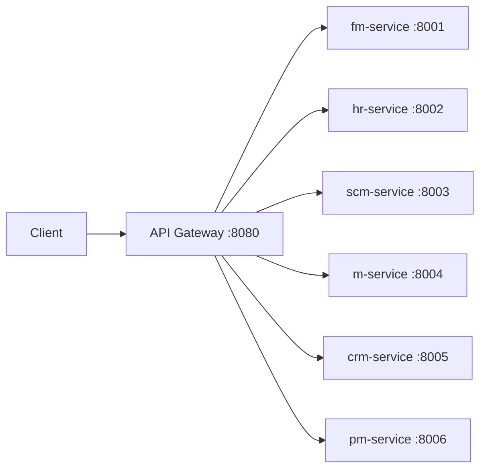

# API Design

Architecture, standards, and conventions for the ERP system's REST API layer.

## Architecture Overview

All client requests flow through a single **API Gateway** (port 8080) which reverse-proxies to the appropriate microservice. Services are not directly exposed to clients.



## API Gateway

The gateway has two code paths — a **simple reverse proxy** (currently deployed) and a **full-featured server** with auth (defined but inactive).

### Active Path: `cmd/main.go`

The deployed gateway uses Go's `net/http/httputil.ReverseProxy` to forward all matching requests as-is to backend services:

```go
proxy := httputil.NewSingleHostReverseProxy(target)
r.Any("/api/v1/"+serviceName+"/*path", func(c *gin.Context) {
    proxy.ServeHTTP(c.Writer, c.Request)
})
```

- Forwards **any HTTP method** matching `/api/v1/{service}/*path`
- Preserves the full original path and query string
- No request/response transformation
- No authentication or authorization

### Inactive Path: `internal/server/server.go`

A richer server implementation exists but is **not wired into the deployed binary**. It provides:

- **JWT authentication** middleware (`ValidateToken`)
- **Permission-based authorization** (`RequirePermission`)
- **Role-based authorization** (`RequireRole`)
- **CORS middleware** (allows all origins)
- **Admin health-check endpoint** (`/api/v1/admin/services/status`)
- **User context injection** into proxied requests (`X-User-ID`, `X-Username` headers)

### Rate Limiter

An in-memory, per-IP sliding-window rate limiter is defined in `internal/middleware/rate_limit.go` but is **not wired into either entry point**.

### Gateway Service URL Configuration

| Service | Active Path Default URL | Inactive Path Default URL |
|---------|------------------------|---------------------------|
| Auth | — | `http://auth-service:8090` |
| FM | `http://finance-service:8001` | `http://fm-service:8081` |
| HR | `http://hr-service:8002` | `http://hr-service:8082` |
| SCM | `http://scm-service:8003` | `http://scm-service:8083` |
| Manufacturing | `http://manufacturing-service:8004` | `http://m-service:8084` |
| CRM | `http://crm-service:8005` | `http://crm-service:8085` |
| PM | `http://projects-service:8006` | `http://pm-service:8086` |

> **Note**: The two paths use different port ranges (8001-8006 vs 8081-8086) and different service naming conventions.

## Route Conventions

### URL Structure

```
/api/v1/{domain}/{resource}[/{id}][/{action}]
```

### Service Route Prefixes

| Service | Gateway Prefix | Actual Service Routes (under `/api/v1`) |
|---------|---------------|----------------------------------------|
| FM | `/api/v1/fm/*` → fm-service:8001 | `/api/v1/accounts`, `/api/v1/journal-entries`, `/api/v1/invoices`, `/api/v1/payments`, `/api/v1/reports` |
| HR | `/api/v1/hr/*` → hr-service:8002 | `/api/v1/employees`, `/api/v1/payroll`, `/api/v1/timesheet`, `/api/v1/leave-requests`, `/api/v1/recruitment/*`, `/api/v1/performance/*`, `/api/v1/training/*`, `/api/v1/reports` |
| SCM | `/api/v1/scm/*` → scm-service:8003 | `/api/v1/products`, `/api/v1/product-categories`, `/api/v1/vendors`, `/api/v1/vendor-contracts`, `/api/v1/purchase-orders`, `/api/v1/purchase-requisitions`, `/api/v1/inventory`, `/api/v1/stock-transfers`, `/api/v1/receipts`, `/api/v1/shipments`, `/api/v1/demand-forecasts`, `/api/v1/reports` |
| M | `/api/v1/m/*` → m-service:8004 | `/api/v1/boms`, `/api/v1/work-centers`, `/api/v1/routings`, `/api/v1/production-plans`, `/api/v1/work-orders`, `/api/v1/quality-inspections`, `/api/v1/maintenance-schedules` |
| CRM | `/api/v1/crm/*` → crm-service:8005 | `/api/v1/customers`, `/api/v1/leads`, `/api/v1/opportunities`, `/api/v1/sales-orders`, `/api/v1/quotes`, `/api/v1/service-tickets`, `/api/v1/campaigns`, `/api/v1/price-lists` |
| PM | `/api/v1/pm/*` → pm-service:8006 | `/api/v1/projects/portfolios`, `/api/v1/projects`, `/api/v1/projects/:id/tasks`, `/api/v1/projects/:id/allocations`, `/api/v1/projects/:id/time`, `/api/v1/projects/:id/expenses`, `/api/v1/projects/:id/documents`, `/api/v1/projects/:id/issues`, `/api/v1/projects/:id/change-requests` |

> The gateway blindly forwards `/api/v1/{service}/*path` to the backend. The backend receives the **full path** including the prefix. For example, a request to `/api/v1/fm/accounts` is forwarded to `http://fm-service:8001/api/v1/fm/accounts`. The backend service parses this as `/api/v1/accounts` (since its routes are defined without the service prefix).

### HTTP Methods

| Method | Usage |
|--------|-------|
| `GET` | List resources or retrieve a single resource |
| `POST` | Create a resource or trigger an action on a resource |
| `PUT` | Full or partial update of a resource |
| `DELETE` | Remove a resource |

### Naming Conventions

- **Resources**: Plural nouns (`/api/v1/accounts`, `/api/v1/employees`)
- **Resource IDs**: Path parameters (`/api/v1/accounts/:id`)
- **Actions**: Verb after resource path (`/api/v1/leads/:id/convert`, `/api/v1/work-orders/:id/start`)
- **Sub-resources**: Nested under parent (`/api/v1/projects/:id/tasks`, `/api/v1/employees/:id/documents`)
- **Reports**: Under `/api/v1/reports/` with descriptive names (`/api/v1/reports/balance-sheet`)
- **Parameterized paths**: Some services use query-style paths (`/api/v1/payroll/employee/:id` — HR)

## API Standards

### Request Body

All write operations accept JSON request bodies bound via Gin's `c.ShouldBindJSON()`:

```json
{
    "field_name": "value",
    "another_field": 123
}
```

### Response Format

All services return JSON. Two conventions exist:

**Simple responses** (used by all services' handlers directly):
```json
{
    "data": { ... },
    "message": "success"
}
```

**Standardized response** (available via shared utils but not currently used):
```json
{
    "success": true,
    "message": "...",
    "data": { ... },
    "error": "",
    "service": "api-gateway",
    "request_id": "...",
    "timestamp": "2026-06-06T12:00:00Z"
}
```

### Error Responses

```json
{
    "error": "Description of what went wrong"
}
```

- **400** — Bad request (missing/invalid fields, validation errors)
- **404** — Resource not found
- **500** — Internal server error

## Authentication and Authorization

### In the Deployed Gateway (`cmd/main.go`)

**No authentication** — all requests pass through unauthenticated.

### In the Inactive Gateway (`internal/server/server.go`)

A full JWT-based auth system is defined:

#### Authentication
- `POST /api/v1/auth/login` — returns JWT token
- `POST /api/v1/auth/register` — creates account
- `POST /api/v1/auth/refresh` — refreshes token
- Token format: `Authorization: Bearer <jwt>`

#### JWT Token Structure
```json
{
    "user_id": 1,
    "username": "jdoe",
    "email": "jdoe@example.com",
    "roles": ["admin"],
    "permissions": ["fm:accounts:write", "hr:*:read"]
}
```

#### Authorization Model

**Permissions** follow the format `{service}:{resource}:{action}`:
- `fm:accounts:write` — write access to FM accounts
- `hr:*:read` — read access to all HR resources
- `m:work-orders:write` — write access to manufacturing work orders

**Roles** are simple string checks: e.g., `RequireRole("admin")`.

**Per-route protection** (in `server.go`) uses granular permission checks for FM:
```
GET    /api/v1/fm/accounts     → fm:*:read
POST   /api/v1/fm/accounts     → fm:accounts:write
DELETE /api/v1/fm/accounts/:id → fm:accounts:delete
GET    /api/v1/fm/reports/*    → fm:reports:read
```

All other services use a catch-all wildcard permission per domain:
```
ANY /api/v1/hr/*path → hr:*:read
ANY /api/v1/scm/*path → scm:*:read
ANY /api/v1/m/*path → m:*:read
ANY /api/v1/crm/*path → crm:*:read
ANY /api/v1/pm/*path → pm:*:read
```

### Downstream Service Auth

A `JWTMiddleware` in `internal/middleware/auth_client.go` is available for individual services to trust the gateway's forwarded headers (`X-User-ID`, `X-Username`), but no service currently uses it.

## Cross-Service Routes

Several endpoints trigger cross-service communication via Kafka events rather than direct HTTP:

| Endpoint | Service | Event Published | Consumed By |
|----------|---------|----------------|-------------|
| `POST /api/v1/sales-orders` | CRM | `crm.sales.order.created` | Manufacturing, SCM |
| `POST /api/v1/projects/:id/request-material` | PM | `prj.material.requested` | SCM |
| `POST /api/v1/projects/:id/request-custom-order` | PM | `prj.custom.order.created` | Manufacturing |
| `POST /api/v1/purchase-orders/:id/send` | SCM | `scm.purchase.order.created` | FM |
| `POST /api/v1/production-plans` | M | `mfg.production.scheduled` | HR, FM |

## Health Endpoints

All services expose a `GET /health` endpoint returning:

```json
{
    "service": "m-service",
    "status": "healthy",
    "port": "8004"
}
```

The inactive gateway server has an admin endpoint `GET /api/v1/admin/services/status` that aggregates health checks across all 7 services (including auth).

## Known Inconsistencies

1. **Gateway naming mismatch**: The active gateway uses path segments `finance`, `manufacturing`, `projects` while the Makefile test commands use `/api/v1/finance/hello`, `/api/v1/manufacturing/hello`, `/api/v1/projects/hello`. The inactive server uses `fm`, `m`, `pm`.

2. **Deployed vs defined**: The authentication, authorization, CORS, and rate-limiting systems are fully implemented but **not deployed** — the Dockerfile builds `cmd/main.go` which has none of these.

3. **Port inconsistencies**: Multiple services have code-default ports that differ from the architecture docs:
   - HR defaults to 8003 (architected as 8002)
   - SCM defaults to 8006 (architected as 8003)
   - CRM defaults to 8002 (architected as 8005)

4. **Response format inconsistency**: Handlers across services use inline `gin.H` responses rather than the standardized `StandardResponse` struct available in shared utils.

5. **No API versioning**: Only `/api/v1` is used with no strategy for future versions.
