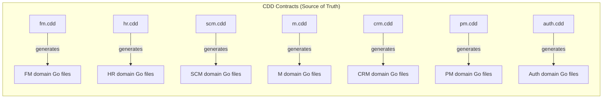

# CDD Contract Reference

Cross-reference mapping between Contract-Driven Design (`.cdd`) files and generated Go code across all 7 services.

## Overview

All 7 services use CDD Engine to generate domain models. Generated files carry the header `// Code generated by CDD Engine. DO NOT EDIT.`



## Contract Files

| Service | Contract Path | Lines | Entities | Event Topics (event_topics.go) |
|---------|--------------|-------|----------|------------------------------|
| Auth | `services/auth-service/contracts/auth.cdd` | 135 | 7 | 5 |
| CRM | `services/crm-service/contracts/crm.cdd` | 322 | 11 | 35 |
| FM | `services/fm-service/contracts/fm.cdd` | 376 | 17 | 29 |
| HR | `services/hr-service/contracts/hr.cdd` | 432 | 16 | 27 |
| M | `services/m-service/contracts/m.cdd` | 342 | 13 | 25 |
| PM | `services/pm-service/contracts/pm.cdd` | 309 | 10 | 32 |
| SCM | `services/scm-service/contracts/scm.cdd` | 460 | 17 | 29 |

## Generated Go Code Mapping

### Auth Service

| CDD Entity | Generated Go Struct | File |
|-----------|-------------------|------|
| `User` | `User` | `services/auth-service/internal/business/domain/user.go` |
| `Session` | `Session` | `services/auth-service/internal/business/domain/session.go` |
| `Role` | `Role` | `services/auth-service/internal/business/domain/role.go` |
| `Permission` | `Permission` | `services/auth-service/internal/business/domain/permission.go` |
| `UserRole` | `UserRole` | `services/auth-service/internal/business/domain/user_role.go` |
| `UserStore` | `UserStore` | `services/auth-service/internal/business/domain/user_store.go` |
| `RolePermission` | `RolePermission` | `services/auth-service/internal/business/domain/role_permission.go` |
| — Event topics | Constants | `services/auth-service/internal/business/domain/event_topics.go` |
| — Event types | Structs | `services/auth-service/internal/business/domain/events.go` |
| — Repository interfaces | Interfaces | `services/auth-service/internal/business/domain/repository.go` |

### Financial Management

| CDD Entity | Generated Go Struct | File |
|-----------|-------------------|------|
| `CurrencyRate` | `CurrencyRate` | `services/fm-service/internal/business/domain/` |
| `FiscalYear` | `FiscalYear` | `services/fm-service/internal/business/domain/fiscal_year.go` |
| `CostCenter` | `CostCenter` | `services/fm-service/internal/business/domain/` |
| `TaxRate` | `TaxRate` | `services/fm-service/internal/business/domain/tax_rate.go` |
| `BankAccount` | `BankAccount` | `services/fm-service/internal/business/domain/` |
| `CustomerCredit` | `CustomerCredit` | `services/fm-service/internal/business/domain/customer_credit.go` |
| `Account` | `Account` | `services/fm-service/internal/business/domain/account.go` |
| `Invoice` | `Invoice` | `services/fm-service/internal/business/domain/invoice.go` |
| `Payment` | `Payment` | `services/fm-service/internal/business/domain/payment.go` |
| ... (13 entities total) | | |
| — Event topics | Constants | `services/fm-service/internal/business/domain/event_topics.go` |
| — Repository interfaces | Interfaces | `services/fm-service/internal/business/domain/repository.go` |

### HR Service

| CDD Entity | Generated Go Struct | File |
|-----------|-------------------|------|
| `Employee` | `Employee` | `services/hr-service/internal/business/domain/employee.go` |
| `Department` | `Department` | `services/hr-service/internal/business/domain/department.go` |
| `Position` | `Position` | `services/hr-service/internal/business/domain/position.go` |
| `PayrollRecord` | `PayrollRecord` | `services/hr-service/internal/business/domain/payroll_record.go` |
| `LeaveRequest` | `LeaveRequest` | `services/hr-service/internal/business/domain/leave_request.go` |
| `AttendanceEntry` | `AttendanceEntry` | `services/hr-service/internal/business/domain/attendance_entry.go` |
| `PerformanceReview` | `PerformanceReview` | `services/hr-service/internal/business/domain/performance_review.go` |
| `TrainingProgram` | `TrainingProgram` | `services/hr-service/internal/business/domain/training_program.go` |
| `JobPosting` | `JobPosting` | `services/hr-service/internal/business/domain/job_posting.go` |
| `ExpenseClaim` | `ExpenseClaim` | `services/hr-service/internal/business/domain/expense_claim.go` |
| — Event topics | Constants | `services/hr-service/internal/business/domain/event_topics.go` |
| — Event types | Structs | `services/hr-service/internal/business/domain/events.go` |
| — Repository interfaces | Interfaces | `services/hr-service/internal/business/domain/repository.go` |

### SCM Service

| CDD Entity | Generated Go Struct | File |
|-----------|-------------------|------|
| `Product` | `Product` | `services/scm-service/internal/business/domain/product.go` |
| `Supplier` | `Supplier` | `services/scm-service/internal/business/domain/supplier.go` |
| `PurchaseOrder` | `PurchaseOrder` | `services/scm-service/internal/business/domain/purchase_order.go` |
| `PurchaseOrderLine` | `PurchaseOrderLine` | `services/scm-service/internal/business/domain/purchase_order_line.go` |
| `InventoryItem` | `InventoryItem` | `services/scm-service/internal/business/domain/inventory_item.go` |
| `InventoryMovement` | `InventoryMovement` | `services/scm-service/internal/business/domain/inventory_movement.go` |
| `Location` | `Location` | `services/scm-service/internal/business/domain/location.go` |
| `Shipment` | `Shipment` | `services/scm-service/internal/business/domain/shipment.go` |
| ... (15 entities total) | | |
| — Event topics | Constants | `services/scm-service/internal/business/domain/event_topics.go` |
| — Event types | Structs | `services/scm-service/internal/business/domain/events.go` |
| — Repository interfaces | Interfaces | `services/scm-service/internal/business/domain/repository.go` |

### Manufacturing Service

| CDD Entity | Generated Go Struct | File |
|-----------|-------------------|------|
| `ProductionOrder` | `ProductionOrder` | `services/m-service/internal/business/domain/production_order.go` |
| `BillOfMaterials` | `BillOfMaterials` | `services/m-service/internal/business/domain/bill_of_materials.go` |
| `BOMComponent` | `BOMComponent` | `services/m-service/internal/business/domain/bomcomponent.go` |
| `WorkCenter` | `WorkCenter` | `services/m-service/internal/business/domain/work_center.go` |
| `WorkOrder` | `WorkOrder` | `services/m-service/internal/business/domain/work_order.go` |
| `RoutingOperation` | `RoutingOperation` | `services/m-service/internal/business/domain/routing_operation.go` |
| `QualityInspection` | `QualityInspection` | `services/m-service/internal/business/domain/quality_inspection.go` |
| `Equipment` | `Equipment` | `services/m-service/internal/business/domain/equipment.go` |
| `MaintenanceOrder` | `MaintenanceOrder` | `services/m-service/internal/business/domain/maintenance_order.go` |
| `CostingRecord` | `CostingRecord` | `services/m-service/internal/business/domain/costing_record.go` |
| — Event topics | Constants | `services/m-service/internal/business/domain/event_topics.go` |
| — Event types | Structs | `services/m-service/internal/business/domain/events.go` |
| — Repository interfaces | Interfaces | `services/m-service/internal/business/domain/repository.go` |

### CRM Service

| CDD Namespace | CDD Entity | Generated Go Struct | File |
|---------------|------------|---------------------|------|
| **`erp.crm.core`** | `CustomerProfile` | `CustomerProfile` | `services/crm-service/internal/business/domain/customer_profile.go` |
| | `PriceBookHeader` | `PriceBookHeader` | `services/crm-service/internal/business/domain/price_book_header.go` |
| | `PriceBookEntry` | `PriceBookEntry` | `services/crm-service/internal/business/domain/price_book_entry.go` |
| | `PricingStrategy` | `PricingStrategy` | `services/crm-service/internal/business/domain/pricing_strategy.go` |
| | `SalesOrder` | `SalesOrder` | `services/crm-service/internal/business/domain/sales_order.go` |
| | `SalesOrderLine` | `SalesOrderLine` | `services/crm-service/internal/business/domain/sales_order_line.go` |
| | `BillingTrigger` | `BillingTrigger` | `services/crm-service/internal/business/domain/billing_trigger.go` |
| | `TransactionalOutbox` | `TransactionalOutbox` | `services/crm-service/internal/business/domain/transactional_outbox.go` |
| | `KafkaEventInbox` | `KafkaEventInbox` | `services/crm-service/internal/business/domain/kafka_event_inbox.go` |
| **`erp.crm.operations`** | `Campaign` | `Campaign` | `services/crm-service/internal/business/domain/campaign.go` |
| | `Lead` | `Lead` | `services/crm-service/internal/business/domain/lead.go` |
| | `Opportunity` | `Opportunity` | `services/crm-service/internal/business/domain/opportunity.go` |
| | `CustomerInteraction` | `CustomerInteraction` | `services/crm-service/internal/business/domain/customer_interaction.go` |
| | `ServiceTicket` | `ServiceTicket` | `services/crm-service/internal/business/domain/service_ticket.go` |
| | `Quote` | `Quote` | `services/crm-service/internal/business/domain/quote.go` |
| | `QuoteLineItem` | `QuoteLineItem` | `services/crm-service/internal/business/domain/quote_line_item.go` |
| — | — Event topics | Constants | `services/crm-service/internal/business/domain/event_topics.go` |
| — | — Event types | Structs | `services/crm-service/internal/business/domain/events.go` |
| — | — Repository interfaces | Interfaces | `services/crm-service/internal/business/domain/repository.go` |


### Project Management Service

| CDD Entity | Generated Go Struct | File |
|-----------|-------------------|------|
| `Project` | `Project` | `services/pm-service/internal/business/domain/project.go` |
| `Task` | `Task` | `services/pm-service/internal/business/domain/task.go` |
| `Portfolio` | `Portfolio` | `services/pm-service/internal/business/domain/portfolio.go` |
| `ProjectTimeEntry` | `ProjectTimeEntry` | `services/pm-service/internal/business/domain/project_time_entry.go` |
| `ProjectExpense` | `ProjectExpense` | `services/pm-service/internal/business/domain/project_expense.go` |
| `ResourceAllocation` | `ResourceAllocation` | `services/pm-service/internal/business/domain/resource_allocation.go` |
| `ProjectIssue` | `ProjectIssue` | `services/pm-service/internal/business/domain/project_issue.go` |
| `ChangeRequest` | `ChangeRequest` | `services/pm-service/internal/business/domain/change_request.go` |
| `ProjectDocument` | `ProjectDocument` | `services/pm-service/internal/business/domain/project_document.go` |
| — Event topics | Constants | `services/pm-service/internal/business/domain/event_topics.go` |
| — Event types | Structs | `services/pm-service/internal/business/domain/events.go` |
| — Repository interfaces | Interfaces | `services/pm-service/internal/business/domain/repository.go` |

## Code Generation Pattern

Each CDD service generates 4 categories of Go files in `internal/business/domain/`:

### 1. Entity Structs

Each CDD `entity` block becomes a Go struct in its own file:

```
entity User {
    id       uuid    @primary
    username string  @unique
    ...
}
```

generates:

```go
type User struct {
    ID       string `json:"id"`
    Username string `json:"username"`
    ...
}
```

> **Note**: CDD specifies `uuid` as the ID type, but generated Go code uses `string`. The generated code stores nanosecond-timestamp IDs like `usr_1749267184000000000`.

### 2. Event Topics (`event_topics.go`)

Each CDD `producer_event` and `consumer_event` becomes a Go constant:

```go
const (
    FinAccountCreated    = "fin.account.created"
    FinAccountUpdated    = "fin.account.updated"
    ...
)
```

### 3. Event Payloads (`events.go`)

Event payload structs for each published event type.

### 4. Repository Interfaces (`repository.go`)

CRUD interfaces for each entity, used by the in-memory implementations in `internal/data/memory/`.

## Notes

- **CDD is the source of truth** for entity definitions, event topics, and service boundaries.
- **Handlers and routes** are NOT CDD-generated — they are manually written in `internal/api/handlers/` and `internal/api/routes/`.
- **In-memory repository implementations** in `internal/data/memory/` implement the CDD-generated repository interfaces.
- **Not all CDD entities have HTTP handlers** — some entities exist only in the domain layer and are managed through other services or only via events.
- **Not all CDD events are published** — approximately 20+ event topic constants exist in code but are never published (see `common-issues.md` M4 for details).
