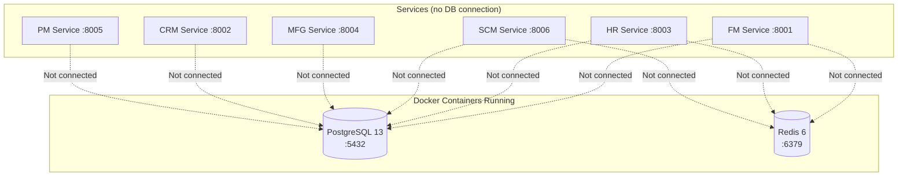

# Database Design

Current data storage architecture — in-memory maps with planned PostgreSQL migration.

## Storage Reality

The ERP system currently has **no operational database**. All services store data in `sync.RWMutex`-protected in-memory Go maps. PostgreSQL and Redis containers run but are not connected to any service.



## In-Memory Storage Architecture

### Repository Pattern

Every service uses the same pattern:

```go
// Repository interface (domain layer — CDD-generated)
type AccountRepository interface {
    Create(ctx context.Context, account *Account) error
    Get(ctx context.Context, id string) (*Account, error)
    Update(ctx context.Context, account *Account) error
    Delete(ctx context.Context, id string) error
    List(ctx context.Context) ([]Account, error)
}

// In-memory implementation (data/memory/)
type MemoryAccountRepo struct {
    mu   sync.RWMutex
    data map[string]*Account
}

func (r *MemoryAccountRepo) Get(ctx context.Context, id string) (*Account, error) {
    r.mu.RLock()
    defer r.mu.RUnlock()
    a, ok := r.data[id]
    if !ok {
        return nil, fmt.Errorf("account not found")
    }
    return a, nil
}

func (r *MemoryAccountRepo) List(ctx context.Context) ([]Account, error) {
    r.mu.RLock()
    defer r.mu.RUnlock()
    result := make([]Account, 0, len(r.data))
    for _, a := range r.data {
        result = append(result, *a)
    }
    return result, nil
}
```

### Characteristics

| Aspect | Behavior |
|--------|----------|
| **Persistence** | None — data lost on service restart |
| **Concurrency** | `sync.RWMutex` — readers don't block readers, writers block all |
| **Queries** | None — no filtering, sorting, or pagination passed to storage |
| **List performance** | O(n) — full map iteration, returns every record |
| **Point lookup** | O(1) — map access by ID |
| **Capacity** | Limited by available RAM |
| **IDs** | `prefix_` + nanosecond timestamp string |

### Memory Repositories by Service

| Service | Repositories | Approx entities per repo |
|---------|-------------|--------------------------|
| Auth | UserRepo, RoleRepo, PermissionRepo | 1-5 seed users |
| FM | AccountRepo, JournalEntryRepo, InvoiceRepo, PaymentRepo, BudgetRepo, TaxRateRepo, TransactionRepo, VendorBillRepo | None (empty start) |
| HR | EmployeeRepo, PayrollRepo, TimesheetRepo, LeaveRepo, JobPostingRepo, JobApplicationRepo, PerformanceRepo, TrainingRepo, TrainingEnrollmentRepo, EmployeeDocumentRepo, ExpenseClaimRepo | Mock seed data |
| SCM | ProductCategoryRepo, ProductRepo, SupplierRepo, VendorContractRepo, PurchaseRequisitionRepo, PurchaseOrderRepo, InventoryRepo, StockTransferRepo, ReceiptRepo, ShipmentRepo, DemandForecastRepo | Mock seed data |
| MFG | BOMRepo, WorkCenterRepo, RoutingRepo, ProductionOrderRepo, WorkOrderRepo, QualityInspectionRepo, MaintenanceScheduleRepo | Mock seed data |
| CRM | CustomerRepo, LeadRepo, OpportunityRepo, SalesOrderRepo, QuoteRepo, ServiceTicketRepo, CampaignRepo, PriceListRepo | Mock seed customer + leads |
| PM | PortfolioRepo, ProjectRepo, TaskRepo, ResourceAllocationRepo, TimeEntryRepo, ExpenseRepo, DocumentRepo, IssueRepo, ChangeRequestRepo | Rich mock data |

### Seed Data

Services generate mock data on startup from `cmd/main.go`:
```go
func seedData(repo domain.AccountRepository) {
    repo.Create(ctx, &domain.Account{ID: "acc_1000", Code: "1000", Name: "Cash", Type: "ASSET"})
    repo.Create(ctx, &domain.Account{ID: "acc_2000", Code: "2000", Name: "Accounts Payable", Type: "LIABILITY"})
    // ...
}
```

Seed data is **re-generated on every restart** — there is no data persistence between restarts.

## SQL Migration Files (CDD-Generated, Not Executed)

Each service has a `data/migrations/` directory with SQL schema files:

```
services/fm-service/internal/data/migrations/
├── 001_create_accounts.sql
├── 002_create_journal_entries.sql
├── 003_create_invoices.sql
├── 004_create_payments.sql
├── 005_create_budgets.sql
├── 006_create_tax_rates.sql
└── 007_create_vendor_bills.sql
```

These files are generated by the CDD Engine from `.cdd` contract files. They use PostgreSQL syntax with UUID primary keys, foreign keys, and indexes. **No migration tool (golang-migrate, goose, etc.) is configured** — the files exist as reference only.

### Schema Example (CDD-Generated)

```sql
-- 001_create_accounts.sql
CREATE TABLE IF NOT EXISTS accounts (
    id UUID PRIMARY KEY DEFAULT gen_random_uuid(),
    account_code VARCHAR(20) NOT NULL UNIQUE,
    account_name VARCHAR(255) NOT NULL,
    account_type VARCHAR(50) NOT NULL,
    parent_account_id UUID,
    account_level INTEGER NOT NULL DEFAULT 0,
    normal_side VARCHAR(10) NOT NULL,
    current_balance DECIMAL(15,2) NOT NULL DEFAULT 0.00,
    is_active BOOLEAN NOT NULL DEFAULT true,
    allow_posting BOOLEAN NOT NULL DEFAULT true,
    created_at TIMESTAMP WITH TIME ZONE DEFAULT NOW(),
    updated_at TIMESTAMP WITH TIME ZONE DEFAULT NOW()
);
```

> **Note**: The actual in-memory Account struct uses `string` for ID (nanosecond timestamp), not UUID.

## Data Consistency

### Current State

| Concern | Status |
|---------|--------|
| **Strong consistency** | ✅ Within a single service (via mutex) |
| **Cross-service consistency** | ⚠️ Eventual consistency via Kafka |
| **Distributed transactions** | ❌ Not implemented |
| **Saga / compensating transactions** | ❌ Not implemented |
| **Idempotency** | ❌ No deduplication of events |

### Cross-Service Data Flow

| Source of Truth | Replicated To | Mechanism | Consistency |
|----------------|---------------|-----------|-------------|
| HR (Employee) | FM (account) | Kafka `hr.employee.created` | Eventual |
| CRM (Customer) | FM (account) | Kafka `crm.customer.created` | Eventual |
| SCM (Product) | MFG (BOM component) | Referenced by ID | No validation |
| SCM (Supplier) | FM (vendor bill) | Referenced by ID | No validation |

Since there are no foreign key constraints, cross-service references are **string-ID-based** with no referential integrity enforcement.

## Redis Usage

**Current**: Not used by any service. The `redis:6` container runs but receives no connections.

**Auth Service**: Has `github.com/redis/go-redis/v9` in `go.mod` and config for Redis host/port. Session data is stored in-memory instead.

## Database Targets (Per CDD Contracts)

The CDD contracts define six separate databases:

| Service | Database Name | Schema Files |
|---------|--------------|--------------|
| FM | `financial_db` | 7 migration files |
| HR | `hr_db` | 4 migration files |
| SCM | `scm_db` | 11 migration files |
| MFG | `mfg_db` | 7 migration files |
| CRM | `crm_db` | 6 migration files |
| PM | `pm_db` | 6 migration files |

These are aspirational targets. No database has been created or populated.

## Migration Path to PostgreSQL

| Step | Effort | Details |
|------|--------|---------|
| 1. Add PostgreSQL driver | Low | Import `pgx` or `lib/pq` |
| 2. Configure connection pool | Low | Read DB config → create pool |
| 3. Run migrations | Medium | Wire golang-migrate to execute SQL files |
| 4. Implement PostgreSQL repos | High | Replace Memory*Repo with SQL implementations |
| 5. Add connection error handling | Medium | Retry logic, health checks |
| 6. Wire Redis for caching | Medium | Read-through cache on DB queries |

## Related Documents

- [System Overview](system-overview.md) — C4 model with current vs target state
- [Technology Stack](technology-stack.md) — Library versions and dependency audit
- [Event-Driven Architecture](event-architecture.md) — Kafka-based data propagation