# Database Design

Comprehensive data modeling and database architecture for the ERP system's microservices.

## Database Architecture Overview

### Database-Per-Service Pattern
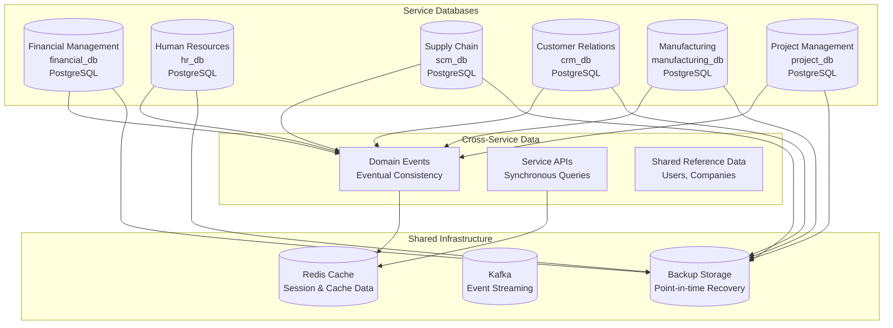

## Data Consistency Patterns

### Eventual Consistency Model
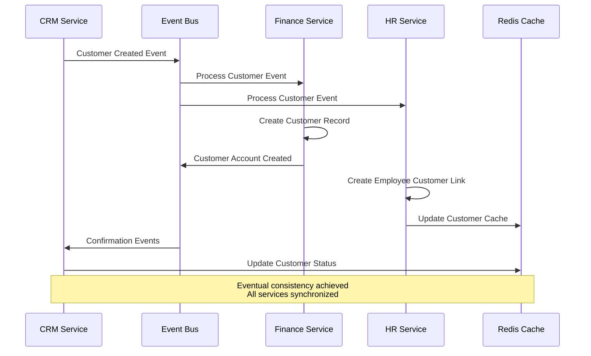

### Saga Pattern for Distributed Transactions
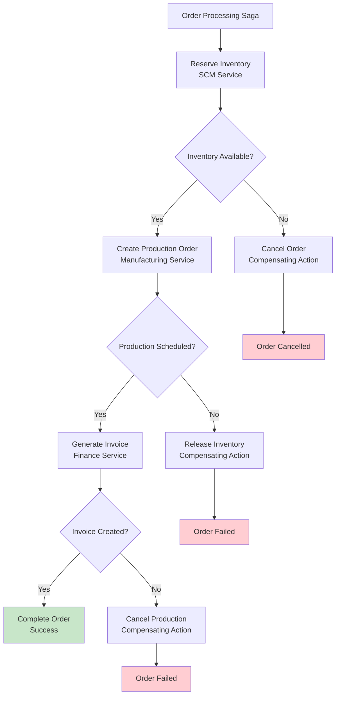

## Core Data Models

### Financial Management Schema
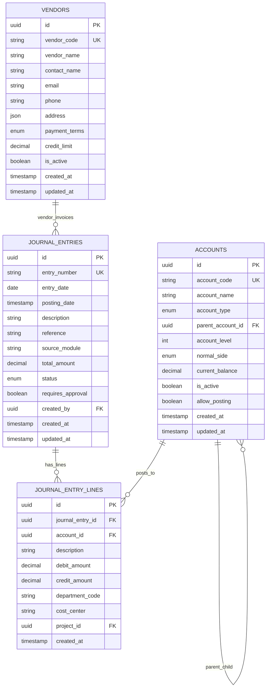

### Human Resources Schema
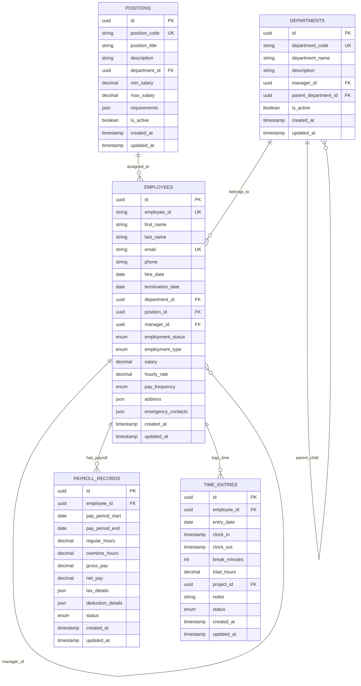

### Supply Chain Management Schema
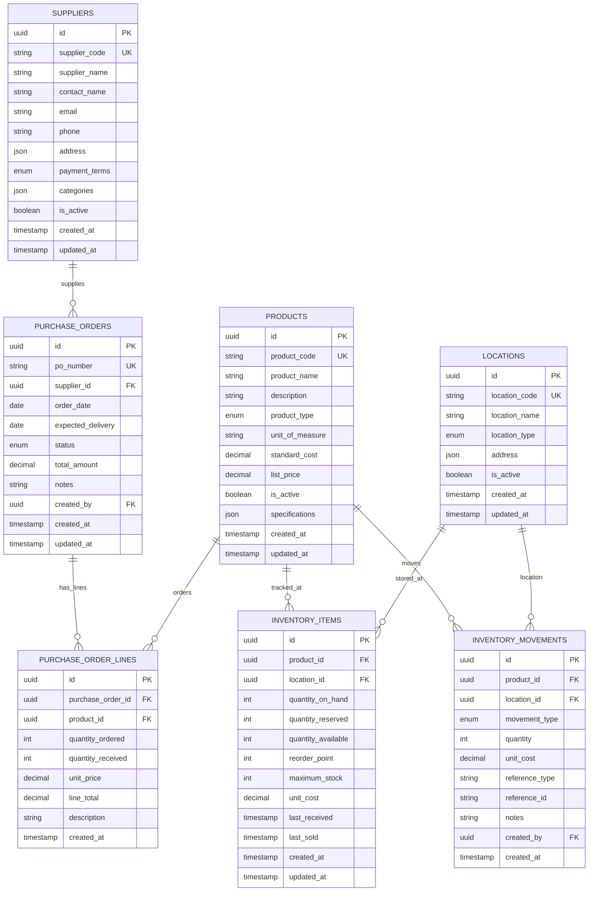

## Indexing Strategy

### Primary Indexes
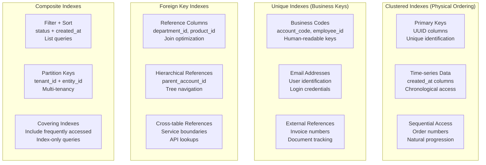

### Query Optimization Patterns
```mermaid
flowchart TD
    A[Query Request] --> B{Query Type}
    
    B -->|Point Lookup| C[Use Primary Key Index<br/>O(1) access time]
    B -->|Range Query| D[Use Composite Index<br/>Optimized range scan]
    B -->|Join Query| E[Use Foreign Key Indexes<br/>Nested loop optimization]
    B -->|Aggregation| F[Use Covering Index<br/>Index-only scan]
    
    C --> G[Return Single Row<br/>Sub-millisecond response]
    D --> H[Return Range Result<br/>Paginated response]
    E --> I[Return Joined Data<br/>Denormalized view]
    F --> J[Return Aggregated Data<br/>Pre-calculated results]
    
    subgraph "Performance Targets"
        PT1[Point Queries: < 1ms]
        PT2[Range Queries: < 10ms]
        PT3[Join Queries: < 50ms]
        PT4[Aggregations: < 100ms]
    end
    
    G -.-> PT1
    H -.-> PT2
    I -.-> PT3
    J -.-> PT4
```

## Data Partitioning

### Horizontal Partitioning Strategy
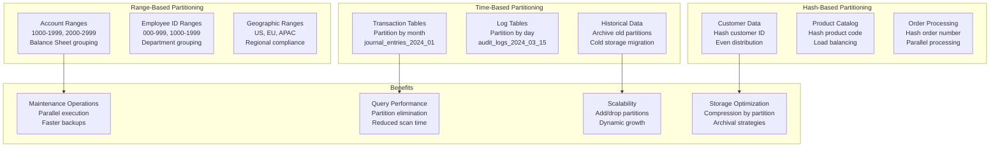

## Backup and Recovery

### Backup Strategy
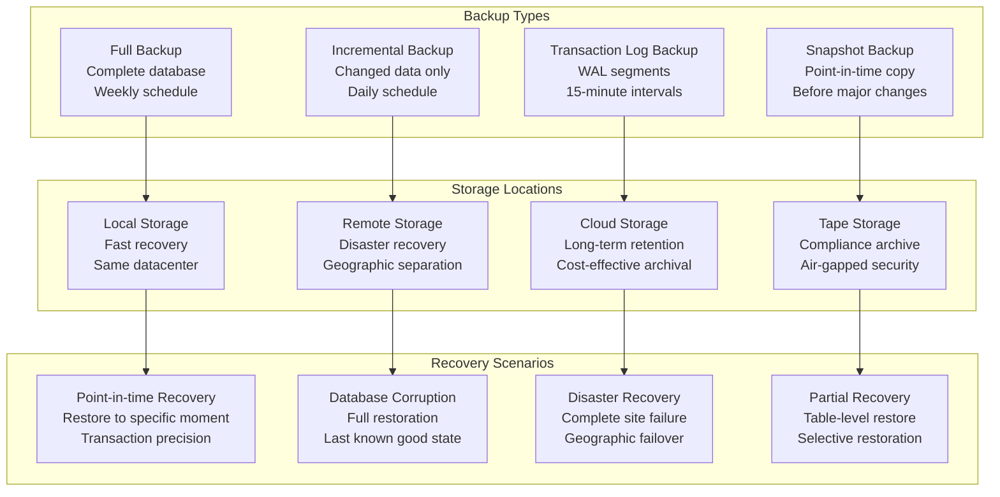

### Recovery Time Objectives
```mermaid
gantt
    title Database Recovery Time Objectives
    dateFormat X
    axisFormat %M:%S
    
    section Critical Systems
    Financial DB    :crit, financial, 0, 5
    Customer DB     :crit, customer, 0, 10
    
    section Business Systems
    HR DB          :active, hr, 0, 15
    SCM DB         :active, scm, 0, 20
    
    section Supporting Systems
    Project DB     :project, 0, 30
    Manufacturing DB :manufacturing, 0, 30
    
    section Recovery Targets
    RTO Target     :milestone, rto, 15, 0
    Maximum RTO    :milestone, max_rto, 30, 0
```

## Performance Monitoring

### Database Metrics
```mermaid
graph TB
    subgraph "Performance Metrics"
        PM1[Query Response Time<br/>Average: < 10ms<br/>95th percentile: < 50ms]
        PM2[Connection Pool Usage<br/>Active connections<br/>Pool efficiency]
        PM3[Transaction Throughput<br/>TPS measurement<br/>Peak load handling]
        PM4[Index Usage Statistics<br/>Index effectiveness<br/>Query optimization]
    end
    
    subgraph "Resource Metrics"
        RM1[CPU Utilization<br/>Database server load<br/>Query processing]
        RM2[Memory Usage<br/>Buffer cache hit ratio<br/>Working set size]
        RM3[Disk I/O Patterns<br/>Read/write operations<br/>Storage performance]
        RM4[Network Bandwidth<br/>Data transfer rates<br/>Connection overhead]
    end
    
    subgraph "Health Indicators"
        HI1[Slow Query Log<br/>Queries > 1 second<br/>Optimization candidates]
        HI2[Lock Contention<br/>Blocking queries<br/>Concurrency issues]
        HI3[Replication Lag<br/>Standby synchronization<br/>Data consistency]
        HI4[Backup Success Rate<br/>Backup completion<br/>Recovery readiness]
    end
    
    subgraph "Alerting Thresholds"
        AT1[Critical: > 100ms avg<br/>Query performance degradation]
        AT2[Warning: > 80% pool<br/>Connection exhaustion risk]
        AT3[Critical: > 90% CPU<br/>Resource constraint]
        AT4[Warning: > 1 min lag<br/>Replication delay]
    end
    
    PM1 --> AT1
    PM2 --> AT2
    RM1 --> AT3
    HI3 --> AT4
```

## Data Security and Compliance

### Encryption at Rest and Transit
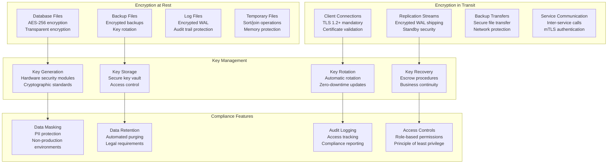

## Next Steps

- [Event-Driven Architecture](event-architecture.md) - Inter-service communication patterns
- [Security Architecture](security-architecture.md) - Authentication and authorization
- [Performance Architecture](performance-architecture.md) - Caching and optimization strategies