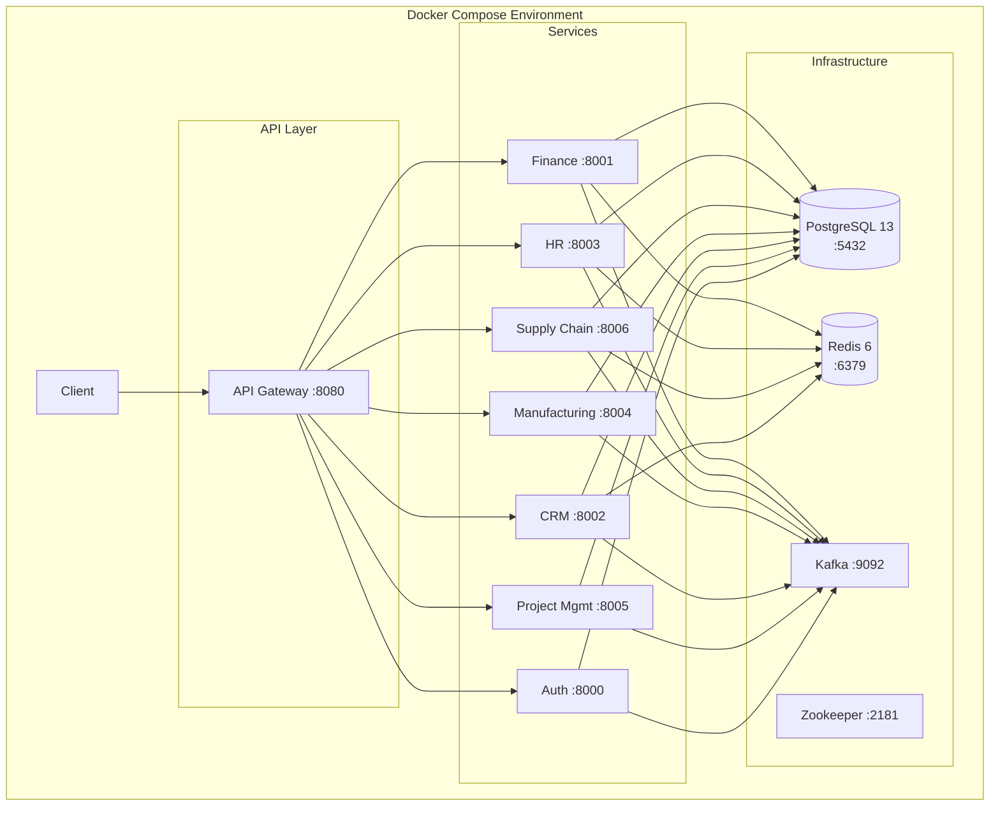

# Deployment Architecture

Containerization, orchestration, build pipeline, and infrastructure configuration for the ERP system.

## Infrastructure Overview



## Container Architecture

All services use **multi-stage Docker builds** with a common pattern:

1. **Build stage**: `golang:1.21-alpine` — compiles Go binary with `CGO_ENABLED=0`
2. **Runtime stage**: `alpine:latest` — minimal image containing only the compiled binary and CA certificates

### Dockerfiles

| Service | Dockerfile Path | Build Command | Exposed Port |
|---------|----------------|---------------|-------------|
| Auth | `services/auth-service/Dockerfile` | `go build -o main ./cmd` | 8000 |
| FM | `services/fm-service/Dockerfile` | `go build -o main cmd/server/main.go` | 8001 |
| CRM | `services/crm-service/Dockerfile` | Multi-stage Go build | 8002 |
| HR | `services/hr-service/Dockerfile` | `go build -o main ./cmd` | 8003 |
| M | `services/m-service/Dockerfile` | `go build -o main ./cmd` | 8001* |
| PM | `services/pm-service/Dockerfile` | `go build -o main ./cmd` | 8001* |
| SCM | `services/scm-service/Dockerfile` | `go build -o main ./cmd` | 8006 |
| API Gateway | `api-gateway/Dockerfile` | `go build -o main cmd/main.go` | 8080 |

> **\*** M-service and PM-service Dockerfiles expose port 8001 but the services default to ports 8004 and 8006 respectively. These are overridden at runtime by docker-compose environment variables.

### Gateway Dockerfile Note

The API Gateway Dockerfile is unique — it expects the build context to include both `shared/` and `api-gateway/` directories:

```dockerfile
COPY shared/ ./shared/
COPY api-gateway/ ./
```

This requires building from the repository root (not from within `api-gateway/`) so the `shared` module is available via the `replace` directive in `go.mod`.

## Docker Compose Configuration

Defined in `docker-compose.yml` at the repository root (Docker Compose v3.8).

### Infrastructure Services

| Service | Image | Port | Purpose |
|---------|-------|------|---------|
| `postgres` | `postgres:13` | 5432 | Primary data storage |
| `redis` | `redis:6` | 6379 | Caching and session storage |
| `zookeeper` | `confluentinc/cp-zookeeper:7.0.1` | 2181 | Kafka coordination |
| `kafka` | `confluentinc/cp-kafka:7.0.1` | 9092 / 29092 | Event messaging |

### Application Services

All services use `build: ./services/{name}` and expose their respective ports. Each service is configured with its `PORT` environment variable matching the exposed port:

| Service | Port (`${PORT}`) | Restart Policy |
|---------|-----------------|----------------|
| `auth-service` | 8000 | `unless-stopped` |
| `fm-service` | 8001 | `unless-stopped` |
| `crm-service` | 8002 | `unless-stopped` |
| `hr-service` | 8003 | `unless-stopped` |
| `m-service` | 8004 | `unless-stopped` |
| `pm-service` | 8005 | `unless-stopped` |
| `scm-service` | 8006 | `unless-stopped` |

Note that the API Gateway is **not included** in docker-compose.yml — it is built and run separately.

### Volumes

- `postgres_data` — Persistent volume for PostgreSQL data storage

## Build Pipeline

### Via Docker Compose

```bash
make build    # docker compose build
make run      # docker compose up -d
make stop     # docker compose down
make clean    # docker compose down --rmi all --volumes --remove-orphans
```

### Via Build Script

`scripts/build.sh` builds all services locally (outside Docker):

1. Builds the shared module (`shared/` → `go mod tidy`)
2. Iterates 6 services (finance, hr, scm, manufacturing, crm, projects) running `go build -o bin/main cmd/main.go` in each
3. Builds the API Gateway similarly

> **Note**: The build script uses directory names (`finance`, `hr`, `scm`, `manufacturing`, `crm`, `projects`) which differ from the Docker Compose service names (`fm-service`, `hr-service`, `scm-service`, `m-service`, `crm-service`, `pm-service`).

### Per-Service Makefiles

Two services have individual Makefiles:

| Service | Commands |
|---------|----------|
| `fm-service` | `build`, `run`, `test`, `test-coverage`, `lint`, `docker-build`, `docker-run`, `dev` (air), `deps`, `migrate-up`, `migrate-down`, `migrate-create`, `clean` |
| `m-service` | (has Makefile — build/test/run commands) |

Services **without** Makefiles: HR, SCM, CRM, PM, Auth.

## Port Mapping Reference

| Service | Gateway Route | Default Port (Code) | Docker Compose Port | Architecture Doc Port |
|---------|--------------|---------------------|--------------------|----------------------|
| Auth | — | 8000 | 8000 | 8000 |
| FM | `/api/v1/fm/*` | 8001 | 8001 | 8001 |
| CRM | `/api/v1/crm/*` | 8002 | 8002 | 8005 |
| HR | `/api/v1/hr/*` | 8003 | 8003 | 8002 |
| M | `/api/v1/m/*` | 8004 | 8004 | 8004 |
| PM | `/api/v1/pm/*` | 8006 | 8005 | 8006 |
| SCM | `/api/v1/scm/*` | 8006 | 8006 | 8003 |

> **Port discrepancies**: Three services have code-default ports that conflict with the documented architecture:
> - CRM defaults to 8002 (architected as 8005) — Docker Compose corrects this to 8002
> - HR defaults to 8003 (architected as 8002) — Docker Compose corrects this to 8003
> - SCM defaults to 8006 (architected as 8003) — Docker Compose corrects this to 8006

## Gateway URL Configuration

The API Gateway uses environment variables to locate backend services. Two conventions exist:

### Deployed Gateway (`cmd/main.go`) — Docker Compose style

| Environment Variable | Default |
|---------------------|---------|
| `FINANCE_SERVICE_URL` | `http://finance-service:8001` |
| `HR_SERVICE_URL` | `http://hr-service:8002` |
| `SCM_SERVICE_URL` | `http://scm-service:8003` |
| `MANUFACTURING_SERVICE_URL` | `http://manufacturing-service:8004` |
| `CRM_SERVICE_URL` | `http://crm-service:8005` |
| `PROJECTS_SERVICE_URL` | `http://projects-service:8006` |

### Inactive Gateway (`internal/server/server.go`) — Short-name style

| Environment Variable | Default |
|---------------------|---------|
| `AUTH_SERVICE_URL` | `http://auth-service:8090` |
| `FM_SERVICE_URL` | `http://fm-service:8081` |
| `HR_SERVICE_URL` | `http://hr-service:8082` |
| `SCM_SERVICE_URL` | `http://scm-service:8083` |
| `M_SERVICE_URL` | `http://m-service:8084` |
| `CRM_SERVICE_URL` | `http://crm-service:8085` |
| `PM_SERVICE_URL` | `http://pm-service:8086` |

## Known Issues

1. **API Gateway not in docker-compose.yml**: The gateway must be built and run separately — `docker compose up` does not start it.

2. **Dockerfile port mismatches**: Multiple Dockerfiles expose ports that differ from the service's actual runtime default:
   - M-service Dockerfile: `EXPOSE 8001` but service defaults to `8004`
   - PM-service Dockerfile: `EXPOSE 8001` but service defaults to `8006`

3. **Build script naming mismatch**: `scripts/build.sh` uses directory names (`finance`, `manufacturing`, `projects`) that differ from docker-compose service names (`fm-service`, `m-service`, `pm-service`) and the deployed gateway's route path prefixes.

4. **Go version discrepancies**: Dockerfiles use `golang:1.21-alpine`, but `go.mod` files specify `go 1.23.0` with toolchain `go1.24.6`. The builder will auto-download the newer toolchain at build time.

5. **No database at runtime**: Despite PostgreSQL being configured in docker-compose and SQL migration files existing in every service, all services use in-memory storage. No service actually connects to the database.

6. **RabbitMQ config unused**: The FM service defines RabbitMQ configuration in its config struct and `.env.example`, but only Kafka is used for messaging.

7. **Inconsistent service naming**:
   - Docker Compose: `fm-service`, `m-service`, `pm-service`
   - Build script: `finance`, `manufacturing`, `projects`
   - Gateway (active): `finance-service`, `manufacturing-service`, `projects-service`
   - Gateway (inactive): `fm-service`, `m-service`, `pm-service`
