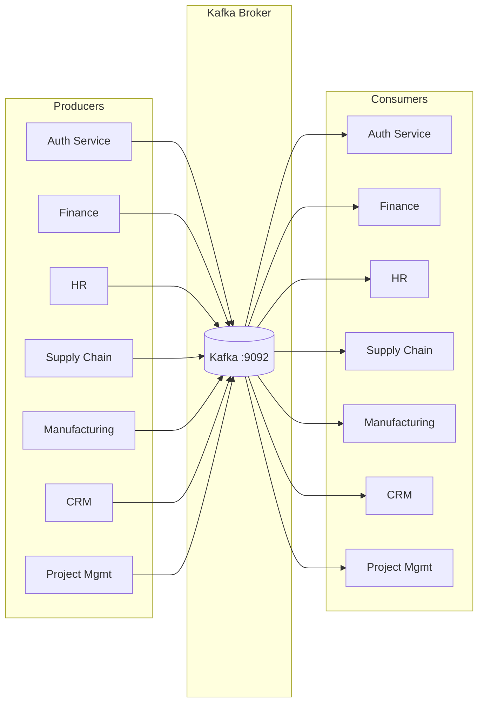

# Event-Driven Architecture

Asynchronous communication between microservices using Apache Kafka.

## Infrastructure

All services use Kafka (Confluent CP 7.0.1) for event-driven communication, via the `segmentio/kafka-go` library.



### Producer Pattern

Every service implements a `KafkaPublisher` wrapper:

```
internal/data/kafka/producer.go
```

- Wraps `kafka.Writer` with `LeastBytes` balancer
- Serializes payloads to JSON
- All publish errors are silently discarded (`_ = publisher.Publish(...)`)
- Fire-and-forget semantics — no retry or acknowledgment

Interface defined in each service's domain layer:

```go
type EventPublisher interface {
    Publish(ctx context.Context, topic string, key string, payload interface{}) error
}
```

### Consumer Pattern

Every service runs a background goroutine with a Kafka consumer:

```
internal/data/kafka/consumer.go
```

- Uses `kafka.Reader` with consumer group subscription
- Blocks on `reader.ReadMessage(ctx)` in an infinite loop
- Routes messages by topic using a `switch` statement
- On error: sleeps 2 seconds and retries
- On context cancellation: exits cleanly
- **No dead-letter queue** — unprocessable messages are dropped

## Topic Naming Convention

Topics follow a 3-part dot-separated format:

```
{domain}.{entity}.{action}
```

| Domain | Prefix | Service |
|--------|--------|---------|
| Auth | `auth.*` | Auth Service |
| Financial | `fin.*` | FM Service |
| Human Resources | `hr.*` | HR Service |
| Supply Chain | `scm.*` | SCM Service |
| Manufacturing | `mfg.*` | M Service |
| Customer Relations | `crm.*` | CRM Service |
| Project Management | `prj.*` | PM Service |

## Event Catalog

### Auth Service

| Topic | Event Struct | Trigger |
|-------|-------------|---------|
| `auth.user.created` | `UserCreatedEvent` | User account created |
| `auth.user.updated` | `UserUpdatedEvent` | User profile updated |
| `auth.user.deleted` | `UserDeletedEvent` | User account deleted |
| `auth.user.logged.in` | `UserLoggedInEvent` | User authentication |
| `auth.user.logged.out` | `UserLoggedOutEvent` | User logout |
| `auth.user.password.changed` | `UserPasswordChangedEvent` | Password updated |
| `auth.role.created` | `RoleCreatedEvent` | New role defined |
| `auth.role.updated` | `RoleUpdatedEvent` | Role definition changed |
| `auth.permission.created` | `PermissionCreatedEvent` | New permission defined |
| `auth.permission.assigned.to.role` | `PermissionAssignedToRoleEvent` | Permission linked to role |

Auth service has **no consumed events** — it only produces.

### Financial Management (FM)

| Topic | Event Struct | Trigger |
|-------|-------------|---------|
| `fin.invoice.created` | `InvoiceEventPayload` | Customer invoice created |
| `fin.invoice.updated` | `InvoiceEventPayload` | Invoice updated |
| `fin.invoice.sent` | `InvoiceEventPayload` | Invoice marked as sent |
| `fin.invoice.paid` | `InvoiceEventPayload` | Payment applied to invoice |
| `fin.invoice.overdue` | `InvoiceEventPayload` | Invoice past due date |
| `fin.payment.received` | `PaymentEventPayload` | Payment recorded |
| `fin.payment.processed` | `PaymentEventPayload` | Payment processed |
| `fin.payment.failed` | `PaymentEventPayload` | Payment processing failed |
| `fin.vendor.payment.due` | `VendorBillEventPayload` | Vendor bill created |
| `fin.budget.created` | `BudgetEventPayload` | Budget created |
| `fin.budget.updated` | `BudgetEventPayload` | Budget modified |
| `fin.budget.exceeded` | `BudgetEventPayload` | Spending exceeds budget |
| `fin.budget.approved` | `BudgetApprovedEvent` | Budget approved (defined but not published) |
| `fin.account.created` | `AccountEventPayload` | GL account created |
| `fin.account.updated` | `AccountEventPayload` | GL account updated |
| `fin.account.balance.changed` | `AccountEventPayload` | Journal entry posted |

**Consumed (13 topics)**:

| Topic | Source | Action |
|-------|--------|--------|
| `hr.employee.created` | HR | Creates payroll liability account |
| `hr.payroll.processed` | HR | Creates salary expense journal entry |
| `hr.expense.submitted` | HR | Creates T&E expense journal entry |
| `scm.purchase.order.created` | SCM | Creates inventory-in-transit journal entry |
| `scm.invoice.received` | SCM | Creates vendor bill via AP service |
| `scm.inventory.valued` | SCM | Creates inventory adjustment journal entry |
| `crm.sale.completed` | CRM | Creates customer invoice via AR service |
| `crm.customer.created` | CRM | Creates customer AR account |
| `mfg.production.completed` | M | Creates finished goods / WIP journal entry |
| `mfg.material.consumed` | M | Creates WIP / raw materials journal entry |
| `prj.project.created` | PM | Creates project expense account |
| `prj.time.logged` | PM | Creates unbilled receivables journal entry |
| `prj.expense.incurred` | PM | Creates project expense journal entry |

The FM consumer is the most sophisticated — it auto-creates accounts and journal entries for cross-service events. It maintains hardcoded chart-of-accounts patterns like `6010-001` (Salaries Expense), `2120-001` (Payroll Liability), and `1200-001` (Raw Materials Inventory).

### Human Resources (HR)

| Topic | Event Struct | Trigger |
|-------|-------------|---------|
| `hr.employee.created` | `EmployeeCreatedEvent` | Employee hired |
| `hr.employee.updated` | `EmployeeUpdatedEvent` | Employee details changed |
| `hr.employee.terminated` | `EmployeeTerminatedEvent` | Employee deleted/terminated |
| `hr.employee.promoted` | `EmployeePromotedEvent` | Position changed |
| `hr.salary.changed` | `SalaryChangedEvent` | Salary updated |
| `hr.payroll.processed` | `PayrollProcessedEvent` | Payroll run completed |
| `hr.timesheet.submitted` | `TimesheetSubmittedEvent` | Timesheet submitted |
| `hr.timesheet.approved` | `TimesheetApprovedEvent` | Timesheet approved |
| `hr.overtime.recorded` | `OvertimeRecordedEvent` | Hours exceed 8 in a day |
| `hr.leave.requested` | `LeaveRequestedEvent` | Leave application submitted |
| `hr.leave.approved` | `LeaveApprovedEvent` | Leave approved |
| `hr.leave.rejected` | `LeaveRejectedEvent` | Leave rejected |
| `hr.training.completed` | `TrainingCompletedEvent` | Training program completed |
| `hr.performance.review.completed` | `PerformanceReviewCompletedEvent` | Review submitted |
| `hr.performance.improvement.needed` | `PerformanceImprovementNeededEvent` | Rating below 3 |
| `hr.expense.submitted` | `ExpenseSubmittedEvent` | Expense claim filed |

**Unused topics** (defined but never published): `hr.certification.earned`, `hr.skill.acquired`, `hr.goal.achieved`, `hr.employee.available`, `hr.employee.skills.updated`, `hr.payroll.failed`.

**Consumed (5 topics)**:

| Topic | Source | Action |
|-------|--------|--------|
| `prj.project.created` | PM | Logged only |
| `prj.task.assigned` | PM | Logged only |
| `fin.budget.allocated` | FM | Logged only |
| `mfg.production.scheduled` | M | Logged only |
| `scm.training.required` | SCM | Auto-creates training program |

### Supply Chain Management (SCM)

| Topic | Event Struct | Trigger |
|-------|-------------|---------|
| `scm.purchase.order.created` | `PurchaseOrderCreatedEvent` | PO sent to supplier |
| `scm.inventory.valued` | `InventoryValuedEvent` | Stock create/update/adjust |

Only **2 topics** are actually published. Many more are defined but unused: `scm.product.*`, `scm.inventory.received/shipped/adjusted/low.stock/out.of.stock`, `scm.purchase.order.sent/received/cancelled`, `scm.vendor.*`, `scm.shipment.*`, `scm.training.required`, `scm.material.delivered`.

**Consumed (7 topics)**:

| Topic | Source | Action |
|-------|--------|--------|
| `crm.sales.order.created` | CRM | Logged only |
| `crm.customer.demand.forecast` | CRM | Auto-creates demand forecast |
| `mfg.material.required` | M | Auto-creates purchase requisition |
| `mfg.material.consumed` | M | Issues raw material from inventory |
| `mfg.production.completed` | M | Receives finished goods into inventory |
| `fin.vendor.payment.processed` | FM | Logged only |
| `prj.material.requested` | PM | Issues material for project |

### Manufacturing (M)

| Topic | Event Struct | Trigger |
|-------|-------------|---------|
| `mfg.production.scheduled` | `ProductionScheduledEvent` | Production order created |
| `mfg.production.started` | `ProductionStartedEvent` | First work order started |
| `mfg.production.completed` | `ProductionCompletedEvent` | All work orders done + all inspections passed |
| `mfg.production.delayed` | `ProductionDelayedEvent` | Schedule pushed out or status set to DELAYED |
| `mfg.work.order.created` | `WorkOrderCreatedEvent` | Work order auto-created from routing |
| `mfg.work.order.started` | `WorkOrderStartedEvent` | Work order execution began |
| `mfg.work.order.completed` | `WorkOrderCompletedEvent` | Work order finished |
| `mfg.work.order.cancelled` | `WorkOrderCancelledEvent` | Work order deleted |
| `mfg.material.consumed` | `MaterialConsumedEvent` | Production order completed |
| `mfg.material.wasted` | `MaterialWastedEvent` | Quality inspection failed |
| `mfg.material.required` | `MaterialRequiredEvent` | MRP run or production order created |
| `mfg.quality.inspection.passed` | `QualityInspectionPassedEvent` | Inspection result PASS |
| `mfg.quality.inspection.failed` | `QualityInspectionFailedEvent` | Inspection result FAIL |
| `mfg.quality.non.conformance.detected` | `QualityNonConformanceDetectedEvent` | Non-conformance auto-created |
| `mfg.maintenance.scheduled` | `MaintenanceScheduledEvent` | Maintenance order created |
| `mfg.maintenance.completed` | `MaintenanceCompletedEvent` | Maintenance completed |
| `mfg.equipment.down` | `EquipmentDownEvent` | Equipment taken offline |
| `mfg.equipment.up` | `EquipmentUpEvent` | Equipment restored |

**Consumed (6 topics)**:

| Topic | Source | Action |
|-------|--------|--------|
| `crm.sales.order.created` | CRM | Auto-schedules production order (make-to-order) |
| `scm.material.received` | SCM | Logged only |
| `scm.inventory.updated` | SCM | Logged only |
| `fin.cost.budget.allocated` | FM | Logged only |
| `hr.employee.scheduled` | HR | Logged only |
| `prj.custom.order.created` | PM | Auto-schedules production order |

### Customer Relationship Management (CRM)

| Topic | Event Struct | Trigger |
|-------|-------------|---------|
| `crm.customer.created` | `CustomerCreatedEvent` | Customer created |
| `crm.customer.updated` | `CustomerUpdatedEvent` | Customer updated |
| `crm.customer.activated` | `CustomerActivatedEvent` | Status changed to ACTIVE |
| `crm.customer.deactivated` | `CustomerDeactivatedEvent` | Status changed to INACTIVE |
| `crm.lead.created` | `LeadCreatedEvent` | Lead created |
| `crm.lead.qualified` | `LeadQualifiedEvent` | Lead qualified |
| `crm.lead.converted` | `LeadConvertedEvent` | Lead converted to customer + opportunity |
| `crm.lead.lost` | `LeadLostEvent` | Lead marked as lost |
| `crm.opportunity.created` | `OpportunityCreatedEvent` | Opportunity created |
| `crm.opportunity.updated` | `OpportunityUpdatedEvent` | Opportunity updated |
| `crm.opportunity.won` | `OpportunityWonEvent` | Opportunity won |
| `crm.opportunity.lost` | `OpportunityLostEvent` | Opportunity lost |
| `crm.sales.order.created` | `SalesOrderCreatedEvent` | Sales order created |
| `crm.sales.order.updated` | `SalesOrderUpdatedEvent` | Sales order updated |
| `crm.sales.order.confirmed` | `SalesOrderConfirmedEvent` | Order confirmed |
| `crm.sales.order.shipped` | `SalesOrderShippedEvent` | Order shipped |
| `crm.sales.order.delivered` | `SalesOrderDeliveredEvent` | Order delivered |
| `crm.sales.order.cancelled` | `SalesOrderCancelledEvent` | Order cancelled |
| `crm.service.ticket.created` | `ServiceTicketCreatedEvent` | Support ticket opened |
| `crm.service.ticket.updated` | `ServiceTicketUpdatedEvent` | Ticket updated |
| `crm.service.ticket.resolved` | `ServiceTicketResolvedEvent` | Ticket resolved |
| `crm.service.ticket.escalated` | `ServiceTicketEscalatedEvent` | Ticket escalated |
| `crm.campaign.launched` | `CampaignLaunchedEvent` | Campaign launched |
| `crm.campaign.completed` | `CampaignCompletedEvent` | Campaign completed |
| `crm.email.sent` | `EmailSentEvent` | Quote sent via email |

**Consumed (7 topics)** — only `scm.shipment.delivered` has a real side-effect; all others log only:

| Topic | Source | Action |
|-------|--------|--------|
| `scm.inventory.available` | SCM | Logged only |
| `scm.shipment.delivered` | SCM | Updates sales order to DELIVERED |
| `fin.payment.received` | FM | Logged only |
| `fin.credit.check.completed` | FM | Logged only |
| `mfg.production.completed` | M | Logged only |
| `prj.project.completed` | PM | Logged only |
| `hr.employee.performance` | HR | Logged only |

### Project Management (PM)

| Topic | Event Struct | Trigger |
|-------|-------------|---------|
| `prj.project.created` | `ProjectCreatedEvent` | Project created |
| `prj.project.started` | `ProjectStartedEvent` | Project status set to ACTIVE |
| `prj.project.completed` | `ProjectCompletedEvent` | Project status set to COMPLETED |
| `prj.project.cancelled` | `ProjectCancelledEvent` | Project status set to CANCELLED |
| `prj.project.updated` | `ProjectUpdatedEvent` | Project status changed (other transitions) |
| `prj.task.created` | `TaskCreatedEvent` | Task created |
| `prj.task.assigned` | `TaskAssignedEvent` | Task assigned to employee |
| `prj.task.started` | `TaskStartedEvent` | Task status set to IN_PROGRESS |
| `prj.task.completed` | `TaskCompletedEvent` | Task status set to DONE |
| `prj.resource.allocated` | `ResourceAllocatedEvent` | Resource assigned to project |
| `prj.time.logged` | `TimeLoggedEvent` | Time entry logged |
| `prj.time.approved` | `TimeApprovedEvent` | Time entry approved |
| `prj.expense.submitted` | `ExpenseSubmittedEvent` | Expense logged |
| `prj.expense.approved` | `ExpenseApprovedEvent` | Expense approved |
| `prj.expense.incurred` | `ProjectExpenseIncurredEvent` | Expense logged (dual-published with submitted) |
| `prj.material.requested` | `MaterialRequestedEvent` | Material requested from SCM |
| `prj.custom.order.created` | `PrjCustomOrderCreatedEvent` | Custom order sent to Manufacturing |

**Unused topics** (defined but never published): `prj.project.delayed`, `prj.task.overdue`, `prj.resource.released`, `prj.resource.overallocated`, `prj.time.rejected`, `prj.expense.rejected`, `prj.milestone.achieved`, `prj.milestone.delayed`.

**Consumed (7 topics)** — only `crm.sales.order.received` has a real side-effect:

| Topic | Source | Action |
|-------|--------|--------|
| `hr.employee.available` | HR | Logged only |
| `hr.employee.skills.updated` | HR | Logged only |
| `fin.budget.approved` | FM | Logged only |
| `fin.payment.received` | FM | Logged only |
| `crm.sales.order.received` | CRM | Auto-creates project + kickoff task |
| `scm.material.delivered` | SCM | Logged only |
| `mfg.custom.production.completed` | M | Logged only |

## Cross-Service Event Flows

### Make-to-Order Flow

```
CRM: Sales Order Created
  → Manufacturing: auto-schedules production order
  → SCM: logs event (future: checks inventory)
  → FM: logs event (future: creates invoice)

PM: Custom Order Created
  → Manufacturing: auto-schedules production order
```

### Production Flow

```
Manufacturing: Production Scheduled
  → HR: logs (future: schedules workforce)
  → FM: logs (future: allocates budget)

Manufacturing: Material Required
  → SCM: auto-creates purchase requisition

Manufacturing: Material Consumed
  → SCM: issues raw material from inventory
  → FM: creates WIP journal entry

Manufacturing: Production Completed
  → SCM: receives finished goods into inventory
  → FM: creates finished goods journal entry
  → CRM: logs (future: updates order status)
  → PM: logs (future: marks production resolved)
```

### Procurement Flow

```
SCM: Purchase Order Created
  → FM: creates inventory-in-transit journal entry

SCM: Inventory Valued
  → FM: creates inventory adjustment journal entry
```

### HR Financial Flow

```
HR: Employee Created
  → FM: creates payroll liability account

HR: Payroll Processed
  → FM: creates salary expense journal entry

HR: Expense Submitted
  → FM: creates T&E expense journal entry
```

### Project Financial Flow

```
PM: Project Created
  → FM: creates project expense account

PM: Time Logged
  → FM: creates unbilled receivables journal entry

PM: Expense Incurred
  → FM: creates project expense journal entry
```

### CRM Financial Flow

```
CRM: Customer Created
  → FM: creates customer AR account

CRM: Sale Completed
  → FM: creates customer invoice
```

### Material Request Flow

```
PM: Material Requested
  → SCM: issues material from inventory

PM: Custom Order Created
  → Manufacturing: auto-schedules production
```

## Event Payload Conventions

All event payloads are JSON-serialized structs with `json` tags. Common fields:

```json
{
    "timestamp": "2026-06-06T12:00:00Z",
    "product_id": "prod_...",
    "quantity": 100,
    ...
}
```

- Timestamps use Go's `time.Time` (RFC3339 format)
- Monetary values use `shopspring/decimal.Decimal` (serialized as JSON numbers)
- IDs are string-type (nanosecond-timestamp-based, not UUID)

## Known Issues

1. **Fire-and-forget**: All event publishing silently ignores errors (`_ = publisher.Publish(...)`). If Kafka is down, events are lost with no retry or circuit-breaking.

2. **Dead-letter queues absent**: No consumer implements a DLQ — unprocessable messages are dropped after the error is logged.

3. **Consumer blocking**: `reader.ReadMessage()` is a blocking call. The `select` on `ctx.Done()` may not exit immediately when context is cancelled; the error check after `ReadMessage` handles this partially.

4. **No idempotency**: There is no deduplication or idempotency key on event processing — duplicate events could cause duplicate side-effects.

5. **Unused topics**: Approximately 20+ topic constants are defined across services but never published. These represent planned features.

6. **Most consumed events are logged only**: Across all services, only 6 consumed events have real business logic side-effects — all others are logged and discarded.

7. **Inconsistent handler depth**: FM's consumer is the most sophisticated (13 real handlers with account creation and journal entry generation), while HR's consumer has only 1 real handler out of 5 topics.
