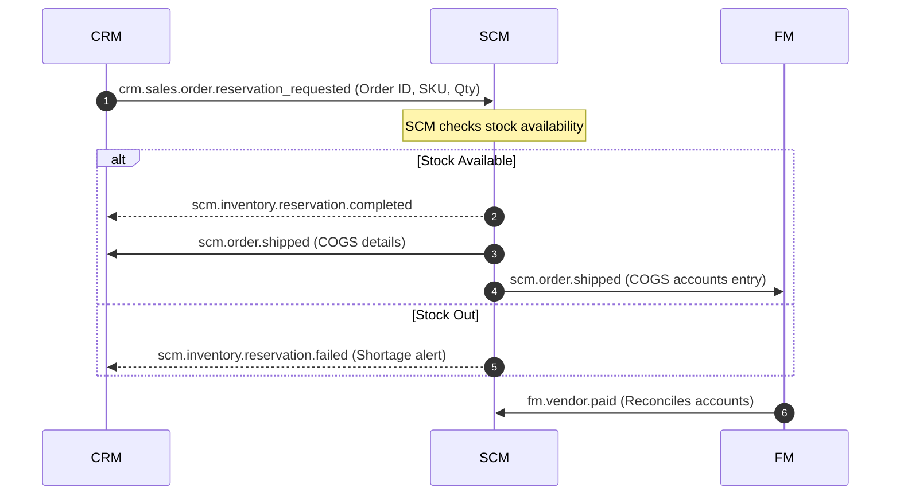
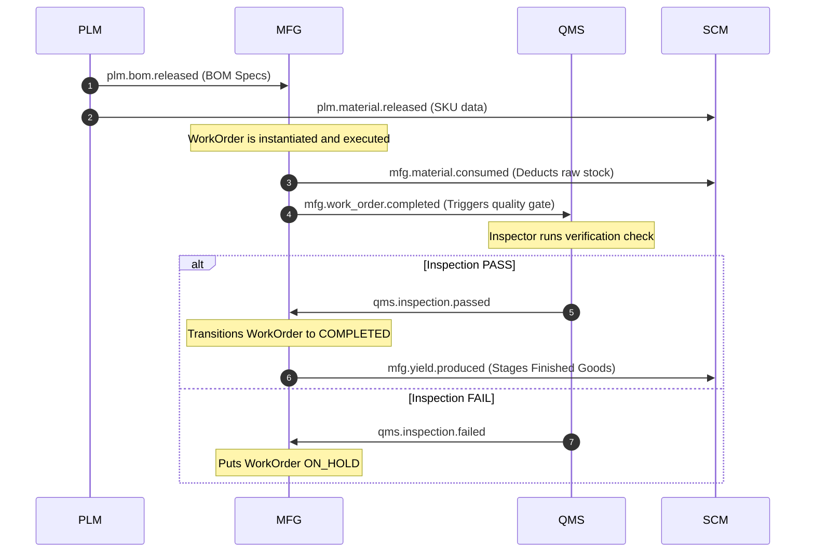
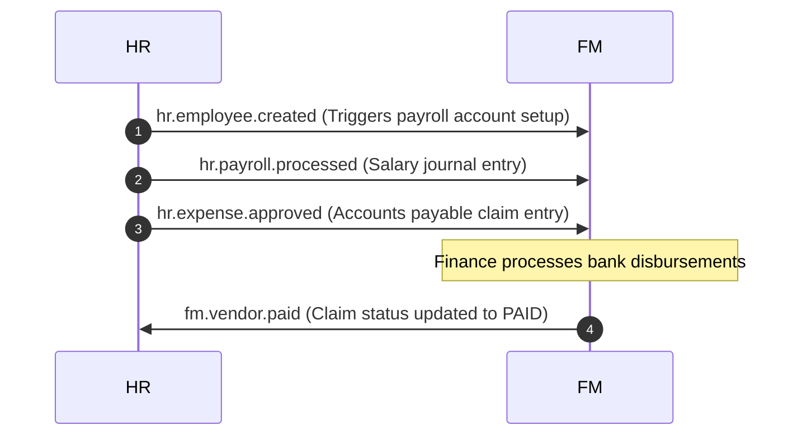

# Kafka Event-Driven Architecture (9-Module Interaction Guide)

This document specifies the asynchronous event-driven messaging mechanism and the producer-consumer relationship map across the 9 system modules.

---

## 1. Event Reliability Mechanisms

To prevent data desyncs in a distributed microservice network, all system modules adhere to two core patterns:

### A. The Transactional Outbox Pattern (Producer Side)
* **Goal**: Guarantee that database updates and corresponding event publishes occur atomically.
* **Mechanism**: When a service mutates state (e.g., hiring an employee), it writes the main entity and a `TransactionalOutbox` message in the same local database transaction.
* **Relay**: A background outbox worker polls `PENDING` outbox records, publishes them to Kafka, and updates their status to `SENT` upon confirmation.

### B. The Exactly-Once Inbox Pattern (Consumer Side)
* **Goal**: Prevent duplicate event execution (idempotency).
* **Mechanism**: Every incoming Kafka event is run through a `ReliableMessagingService` within a transaction lock. The consumer inserts the event ID into a `KafkaEventInbox` table. If the event ID already exists with `SUCCESS` state, it is immediately skipped, preventing double-processing.

---

## 2. 9-Module Producer-Consumer Matrix

The table below catalogs which service produces an event and which downstream services consume it to trigger side-effects:

| Topic | Producer Module | Consumer Modules | Description / Side-Effects triggered |
| :--- | :--- | :--- | :--- |
| `plm.material.released` | **PLM** (Product Lifecycle) | **SCM** | SCM automatically creates/registers the product SKU in the inventory catalog. |
| `plm.bom.released` | **PLM** | **MFG** | MFG saves the Bill of Material schema for future work order routing. |
| `plm.eco.implemented` | **PLM** | **MFG** | MFG triggers the obsolete BOM shield, putting older staged work orders on hold. |
| `crm.sales.order.reservation_requested` | **CRM** (Customer Relations) | **SCM** | SCM reserves stock in the warehouse for the order items. |
| `crm.sales.order.cancelled` | **CRM** | **SCM** | SCM releases inventory reservations back to available stock. |
| `scm.inventory.reservation.completed` | **SCM** (Supply Chain) | **CRM** | CRM updates Sales Order status to Confirmed/Reserved. |
| `scm.inventory.reservation.failed` | **SCM** | **CRM** | CRM flags Sales Order for manual review due to stock shortage. |
| `scm.receipt.staged` | **SCM** | **FM**, **PRJ** | FM records inventory-in-transit GL journal entries. PRJ tracks project purchase receipts. |
| `scm.order.shipped` | **SCM** | **CRM**, **FM** | CRM updates order to Shipped. FM records COGS journal entries. |
| `scm.asset.received` | **SCM** | **FM**, **EAM** | EAM provisions new equipment profile. FM records capital assets entry. |
| `mfg.production.started` | **MFG** (Manufacturing) | **EAM** | EAM marks the routing machine status as Busy. |
| `mfg.material.consumed` | **MFG** | **SCM**, **FM** | SCM decrements raw material stock levels. FM posts WIP journal entries. |
| `mfg.yield.produced` | **MFG** | **SCM** | SCM increments inventory levels for finished goods or sub-assemblies. |
| `mfg.work_order.completed` | **MFG** | **QMS** | QMS automatically schedules a quality inspection task for the product batch. |
| `qms.inspection.passed` | **QMS** (Quality) | **MFG** | MFG transitions the parent work order from In-Progress to Completed. |
| `qms.inspection.failed` | **QMS** | **MFG** | MFG immediately flags the parent work order as ON_HOLD. |
| `eam.machine.offline` | **EAM** (Assets) | **MFG** | MFG suspends active work orders on that station and moves them to ON_HOLD. |
| `hr.employee.created` | **HR** (Human Resources) | **FM** | FM provisions employee payroll vendor ledger accounts. |
| `hr.payroll.processed` | **HR** | **FM** | FM records General Ledger salary journal entries. |
| `hr.expense.approved` | **HR** | **FM** | FM creates accounts payable entry for reimbursement. |
| `fm.vendor.paid` | **FM** (Finance) | **HR**, **SCM** | HR sets expense claims to Paid. SCM updates purchase bills to Paid. |
| `prj.time.logged` | **PRJ** (Projects) | **HR** | HR logs project timesheets to calculate contractor payout. |

---

## 3. Core Event Choreography Flows

### Flow 1: Order-to-Cash (CRM $\leftrightarrow$ SCM $\leftrightarrow$ FM)

This loop covers customer order booking, stock reservation, shipping, invoicing, and payment:

---

### Flow 2: Plan-to-Produce & Quality (PLM $\to$ MFG $\leftrightarrow$ QMS $\to$ SCM)

Covers engineering release, work execution, quality checks, and stock staging:

---

### Flow 3: Workforce-to-Ledger (HR $\leftrightarrow$ FM)

Covers onboarding, expense filing, payroll processing, and cash disbursements:

