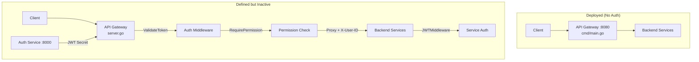

# Security Architecture

Authentication, authorization, and data protection across the ERP system.

## Architecture Overview

The security system has three components:

```
Auth Service      — User management, JWT issuance, RBAC (roles/permissions)
API Gateway       — Token validation, permission enforcement, role checking (INACTIVE)
Downstream Auth   — Service-level trust via forwarded headers (INACTIVE)
```



> **Critical**: The deployed gateway (`cmd/main.go`) has **no authentication**. The full JWT auth system is defined in `internal/server/server.go` and `internal/middleware/auth.go` but is **not wired into the running binary**.

## Auth Service

The Auth Service runs on port 8000 and handles identity and access management.

### Endpoints

All under `/api/v1/auth`:

| Method | Path | Description |
|--------|------|-------------|
| POST | `/api/v1/auth/register` | Create a new user |
| POST | `/api/v1/auth/login` | Authenticate and return JWT |
| POST | `/api/v1/auth/refresh` | Refresh an expired token |
| POST | `/api/v1/auth/logout` | Revoke a refresh token |
| PUT | `/api/v1/auth/users/:id` | Update user profile |
| POST | `/api/v1/auth/users/:id/store` | Assign user to a store |
| POST | `/api/v1/auth/users/:id/validate-permission` | Check user permission |
| POST | `/api/v1/auth/users/:id/deactivate` | Deactivate a user |

### Authentication Flow

```
Login Request (username + password)
  → AuthService.AuthenticateUser()
    → Lookup user by username
    → Check account is active
    → Compare password (plaintext)
    → Resolve roles + permissions via RBACService
    → Generate JWT (HS256) signed with secret
    → Create session with refresh token
  → Return { access_token, refresh_token, token_type: "Bearer" }
```

### JWT Token Structure

The JWT is signed with HMAC-SHA256 and contains:

```json
{
  "user_id": "usr_1749267184000000000",
  "username": "admin",
  "email": "admin@erp.com",
  "roles": ["Admin"],
  "permissions": ["scm:product:create", "scm:product:read", "crm:customer:create"],
  "exp": 1749270784,
  "iat": 1749267184,
  "nbf": 1749267184
}
```

### Token Configuration

| Parameter | Default | Config |
|-----------|---------|--------|
| Signing Secret | `super-secret-key-123` | `JWT_SECRET` |
| Access Token Expiry | 60 minutes | `JWT_ACCESS_EXPIRY` |
| Refresh Token Expiry | 24 hours | `JWT_REFRESH_EXPIRY` |

### Password Handling

**Passwords are stored as plaintext.** The code explicitly notes:

```go
// Simple check (in production, use bcrypt or secure comparison)
if user.PasswordHash != password {
```

```go
// password hash is raw password for simplicity of the in-memory example
PasswordHash: req.Password,
```

There is no hashing (bcrypt, scrypt, or argon2), no salting, and no pepper.

## RBAC Model

### Entities

| Entity | Description |
|--------|-------------|
| `User` | System user with username, email, password |
| `Role` | Named role (e.g., Admin, Manager, Clerk) |
| `Permission` | Action permission with `{service}:{resource}:{action}` format |
| `UserRole` | Many-to-many: user → role assignment |
| `RolePermission` | Many-to-many: role → permission assignment |

### Permission Format

```
{service}:{resource}:{action}
```

Examples from seed data:
- `scm:product:create` — Create products in SCM
- `scm:product:read` — View products in SCM
- `crm:customer:create` — Create customers in CRM
- `crm:customer:read` — View customers in CRM

### Default Roles (Seeded)

| Role | Permissions |
|------|-------------|
| **Admin** | `scm:product:create`, `scm:product:read`, `crm:customer:create`, `crm:customer:read` |
| **Manager** | `scm:product:read`, `crm:customer:read` |
| **Clerk** | `scm:product:read` |

Default admin credentials: `admin` / `admin123`

## API Gateway Auth (Inactive)

The gateway's `internal/middleware/auth.go` defines three middleware components that are **not currently deployed**:

### ValidateToken

Extracts and validates the JWT from the `Authorization: Bearer <token>` header. On success, injects into Gin context:
- `user_id` (uint)
- `username` (string)
- `email` (string)
- `roles` ([]string)
- `permissions` ([]string)
- `token` (string — raw JWT)

Returns **401** if header is missing, malformed, or token is invalid.

### RequirePermission

Checks the user's JWT permissions for `{service}:{resource}:{action}`. Returns **403** with `required_permission` if not found.

### RequireRole

Checks the user's JWT roles for an exact string match. Returns **403** with `required_role` if not found.

### Route Protection Map

In the inactive server, routes are protected as follows:

| Route | Auth | Check |
|-------|------|-------|
| `POST /api/v1/auth/login` | Public | None |
| `POST /api/v1/auth/register` | Public | None |
| `POST /api/v1/auth/refresh` | Public | None |
| `ANY /api/v1/fm/*` | JWT + Permission | FM-specific granular checks |
| `ANY /api/v1/hr/*path` | JWT + Permission | `hr:*:read` (wildcard) |
| `ANY /api/v1/scm/*path` | JWT + Permission | `scm:*:read` (wildcard) |
| `ANY /api/v1/m/*path` | JWT + Permission | `m:*:read` (wildcard) |
| `ANY /api/v1/crm/*path` | JWT + Permission | `crm:*:read` (wildcard) |
| `ANY /api/v1/pm/*path` | JWT + Permission | `pm:*:read` (wildcard) |
| `ANY /api/v1/admin/*path` | JWT + Role | `admin` role required |

## Downstream Service Auth (Inactive)

`internal/middleware/auth_client.go` provides a `JWTMiddleware()` for individual services to trust the gateway:

- Reads `X-User-ID` and `X-Username` headers (set by the gateway's proxy)
- Returns **401** if headers are missing
- Injects `user_id` and `username` into the service's Gin context

**No service currently uses this middleware.**

## CORS

The inactive gateway server has a CORS middleware that:

- Allows all origins (`Access-Control-Allow-Origin: *`)
- Allows methods: GET, POST, PUT, DELETE, OPTIONS
- Handles OPTIONS preflight requests with HTTP 204
- Sets `Access-Control-Allow-Headers: Content-Type, Authorization`

The deployed gateway (`cmd/main.go`) has **no CORS handling**.

## Rate Limiting

An in-memory per-IP rate limiter is defined in `api-gateway/internal/middleware/rate_limit.go` but is **not wired into any route**.

## Security Gaps

### Critical

| Gap | Details |
|-----|---------|
| **No authentication deployed** | The running gateway has zero auth. All API endpoints are public. |
| **Plaintext passwords** | Auth service stores and compares passwords as plaintext. |
| **Hardcoded JWT secret** | Default `JWT_SECRET` is `super-secret-key-123`, visible in source code. |
| **No TLS/HTTPS** | All communication is plain HTTP. No certificate configuration exists. |
| **Default credentials** | Admin user `admin` / `admin123` is seeded with no change-enforcement. |

### High

| Gap | Details |
|-----|---------|
| **No input sanitization** | Request fields are bound directly without sanitization. |
| **No SQL injection protection** | Not currently exploitable (in-memory storage), but no parameterized query patterns exist for future DB migration. |
| **No audit logging** | No authentication events, permission denials, or sensitive operations are logged. |
| **No session invalidation on password change** | Changing a password does not invalidate existing JWT tokens. |
| **Refresh tokens are predictable** | Format: `rt_{unix_nano}_{user_id}` — enumerable. |
| **JWT contains no token ID (jti)** | No way to revoke individual access tokens. |

### Medium

| Gap | Details |
|-----|---------|
| **User ID type mismatch** | Auth service uses string IDs (`usr_...`), gateway middleware parses `X-User-ID` as `uint`. |
| **No permission hierarchy** | `RequirePermission` does exact match — no wildcard or prefix-based matching despite the CDD defining group permissions like `fm:*:read`. |
| **No CSRF protection** | No anti-CSRF tokens or SameSite cookie policies. |
| **Verbose error messages** | API returns `invalid credentials` on login failure (acceptable), but internal errors may leak details. |

## Recommendations

### Immediate

1. **Wire the existing auth middleware** into the API gateway by switching from `cmd/main.go` to `internal/server/server.go` — the code is fully implemented
2. **Hash passwords** using bcrypt with cost factor 12
3. **Change the default JWT secret** via environment variable
4. **Enable TLS** with a self-signed certificate for development

### Short-Term

5. **Add `jti` (JWT ID) claim** for token revocation capability
6. **Implement refresh token rotation** — invalidate old refresh token on each refresh
7. **Add rate limiting** by wiring the existing rate limiter middleware
8. **Add audit logging** for authentication events (login success/failure, permission denials)

### Long-Term

9. **Replace refresh token format** with cryptographically random tokens
10. **Add permission wildcard matching** — support `scm:*:read` as a group permission
11. **Introduce a secrets manager** — never hardcode secrets in source
12. **Implement OAuth2 / OpenID Connect** for third-party integrations
