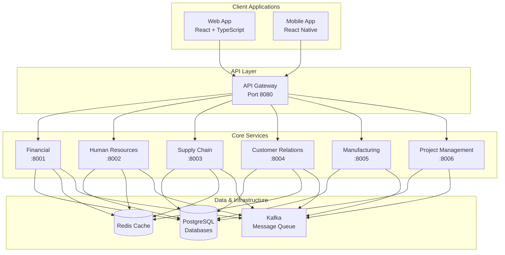

# System Overview

High-level architecture and key components of the ERP system.

## Architecture Principles

The ERP system is built on these core principles:

**Microservices Architecture**: Independent, loosely-coupled services that can be developed, deployed, and scaled independently.

**Event-Driven Design**: Services communicate asynchronously through events, ensuring loose coupling and system resilience.

**Domain-Driven Design**: Each service represents a specific business domain with clear boundaries and responsibilities.

**Cloud-Native**: Container-based architecture designed for cloud deployment with horizontal scaling capabilities.

## System Components

## Core Services

### API Gateway (Port 8080)
**Purpose**: Single entry point for all client requests
**Responsibilities**:
- Request routing to appropriate services
- Authentication and authorization
- Rate limiting and request throttling  
- Request/response transformation
- Load balancing across service instances

### Financial Management Service (Port 8001)
**Purpose**: Complete financial management and accounting
**Key Features**:
- General ledger and chart of accounts
- Accounts payable and receivable
- Journal entries and financial reporting
- Multi-currency support
- Budget management

### Human Resources Service (Port 8002)
**Purpose**: Employee lifecycle management
**Key Features**:
- Employee information management
- Payroll processing and tax calculations
- Time and attendance tracking
- Benefits administration
- Performance management

### Supply Chain Management Service (Port 8003)
**Purpose**: Inventory and procurement management  
**Key Features**:
- Multi-location inventory tracking
- Purchase order management
- Supplier relationship management
- Warehouse operations
- Demand planning

### Customer Relationship Management Service (Port 8004)
**Purpose**: Customer lifecycle and sales management
**Key Features**:
- Lead management and qualification
- Opportunity tracking
- Customer account management  
- Marketing campaigns
- Customer support ticketing

### Manufacturing Service (Port 8005)
**Purpose**: Production planning and execution
**Key Features**:
- Bill of materials management
- Production planning and scheduling
- Work order processing
- Quality control
- Shop floor operations

### Project Management Service (Port 8006)
**Purpose**: Project planning and resource management
**Key Features**:
- Project planning and scheduling
- Resource allocation
- Time tracking and billing
- Budget management
- Client invoicing

## Infrastructure Components

### PostgreSQL Databases
**Purpose**: Primary data storage
**Configuration**: 
- Separate database per service for data isolation
- Connection pooling for performance
- Automated backups and point-in-time recovery
- Read replicas for reporting workloads

### Redis Cache
**Purpose**: High-performance caching and session storage
**Usage**:
- Application-level caching for frequently accessed data
- Session storage for user authentication
- Temporary data storage for background jobs
- Rate limiting counters

### Kafka Message Queue
**Purpose**: Asynchronous event-driven communication
**Usage**:
- Inter-service communication through domain events
- Event sourcing for audit trails
- Integration with external systems
- Workflow orchestration

## Service Communication Patterns

### Synchronous Communication
- HTTP/REST APIs for direct service-to-service calls
- Used for queries and immediate responses
- Circuit breaker pattern for resilience
- Timeout and retry mechanisms

### Asynchronous Communication
- Kafka events for eventual consistency
- Domain events for business process coordination
- Event sourcing for audit and replay capabilities
- Saga pattern for distributed transactions

## Data Architecture

### Database per Service
Each service has its own dedicated database to ensure:
- Data isolation and service autonomy
- Independent scaling and optimization
- Technology diversity (different services can use different databases)
- Failure isolation

### Eventual Consistency
Services maintain consistency through:
- Domain events for data synchronization
- Compensating actions for error handling  
- Event-driven projections for read models
- Idempotent event processing

## Security Architecture

### Authentication and Authorization
- JWT-based authentication with refresh tokens
- Role-based access control (RBAC)
- API-level authorization enforcement
- Secure session management with Redis

### Data Protection
- TLS encryption for all communication
- Database encryption at rest
- Sensitive data masking in logs
- Input validation and sanitization

## Deployment Architecture

### Containerization
- Docker containers for all services
- Multi-stage builds for optimized images  
- Health checks and readiness probes
- Resource limits and requests

### Orchestration
- Kubernetes for production deployments
- Docker Swarm for smaller deployments
- Horizontal pod autoscaling
- Rolling updates with zero downtime

## Monitoring and Observability

### Metrics and Monitoring
- Prometheus metrics collection
- Grafana dashboards for visualization
- Custom business metrics
- Infrastructure monitoring

### Logging and Tracing
- Centralized logging with ELK stack
- Structured JSON logging
- Distributed tracing with correlation IDs
- Error tracking and alerting

## Quality Attributes

### Scalability
- Horizontal scaling of individual services
- Database read replicas for query scaling
- Caching layers for performance
- Load balancing across service instances

### Reliability
- Circuit breaker patterns for fault tolerance
- Health checks and automatic recovery
- Data backup and disaster recovery
- Graceful degradation of functionality

### Performance
- Response time targets: <200ms for queries, <500ms for transactions
- Caching strategies for frequently accessed data
- Database query optimization
- CDN for static assets

### Security
- Zero-trust security model
- Regular security audits and penetration testing
- Compliance with industry standards (SOC 2, PCI DSS)
- Automated security scanning in CI/CD

## Next Steps

Learn more about specific aspects:
- [Technology Stack](technology-stack.md) - Detailed technology choices
- [Microservices Architecture](microservices-architecture.md) - Service design patterns
- [Database Design](database-design.md) - Data modeling and schemas