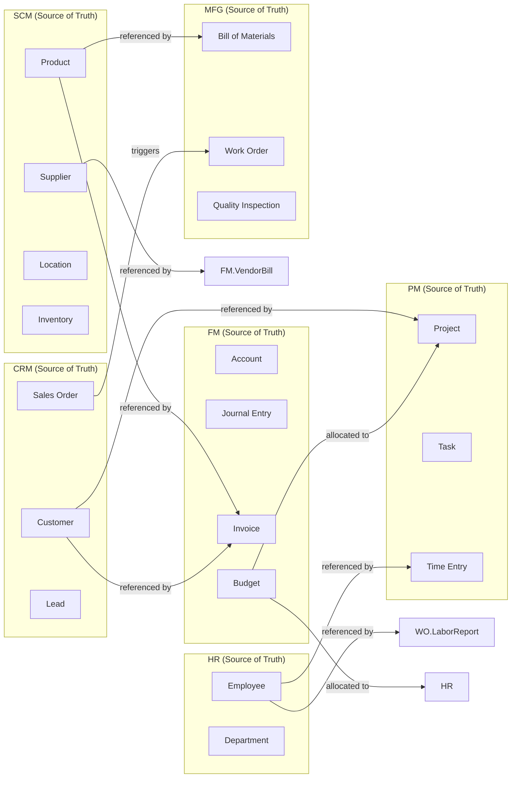

# System Overview — C4 Architecture Model

This document describes the ERP system at four levels: **Context** (system boundaries), **Container** (deployable units), **Component** (internal structure), and **Code** (key patterns). Each level distinguishes **current state** (what exists) from **target state** (what CDD contracts define but isn't implemented).

---

## Level 1: System Context

```
┌─────────────────────────────────────────────────────────────────┐
│                        ERP System                                │
│                                                                  │
│  ┌──────────┐  ┌──────────┐  ┌──────────┐  ┌──────────┐       │
│  │ Auth     │  │ FM       │  │ HR       │  │ SCM      │       │
│  │ :8000    │  │ :8001    │  │ :8002    │  │ :8003    │       │
│  └──────────┘  └──────────┘  └──────────┘  └──────────┘       │
│                                                               │
│  ┌──────────┐  ┌──────────┐  ┌──────────┐  ┌──────────┐     │
│  │ CRM      │  │ MFG      │  │ PM       │  │ Gateway  │     │
│  │ :8004    │  │ :8005    │  │ :8006    │  │ :8080    │     │
│  └──────────┘  └──────────┘  └──────────┘  └──────────┘     │
│                                                               │
│  ┌──────────┐  ┌──────────┐  ┌──────────┐                    │
│  │ Postgres │  │ Redis    │  │ Kafka    │                    │
│  │ :5432    │  │ :6379    │  │ :9092    │                    │
│  └──────────┘  └──────────┘  └──────────┘                    │
└─────────────────────────────────────────────────────────────────┘
         ▲                        ▲
         │ HTTP                   │ Kafka
         ▼                        ▼
┌─────────────────┐    ┌──────────────────┐
│  API Clients     │    │  HR Payroll      │
│  (curl, browser) │    │  (manual trigger)│
└─────────────────┘    └──────────────────┘
```

### Actors

| Actor | Interaction | Current State |
|-------|-------------|---------------|
| **API Client** | HTTP via Gateway :8080 | No auth required, all endpoints public |
| **Admin** | Direct to Auth Service :8000 | Can login/register, but gateway ignores tokens |
| **Kafka** | Async event bus :9092 | All services produce/consume; fire-and-forget publish |

### External Systems

| System | Integration | Current State |
|--------|-------------|---------------|
| **PostgreSQL** | Database :5432 | Container running, **no service connects** |
| **Redis** | Cache :6379 | Container running, **no service connects** |

---

## Level 2: Containers (Deployable Units)

### Current State

```mermaid
graph TB
    subgraph "Docker Compose (11 containers)"
        subgraph "Infrastructure"
            PG[(PostgreSQL 13<br/>:5432)]
            RD[(Redis 6<br/>:6379)]
            ZK[Zookeeper<br/>:2181]
            KF[Kafka 7.0.1<br/>:9092)]
        end

        subgraph "Application"
            GW[API Gateway<br/>Go + Gin<br/>:8080]
            AU[Auth Service<br/>Go + Gin<br/>:8000]
            FM[FM Service<br/>Go + Gin<br/>:8001]
            HR[HR Service<br/>Go + Gin<br/>:8003]
            SCM[SCM Service<br/>Go + Gin<br/>:8006]
            CRM[CRM Service<br/>Go + Gin<br/>:8002]
            MFG[MFG Service<br/>Go + Gin<br/>:8004]
            PM[PM Service<br/>Go + Gin<br/>:8005]
        end
    end

    GW -->|HTTP proxy| FM
    GW -->|HTTP proxy| HR
    GW -->|HTTP proxy| SCM
    GW -->|HTTP proxy| CRM
    GW -->|HTTP proxy| MFG
    GW -->|HTTP proxy| PM

    FM -->|produce/consume| KF
    HR -->|produce/consume| KF
    SCM -->|produce/consume| KF
    CRM -->|produce| KF
    MFG -->|produce/consume| KF
    PM -->|produce/consume| KF
    AU -->|produce| KF

    FM -.->|Not connected| PG
    HR -.->|Not connected| PG
    SCM -.->|Not connected| PG
    CRM -.->|Not connected| PG
    MFG -.->|Not connected| PG
    PM -.->|Not connected| PG
    AU -.->|Not connected| PG

    FM -.->|Not connected| RD
    HR -.->|Not connected| RD
    SCM -.->|Not connected| RD
    CRM -.->|Not connected| RD
```

> **Key**: Solid lines = working. Dotted lines = infra exists but not connected.

### Container Technologies

| Container | Language / Image | Framework | Storage |
|-----------|-----------------|-----------|---------|
| API Gateway | Go 1.23 | Gin | None (stateless proxy) |
| Auth Service | Go 1.23 | Gin | In-memory map |
| FM Service | Go 1.23 | Gin | In-memory map |
| HR Service | Go 1.23 | Gin | In-memory map |
| SCM Service | Go 1.23 | Gin | In-memory map |
| CRM Service | Go 1.23 | Gin | In-memory map |
| MFG Service | Go 1.23 | Gin | In-memory map |
| PM Service | Go 1.23 | Gin | In-memory map |
| PostgreSQL | postgres:13 | — | Disk (no clients) |
| Redis | redis:6 | — | Memory (no clients) |
| Kafka | cp-kafka:7.0.1 | — | Disk (/var/lib/kafka/data) |

### Port Mapping Matrix

| Service | Docker Compose Port | Gateway Backend URL | Code Default Port |
|---------|--------------------|--------------------|--------------------|
| Auth | 8000 | — | 8000 |
| FM | 8001 | http://finance-service:8001 | 8001 |
| HR | **8003** | http://hr-service:8002 | **8003** (code) vs 8002 (gateway) |
| SCM | **8006** | http://scm-service:8003 | **8006** (code) vs 8003 (gateway) |
| MFG | 8004 | http://manufacturing-service:8004 | 8004 |
| CRM | **8002** | http://crm-service:8005 | **8002** (code) vs 8005 (gateway) |
| PM | 8005 | http://projects-service:8006 | 8005 |

> **HR, SCM, CRM have port mismatches** between docker-compose, code defaults, and gateway config.

---

## Level 3: Component Architecture

### Service Internal Structure (applies to all 7 services)

```
cmd/main.go
└── config.Load()              → reads env vars, returns Config struct
└── domain.NewMemoryRepo()     → creates sync.RWMutex-protected map
└── domain.NewKafkaPublisher() → creates kafka.Writer (segmentio/kafka-go)
└── service.NewXxxService()   → injects repo + publisher
└── handler.NewXxxHandler()   → injects service
└── routes.SetupRoutes()      → registers Gin routes
└── go kafkaConsumer()         → goroutine: ReadMessage → switch by topic
└── router.Run(":PORT")       → starts HTTP server
```

### Gateway: Two Versions

| Aspect | Active (`cmd/main.go`) | Inactive (`internal/server/server.go`) |
|--------|----------------------|--------------------------------------|
| Auth | None | JWT validation + RBAC middleware |
| Rate limit | None | Per-IP sliding window (`rate_limit.go`) |
| CORS | None | Configured |
| Routes | `/health`, `/services`, reverse proxy | Full route table with RBAC |
| Proxy backends | 8081-8086 | 8001-8006 |

### Shared Utilities

| Utility | Location | Used By |
|---------|----------|---------|
| `Logger` (Info/Error/Debug/Warn) | `shared/utils/logger.go` | **None** (all services use `log.Printf`) |
| `Response` helper (Success/Error/etc.) | `shared/utils/response.go` | **None** (all services use `gin.H`) |
| `GinLogger` middleware | `shared/templates/utils/` | **None** |
| `RequestIDMiddleware` | `shared/templates/utils/` | **None** |

### Kafka Integration Pattern

```
Producer (all services):
    _ = publisher.Publish(ctx, topic, key, payload)
    ↑ Error silently ignored — fire-and-forget

Consumer (goroutine per service):
    msg, err := reader.ReadMessage(ctx)
    switch msg.Topic {
    case "hr.payroll.processed":
        // handle — single goroutine, sequential
    }
    ↑ No retry, no DLQ, no idempotency
```

---

## Level 4: Code — Key Patterns

### Repository Pattern (In-Memory)

```go
// MemoryAccountRepo implements domain.AccountRepository
type MemoryAccountRepo struct {
    mu   sync.RWMutex
    data map[string]*domain.Account
}

func (r *MemoryAccountRepo) Create(ctx context.Context, a *domain.Account) error {
    r.mu.Lock()
    defer r.mu.Unlock()
    r.data[a.ID] = a
    return nil
}

func (r *MemoryAccountRepo) List(ctx context.Context) ([]domain.Account, error) {
    r.mu.RLock()
    defer r.mu.RUnlock()
    // iterate and return copy
}
```

### Event Publishing (Fire-and-Forget)

```go
func (p *KafkaPublisher) Publish(ctx context.Context, topic, key string, payload interface{}) error {
    bytes, _ := json.Marshal(payload)
    err := p.writer.WriteMessages(ctx, kafka.Message{
        Topic: topic,
        Key:   []byte(key),
        Value: bytes,
    })
    if err != nil {
        log.Printf("failed to publish event: %v", err) // <-- only logging
    }
    return err  // caller ignores: _ = publisher.Publish(...)
}
```

### UUID Generation (Timestamp-Based)

```go
// Not actually UUID — nanosecond timestamp
id := fmt.Sprintf("acc_%d", time.Now().UnixNano())
// Conflict risk under high concurrency on same nanosecond
```

---

## Bounded Context Map (DDD)

### Context Ownership

Each domain concept has a single **source-of-truth** service. Other services reference it cross-service.

| Domain Concept | Owner (Source of Truth) | Referenced By | Mechanism |
|---------------|------------------------|---------------|-----------|
| **User / Employee** | Auth + HR | PM (allocation), FM (expenses) | Kafka + REST |
| **Customer** | CRM | FM (invoicing), PM (projects) | Kafka |
| **Product** | SCM | MFG (BOM), CRM (sales), PM (materials) | Kafka |
| **Supplier** | SCM | FM (vendor bills) | Kafka |
| **Account** (GL) | FM | — | Internal |
| **Journal Entry** | FM | — | Internal |
| **Budget** | FM | PM, HR, MFG | Kafka |
| **Production Order** | MFG | SCM (materials), FM (costs) | Kafka |
| **Project** | PM | FM (billing) | Kafka |
| **Portfolio** | PM | — | Internal |
| **Invoice** | FM | — | Internal |
| **Sales Order** | CRM | MFG, SCM, PM | Kafka |
| **Lead / Opportunity** | CRM | — | Internal |
| **Inventory** | SCM | MFG, PM | Kafka |
| **Purchase Order** | SCM | FM | Kafka |
| **Timesheet / Leave** | HR | PM | Kafka |
| **Training** | HR | — | Internal |
| **Equipment / WorkCenter** | MFG | — | Internal |
| **Role / Permission** | Auth | — | Internal |

### Context Boundaries (CDD-Defined)

The CDD contracts define explicit references:
- `Manufacturing.BillOfMaterials.product_id` → `scm.Product.id` (SCM owns products)
- `Manufacturing.LaborReport.employee_id` → `hr.Employee.id` (HR owns employees)
- `FM.VendorBill.supplier_id` → `scm.Supplier.id` (SCM owns suppliers)
- `FM.Invoice.customer_id` → CRM Customer (CRM owns customers)
- `Manufacturing.ProductionOrder.sales_order_id` → CRM SalesOrder (CRM owns orders)

> **Note**: These cross-service references from CDD contracts are **not enforced in code** because no database relationship exists. Services reference each other via Kafka events only.

---

## Architecture Decision Records

### ADR-001: Go + Gin for All Services
**Status**: Accepted | **Date**: Generated scaffold
**Context**: Need a consistent web framework across 7 microservices.
**Decision**: Use Go 1.23+ with Gin for all HTTP services. All services share the same dependency versions.
**Consequences**: Consistent patterns across services, but Go 1.23 requires toolchain auto-download on older builder images (Dockerfiles specify `golang:1.21-alpine`).

### ADR-002: In-Memory Storage (No Database)
**Status**: Accepted (interim) | **Date**: Scaffold generation
**Context**: PostgreSQL schemas exist but no database driver is imported.
**Decision**: Use `sync.RWMutex`-protected maps for all repositories. Data is ephemeral.
**Consequences**: Zero setup for development, rapid iteration. All data lost on restart. Not production-ready. Migration to PostgreSQL requires writing actual repository implementations.

### ADR-003: Kafka for Async Communication
**Status**: Accepted | **Date**: Scaffold generation
**Context**: Services need asynchronous event-driven integration.
**Decision**: Use `segmentio/kafka-go` v0.4.51 with `LeastBytes` balancer. Each service has its own producer and consumer.
**Consequences**: ~85 topic names defined across all services. Publishing is fire-and-forget (errors logged but ignored). Single-goroutine consumer limits throughput. No dead-letter queue.

### ADR-004: No Authentication on Gateway
**Status**: Accepted (interim) | **Date**: Scaffold generation
**Context**: Full JWT + RBAC auth middleware exists but is not wired.
**Decision**: The deployed `cmd/main.go` reverse-proxies without any auth. The full server at `internal/server/server.go` with auth is unused.
**Consequences**: All endpoints public. Auth Service runs on :8000 but its tokens are never validated. To enable auth, switch the Dockerfile to build `internal/server/server.go`.

### ADR-005: Contract-Driven Development (CDD Engine)
**Status**: Accepted | **Date**: Scaffold generation
**Context**: Domain models, SQL schemas, event topics, and service interfaces are code-generated.
**Decision**: Use CDD Engine (Go code generator) from `.cdd` contract files. Domain model files carry `// Code generated by CDD Engine. DO NOT EDIT.`
**Consequences**: Models are consistent with contracts. Hand-written business logic (services) and auto-generated domain models coexist. CDD files are the source of truth for domain structure but not for implementation state.

### ADR-006: Timestamp-Based "UUIDs"
**Status**: Accepted | **Date**: Scaffold generation
**Context**: Need unique IDs for entities.
**Decision**: Use `fmt.Sprintf("acc_%d", time.Now().UnixNano())` instead of actual UUIDs (e.g., `google/uuid`).
**Consequences**: Simple, no dependency, but collision risk under high concurrency on the same nanosecond. Not URL-safe. Not sortable across restarts.

### ADR-007: No Pagination on List Endpoints
**Status**: Accepted | **Date**: Scaffold generation
**Context**: All list endpoints return all records unfiltered.
**Decision**: No `page`/`page_size` parameters. Full dataset returned every request.
**Consequences**: Simple implementation. Becomes a problem with >1000 records. MySQL-style `OFFSET`/`LIMIT` or cursor-based pagination must be added later.

### ADR-008: No Structured Logging
**Status**: Accepted | **Date**: Scaffold generation
**Context**: Shared logger exists at `shared/utils/logger.go` but is not used.
**Decision**: All services use `log.Printf` for logging. No log levels, no structured fields, no request IDs.
**Consequences**: Logs are unstructured and hard to search. The shared `Logger` with Info/Error/Debug/Warn + Gin middleware exists but needs to be wired per-service.

### ADR-009: No Testing Harness
**Status**: Accepted | **Date**: Scaffold generation
**Context**: Only 1 test file exists (fm-service, 2 test cases, 102 lines).
**Decision**: No testing framework, no mock generation, no integration test setup.
**Consequences**: Cannot verify correctness programmatically. All testing is manual via `curl`.

### ADR-010: Hardcoded JWT Secret
**Status**: Accepted (interim) | **Date**: Scaffold generation
**Context**: Auth service needs a JWT signing key.
**Decision**: Default `JWT_SECRET=super-secret-key-123` hardcoded in config. Overridable via env var.
**Consequences**: Easy setup. Critical security risk if deployed with default secret.

### ADR-011: Fire-and-Forget Event Publishing
**Status**: Accepted | **Date**: Scaffold generation
**Context**: Kafka publishing could fail.
**Decision**: Return error from publish but all callers use `_ = publisher.Publish(...)`.
**Consequences**: Silent event loss on Kafka failure. No retry, no circuit breaker, no dead-letter queue. Events that fail to publish are invisible to operators.

### ADR-012: Single-Threaded Kafka Consumer
**Status**: Accepted | **Date**: Scaffold generation
**Context**: Need to consume Kafka messages.
**Decision**: Each service runs a single goroutine that calls `reader.ReadMessage()` in a loop.
**Consequences**: Sequential message processing. A slow handler blocks all subsequent messages. No parallel processing across partitions.

---

## Current vs Target State

| Concern | Current State | Target State (per CDD + docs) | Gap |
|---------|---------------|-------------------------------|-----|
| **Storage** | In-memory maps | PostgreSQL per service | Full rewrite of repository layer |
| **Auth** | None on gateway | JWT + RBAC on all endpoints | Switch build target + wire middleware |
| **Events** | Fire-and-forget | Reliable delivery with retry | Add retry, DLQ, observability |
| **Kafka consumer** | Single goroutine | Partition-scaled consumers | Add consumer group management |
| **IDs** | Nanosecond timestamps | UUID v4 | Swap `fmt.Sprintf` for `google/uuid` |
| **Logging** | `log.Printf` | Structured JSON + levels | Wire shared Logger per service |
| **Testing** | 2 test cases | Unit + integration + contract | Build testing infrastructure |
| **Pagination** | None | Cursor-based | Add params to list handlers |
| **Password** | Plaintext | bcrypt | Hash on register, compare on login |
| **JWT secret** | Hardcoded default | Vault/Secrets manager | External secret management |
| **Circuit breaker** | None | Per-service-client | Add resilience library |
| **Metrics** | None | Prometheus + Grafana | Instrument handlers |
| **Tracing** | None | OpenTelemetry | Add trace propagation |
| **CI/CD** | None | GitHub Actions | Build pipeline |
| **Gateway ports** | Mismatched | Consistent 8001-8006 | Fix docker-compose or gateway config |

---

## Data Architecture

### Cross-Service Data Flow



### Consistency Strategy

| Pattern | Used? | Where |
|---------|-------|-------|
| **Eventual consistency** | ✅ | All cross-service data (Kafka events) |
| **Strong consistency** | ❌ | Not implemented — no distributed transactions |
| **Saga pattern** | ❌ | No compensating transactions |
| **Idempotency keys** | ❌ | Duplicate events may cause duplicate side-effects |
| **CRDT / conflict-free** | ❌ | Not applicable |

---

## Scalability Model

### Current Limitations

| Constraint | Impact | Remedy |
|------------|--------|--------|
| In-memory storage | Data lost on restart, limited by RAM | PostgreSQL |
| Single Kafka consumer goroutine | Sequential processing bottleneck | Partition-based parallel consumers |
| No connection pooling | N/A (no DB/Redis) | Add when database is connected |
| No caching | Every request hits in-memory map | Wire Redis |
| No statelessness guarantee | Session data in Auth memory | Move sessions to Redis |
| Gateway single instance | Single point of failure | Multi-instance with load balancer |

### Target Architecture

```
                  ┌─────────────┐
                  │  Load       │
                  │  Balancer   │
                  └──────┬──────┘
                         │
            ┌────────────┼────────────┐
            ▼            ▼            ▼
      ┌──────────┐ ┌──────────┐ ┌──────────┐
      │ Gateway  │ │ Gateway  │ │ Gateway  │
      │ Instance1│ │ Instance2│ │ Instance3│
      └──────────┘ └──────────┘ └──────────┘
            │            │            │
            └────────────┼────────────┘
                         │
            ┌────────────┼────────────┐
            ▼            ▼            ▼
      ┌──────────┐ ┌──────────┐ ┌──────────┐
      │ FM x3    │ │ HR x2    │ │ SCM x3   │
      │ (stateless│ │(stateless│ │(stateless│
      │ + DB)    │ │ + DB)    │ │ + DB)    │
      └──────────┘ └──────────┘ └──────────┘
```

> **Prerequisite**: Move from in-memory to PostgreSQL before horizontal scaling is viable.

---

## Resilience Model

### Current State
| Pattern | Status |
|---------|--------|
| Circuit breaker | Not implemented |
| Retry with backoff | Not implemented |
| Timeout | Default HTTP client (no timeout set) |
| Bulkhead | Not implemented |
| Health checks | `/health` endpoint per service (simple) |
| Graceful shutdown | Implemented in CRM, PM (SIGINT/SIGTERM handler) |
| Dead-letter queue | Not implemented |
| Rate limiting | Code exists (`rate_limit.go`) but not wired |

### Health Check Endpoints

All services expose `GET /health`:
```json
{"status": "healthy", "service": "fm-service"}
```

Health checks are **not used by Docker Compose** (no `healthcheck` configuration on any container).

---

## Observability Model

### Current State
| Concern | Status |
|---------|--------|
| Structured logging | Not used (shared Logger exists but unwired) |
| Request IDs | Not propagated (shared middleware exists but unwired) |
| Metrics | Not collected |
| Distributed tracing | Not implemented |
| Centralized log aggregation | Not deployed |
| Dashboards | Not deployed |
| Alerting | Not configured |

### Target State (per CDD contracts)
```yaml
# docker-compose addition (not yet deployed)
prometheus:
  image: prom/prometheus
  ports: ["9090:9090"]

grafana:
  image: grafana/grafana
  ports: ["3000:3000"]
```

---

## Deployment Model

### Current
```bash
# Local development only
docker compose up -d      # starts 11 containers
cd api-gateway && go run cmd/main.go  # gateway must be started separately
```

### Target (per docs, not implemented)
- Kubernetes deployment with Helm charts
- Horizontal Pod Autoscaling
- Blue-green deployments
- Terraform for infrastructure
- GitHub Actions CI/CD pipeline

### Known Deployment Issues

| Issue | Detail |
|-------|--------|
| Gateway not in docker-compose | Must be started manually |
| Gateway Dockerfile must build from repo root | `docker build -f api-gateway/Dockerfile .` (from root, not from api-gateway/) |
| Image port mismatches | M-service and PM-service Dockerfiles hardcode `EXPOSE 8001` |
| No health checks on containers | Docker Compose has no `healthcheck` for any service |
| No resource limits | No `mem_limit` or `cpus` on any container |

---

## API Strategy

### Versioning
- All routes use `/api/v1/{module}/{resource}`
- No version negotiation (header-based or URL-based)
- No deprecation policy documented
- No breaking change policy

### Response Format
- **Current**: Ad-hoc `gin.H{"data": ...}`, `gin.H{"error": ...}` — no standard envelope
- **CDD-defined**: `StandardResponse{Success, Message, Data, Error, Service, RequestID, Timestamp}` — exists in shared utils but unused

### Error Handling
- **Current**: Each handler returns different error shapes:
  ```go
  // Handler A
  c.JSON(http.StatusNotFound, gin.H{"error": "account not found"})
  // Handler B
  c.JSON(http.StatusBadRequest, gin.H{"error": err.Error()})
  ```
- **Target**: Standard error response with code, message, details array

---

## Testing Strategy

### Current State
- **1 test file** in the entire codebase: `services/fm-service/internal/business/service/service_test.go`
- 102 lines, 2 test cases
- No integration tests
- No contract tests
- No mock generation
- No CI pipeline to run tests

### Target (not implemented)
| Test Type | Tool | Coverage Target |
|-----------|------|-----------------|
| Unit (services) | Go testing + Testify | 80%+ |
| Unit (handlers) | Go testing + httptest | 80%+ |
| Integration | Docker Compose + Testcontainers | Critical paths |
| Contract | Pact or CDD-verified | All cross-service APIs |
| E2E | Custom test suite | Core business flows |

---

## Related Documentation

- [Services Overview](services-overview.md) — Detailed endpoint and domain model reference
- [Event Architecture](event-architecture.md) — Full 85+ topic Kafka event catalog
- [API Design](api-design.md) — Gateway routing and conventions
- [Deployment Architecture](deployment-architecture.md) — Docker Compose and build pipeline
- [Security Architecture](security-architecture.md) — Auth service, JWT, RBAC, gaps
- [Performance Architecture](performance-architecture.md) — Concurrency, caching, bottlenecks
- [Common Issues](common-issues.md) — 41 known problems across the codebase
- [Business Modules](../modules/README.md) — Module capabilities by domain
