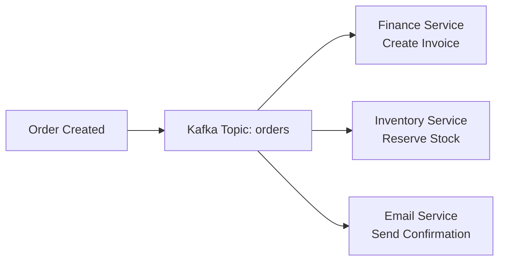

# Frequently Asked Questions (FAQ)

Quick answers to common questions about the ERP system. Questions are organized by topic and include practical examples.

## General Questions

### What is this ERP system?

The ERP system is a comprehensive business management platform built with modern technologies. It handles financial management, human resources, supply chain, customer relations, manufacturing, and project management through integrated microservices.

**Key Features:**
- Microservices architecture with Go and React
- Real-time data synchronization across modules
- Cloud-native deployment with Kubernetes support
- Complete audit trails and compliance features
- Mobile application support

### Why microservices instead of a monolithic application?

**Benefits of our microservices approach:**

1. **Scalability**: Scale individual services based on load
   ```bash
   # Scale only the high-traffic financial service
   kubectl scale deployment financial-service --replicas=5
   ```

2. **Independent Development**: Teams can work on different services simultaneously
3. **Technology Flexibility**: Use the best tool for each service
4. **Fault Isolation**: One service failure doesn't bring down the entire system
5. **Easier Maintenance**: Deploy and update services independently

### What makes this different from other ERP systems?

**Modern Architecture:**
- Cloud-native design from the ground up
- Event-driven architecture for real-time updates
- API-first approach for easy integrations
- Container-based deployment for portability

**Developer-Friendly:**
- Complete documentation with working examples
- Automated testing and deployment pipelines
- Extensive monitoring and debugging tools
- Open source with active community support

---

## Technology Questions

### Why Go for backend services?

**Go was chosen for several reasons:**

1. **Performance**: Compiled language with excellent concurrency
2. **Simplicity**: Easy to learn and maintain
3. **Cloud-Native**: Excellent Docker and Kubernetes support
4. **Standard Library**: Rich standard library reduces dependencies
5. **Deployment**: Single binary deployment

**Example of Go's simplicity:**
```go
// Simple HTTP server with routing
func main() {
    r := gin.Default()
    r.GET("/health", func(c *gin.Context) {
        c.JSON(200, gin.H{"status": "healthy"})
    })
    r.Run(":8001")
}
```

### Why PostgreSQL over MySQL or NoSQL?

**PostgreSQL advantages for ERP systems:**

1. **ACID Compliance**: Critical for financial transactions
2. **JSON Support**: Flexible schema when needed
3. **Advanced Features**: Window functions, CTEs, full-text search
4. **Extensibility**: Custom data types and functions
5. **Performance**: Excellent query optimization

**Example of PostgreSQL's power:**
```sql
-- Complex financial reporting query
WITH monthly_revenue AS (
    SELECT 
        DATE_TRUNC('month', invoice_date) as month,
        SUM(total_amount) as revenue
    FROM invoices 
    WHERE invoice_date >= '2024-01-01'
    GROUP BY DATE_TRUNC('month', invoice_date)
)
SELECT 
    month,
    revenue,
    LAG(revenue) OVER (ORDER BY month) as prev_month_revenue,
    revenue - LAG(revenue) OVER (ORDER BY month) as growth
FROM monthly_revenue
ORDER BY month;
```

### Can I use a different database?

Yes, but with considerations:

**Supported Databases:**
- **PostgreSQL** (recommended): Full feature support
- **MySQL**: Most features work, some JSON operations limited
- **SQLite**: Development only, not for production

**Database abstraction layer:**
```go
type Repository interface {
    CreateAccount(ctx context.Context, account *Account) error
    GetAccount(ctx context.Context, id string) (*Account, error)
    UpdateAccount(ctx context.Context, account *Account) error
    DeleteAccount(ctx context.Context, id string) error
}

// Implementations for different databases
type PostgreSQLRepository struct{ db *gorm.DB }
type MySQLRepository struct{ db *gorm.DB }
```

### Why Kafka for messaging?

**Kafka benefits:**

1. **High Throughput**: Handle millions of messages per second
2. **Durability**: Messages are persisted and replicated
3. **Scalability**: Add brokers and partitions as needed
4. **Ordering**: Maintain message order within partitions
5. **Replay**: Replay messages from any point in time

**Event flow example:**


---

## Development Questions

### How do I add a new microservice?

**Step-by-step process:**

1. **Create service structure:**
   ```bash
   mkdir -p services/new-service/{cmd/server,internal/{api/handlers,business/services,data/repositories},config}
   ```

2. **Copy template files:**
   ```bash
   cp services/fm-service/go.mod services/new-service/
   cp services/fm-service/Dockerfile services/new-service/
   cp services/fm-service/Makefile services/new-service/
   ```

3. **Update configuration:**
   ```yaml
   # Add to docker-compose.yml
   services:
     new-service:
       build: ./services/new-service
       ports:
         - "8007:8007"
       environment:
         - DB_HOST=postgres
         - REDIS_HOST=redis
   ```

4. **Register with API Gateway:**
   ```nginx
   # Add to nginx.conf or Kong configuration
   location /api/v1/new-service/ {
       proxy_pass http://new-service:8007/;
   }
   ```

### How do I add a new API endpoint?

**Example: Adding a customer endpoint**

1. **Define the handler:**
   ```go
   // internal/api/handlers/customer_handler.go
   func (h *CustomerHandler) CreateCustomer(c *gin.Context) {
       var req CreateCustomerRequest
       if err := c.ShouldBindJSON(&req); err != nil {
           c.JSON(400, gin.H{"error": err.Error()})
           return
       }
       
       customer, err := h.customerService.CreateCustomer(c.Request.Context(), req)
       if err != nil {
           c.JSON(500, gin.H{"error": err.Error()})
           return
       }
       
       c.JSON(201, customer)
   }
   ```

2. **Add the route:**
   ```go
   // internal/api/routes/routes.go
   func SetupRoutes(r *gin.Engine, handlers *Handlers) {
       api := r.Group("/api/v1")
       {
           api.POST("/customers", handlers.Customer.CreateCustomer)
           api.GET("/customers/:id", handlers.Customer.GetCustomer)
           api.PUT("/customers/:id", handlers.Customer.UpdateCustomer)
       }
   }
   ```

3. **Implement business logic:**
   ```go
   // internal/business/services/customer_service.go
   func (s *customerService) CreateCustomer(ctx context.Context, req CreateCustomerRequest) (*Customer, error) {
       customer := &Customer{
           ID:    uuid.New().String(),
           Name:  req.Name,
           Email: req.Email,
       }
       
       if err := s.repo.Create(ctx, customer); err != nil {
           return nil, err
       }
       
       return customer, nil
   }
   ```

### How do I handle database migrations?

**Migration workflow:**

1. **Create migration:**
   ```bash
   cd services/fm-service
   make migrate-create name=add_customer_table
   ```

2. **Edit migration files:**
   ```sql
   -- 001_add_customer_table.up.sql
   CREATE TABLE customers (
       id UUID PRIMARY KEY DEFAULT gen_random_uuid(),
       name VARCHAR(255) NOT NULL,
       email VARCHAR(255) UNIQUE NOT NULL,
       created_at TIMESTAMP DEFAULT NOW()
   );
   ```

   ```sql
   -- 001_add_customer_table.down.sql
   DROP TABLE IF EXISTS customers;
   ```

3. **Apply migration:**
   ```bash
   make migrate-up
   ```

4. **Rollback if needed:**
   ```bash
   make migrate-down
   ```

### How do I test my changes?

**Testing levels:**

1. **Unit tests:**
   ```go
   func TestCustomerService_CreateCustomer(t *testing.T) {
       mockRepo := &MockCustomerRepository{}
       service := NewCustomerService(mockRepo)
       
       mockRepo.On("Create", mock.Anything, mock.Anything).Return(nil)
       
       customer, err := service.CreateCustomer(context.Background(), CreateCustomerRequest{
           Name:  "Test Customer",
           Email: "test@example.com",
       })
       
       assert.NoError(t, err)
       assert.Equal(t, "Test Customer", customer.Name)
   }
   ```

2. **Integration tests:**
   ```bash
   # Run with test database
   export DB_DATABASE=test_db
   go test ./internal/api/handlers -tags=integration
   ```

3. **API tests:**
   ```bash
   # Test live endpoint
   curl -X POST http://localhost:8080/api/v1/customers \
     -H "Content-Type: application/json" \
     -d '{"name":"Test","email":"test@example.com"}'
   ```

---

## Deployment Questions

### How do I deploy to production?

**Production deployment options:**

1. **Kubernetes (recommended):**
   ```bash
   # Build and push images
   make build-production
   make push-images
   
   # Deploy with Helm
   helm install erp-system ./helm/erp-system
   ```

2. **Docker Swarm:**
   ```bash
   # Initialize swarm
   docker swarm init
   
   # Deploy stack
   docker stack deploy -c docker-compose.prod.yml erp-system
   ```

3. **Cloud providers:**
   ```bash
   # AWS ECS
   ecs-cli compose --project-name erp-system up
   
   # Google Cloud Run
   gcloud run deploy --source .
   ```

### How do I configure different environments?

**Environment configuration:**

1. **Environment-specific compose files:**
   ```yaml
   # docker-compose.override.yml (development)
   services:
     fm-service:
       environment:
         - LOG_LEVEL=debug
         - DB_HOST=localhost
   ```

   ```yaml
   # docker-compose.prod.yml (production)
   services:
     fm-service:
       environment:
         - LOG_LEVEL=info
         - DB_HOST=prod-db.company.com
       deploy:
         replicas: 3
   ```

2. **Configuration management:**
   ```go
   type Config struct {
       Environment string `env:"ENVIRONMENT" envDefault:"development"`
       LogLevel    string `env:"LOG_LEVEL" envDefault:"info"`
       Database    DatabaseConfig
       Redis       RedisConfig
   }
   
   func LoadConfig() (*Config, error) {
       cfg := &Config{}
       if err := env.Parse(cfg); err != nil {
           return nil, err
       }
       return cfg, nil
   }
   ```

### How do I monitor the system?

**Monitoring setup:**

1. **Health checks:**
   ```go
   func (h *HealthHandler) CheckHealth(c *gin.Context) {
       status := h.healthChecker.Check()
       httpStatus := 200
       if status.Status != "healthy" {
           httpStatus = 503
       }
       c.JSON(httpStatus, status)
   }
   ```

2. **Metrics collection:**
   ```go
   // Prometheus metrics
   var (
       httpRequestsTotal = prometheus.NewCounterVec(
           prometheus.CounterOpts{
               Name: "http_requests_total",
               Help: "Total number of HTTP requests",
           },
           []string{"method", "endpoint", "status"},
       )
   )
   ```

3. **Log aggregation:**
   ```yaml
   # docker-compose.yml with logging
   services:
     fm-service:
       logging:
         driver: "json-file"
         options:
           max-size: "10m"
           max-file: "3"
   ```

---

## Business Questions

### Can I customize the financial module for my industry?

**Yes, the system is highly customizable:**

1. **Custom account types:**
   ```go
   type AccountType string
   
   const (
       AccountTypeAsset     AccountType = "ASSET"
       AccountTypeLiability AccountType = "LIABILITY"
       AccountTypeEquity    AccountType = "EQUITY"
       AccountTypeRevenue   AccountType = "REVENUE"
       AccountTypeExpense   AccountType = "EXPENSE"
       // Add custom types
       AccountTypeManufacturingOverhead AccountType = "MFG_OVERHEAD"
       AccountTypeR_and_D               AccountType = "R_AND_D"
   )
   ```

2. **Industry-specific reports:**
   ```sql
   -- Manufacturing cost analysis
   WITH production_costs AS (
       SELECT 
           p.product_id,
           SUM(CASE WHEN a.account_type = 'MATERIAL' THEN jel.debit_amount ELSE 0 END) as material_cost,
           SUM(CASE WHEN a.account_type = 'LABOR' THEN jel.debit_amount ELSE 0 END) as labor_cost,
           SUM(CASE WHEN a.account_type = 'MFG_OVERHEAD' THEN jel.debit_amount ELSE 0 END) as overhead_cost
       FROM production_orders p
       JOIN journal_entry_lines jel ON p.journal_entry_id = jel.journal_entry_id
       JOIN accounts a ON jel.account_id = a.id
       GROUP BY p.product_id
   )
   SELECT * FROM production_costs;
   ```

### How do I handle multi-currency transactions?

**Multi-currency support:**

1. **Currency model:**
   ```go
   type Transaction struct {
       ID               string          `json:"id"`
       Amount           decimal.Decimal `json:"amount"`
       Currency         string          `json:"currency"`
       ExchangeRate     decimal.Decimal `json:"exchange_rate"`
       BaseCurrencyAmount decimal.Decimal `json:"base_currency_amount"`
   }
   ```

2. **Currency conversion:**
   ```go
   func (s *transactionService) ConvertToBaseCurrency(amount decimal.Decimal, fromCurrency string) (decimal.Decimal, error) {
       if fromCurrency == s.baseCurrency {
           return amount, nil
       }
       
       rate, err := s.exchangeRateService.GetRate(fromCurrency, s.baseCurrency)
       if err != nil {
           return decimal.Zero, err
       }
       
       return amount.Mul(rate), nil
   }
   ```

### Can I integrate with existing systems?

**Yes, through multiple integration methods:**

1. **REST APIs:**
   ```bash
   # Import data from legacy system
   curl -X POST http://localhost:8080/api/v1/customers/import \
     -H "Content-Type: application/json" \
     -d @legacy-customers.json
   ```

2. **Event webhooks:**
   ```go
   // Receive events from external systems
   func (h *WebhookHandler) HandleExternalEvent(c *gin.Context) {
       var event ExternalEvent
       if err := c.ShouldBindJSON(&event); err != nil {
           c.JSON(400, gin.H{"error": err.Error()})
           return
       }
       
       // Process event
       h.eventProcessor.ProcessExternalEvent(event)
       c.JSON(200, gin.H{"status": "processed"})
   }
   ```

3. **Database synchronization:**
   ```sql
   -- Sync customer data from external database
   INSERT INTO customers (name, email, external_id)
   SELECT name, email, id
   FROM external_db.customers
   WHERE updated_at > (SELECT MAX(last_sync) FROM sync_status WHERE table_name = 'customers');
   ```

---

## Performance Questions

### How do I optimize database performance?

**Database optimization strategies:**

1. **Proper indexing:**
   ```sql
   -- Compound index for common queries
   CREATE INDEX idx_invoices_customer_date ON invoices(customer_id, invoice_date);
   
   -- Partial index for active records
   CREATE INDEX idx_active_accounts ON accounts(account_type) WHERE is_active = true;
   ```

2. **Query optimization:**
   ```sql
   -- Use EXPLAIN to analyze queries
   EXPLAIN ANALYZE SELECT * FROM invoices WHERE customer_id = $1 AND invoice_date >= $2;
   
   -- Optimize with proper WHERE clauses
   SELECT i.*, c.name as customer_name
   FROM invoices i
   JOIN customers c ON i.customer_id = c.id
   WHERE i.invoice_date >= '2024-01-01'
     AND i.status = 'PENDING'
   ORDER BY i.invoice_date DESC
   LIMIT 100;
   ```

3. **Connection pooling:**
   ```go
   func setupDatabase(config DatabaseConfig) (*gorm.DB, error) {
       db, err := gorm.Open(postgres.Open(config.DSN))
       if err != nil {
           return nil, err
       }
       
       sqlDB, err := db.DB()
       if err != nil {
           return nil, err
       }
       
       // Configure connection pool
       sqlDB.SetMaxIdleConns(10)
       sqlDB.SetMaxOpenConns(100)
       sqlDB.SetConnMaxLifetime(time.Hour)
       
       return db, nil
   }
   ```

### How do I scale individual services?

**Scaling strategies:**

1. **Horizontal scaling:**
   ```yaml
   # Kubernetes HPA
   apiVersion: autoscaling/v2
   kind: HorizontalPodAutoscaler
   metadata:
     name: financial-service-hpa
   spec:
     scaleTargetRef:
       apiVersion: apps/v1
       kind: Deployment
       name: financial-service
     minReplicas: 2
     maxReplicas: 10
     metrics:
     - type: Resource
       resource:
         name: cpu
         target:
           type: Utilization
           averageUtilization: 70
   ```

2. **Load balancing:**
   ```go
   // Round-robin load balancing
   type LoadBalancer struct {
       services []string
       current  int32
   }
   
   func (lb *LoadBalancer) GetService() string {
       index := atomic.AddInt32(&lb.current, 1) % int32(len(lb.services))
       return lb.services[index]
   }
   ```

---

## Security Questions

### How is data security handled?

**Multi-layered security approach:**

1. **Encryption at rest:**
   ```sql
   -- PostgreSQL encryption
   CREATE TABLE customers (
       id UUID PRIMARY KEY,
       name VARCHAR(255),
       email VARCHAR(255),
       encrypted_ssn BYTEA -- Encrypted sensitive data
   );
   ```

2. **Encryption in transit:**
   ```yaml
   # TLS configuration
   services:
     api-gateway:
       environment:
         - TLS_CERT_FILE=/certs/tls.crt
         - TLS_KEY_FILE=/certs/tls.key
   ```

3. **Application-level encryption:**
   ```go
   func (s *customerService) CreateCustomer(ctx context.Context, req CreateCustomerRequest) error {
       // Encrypt sensitive fields
       encryptedSSN, err := s.crypto.Encrypt(req.SSN)
       if err != nil {
           return err
       }
       
       customer := &Customer{
           Name:         req.Name,
           Email:        req.Email,
           EncryptedSSN: encryptedSSN,
       }
       
       return s.repo.Create(ctx, customer)
   }
   ```

### How do I implement role-based access control?

**RBAC implementation:**

1. **Role definition:**
   ```go
   type Role struct {
       ID          string       `json:"id"`
       Name        string       `json:"name"`
       Permissions []Permission `json:"permissions"`
   }
   
   type Permission struct {
       Resource string `json:"resource"` // e.g., "accounts"
       Action   string `json:"action"`   // e.g., "read", "write", "delete"
   }
   ```

2. **Middleware enforcement:**
   ```go
   func RequirePermission(resource, action string) gin.HandlerFunc {
       return func(c *gin.Context) {
           userRoles := c.GetStringSlice("user_roles")
           
           if !s.authService.HasPermission(userRoles, resource, action) {
               c.JSON(403, gin.H{"error": "insufficient permissions"})
               c.Abort()
               return
           }
           
           c.Next()
       }
   }
   
   // Usage
   r.GET("/accounts", RequirePermission("accounts", "read"), h.GetAccounts)
   ```

---

## Common Issues

### "Service Unavailable" errors

**Troubleshooting steps:**

1. **Check service health:**
   ```bash
   curl http://localhost:8080/health
   ```

2. **Verify service status:**
   ```bash
   docker-compose ps
   make health
   ```

3. **Check logs:**
   ```bash
   docker-compose logs fm-service
   ```

### Database connection issues

**Common solutions:**

1. **Reset database:**
   ```bash
   docker-compose down
   docker volume rm erp-system_postgres_data
   docker-compose up -d postgres
   ```

2. **Check configuration:**
   ```bash
   docker-compose exec postgres psql -U postgres -c "SELECT version();"
   ```

### Performance degradation

**Investigation steps:**

1. **Monitor resource usage:**
   ```bash
   docker stats
   ```

2. **Analyze slow queries:**
   ```sql
   -- Enable slow query logging in PostgreSQL
   SELECT query, calls, total_time, mean_time
   FROM pg_stat_statements
   ORDER BY mean_time DESC
   LIMIT 10;
   ```

3. **Check cache hit rates:**
   ```bash
   docker-compose exec redis redis-cli info stats
   ```

---

**Still have questions?** → Check [🔧 Troubleshooting](troubleshooting.md)

**Ready to dive deeper?** → Continue to [🔨 Implementation Guides](backend-implementation.md)