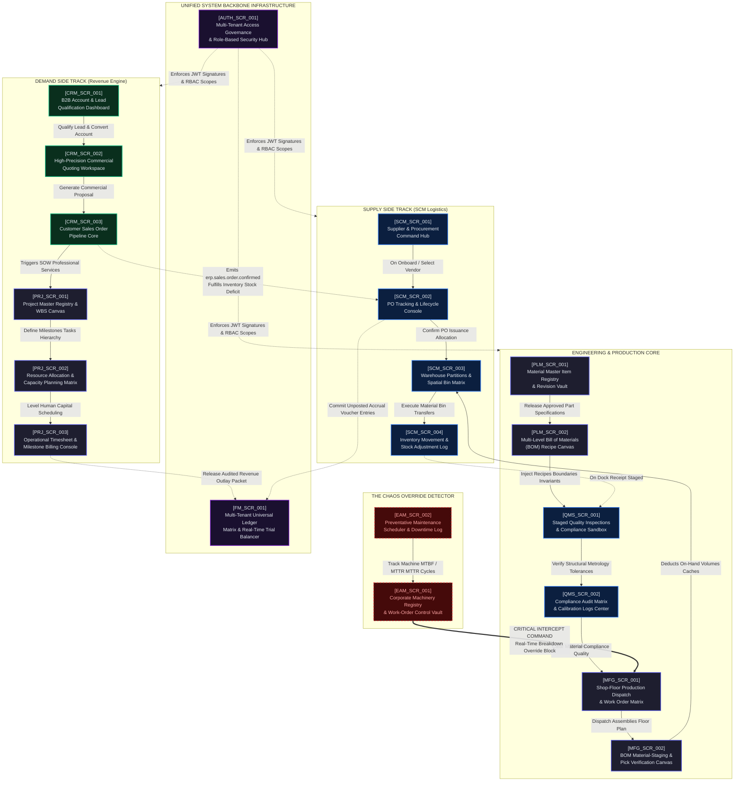

```mermaid
graph TD
    %% Define Theme Styles & Palettes
    classDef supply fill:#0B1F3F,stroke:#3B82F6,stroke-width:2px,color:#E2E8F0;
    classDef demand fill:#0A2F1D,stroke:#10B981,stroke-width:2px,color:#E2E8F0;
    classDef engineering fill:#1E1E2F,stroke:#6366F1,stroke-width:2px,color:#E2E8F0;
    classDef infrastructure fill:#1A102F,stroke:#7E22CE,stroke-width:2px,color:#E2E8F0;
    classDef critical fill:#450A0A,stroke:#EF4444,stroke-width:2px,color:#FCA5A5,stroke-dasharray: 5 5;

    %% --- TRACK 1: SUPPLY SIDE TRACK (SCM MODULE) ---
    subgraph Supply_Side ["SUPPLY SIDE TRACK (SCM Logistics)"]
        SCM1["[SCM_SCR_001]<br>Supplier & Procurement<br>Command Hub"]
        SCM2["[SCM_SCR_002]<br>PO Tracking & Lifecycle<br>Console"]
        SCM3["[SCM_SCR_003]<br>Warehouse Partitions &<br>Spatial Bin Matrix"]
        SCM4["[SCM_SCR_004]<br>Inventory Movement &<br>Stock Adjustment Log"]
    end
    class SCM1,SCM2,SCM3,SCM4 supply;

    SCM1 -->|On Onboard / Select Vendor| SCM2
    SCM2 -->|Confirm PO Issuance Allocation| SCM3
    SCM3 -->|Execute Material Bin Transfers| SCM4

    %% --- TRACK 2: DEMAND SIDE TRACK (CRM & PRJ MODULES) ---
    subgraph Demand_Side ["DEMAND SIDE TRACK (Revenue Engine)"]
        CRM1["[CRM_SCR_001]<br>B2B Account & Lead<br>Qualification Dashboard"]
        CRM2["[CRM_SCR_002]<br>High-Precision Commercial<br>Quoting Workspace"]
        CRM3["[CRM_SCR_003]<br>Customer Sales Order<br>Pipeline Core"]
        
        PRJ1["[PRJ_SCR_001]<br>Project Master Registry &<br>WBS Canvas"]
        PRJ2["[PRJ_SCR_002]<br>Resource Allocation &<br>Capacity Planning Matrix"]
        PRJ3["[PRJ_SCR_003]<br>Operational Timesheet &<br>Milestone Billing Console"]
    end
    class CRM1,CRM2,CRM3 demand;
    class PRJ1,PRJ2,PRJ3 engineering;

    CRM1 -->|Qualify Lead & Convert Account| CRM2
    CRM2 -->|Generate Commercial Proposal| CRM3
    
    %% Cross-Domain Demand Triggers
    CRM3 -.->|Emits erp.sales.order.confirmed<br>Fulfills Inventory Stock Deficit| SCM2
    CRM3 -->|Triggers SOW Professional Services| PRJ1
    
    PRJ1 -->|Define Milestones Tasks Hierarchy| PRJ2
    PRJ2 -->|Level Human Capital Scheduling| PRJ3

    %% --- TRACK 3: ENGINEERING & PRODUCT ENGINE TRACK (PLM, QMS, MFG) ---
    subgraph Product_Engine ["ENGINEERING & PRODUCTION CORE"]
        PLM1["[PLM_SCR_001]<br>Material Master Item Registry<br>& Revision Vault"]
        PLM2["[PLM_SCR_002]<br>Multi-Level Bill of Materials<br>(BOM) Recipe Canvas"]
        
        QMS1["[QMS_SCR_001]<br>Staged Quality Inspections<br>& Compliance Sandbox"]
        QMS2["[QMS_SCR_002]<br>Compliance Audit Matrix<br>& Calibration Logs Center"]
        
        MFG1["[MFG_SCR_001]<br>Shop-Floor Production Dispatch<br>& Work Order Matrix"]
        MFG2["[MFG_SCR_002]<br>BOM Material-Staging &<br>Pick Verification Canvas"]
    end
    class PLM1,PLM2,MFG1,MFG2 engineering;
    class QMS1,QMS2 supply;

    PLM1 -->|Release Approved Part Specifications| PLM2
    PLM2 -->|Inject Recipes Boundaries Invariants| QMS1
    QMS1 -->|Verify Structural Metrology Tolerances| QMS2
    QMS2 -->|Clear Material Compliance Quality| MFG1
    MFG1 -->|Dispatch Assemblies Floor Plan| MFG2
    
    %% Cross-Domain Fulfillment and Pick Loops
    SCM4 -.->|On Dock Receipt Staged| QMS1
    MFG2 -->|Deducts On-Hand Volumes Caches| SCM3

    %% --- THE EMERGENCY CRITICAL INTERCEPT (EAM MODULE) ---
    subgraph Incident_Control ["THE CHAOS OVERRIDE DETECTOR"]
        EAM1["[EAM_SCR_001]<br>Corporate Machinery Registry<br>& Work-Order Control Vault"]
        EAM2["[EAM_SCR_002]<br>Preventative Maintenance<br>Scheduler & Downtime Log"]
    end
    class EAM1,EAM2 critical;
    
    EAM2 -->|Track Machine MTBF / MTTR MTTR Cycles| EAM1
    
    %% The Critical Intercept Signal
    EAM1 ==>|CRITICAL INTERCEPT COMMAND<br>Real-Time Breakdown Override Block| MFG1

    %% --- TRACK 4: UNIFIED SYSTEM BACKBONE INFRASTRUCTURE (AUTH & FM) ---
    subgraph Backbone ["UNIFIED SYSTEM BACKBONE INFRASTRUCTURE"]
        AUTH1["[AUTH_SCR_001]<br>Multi-Tenant Access Governance<br>& Role-Based Security Hub"]
        FM1["[FM_SCR_001]<br>Multi-Tenant Universal Ledger<br>Matrix & Real-Time Trial Balancer"]
    end
    class AUTH1,FM1 infrastructure;

    %% Infrastructure Cross-Cutting Ties
    AUTH1 -.->|Enforces JWT Signatures & RBAC Scopes| Supply_Side
    AUTH1 -.->|Enforces JWT Signatures & RBAC Scopes| Demand_Side
    AUTH1 -.->|Enforces JWT Signatures & RBAC Scopes| Product_Engine
    
    PRJ3 -.->|Release Audited Revenue Outlay Packet| FM1
    SCM2 -.->|Commit Unposted Accrual Voucher Entries| FM1

```