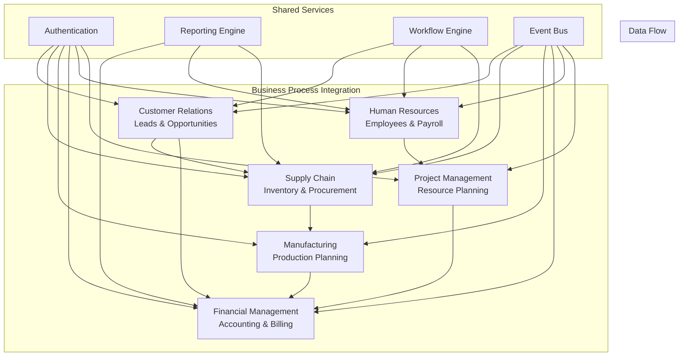
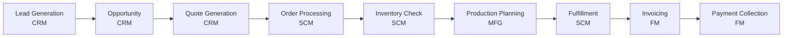
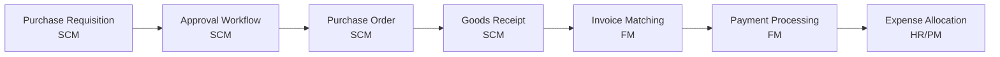
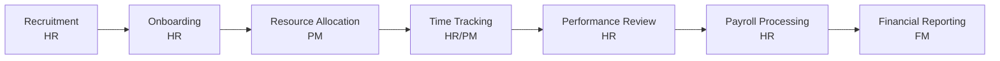
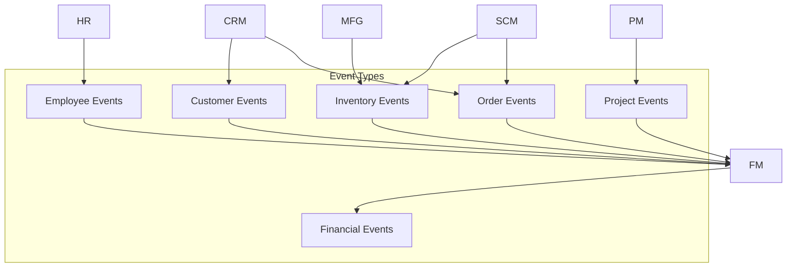
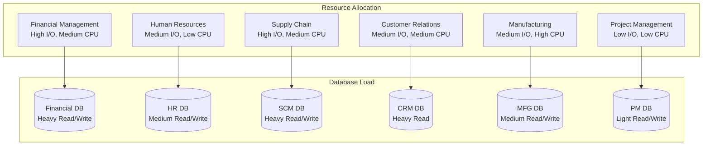

# Business Modules

Complete guide to all business functionality and features in the ERP system, organized by module with detailed visualizations and workflows.

## Core Business Modules

The ERP system provides six integrated business modules, each with its own comprehensive documentation:

### 📊 [Financial Management](financial-management/)
Complete accounting and financial operations
- General ledger and chart of accounts
- Accounts payable and receivable
- Journal entries and financial reporting
- Multi-currency support and budgeting

### 👥 [Human Resources](human-resources/)
Employee lifecycle and workforce management
- Employee information and organizational structure
- Payroll processing and tax calculations
- Time tracking and benefits administration
- Performance management and recruitment

### 📦 [Supply Chain Management](supply-chain-management/)
Inventory and procurement operations
- Multi-location inventory tracking
- Purchase order and supplier management
- Warehouse operations and logistics
- Demand planning and forecasting

### 🤝 [Customer Relationship Management](customer-relationship-management/)
Customer lifecycle and sales management
- Lead management and qualification
- Opportunity tracking and pipeline management
- Customer account and relationship management
- Marketing campaigns and customer support

### 🏭 [Manufacturing](manufacturing/)
Production planning and execution
- Bill of materials and product structure
- Production planning and scheduling
- Work order processing and tracking
- Quality control and shop floor operations

### 📋 [Project Management](project-management/)
Project planning and resource management
- Project planning with work breakdown structures
- Resource allocation and capacity management
- Time tracking and project billing
- Budget management and profitability analysis

## Module Integration Overview



## Key Business Process Flows

### Order-to-Cash Process


### Procure-to-Pay Process


### Hire-to-Retire Process


## Module Dependencies and Integration

### Data Sharing Matrix
| Module | Shares With | Data Shared |
|--------|-------------|-------------|
| **CRM** | Financial | Customer data, invoicing, payments |
| **CRM** | Project | Customer projects, billing rates |
| **SCM** | Financial | Purchase orders, inventory valuation |
| **SCM** | Manufacturing | Material requirements, inventory |
| **HR** | Financial | Payroll expenses, employee costs |
| **HR** | Project | Resource allocation, time tracking |
| **Manufacturing** | Financial | Production costs, inventory movements |
| **Manufacturing** | SCM | Material consumption, finished goods |
| **Project** | Financial | Project costs, client invoicing |

### Real-time Integration Events
Each module publishes and subscribes to domain events:



## API Access Patterns

Each module exposes REST APIs following consistent patterns:

### Base URL Structure
```
/api/v1/{module}/{resource}
```

### Common Endpoints
| Method | Pattern | Description |
|--------|---------|-------------|
| GET | `/{resource}` | List resources with pagination |
| POST | `/{resource}` | Create new resource |
| GET | `/{resource}/{id}` | Get specific resource |
| PUT | `/{resource}/{id}` | Update resource |
| DELETE | `/{resource}/{id}` | Delete resource |
| GET | `/{resource}/{id}/history` | Get audit history |

### Module-Specific API Routes
- **Financial**: `/api/v1/finance/*`
- **HR**: `/api/v1/hr/*`
- **SCM**: `/api/v1/scm/*`
- **CRM**: `/api/v1/crm/*`
- **Manufacturing**: `/api/v1/manufacturing/*`
- **Projects**: `/api/v1/projects/*`

## Performance and Scalability

### Module Resource Requirements


## Next Steps

Explore detailed documentation for each module:

### For Business Users
1. Start with [CRM](customer-relationship-management/) for sales processes
2. Review [Financial Management](financial-management/) for accounting
3. Explore [HR](human-resources/) for employee management

### For Developers  
1. Understand [Financial Management](financial-management/) architecture
2. Review [SCM](supply-chain-management/) integration patterns
3. Study [Manufacturing](manufacturing/) workflow automation

### For System Administrators
1. Review [HR](human-resources/) security requirements
2. Understand [Project Management](project-management/) resource needs
3. Plan [CRM](customer-relationship-management/) scaling strategies

## Related Documentation

- [🏗️ System Architecture](../architecture/README.md) - Technical implementation details
- [🔧 Operations](../operations/README.md) - API reference and deployment
- [📚 Getting Started](../getting-started/README.md) - Setup and configuration