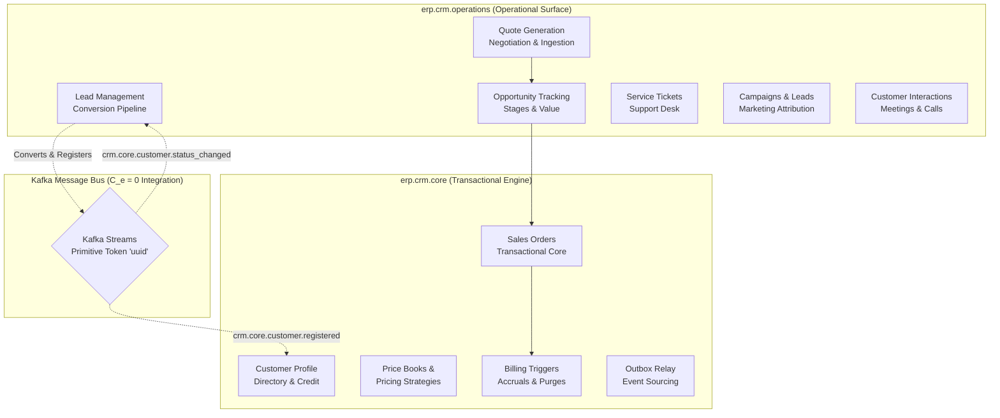
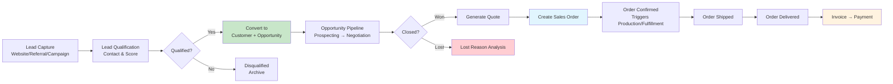

# Customer Relationship Management Module

Customer accounts, lead management, opportunity pipeline, sales orders, quotes, service tickets, campaigns, and price lists. Port **8002** (docker-compose: 8002).

## Module Overview

The CRM Service is architected into two distinct, decoupled domain packages to isolate transactional core business operations from operational and marketing functions, ensuring zero direct dependency coupling ($C_e = 0$) across namespaces:

1. **`erp.crm.core`**: The high-throughput, transactional execution engine that processes customer directories, versioned price books, pricing strategy modifiers, sales orders, and billing triggers.
2. **`erp.crm.operations`**: The operational CRM surface handling lead ingestion, pipelines, opportunity scoring, customer support tickets, campaign attribution, and quoting.



## Documentation Structure

### Features Covered in This Document

This README documents the following CRM features inline:
- **Customer Directory & Profiling** — Accounts, credit limits, and manager assignments
- **Price Books & Strategy Evaluation** — Volume breaks, temporal discounts, and contract Markups
- **Sales Order Life-Cycle** — Drafts, state transitions, validation, and confirmation
- **Billing Accrual & Purging** — Integration and handoff to Accounts Receivable (FM)
- **Outbox Relay & Event Sourcing** — Reliable transaction replication to Kafka
- **Marketing Campaign Ingestion** — Campaigns, leads, opportunity stages, and conversions
- **Customer Interactions & Support** — Meeting summaries, ticket resolutions, and quotes

---

## Domain Models

### 1. Transactional Core Engine (`erp.crm.core`)

| Model | CDD Table Reference | Description |
|-------|---------------------|-------------|
| `CustomerProfile` | `crm_customers` | Master customer account with credit limits, currency, and manager assignments. Includes optional contact info. |
| `PriceBookHeader` | `crm_price_books` | Header representing a pricing policy (Standard, Regional, etc.) with active dates. |
| `PriceBookEntry` | `crm_price_book_entries` | Map of unit list prices and quantity thresholds for materials within a price book. |
| `PricingStrategy` | `crm_pricing_strategies` | Zero-drift historical audit rules (flat markups, tiered breaks) applied dynamically. |
| `SalesOrder` | `crm_sales_orders` | Sales transactions containing total valuation, tax, and tracking state. |
| `SalesOrderLine` | `crm_sales_order_lines` | Detail line items representing quantity ordered/shipped, material IDs, and net amounts. |
| `BillingTrigger` | `crm_billing_triggers` | Monthly partitioned records staging revenue recognition inputs for Accounts Receivable. |
| `TransactionalOutbox` | `crm_transactional_outbox` | Outbox pattern message store ensuring at-least-once message delivery to Kafka. |
| `KafkaEventInbox` | `crm_kafka_event_inbox` | Idempotency log tracking processed Kafka message IDs and execution statuses. |

### 2. Operational CRM Surface (`erp.crm.operations`)

| Model | CDD Table Reference | Description |
|-------|---------------------|-------------|
| `Campaign` | `crm_campaigns` | Marketing campaigns tracking name, type, budget, and schedules. |
| `Lead` | `crm_leads` | Contact profiles representing qualified or unqualified prospective clients. |
| `Opportunity` | `crm_opportunities` | Pipeline tracker for potential deals detailing expected values and stage probabilities. |
| `CustomerInteraction` | `crm_customer_interactions` | Narrative log of customer meetings, phone calls, and email correspondence. |
| `ServiceTicket` | `crm_service_tickets` | Support desk request tickets tracking assignment, priority, and resolution states. |
| `Quote` | `crm_quotes` | Customer pricing proposals capturing overall valuation and validation duration. |
| `QuoteLineItem` | `crm_quote_line_items` | Individual line entries detailing material SKU quotes and pricing. |

---

## Business Services

### Package 1: Transactional Core Services (`erp.crm.core`)

#### CustomerAccountService
- `createProfile`: Provision a new customer profile under a legal entity with an manager employee ID.
- `updateCreditStatus`: Modify customer accounts (Active, Credit Hold, etc.) based on credit reviews.

#### PricingCalculationService
- `createPriceBook`: Define a new pricing matrix list header.
- `assignMaterialPrice`: Set baseline list price overrides for items in a price book.
- `registerStrategyModifier`: Apply modifier percentages or configuration tier rules to a strategy.
- `resolveItemUnitPrice`: Compute net line prices based on customer profiles and tiered pricing rules.

#### SalesOrderService
- `instantiateDraftOrder`: Create a draft order with line-item validation.
- `processOrderStateTransition`: Drive state machine changes (Draft → Pending Check → Approved → Shipped → Delivered).

#### RevenueBillingService
- `stageLogisticsBillingEntry`: Stage accrued billing amounts derived from SCM shipping documents.
- `dispatchStagedBillingToAccountsReceivable`: Batch transmit completed billing triggers to FM.
- `purgeProcessedBillingTriggers`: Clean up old database records using a monthly partition purge.

#### OutboxRelayWorker / ReliableMessagingService
- `getUnsentMessages`: Poll transactional outbox for pending payloads.
- `logProcessingAttempt` / `updateOutboxStatus`: Track delivery retries and success events.
- `executeIdempotentTransaction`: Process incoming event streams inside a transaction log.

---

### Package 2: Operational CRM Services (`erp.crm.operations`)

#### CampaignService
- `createCampaign` / `getCampaign` / `listCampaigns` / `updateCampaign` / `deleteCampaign`: Manage campaign lifecycles.

#### LeadService
- `createLead` / `getLead` / `listLeads` / `updateLead` / `deleteLead`: Perform typical lead maintenance.
- `convertLead`: Execute the lead conversion routine. Emits a registration signal to trigger downstream customer and opportunity profiles.

#### OpportunityService
- `createOpportunity` / `getOpportunity` / `listOpportunities` / `updateOpportunity` / `deleteOpportunity`: Maintain opportunities.

#### QuoteService
- `createQuote` / `getQuote` / `listQuotes` / `updateQuote` / `deleteQuote`: Handle customer quotes and items.
- `sendQuote`: Transition quote status to `SENT` and dispatch events.

#### TicketService
- `createTicket` / `getTicket` / `listTickets` / `updateTicket` / `deleteTicket`: Support ticket lifecycle operations.

#### CustomerInteractionService
- `createInteraction` / `getInteraction` / `listInteractions` / `deleteInteraction`: Manage communication logs.

---

## API Endpoints (35 routes)

### Customers
```http
GET    /api/v1/customers              # List all customers
POST   /api/v1/customers              # Create customer
GET    /api/v1/customers/:id          # Get customer by ID
PUT    /api/v1/customers/:id          # Update customer
DELETE /api/v1/customers/:id          # Delete customer
```

### Leads
```http
GET    /api/v1/leads                  # List all leads
POST   /api/v1/leads                  # Create lead
GET    /api/v1/leads/:id              # Get lead by ID
PUT    /api/v1/leads/:id              # Update lead
DELETE /api/v1/leads/:id              # Delete lead
POST   /api/v1/leads/:id/convert      # Convert lead to customer + opportunity
```

### Opportunities
```http
GET    /api/v1/opportunities          # List all opportunities
POST   /api/v1/opportunities          # Create opportunity
GET    /api/v1/opportunities/:id      # Get opportunity by ID
PUT    /api/v1/opportunities/:id      # Update opportunity
DELETE /api/v1/opportunities/:id      # Delete opportunity
```

### Sales Orders
```http
GET    /api/v1/sales-orders           # List all sales orders
POST   /api/v1/sales-orders           # Create sales order
GET    /api/v1/sales-orders/:id       # Get sales order by ID
PUT    /api/v1/sales-orders/:id       # Update sales order
DELETE /api/v1/sales-orders/:id       # Delete sales order
```

### Quotes
```http
GET    /api/v1/quotes                 # List all quotes
POST   /api/v1/quotes                 # Create quote
GET    /api/v1/quotes/:id             # Get quote by ID
PUT    /api/v1/quotes/:id             # Update quote
DELETE /api/v1/quotes/:id             # Delete quote
POST   /api/v1/quotes/:id/send        # Send quote to customer
```

### Service Tickets
```http
GET    /api/v1/service-tickets        # List all tickets
POST   /api/v1/service-tickets        # Create service ticket
GET    /api/v1/service-tickets/:id    # Get ticket by ID
PUT    /api/v1/service-tickets/:id    # Update ticket
DELETE /api/v1/service-tickets/:id    # Delete ticket
```

### Campaigns
```http
GET    /api/v1/campaigns              # List all campaigns
POST   /api/v1/campaigns              # Create campaign
GET    /api/v1/campaigns/:id          # Get campaign by ID
PUT    /api/v1/campaigns/:id          # Update campaign
DELETE /api/v1/campaigns/:id          # Delete campaign
```

### Price Lists
```http
GET    /api/v1/price-lists            # List all price lists
POST   /api/v1/price-lists            # Create price list
GET    /api/v1/price-lists/:id        # Get price list by ID
PUT    /api/v1/price-lists/:id        # Update price list
DELETE /api/v1/price-lists/:id        # Delete price list
```

---

## Sales Pipeline Flow

### Lead-to-Cash Process


---

## Kafka Integration

The service decoupling requires all cross-boundary communications between `erp.crm.core` and `erp.crm.operations` (as well as external services) to be processed asynchronously over Kafka streams using primitive identifiers (`uuid`) to guarantee $C_e = 0$.

### Events Published (32 topics, per CDD)

* **Orders & Billing:**
  - `crm.order.confirmed`
  - `crm.order.cancelled`
  - `crm.billing.accrued`
  - `crm.sales.order.created`
  - `crm.sales.order.updated`
  - `crm.sales.order.confirmed`
  - `crm.sales.order.cancelled`
  - `crm.sales.order.shipped`
  - `crm.sales.order.delivered`
  - `crm.sales.order.received`
* **Customers & Profiles:**
  - `crm.customer.created`
  - `crm.customer.updated`
  - `crm.customer.activated`
  - `crm.customer.deactivated`
* **Leads & Opportunities:**
  - `crm.lead.created`
  - `crm.lead.qualified`
  - `crm.lead.converted`
  - `crm.lead.lost`
  - `crm.opportunity.created`
  - `crm.opportunity.updated`
  - `crm.opportunity.won`
  - `crm.opportunity.lost`
* **Marketing & Interactions:**
  - `crm.campaign.launched`
  - `crm.campaign.completed`
  - `crm.customer.interaction.logged`
  - `crm.email.sent`
  - `crm.email.opened`
  - `crm.email.clicked`
* **Service Tickets:**
  - `crm.service.ticket.created`
  - `crm.service.ticket.updated`
  - `crm.service.ticket.resolved`
  - `crm.service.ticket.escalated`

### Events Consumed (12 topics, per CDD)

| Topic | Publisher | Integration / Logic |
|-------|-----------|--------------------|
| `plm.material.released` | PLM | Update material catalogs |
| `scm.order.shipped` | SCM | Mark sales order as SHIPPED |
| `prj.milestone.achieved` | PM | Trigger billing for project milestones |
| `scm.inventory.available` | SCM | Logged only |
| `scm.shipment.delivered` | SCM | Update sales order status to DELIVERED |
| `fm.payment.received` | FM | Mark associated transactions as paid |
| `fm.credit.check.completed` | FM | Trigger credit-hold resolution flows |
| `mfg.production.completed` | MFG | Logged only |
| `prj.project.completed` | PM | Trigger final order reconciliations |
| `hr.employee.performance` | HR | Logged only |
| `crm.core.customer.registered` | Core | Synchronize profile mutations safely |
| `crm.core.customer.status_changed`| Core | Inform operational status views of credit holds |

---

## Seed Data

On startup, the service seeds mock data for development:
- **Customers**: Acme Corporation (Active)
- **Leads**: John Doe from Initech (score 10, New), Jane Smith from Umbrella Corp (score 10, Contacted)
- **Opportunities**: "Enterprise Software Deal" for Acme Corp ($50,000, Stage: Prospecting, 10% probability)

---

## Relation to Other Modules

| Module | Integration | Direction | Topic |
|--------|-------------|-----------|-------|
| **Manufacturing** | Sales order triggers production | Outbound | `crm.sales.order.created` |
| **SCM** | Demand forecast data | Outbound | `crm.customer.demand.forecast` |
| **SCM** | Order fulfillment trigger | Outbound | `crm.sales.order.created` |
| **PM** | Sales order creates project | Outbound | `crm.sales.order.received` |
| **FM** | Completed sale creates revenue entry | Outbound | `crm.sale.completed` |
