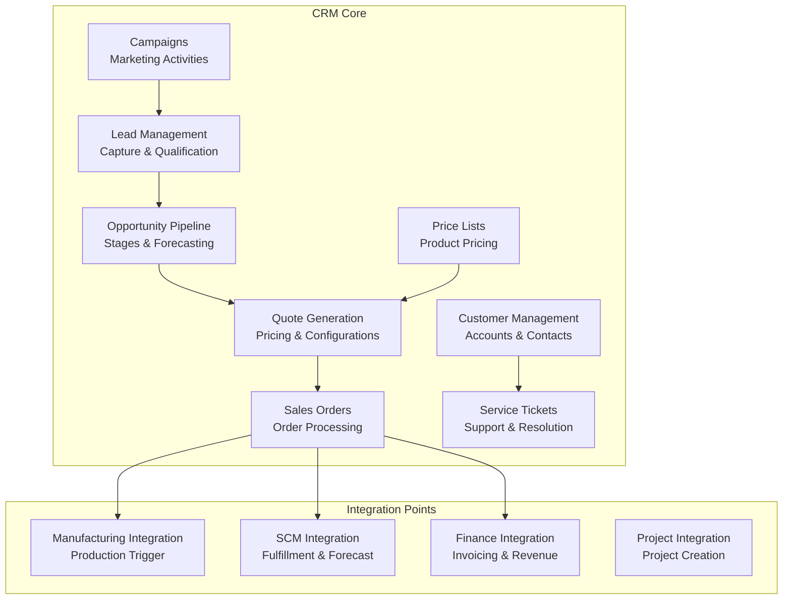
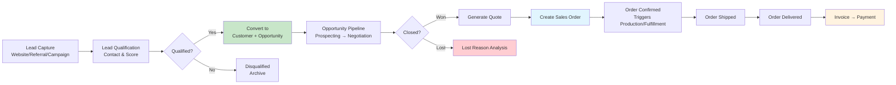

# Customer Relationship Management Module

Customer accounts, lead management, opportunity pipeline, sales orders, quotes, service tickets, campaigns, and price lists. Port **8002** (docker-compose: 8002).

## Module Overview



## Documentation Structure

### Features Covered in This Document

This README documents the following CRM features inline:
- Customer Management — Accounts, contacts, and segmentation
- Lead Management — Capture, qualification, and conversion
- Opportunity Management — Pipeline and forecasting
- Quote Management — Pricing and configuration
- Sales Orders — Order processing and lifecycle
- Service Tickets — Customer support and resolution
- Campaigns — Marketing activities
- Price Lists — Product pricing configuration

## Domain Models (11 types)

| Model | Key Fields | Description |
|-------|-----------|-------------|
| `Customer` | ID, Name, Email, Phone, Status (Active/Inactive/Lead), CreditLimit, BillingAddress, ShippingAddress, ParentCustomerID | Business customer account |
| `Lead` | ID, FirstName, LastName, Email, Phone, CompanyName, Source (Website/Referral/ColdCall/Campaign/Other), Status (New/Contacted/Qualified/Disqualified/Converted), Score | Sales prospect |
| `Opportunity` | ID, CustomerID, Title, Amount, Stage (Prospecting/Qualification/NeedsAnalysis/Proposal/Negotiation/ClosedWon/ClosedLost), Probability, ExpectedCloseDate | Sales opportunity |
| `SalesOrder` | ID, CustomerID, OrderDate, TotalAmount, Status (Draft/Pending/Confirmed/Shipped/Delivered/Cancelled), Items[] | Customer sales order |
| `SalesOrderItem` | ProductID, ProductName, Quantity, UnitPrice, Discount, Total | Line item on sales order |
| `Quote` | ID, CustomerID, ValidUntil, TotalAmount, Status (Draft/Sent/Accepted/Rejected/Expired), Items[] | Customer price quote |
| `QuoteLineItem` | ProductID, ProductName, Quantity, UnitPrice, Discount, Total | Line item on quote |
| `ServiceTicket` | ID, CustomerID, Subject, Description, Priority (Low/Medium/High/Critical), Status (Open/InProgress/Resolved/Closed), AssignedTo | Customer support ticket |
| `Campaign` | ID, Name, Type (Email/Social/Event/DirectMail/Other), StartDate, EndDate, Budget, Status (Draft/Active/Paused/Completed/Cancelled) | Marketing campaign |
| `PriceList` | ID, Name, Currency, Description | Product pricing list |
| `PriceListItem` | PriceListID, ProductID, ProductName, UnitPrice, MinQuantity | Price entry in list |

## Business Services (8)

### CustomerService

| Method | Description | Side Effects |
|--------|-------------|-------------|
| `Create` | Create customer with ACTIVE status | Publishes `crm.customer.created` |
| `GetByID` | Get customer by ID | — |
| `GetAll` | List all customers | — |
| `Update` | Update customer, publish activation event if status changes to ACTIVE | Publishes `crm.customer.activated` |
| `Delete` | Delete customer | — |

### LeadService

| Method | Description | Side Effects |
|--------|-------------|-------------|
| `Create` | Create lead with NEW status, score 10 | — |
| `GetByID` | Get lead by ID | — |
| `GetAll` | List all leads | — |
| `Update` | Update lead, publish qualified/disqualified events | Publishes `crm.lead.qualified` or `crm.lead.disqualified` |
| `Delete` | Delete lead | — |
| `ConvertLead` | Convert lead → customer + opportunity in one operation | Publishes `crm.lead.converted`, `crm.customer.created`, `crm.opportunity.created` |

### OpportunityService

| Method | Description | Side Effects |
|--------|-------------|-------------|
| `Create` | Create opportunity with 10% probability | — |
| `GetByID` | Get opportunity by ID | — |
| `GetAll` | List all opportunities | — |
| `Update` | Update opportunity, publish won/lost events on status change | Publishes `crm.opportunity.won` or `crm.opportunity.lost` |
| `Delete` | Delete opportunity | — |

### SalesOrderService

| Method | Description | Side Effects |
|--------|-------------|-------------|
| `Create` | Create order with item subtotals | Publishes `crm.sales.order.created` |
| `GetByID` | Get order by ID | — |
| `GetAll` | List all orders | — |
| `Update` | Update order, publish status events | Publishes `crm.sales.order.confirmed`, `crm.sales.order.shipped`, `crm.sales.order.delivered`, or `crm.sales.order.cancelled` |
| `Delete` | Delete order | — |

### QuoteService

| Method | Description | Side Effects |
|--------|-------------|-------------|
| `Create` | Create quote with total from line items | — |
| `GetByID` | Get quote by ID | — |
| `GetAll` | List all quotes | — |
| `Update` | Update quote | — |
| `Delete` | Delete quote | — |
| `SendQuote` | Set status SENT | Publishes `crm.quote.sent` |

### ServiceTicketService

| Method | Description | Side Effects |
|--------|-------------|-------------|
| `Create` | Create ticket with OPEN status | Publishes `crm.ticket.created` |
| `GetByID` | Get ticket by ID | — |
| `GetAll` | List all tickets | — |
| `Update` | Update ticket, publish resolved/escalated events | Publishes `crm.ticket.updated`, `crm.ticket.resolved`, or `crm.ticket.escalated` |
| `Delete` | Delete ticket | — |

### CampaignService

| Method | Description | Side Effects |
|--------|-------------|-------------|
| `Create` | Create campaign with DRAFT status | — |
| `GetByID` | Get campaign by ID | — |
| `GetAll` | List all campaigns | — |
| `Update` | Update campaign, publish launched/completed events | Publishes `crm.campaign.launched` or `crm.campaign.completed` |
| `Delete` | Delete campaign | — |

### PriceListService

| Method | Description |
|--------|-------------|
| `Create` | Create price list with items |
| `GetByID` | Get price list by ID |
| `GetAll` | List all price lists |
| `Update` | Update price list |
| `Delete` | Delete price list |

## API Endpoints (35 routes)

### Customers
```http
GET    /api/v1/customers              # List all customers
POST   /api/v1/customers              # Create customer
GET    /api/v1/customers/:id          # Get customer by ID
PUT    /api/v1/customers/:id          # Update customer
DELETE /api/v1/customers/:id          # Delete customer
```

### Leads
```http
GET    /api/v1/leads                  # List all leads
POST   /api/v1/leads                  # Create lead
GET    /api/v1/leads/:id              # Get lead by ID
PUT    /api/v1/leads/:id              # Update lead
DELETE /api/v1/leads/:id              # Delete lead
POST   /api/v1/leads/:id/convert      # Convert lead to customer + opportunity
```

### Opportunities
```http
GET    /api/v1/opportunities          # List all opportunities
POST   /api/v1/opportunities          # Create opportunity
GET    /api/v1/opportunities/:id      # Get opportunity by ID
PUT    /api/v1/opportunities/:id      # Update opportunity
DELETE /api/v1/opportunities/:id      # Delete opportunity
```

### Sales Orders
```http
GET    /api/v1/sales-orders           # List all sales orders
POST   /api/v1/sales-orders           # Create sales order
GET    /api/v1/sales-orders/:id       # Get sales order by ID
PUT    /api/v1/sales-orders/:id       # Update sales order
DELETE /api/v1/sales-orders/:id       # Delete sales order
```

### Quotes
```http
GET    /api/v1/quotes                 # List all quotes
POST   /api/v1/quotes                 # Create quote
GET    /api/v1/quotes/:id             # Get quote by ID
PUT    /api/v1/quotes/:id             # Update quote
DELETE /api/v1/quotes/:id             # Delete quote
POST   /api/v1/quotes/:id/send        # Send quote to customer
```

### Service Tickets
```http
GET    /api/v1/service-tickets        # List all tickets
POST   /api/v1/service-tickets        # Create service ticket
GET    /api/v1/service-tickets/:id    # Get ticket by ID
PUT    /api/v1/service-tickets/:id    # Update ticket
DELETE /api/v1/service-tickets/:id    # Delete ticket
```

### Campaigns
```http
GET    /api/v1/campaigns              # List all campaigns
POST   /api/v1/campaigns              # Create campaign
GET    /api/v1/campaigns/:id          # Get campaign by ID
PUT    /api/v1/campaigns/:id          # Update campaign
DELETE /api/v1/campaigns/:id          # Delete campaign
```

### Price Lists
```http
GET    /api/v1/price-lists            # List all price lists
POST   /api/v1/price-lists            # Create price list
GET    /api/v1/price-lists/:id        # Get price list by ID
PUT    /api/v1/price-lists/:id        # Update price list
DELETE /api/v1/price-lists/:id        # Delete price list
```

## Sales Pipeline Flow

### Lead-to-Cash Process


## Kafka Integration

### Events Published (28 topics, per CDD)

**Customer:** `crm.customer.created`, `crm.customer.updated`, `crm.customer.activated`, `crm.customer.deactivated`
**Lead:** `crm.lead.created`, `crm.lead.qualified`, `crm.lead.converted`, `crm.lead.lost`
**Opportunity:** `crm.opportunity.created`, `crm.opportunity.updated`, `crm.opportunity.won`, `crm.opportunity.lost`
**Sales Orders:** `crm.sales.order.created`, `crm.sales.order.updated`, `crm.sales.order.confirmed`, `crm.sales.order.shipped`, `crm.sales.order.delivered`, `crm.sales.order.cancelled`, `crm.sales.order.received`
**Service Tickets:** `crm.service.ticket.created`, `crm.service.ticket.updated`, `crm.service.ticket.resolved`, `crm.service.ticket.escalated`
**Campaigns:** `crm.campaign.launched`, `crm.campaign.completed`
**Email:** `crm.email.sent`, `crm.email.opened`, `crm.email.clicked`

### Events Consumed (7 topics, per CDD)

| Topic | Publisher | Logic |
|-------|-----------|-------|
| `scm.inventory.available` | SCM | Logged only |
| `scm.shipment.delivered` | SCM | Update sales order to DELIVERED |
| `fin.payment.received` | FM | Logged only |
| `fin.credit.check.completed` | FM | Logged only |
| `mfg.production.completed` | MFG | Logged only |
| `prj.project.completed` | PM | Logged only |
| `hr.employee.performance` | HR | Logged only |

## Seed Data

On startup, the service seeds mock data for development:

| Entity | Records | Key Details |
|--------|---------|-------------|
| **Customers** | 1 | Acme Corporation (Active) |
| **Leads** | 2 | John Doe from Initech (score 10, New), Jane Smith from Umbrella Corp (score 10, Contacted) |
| **Opportunities** | 1 | "Enterprise Software Deal" for Acme Corp ($50,000, Stage: Prospecting, 10% probability) |

## Relation to Other Modules

| Module | Integration | Direction | Topic |
|--------|-------------|-----------|-------|
| **Manufacturing** | Sales order triggers production | Outbound | `crm.sales.order.created` |
| **SCM** | Demand forecast data | Outbound | `crm.customer.demand.forecast` |
| **SCM** | Order fulfillment trigger | Outbound | `crm.sales.order.created` |
| **PM** | Sales order creates project | Outbound | `crm.sales.order.received` |
| **FM** | Completed sale creates revenue entry | Outbound | `crm.sale.completed` |

## Known Limitations

- **Lead conversion is a stub** — `ConvertLead` creates a customer with a hardcoded name and an opportunity, no real data mapping from lead fields
- **No email integration** — `SendQuote` sets status to SENT but performs no actual email delivery
- **No campaign execution** — campaigns are CRUD only with no actual email, social, or event execution
- **No product catalog** — `SalesOrderItem` and `PriceListItem` reference `ProductName` as a string, no link to SCM product catalog
- **No order-to-cash automation** — the `crm.sales.order.created` → `crm.sale.completed` pipeline is manual
- **No customer portal** — self-service access for customers does not exist
- **No service ticket SLA tracking** — priority levels exist but no SLA breach logic
