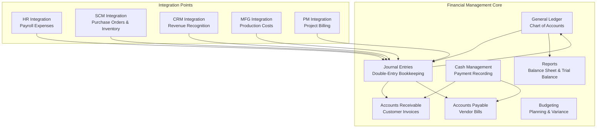

# Financial Management Module

General ledger, accounts receivable, accounts payable, cash management, budgeting, and financial reports. Port **8001**.

## Module Overview



## Documentation Structure

### Core Features
- [General Ledger](general-ledger.md) — Chart of accounts, journal entries, trial balance, balance sheet
- [API Reference](api-reference.md) — Complete REST API documentation with examples

### Planned Sub-docs (not yet written)
- `accounts-payable.md` — Vendor bill management
- `accounts-receivable.md` — Customer invoice management
- `budgeting.md` — Budget planning and variance analysis
- `financial-reporting.md` — Balance sheet, income statement, cash flow
- `integration-patterns.md` — Cross-module event flows

## Domain Models (17 types)

| Model | Key Fields | Description |
|-------|-----------|-------------|
| `Account` | ID, AccountNumber, Name, Type (ASSET/LIABILITY/EQUITY/REVENUE/EXPENSE), ParentID, Balance, Currency, IsActive | Chart of accounts entry |
| `JournalEntry` | ID, Reference, Date, Description, Status (POSTED/REVERSED), CreatedBy, ReversedBy | Double-entry transaction |
| `JournalEntryLine` | ID, EntryID, AccountID, DebitAmount, CreditAmount, Description | Line in a journal entry |
| `Invoice` | ID, CustomerID, IssueDate, DueDate, TotalAmount, Status, Lines[] | Customer invoice |
| `InvoiceLine` | Description, Quantity, UnitPrice, LineTotal | Line item on invoice |
| `Payment` | ID, InvoiceID, BillID, BankAccountID, Amount, PaymentMethod | Payment record |
| `VendorBill` | ID, VendorID, BillDate, DueDate, TotalAmount, Status, Lines[] | Vendor bill |
| `VendorBillLine` | Description, Quantity, UnitPrice, LineTotal | Line item on vendor bill |
| `Budget` | ID, Name, FiscalYear, TotalAmount, SpentAmount, Status | Budget plan |
| `FiscalYear` | ID, Name, StartDate, EndDate, IsClosed | Accounting period |
| `CostCenter` | ID, Code, Name, DepartmentID | Cost allocation unit |
| `TaxRate` | ID, Name, Rate, Type | Tax configuration |
| `CurrencyRate` | ID, FromCurrency, ToCurrency, Rate, EffectiveDate | Exchange rate (not used in logic) |
| `BankAccount` | ID, AccountNumber, BankName, Balance | Bank account |
| `BankStatement` | ID, BankAccountID, Period, StartingBalance, EndingBalance | Bank statement |
| `BankStatementLine` | ID, StatementID, Date, Description, Amount | Bank transaction |
| `CustomerCredit` | CustomerID, CreditLimit, CurrentBalance | Customer credit limit |

## Business Services (6)

### GeneralLedgerService

| Method | Description | Side Effects |
|--------|-------------|-------------|
| `CreateAccount` | Create account (req: number, name, type) | Publishes `fin.account.created` |
| `ListAccounts` | List all accounts | — |
| `GetAccount` | Get by ID | — |
| `GetAccountByNumber` | Get by account number | — |
| `UpdateAccount` | Update name, type, parent, active status | Publishes `fin.account.updated` |
| `DeleteAccount` | Delete account | — |
| `GetAccountBalance` | Get current balance | — |
| `ListJournalEntries` | List all entries | — |
| `CreateJournalEntry` | Create entry (min 2 lines, debits=credits validation, auto-balance update) | Publishes `fin.account.balance.changed` per line |
| `GetJournalEntry` | Get entry with lines | — |
| `UpdateJournalEntry` | Update ref, desc, lines | — |
| `DeleteJournalEntry` | Delete entry | — |
| `ReverseJournalEntry` | Create reversal with swapped debits/credits | Publishes events for reversal |
| `GetTrialBalance` | Group by debit-type vs credit-type | — |
| `GetBalanceSheet` | Group by ASSET/LIABILITY/EQUITY | — |

### AccountsReceivableService

| Method | Description |
|--------|-------------|
| `CreateInvoice` | Create invoice with auto-calculated line totals |
| `ListInvoices` | List all invoices |
| `GetInvoice` | Get invoice with lines |
| `UpdateInvoice` | Update invoice fields |
| `DeleteInvoice` | Delete invoice |
| `SendInvoice` | Toggle sent status |

### AccountsPayableService

| Method | Description |
|--------|-------------|
| `CreateVendorBill` | Create vendor bill |
| `ListVendorBills` | List all bills |
| `GetVendorBill` | Get bill with lines |

> **Note**: No routes are wired for vendor bills.

### CashManagementService

| Method | Description |
|--------|-------------|
| `RecordPayment` | Record payment against invoice or bill |
| `ListPayments` | List all payments |
| `GetPayment` | Get payment by ID |

### BudgetingService

| Method | Description |
|--------|-------------|
| `CreateBudget` | Create budget plan |
| `ListBudgets` | List all budgets |
| `GetBudget` | Get budget by ID |
| `UpdateBudget` | Update budget |
| `DeleteBudget` | Delete budget |
| `GetBudgetVariance` | Actual vs budget variance calculation |

### TaxService (defined in CDD, not wired)

| Method | Description |
|--------|-------------|
| `CreateTaxRate` | Create a tax rate |
| `ListTaxRates` | List all tax rates |
| `GetTaxRate` | Get tax rate by ID |

> **Status**: CDD-defined. Code exists in `internal/business/domain/tax_service.go` but NOT wired in `cmd/main.go`.

## API Endpoints (25 routes)

### Health
```http
GET /health
```

### Account Management
| Method | Path | Description |
|--------|------|-------------|
| GET | `/api/v1/accounts` | List all accounts |
| POST | `/api/v1/accounts` | Create account |
| GET | `/api/v1/accounts/:id` | Get account |
| PUT | `/api/v1/accounts/:id` | Update account |
| DELETE | `/api/v1/accounts/:id` | Delete account |
| GET | `/api/v1/accounts/:id/balance` | Get account balance |

### Journal Entries
| Method | Path | Description |
|--------|------|-------------|
| GET | `/api/v1/journal-entries` | List all entries |
| POST | `/api/v1/journal-entries` | Create entry |
| GET | `/api/v1/journal-entries/:id` | Get entry with lines |
| PUT | `/api/v1/journal-entries/:id` | Update entry |
| DELETE | `/api/v1/journal-entries/:id` | Delete entry |

### Invoices
| Method | Path | Description |
|--------|------|-------------|
| GET | `/api/v1/invoices` | List all invoices |
| POST | `/api/v1/invoices` | Create invoice |
| GET | `/api/v1/invoices/:id` | Get invoice with lines |
| PUT | `/api/v1/invoices/:id` | Update invoice |
| DELETE | `/api/v1/invoices/:id` | Delete invoice |
| POST | `/api/v1/invoices/:id/send` | Send invoice |

### Payments
| Method | Path | Description |
|--------|------|-------------|
| GET | `/api/v1/payments` | List all payments |
| POST | `/api/v1/payments` | Record payment |
| GET | `/api/v1/payments/:id` | Get payment |

### Reports
| Method | Path | Description | Status |
|--------|------|-------------|--------|
| GET | `/api/v1/reports/balance-sheet` | Balance sheet by account type | Real |
| GET | `/api/v1/reports/income-statement` | Income statement | Stub |
| GET | `/api/v1/reports/cash-flow` | Cash flow report | Stub |

## Kafka Integration

### Events Published (16 topics, per CDD)

| Topic | Trigger |
|-------|---------|
| `fin.account.created` | CreateAccount |
| `fin.account.updated` | UpdateAccount |
| `fin.account.balance.changed` | CreateJournalEntry (per line) |
| `fin.invoice.created` | CreateInvoice |
| `fin.invoice.updated` | UpdateInvoice |
| `fin.invoice.sent` | SendInvoice |
| `fin.invoice.paid` | Payment against invoice |
| `fin.invoice.overdue` | — |
| `fin.payment.received` | RecordPayment |
| `fin.payment.processed` | RecordPayment |
| `fin.payment.failed` | — |
| `fin.vendor.payment.due` | — |
| `fin.budget.created` | CreateBudget |
| `fin.budget.updated` | UpdateBudget |
| `fin.budget.exceeded` | Budget overspent |
| `fin.budget.approved` | Budget approval (consumed by PM) |

### Events Consumed (13 topics, per CDD)

All consumed by `EventConsumer`:

| Topic | Publisher | Business Logic |
|-------|-----------|----------------|
| `hr.employee.created` | HR | Track new employee |
| `hr.payroll.processed` | HR | Create salary journal entry |
| `hr.expense.submitted` | HR | Create expense journal entry |
| `scm.purchase.order.created` | SCM | Create inventory-in-transit journal entry |
| `scm.invoice.received` | SCM | Create AP journal entry |
| `scm.inventory.valued` | SCM | Update inventory GL balance |
| `crm.sale.completed` | CRM | Create revenue journal entry |
| `crm.customer.created` | CRM | Track new customer |
| `mfg.production.completed` | MFG | WIP → finished goods journal entry |
| `mfg.material.consumed` | MFG | Raw material issue journal entry |
| `prj.project.created` | PM | Track new project |
| `prj.time.logged` | PM | Create unbilled receivable entry |
| `prj.expense.incurred` | PM | Capitalize project cost |

## Known Limitations

| Gap | Detail |
|-----|--------|
| No database | All data in-memory, lost on restart |
| Income statement is stub | Returns hardcoded message, no aggregation |
| Cash flow is stub | Returns hardcoded message, no logic |
| Vendor bills not wired | Domain + service exist but no REST endpoints |
| Currency is decorative | Stored per account, no conversion logic |
| No draft/approval | All journal entries POSTED immediately |
| Account type is free text | No enum validation for ASSET/LIABILITY/etc. |
| No account code uniqueness | Duplicate numbers not rejected |
| No pagination | List endpoints return all records |
| No three-way matching | Invoice/PO/receipt matching not implemented |
| No bank reconciliation | Models exist but no logic |
| No period closing | Fiscal year close not implemented |
| No retained earnings transfer | Revenue/Expense not closed to retained earnings |
| Fire-and-forget events | `_ = publisher.Publish(...)` ignores errors |

## Related Modules

- [Human Resources](../human-resources/) — Payroll expense processing via Kafka
- [Supply Chain Management](../supply-chain-management/) — Purchase order integration
- [Customer Relations](../customer-relationship-management/) — Revenue recognition
- [Manufacturing](../manufacturing/) — Production cost accounting
- [Project Management](../project-management/) — Project billing and cost allocation
