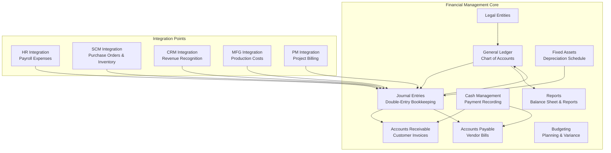

# Financial Management Module

General ledger, accounts receivable, accounts payable, cash management, budgeting, fixed assets, and financial reports. Port **8001**.

## Module Overview

## Documentation Structure

### Core Features
- [Overview](overview.md) — Module features, architecture, and integration overview
- [General Ledger](general-ledger.md) — Chart of accounts, journal entries, balance behaviors
- [API Reference](api-reference.md) — Complete REST API documentation with examples

---

## Domain Models

| Model | Key Fields | Description |
|-------|-----------|-------------|
| `LegalEntity` | ID, CompanyCode, CompanyName, FunctionalCurrency, TaxRegistrationNumber | Multi-tenant tenant boundary |
| `ChartOfAccounts` | ID, LegalEntityID, AccountCode, AccountName, Type (ASSET/LIABILITY/EQUITY/REVENUE/EXPENSE), IsActive | Chart of accounts entry |
| `UniversalJournalEntry` | ID, LegalEntityID, SourceModule, SourceDocumentID, PostingDate, FinancialPeriod, Status (DRAFT/POSTED/REVERSED) | Double-entry journal header |
| `UniversalJournalLine` | ID, JournalEntryID, AccountID, AmountFunctional, AmountTransactional, CurrencyTransactional | Ledger transaction line |
| `ArInvoice` | ID, LegalEntityID, InvoiceNumber, CustomerID, SalesOrderID, TotalAmount, TaxAmount, DueDate, Status | Customer invoice (flat schema) |
| `ApVendorBill` | ID, LegalEntityID, BillNumber, VendorID, PurchaseOrderID, TotalAmount, TaxAmount, DueDate, Status | Vendor bill (flat schema) |
| `CapitalAsset` | ID, LegalEntityID, AssetTag, EamEquipmentID, AcquisitionCost, AccumulatedDepreciation, UsefulLifeMonths, CapitalizationDate, Status | Capitalized fixed asset |
| `DepreciationScheduleLine` | ID, FixedAssetID, FiscalYear, PeriodNumber, DepreciationAmount, IsPosted | Scheduled straight-line depreciation entry |
| `BankAccount` | ID, LegalEntityID, AccountNumber, Currency, LiquidBalance | Bank account record |
| `Payment` | ID, InvoiceID, BillID, BankAccountID, PaymentNumber, PaymentDate, Amount, PaymentMethod, Status | Payment record against AR/AP |
| `BankStatement` | ID, BankAccountID, StatementDate, EndingBalance, IsReconciled | Bank statement header |
| `BankStatementLine` | ID, StatementID, TransactionDate, Description, Amount, IsMatched | Individual bank transaction line |
| `Budget` | ID, AccountID, CostCenterID, FiscalYear, Period, AllocatedAmount, SpentAmount | Budget allocation per period |
| `TaxRate` | ID, Code, Name, Rate, IsActive | Tax rate configuration |
| `CurrencyRate` | ID, FromCurrency, ToCurrency, Rate, EffectiveDate | Exchange rates table |
| `CustomerCredit` | ID, CustomerID, CreditLimit, CurrentBalance, IsOnHold | Customer credit limit details |
| `TransactionalOutbox` | ID, EventType, AggregateID, Payload, Status | Outbox record for reliable publishing |
| `KafkaEventInbox` | EventID, EventType, ProcessedAt, ProcessingStatus, Payload | Inbox record for event idempotency |

---

## Business Services

### GeneralLedgerService
- `CreateAccount`: Creates a new account (validates legal entity and code uniqueness).
- `ListAccounts`: Lists all accounts.
- `GetAccount`: Retrieves account by ID.
- `UpdateAccount`: Updates account name, type, and active status.
- `DeleteAccount`: Deletes account.
- `GetAccountBalance`: Retrieves dynamic balance from ledger lines.
- `CreateJournalEntry`: Creates and posts balanced double-entry journals.
- `ListJournalEntries`: Lists journal entries.
- `GetJournalEntry`: Retrieves entry and its ledger lines.
- `UpdateJournalEntry`: Updates draft journal entries.
- `DeleteJournalEntry`: Deletes draft journal entries.
- `GetBalanceSheet`: Live balance sheet calculation.
- `GetIncomeStatement`: Live income statement calculation.
- `GetCashFlow`: Live cash flow calculation.

### AccountsReceivableService
- `CreateInvoice`: Creates a flat customer invoice.
- `ListInvoices`: Lists customer invoices.
- `GetInvoice`: Retrieves invoice details.
- `UpdateInvoice`: Updates invoice status/attributes.
- `DeleteInvoice`: Deletes invoice.
- `SendInvoice`: Sends invoice (triggers `fm.invoice.sent` event).

### AccountsPayableService
- `CreateVendorBill`: Creates a flat vendor bill.
- `ListVendorBills`: Lists vendor bills.
- `GetVendorBill`: Retrieves vendor bill details.

### CashManagementService
- `RecordPayment`: Records payment against invoices or vendor bills.
- `ListPayments`: Lists recorded payments.
- `GetPayment`: Retrieves payment details.
- `GetBankStatement`: Retrieves bank statements and lines.

### BudgetingService
- `CreateBudget`: Allocates budget.
- `ListBudgets`: Lists budgets.
- `GetBudget`: Retrieves budget details.
- `GetBudgetVariance`: Performs Actual vs Budget comparison.

### CapitalAssetService
- `CapitalizeAsset`: Capitalizes fixed assets.
- `GenerateDepreciationSchedule`: Creates month-by-month straight-line schedules.
- `PostMonthlyStraightLineDepreciation`: Posts scheduled depreciation journal lines.

---

## API Endpoints (33 routes)

### Health
- `GET /health` — Health check

### Legal Entities
- `GET /api/v1/legal-entities` — List legal entities
- `POST /api/v1/legal-entities` — Create legal entity
- `GET /api/v1/legal-entities/:id` — Get legal entity

### Accounts
- `GET /api/v1/accounts` — List accounts
- `POST /api/v1/accounts` — Create account
- `GET /api/v1/accounts/:id` — Get account details
- `PUT /api/v1/accounts/:id` — Update account
- `DELETE /api/v1/accounts/:id` — Delete account
- `GET /api/v1/accounts/:id/balance` — Get account balance

### Journal Entries
- `GET /api/v1/journal-entries` — List journal entries
- `POST /api/v1/journal-entries` — Create journal entry
- `GET /api/v1/journal-entries/:id` — Get journal entry with lines
- `PUT /api/v1/journal-entries/:id` — Update journal entry
- `DELETE /api/v1/journal-entries/:id` — Delete journal entry

### Invoices (AR)
- `GET /api/v1/invoices` — List invoices
- `POST /api/v1/invoices` — Create invoice
- `GET /api/v1/invoices/:id` — Get invoice details
- `PUT /api/v1/invoices/:id` — Update invoice
- `DELETE /api/v1/invoices/:id` — Delete invoice
- `POST /api/v1/invoices/:id/send` — Send invoice
- `GET /api/v1/invoices/:id/lines` — Get invoice lines (flat model compatibility)

### Vendor Bills (AP)
- `GET /api/v1/vendor-bills` — List vendor bills
- `POST /api/v1/vendor-bills` — Create vendor bill
- `GET /api/v1/vendor-bills/:id/lines` — Get vendor bill lines

### Payments & Banking
- `GET /api/v1/payments` — List payments
- `POST /api/v1/payments` — Record payment
- `GET /api/v1/payments/:id` — Get payment details
- `GET /api/v1/bank-statements/:id/lines` — Get bank statement lines

### Fixed Assets
- `GET /api/v1/assets` — List assets
- `POST /api/v1/assets/capitalize` — Capitalize fixed asset
- `GET /api/v1/assets/:id` — Get asset details
- `POST /api/v1/assets/:id/depreciation-schedule` — Generate depreciation schedule
- `POST /api/v1/assets/depreciate` — Post monthly depreciation

### Reports
- `GET /api/v1/reports/balance-sheet` — Balance Sheet report
- `GET /api/v1/reports/income-statement` — Income Statement report
- `GET /api/v1/reports/cash-flow` — Cash Flow report

---

## Kafka Integration

### Events Published
Topics are prefixed with `fm.*`:
- `fm.invoice.created` | Triggers when invoice is created
- `fm.invoice.updated` | Triggers when invoice is updated
- `fm.invoice.sent` | Triggers when invoice is marked sent
- `fm.invoice.paid` | Triggers when payment fully satisfies invoice amount
- `fm.invoice.overdue` | Triggers when invoice passes due date without payment
- `fm.payment.received` | Triggers on recorded incoming payment
- `fm.payment.processed` | Triggers on payment success
- `fm.payment.failed` | Triggers on payment failure
- `fm.vendor.payment.due` | Triggers on vendor bill due date
- `fm.vendor.paid` | Triggers on payment recorded against vendor bill
- `fm.customer.credit_status.updated` | Triggers when credit limit or current balance is altered
- `fm.account.created` | Triggers when chart of accounts entry is created
- `fm.account.updated` | Triggers when chart of accounts entry is updated
- `fm.account.balance.changed` | Triggers when a universal journal line changes balance
- `fm.budget.created` | Triggers when a budget is created
- `fm.budget.updated` | Triggers when a budget is updated
- `fm.budget.exceeded` | Triggers when spending exceeds allocated budget amount
- `fm.budget.approved` | Triggers when a budget is approved

### Events Consumed
All events processed transactionally and deduplicated:
- `hr.payroll.processed` | Generates GL salary entries
- `hr.employee.created` | Stores new employee metadata
- `hr.expense.submitted` | Generates GL expense entry
- `scm.receipt.staged` | Records staged inventory receipt
- `scm.order.shipped` | Records SCM order shipment COGS
- `scm.purchase.order.created` | Creates purchase order reference
- `scm.invoice.received` | Generates vendor bill (AP) entries
- `scm.inventory.valued` | Adjusts inventory GL balances
- `crm.order.confirmed` | Generates receivable/invoice records
- `crm.customer.created` | Stores new customer metadata
- `mfg.yield.produced` | Generates manufacturing yield GL entries
- `mfg.production.completed` | Moves manufacturing WIP to finished goods
- `mfg.material.consumed` | Records manufacturing raw material issues
- `prj.milestone.achieved` | Records project billing milestones
- `prj.project.created` | Stores project metadata
- `prj.time.logged` | Creates unbilled receivable entries
- `prj.expense.incurred` | Capitalizes project cost entries
