# Financial Management Module

Comprehensive accounting and financial management capabilities for complete financial lifecycle management.

## Module Overview

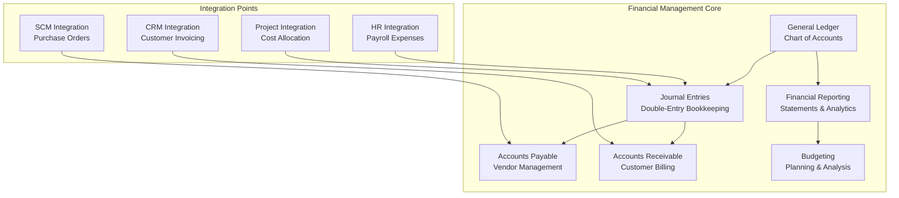

## Documentation Structure

### Core Features
- [General Ledger](general-ledger.md) - Chart of accounts and account management
- [Journal Entries](journal-entries.md) - Double-entry bookkeeping and transaction recording
- [Accounts Payable](accounts-payable.md) - Vendor management and payment processing
- [Accounts Receivable](accounts-receivable.md) - Customer billing and collections
- [Financial Reporting](financial-reporting.md) - Statements, analytics, and compliance
- [Budgeting](budgeting.md) - Budget planning and variance analysis

### Integration and APIs
- [API Reference](api-reference.md) - Complete REST API documentation
- [Integration Patterns](integration-patterns.md) - External system connections
- [Event Architecture](event-architecture.md) - Domain events and messaging

### Implementation
- [Database Schema](database-schema.md) - Data models and relationships
- [Business Rules](business-rules.md) - Financial rules and validations
- [Security](security.md) - Access control and data protection

## Key Financial Processes

### Accounting Cycle
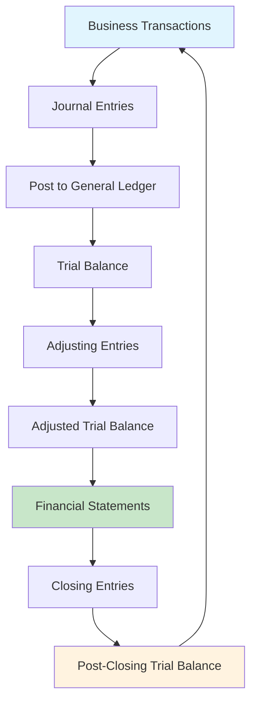

### Revenue Recognition Process
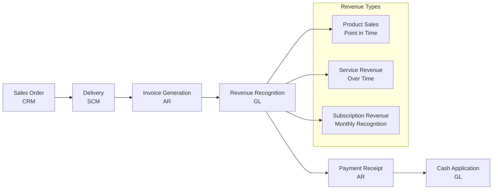

### Purchase-to-Pay Process
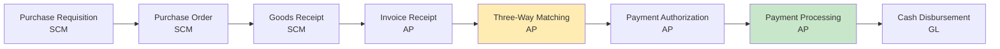

## Financial Statement Structure

### Balance Sheet Architecture
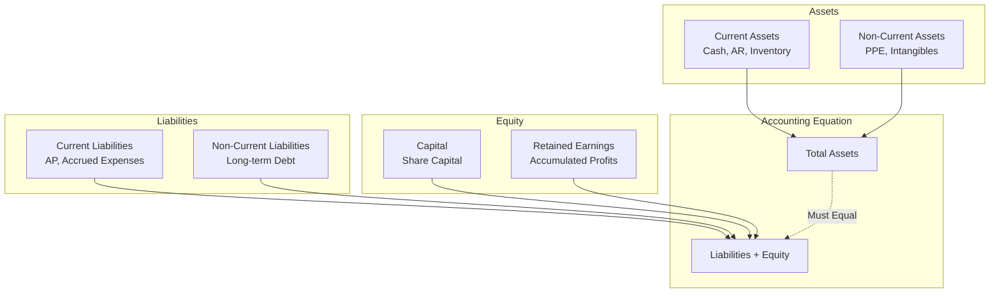

### Income Statement Flow
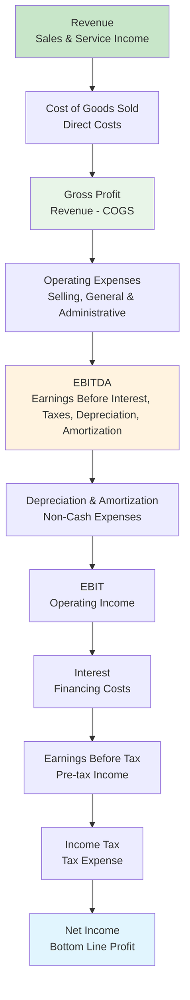

## Chart of Accounts Structure

### Standard Account Hierarchy
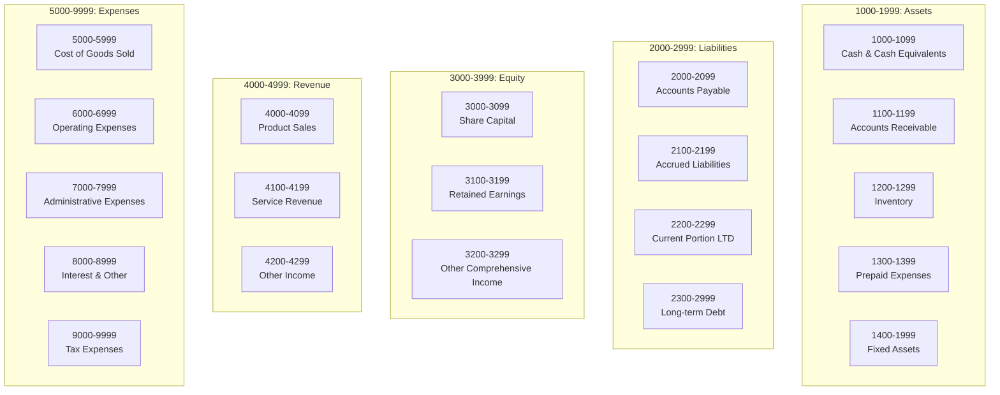

## Multi-Currency Support

### Currency Management Flow
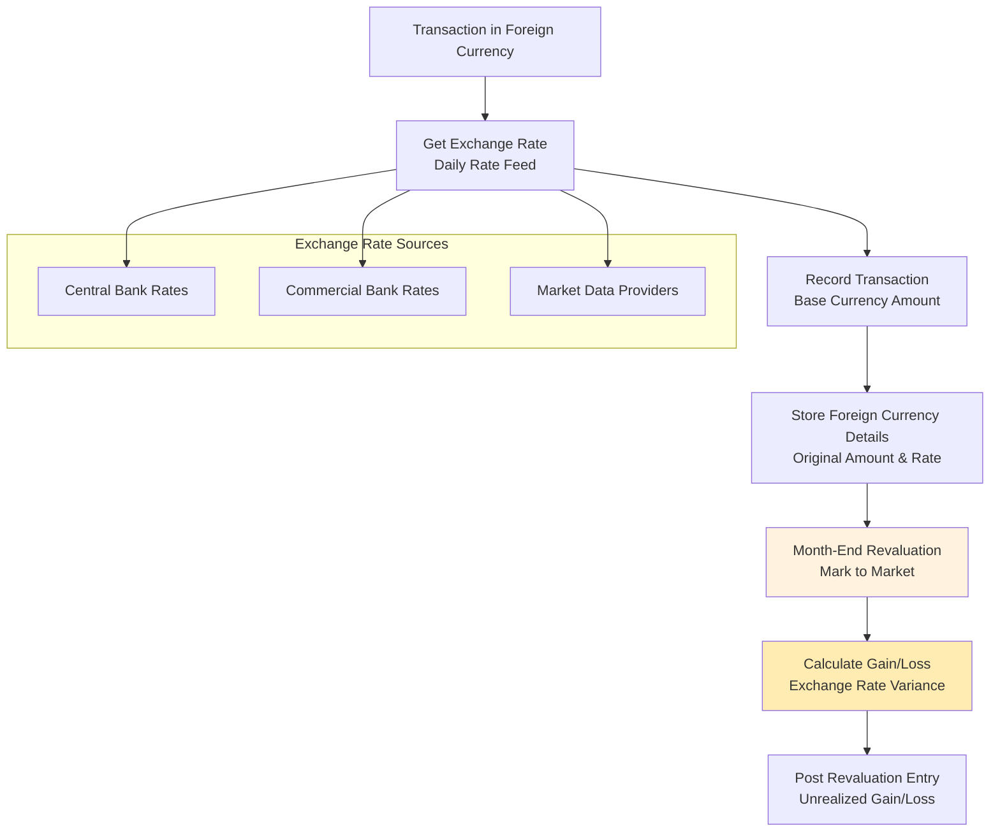

### Multi-Currency Reporting
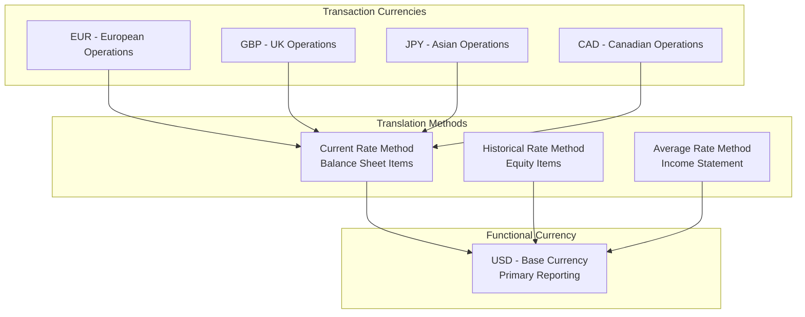

## Cash Flow Management

### Cash Flow Categories
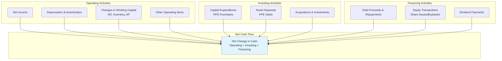

### Cash Position Monitoring
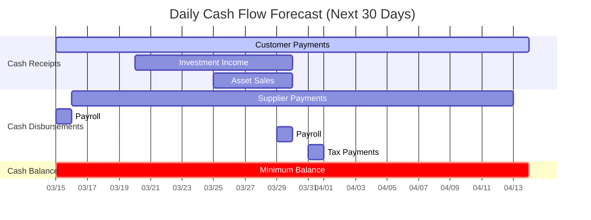

## Key Performance Indicators

### Financial KPIs Dashboard
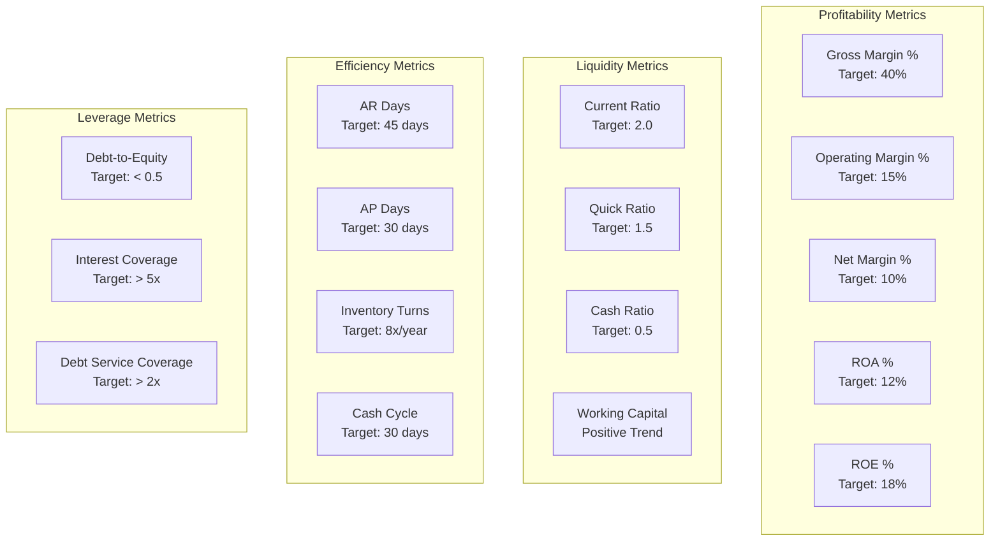

## Next Steps

Explore specific areas of the Financial Management module:

### For Accountants
1. [General Ledger](general-ledger.md) - Chart of accounts setup
2. [Journal Entries](journal-entries.md) - Transaction recording
3. [Financial Reporting](financial-reporting.md) - Statements and compliance

### For Controllers  
1. [Budgeting](budgeting.md) - Planning and variance analysis
2. [Business Rules](business-rules.md) - Financial controls
3. [Integration Patterns](integration-patterns.md) - System connections

### For Developers
1. [Database Schema](database-schema.md) - Data model implementation
2. [API Reference](api-reference.md) - Integration specifications
3. [Event Architecture](event-architecture.md) - Messaging patterns

## Related Modules

- [📦 Supply Chain Management](../supply-chain-management/) - Purchase order integration
- [👥 Human Resources](../human-resources/) - Payroll expense processing
- [🤝 Customer Relations](../customer-relationship-management/) - Customer invoicing
- [📋 Project Management](../project-management/) - Project cost allocation