# General Ledger

Central repository for all financial transactions with hierarchical chart of accounts and real-time balance tracking.

## Chart of Accounts Structure

### Account Hierarchy Design
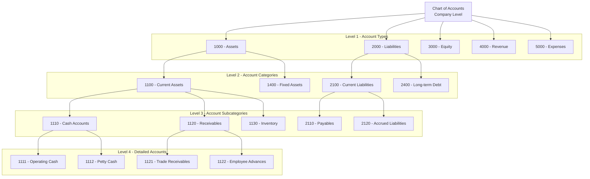

## Standard Chart of Accounts

### Asset Accounts (1000-1999)
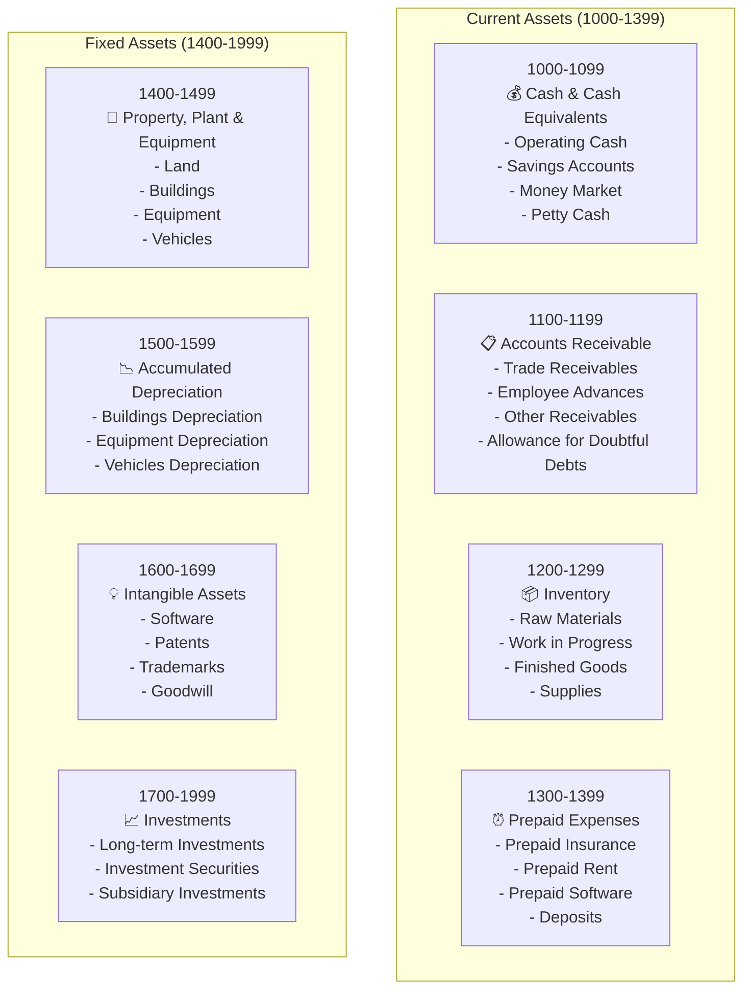

### Liability Accounts (2000-2999)
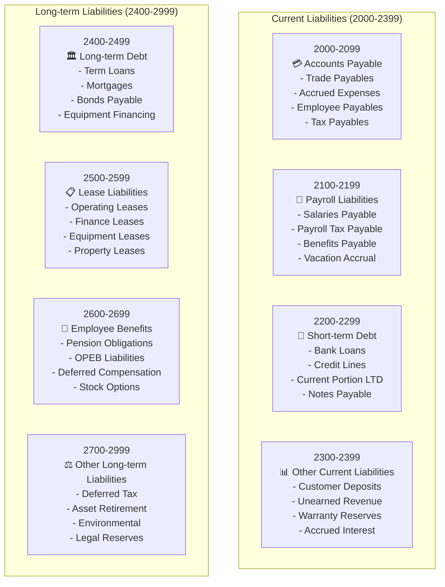

## Account Management Features

### Account Creation Workflow
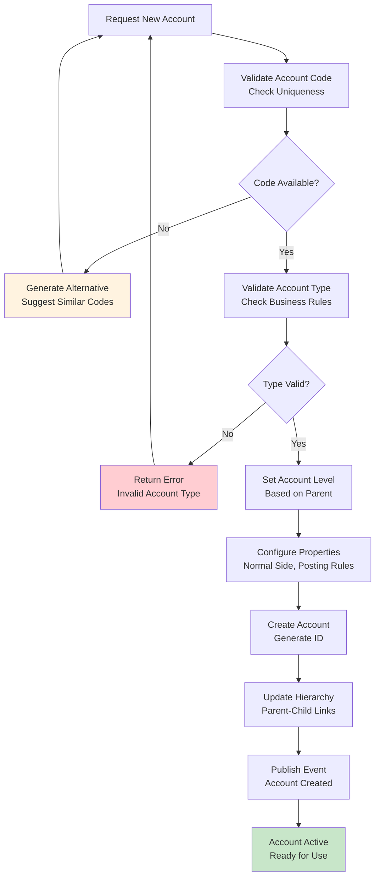

### Account Properties and Rules
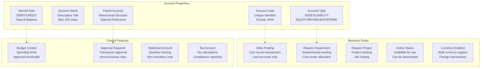

## Balance Calculation and Tracking

### Real-time Balance Updates
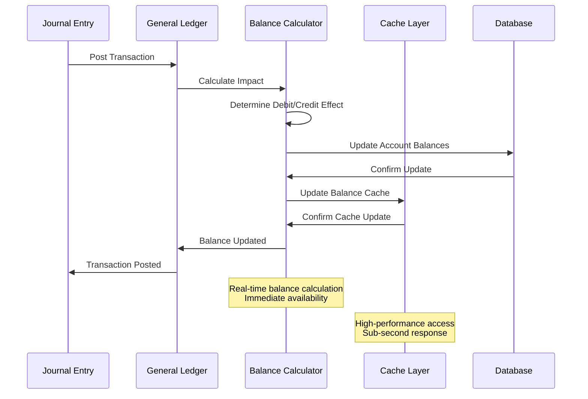

### Balance History Tracking
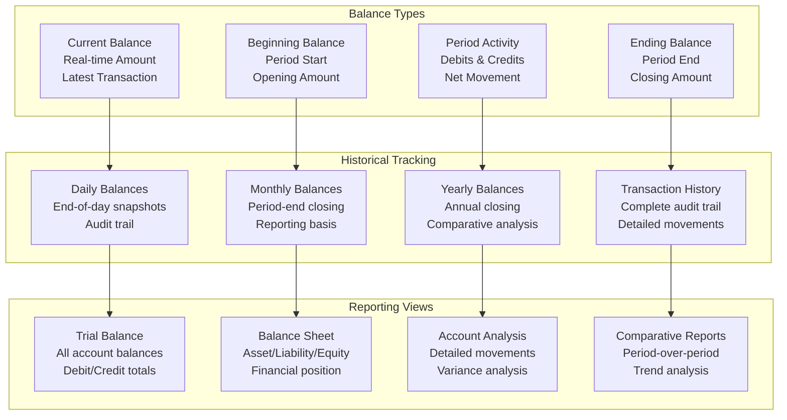

## Multi-Dimensional Analysis

### Cost Center Integration
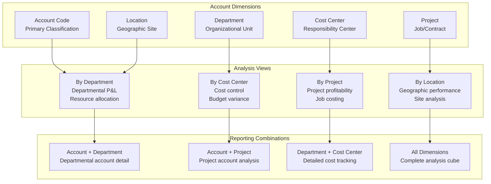

## Account Reconciliation

### Reconciliation Process
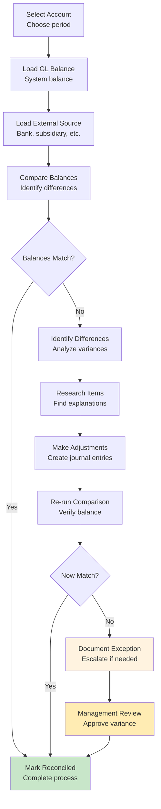

### Reconciliation Types
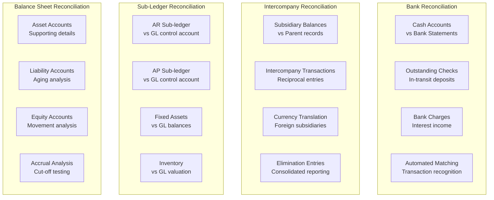

## Performance Optimization

### Indexing Strategy
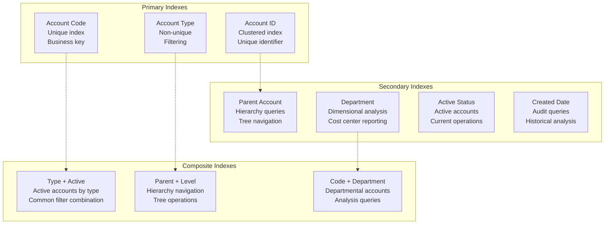

## API Examples

### Create Account
```http
POST /api/v1/finance/accounts
Content-Type: application/json
Authorization: Bearer <token>

{
  "account_code": "1150",
  "account_name": "Accounts Receivable - Trade",
  "account_type": "ASSET",
  "normal_side": "DEBIT",
  "parent_account_id": "acc-1100",
  "allow_posting": true,
  "require_department": true,
  "active": true,
  "description": "Customer receivables from normal business operations"
}
```

### Get Account Balance
```http
GET /api/v1/finance/accounts/acc-1150/balance
Authorization: Bearer <token>

Query Parameters:
- as_of_date: 2024-03-31 (optional, defaults to current date)
- include_pending: true (include unposted transactions)
- currency: USD (for multi-currency accounts)
```

### Account Hierarchy
```http
GET /api/v1/finance/accounts/hierarchy
Authorization: Bearer <token>

Query Parameters:
- account_type: ASSET (filter by account type)
- active_only: true (exclude inactive accounts)
- max_level: 4 (limit hierarchy depth)
- include_balances: true (include current balances)
```

## Next Steps

- [Journal Entries](journal-entries.md) - Recording transactions against accounts
- [Financial Reporting](financial-reporting.md) - Using accounts in financial statements
- [Database Schema](database-schema.md) - Technical implementation details