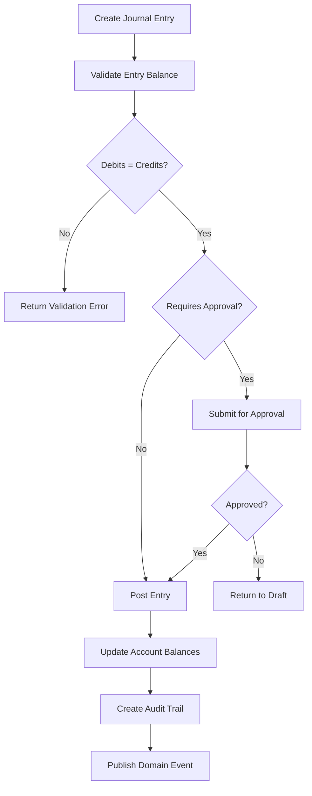

# Financial Management Overview

Comprehensive accounting and financial management capabilities for complete financial lifecycle management.

## Core Features Summary

### General Ledger and Chart of Accounts
**Purpose**: Central repository for all financial transactions with hierarchical account structure

**Key Features:**
- **Flexible Account Hierarchy**: Support for unlimited account levels and sub-accounts
- **Account Types**: Asset, Liability, Equity, Revenue, and Expense classifications
- **Account Codes**: Configurable numbering schemes for different account types
- **Balance Tracking**: Real-time balance calculations with historical tracking
- **Multi-dimensional Analysis**: Department, project, and cost center tracking

See detailed documentation: [General Ledger](general-ledger.md)

### Journal Entry Management
**Purpose**: Record all financial transactions with proper audit trails and validation

**Key Features:**
- **Double-Entry Bookkeeping**: Automatic validation that debits equal credits
- **Batch Processing**: Support for multiple transactions in single entry
- **Approval Workflows**: Configurable approval processes based on amount thresholds
- **Reversing Entries**: Ability to reverse posted entries with audit trail
- **Source Tracking**: Track originating module for each entry

**Workflow Example:**


See detailed documentation: [Journal Entries](journal-entries.md)

### Accounts Payable
**Purpose**: Manage vendor relationships and payment processes

**Key Features:**
- **Vendor Management**: Comprehensive vendor database with payment terms
- **Invoice Processing**: Three-way matching (PO, receipt, invoice)
- **Payment Processing**: Batch payments, ACH, wire transfers, checks
- **Aging Analysis**: Track overdue payments and cash flow planning
- **Approval Workflows**: Multi-level approval for large payments
- **1099 Processing**: Year-end tax reporting for vendors

See detailed documentation: [Accounts Payable](accounts-payable.md)

### Accounts Receivable
**Purpose**: Manage customer billing and collection processes

**Key Features:**
- **Customer Management**: Customer database with credit limits
- **Invoice Generation**: Automated and manual invoice creation
- **Payment Application**: Apply customer payments to invoices
- **Collections Management**: Automated dunning and collection workflows
- **Credit Management**: Credit limit monitoring and enforcement
- **Aging Analysis**: Track outstanding receivables

See detailed documentation: [Accounts Receivable](accounts-receivable.md)

### Financial Reporting
**Purpose**: Generate comprehensive financial statements and analysis

**Standard Reports:**
- **Balance Sheet**: Assets, liabilities, and equity at point in time
- **Income Statement**: Revenue and expenses for period
- **Cash Flow Statement**: Operating, investing, and financing activities
- **Trial Balance**: All account balances with debit/credit totals
- **General Ledger Detail**: Transaction-level detail for all accounts

**Advanced Analytics:**
- **Budget vs. Actual**: Variance analysis with drill-down capabilities
- **Trend Analysis**: Multi-period comparisons and trending
- **Ratio Analysis**: Financial ratios and benchmarking
- **Cash Flow Forecasting**: Projected cash flows based on AR/AP
- **Profitability Analysis**: By department, product, or customer

See detailed documentation: [Financial Reporting](financial-reporting.md)

## Implementation Examples

### Account Creation Service
```go
type Account struct {
    ID              string          `json:"id"`
    AccountCode     string          `json:"account_code"`
    AccountName     string          `json:"account_name"`
    AccountType     AccountType     `json:"account_type"`
    ParentAccountID *string         `json:"parent_account_id,omitempty"`
    AccountLevel    int             `json:"account_level"`
    NormalSide      string          `json:"normal_side"`
    CurrentBalance  decimal.Decimal `json:"current_balance"`
    IsActive        bool            `json:"is_active"`
    AllowPosting    bool            `json:"allow_posting"`
}

func (s *AccountService) CreateAccount(ctx context.Context, req CreateAccountRequest) (*Account, error) {
    // Validate account code uniqueness
    if exists, _ := s.repo.ExistsWithCode(ctx, req.AccountCode); exists {
        return nil, ErrAccountCodeExists
    }
    
    // Calculate account level based on parent
    level := 1
    if req.ParentAccountID != nil {
        parent, err := s.repo.GetByID(ctx, *req.ParentAccountID)
        if err != nil {
            return nil, err
        }
        level = parent.AccountLevel + 1
    }
    
    account := &Account{
        ID:              uuid.New().String(),
        AccountCode:     req.AccountCode,
        AccountName:     req.AccountName,
        AccountType:     req.AccountType,
        ParentAccountID: req.ParentAccountID,
        AccountLevel:    level,
        NormalSide:      req.NormalSide,
        IsActive:        true,
        AllowPosting:    req.AllowPosting,
    }
    
    return s.repo.Create(ctx, account)
}
```

### Invoice Processing Service
```go
type VendorInvoice struct {
    ID              string          `json:"id"`
    VendorID        string          `json:"vendor_id"`
    InvoiceNumber   string          `json:"invoice_number"`
    InvoiceDate     time.Time       `json:"invoice_date"`
    DueDate         time.Time       `json:"due_date"`
    Amount          decimal.Decimal `json:"amount"`
    Status          InvoiceStatus   `json:"status"`
    PurchaseOrderID *string         `json:"purchase_order_id"`
    ReceiptID       *string         `json:"receipt_id"`
}

func (s *APService) ProcessInvoice(ctx context.Context, invoice *VendorInvoice) error {
    // Three-way matching
    if invoice.PurchaseOrderID != nil && invoice.ReceiptID != nil {
        if err := s.validateThreeWayMatch(ctx, invoice); err != nil {
            return err
        }
    }
    
    // Create journal entry
    entry := &JournalEntry{
        Description: fmt.Sprintf("Vendor Invoice %s", invoice.InvoiceNumber),
        Lines: []JournalEntryLine{
            {
                AccountCode:   "5000", // Expense account
                DebitAmount:   invoice.Amount,
                CreditAmount:  decimal.Zero,
            },
            {
                AccountCode:   "2000", // Accounts Payable
                DebitAmount:   decimal.Zero,
                CreditAmount:  invoice.Amount,
            },
        },
    }
    
    return s.journalService.CreateEntry(ctx, entry)
}
```

## Business Rules and Validation

### Account Management Rules
- Account codes must be unique within the chart of accounts
- Parent accounts cannot be deleted if they have child accounts
- Posting accounts cannot have child accounts
- Account types must follow standard accounting classifications

### Journal Entry Rules
- All journal entries must balance (debits = credits)
- Entries above threshold require approval workflow
- Posted entries cannot be modified (only reversed)
- Each entry must have minimum two lines

### Multi-Currency Rules
- Exchange rates updated daily from external service
- Currency gains/losses calculated automatically
- Base currency configurable per organization
- Historical exchange rates maintained for reporting

## Integration Points

### Internal Module Integration
- **HR Module**: Payroll expense allocation and employee expense processing
- **SCM Module**: Purchase order processing and inventory valuation
- **CRM Module**: Customer invoicing and commission calculations
- **Project Module**: Project cost allocation and billing
- **Manufacturing Module**: Production cost accounting and inventory movements

### External System Integration
- **Banking Systems**: Electronic payments, account reconciliation, cash management
- **Payment Processors**: Credit card processing, online payment gateways
- **Tax Services**: Automated tax calculations and compliance reporting
- **Audit Systems**: External auditor access and documentation export

## Next Steps

Learn about specific areas:
- [General Ledger](general-ledger.md) - Detailed account management
- [Journal Entries](journal-entries.md) - Transaction processing
- [API Reference](api-reference.md) - Integration specifications
- [Database Schema](database-schema.md) - Data model details