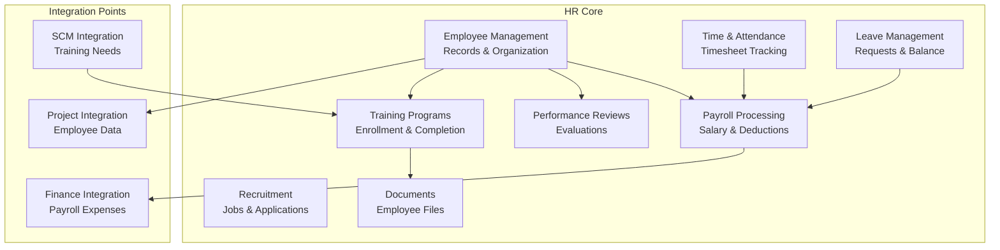

# Human Resources Module

Employee lifecycle, payroll, time tracking, leave management, recruitment, performance reviews, training, and employee documents. Port **8002** (docker-compose: 8003).

## Module Overview

## Documentation Structure

### Core Features
- `employee-management.md` — Employee records, departments, positions
- `payroll-processing.md` — Salary calculation and deductions
- `time-attendance.md` — Timesheet submission and approval
- `leave-management.md` — Leave requests and balance tracking
- `recruitment.md` — Job postings and applications
- `performance-management.md` — Reviews and evaluations
- `training.md` — Programs and enrollment
- `employee-documents.md` — Document management

### Integration and APIs
- `api-reference.md` — REST API documentation
- `integration-patterns.md` — Cross-module event flows
- `event-architecture.md` — Kafka event catalog

### Implementation
- `database-schema.md` — Data models

## Domain Models (18 types)

| Model | Key Fields |
|-------|-----------|
| `Employee` | ID, EmployeeID, FirstName, LastName, Email, Phone, HireDate, TermDate, DepartmentID, PositionID, ManagerID, Status (ACTIVE/TERMINATED/LEAVE), Salary |
| `Department` | ID, Name, Code, ManagerID, ParentDepartmentID |
| `Position` | ID, Title, JobGrade, MinSalary, MaxSalary |
| `PayrollRecord` | ID, EmployeeID, PeriodStart, PeriodEnd, GrossPay, NetPay, Status, Deductions[] |
| `PayrollDeduction` | Type, Amount, Description |
| `AttendanceEntry` | ID, EmployeeID, Date, ClockIn, ClockOut, HoursWorked, Type |
| `LeaveRequest` | ID, EmployeeID, Type, StartDate, EndDate, Status, Reason |
| `LeaveBalance` | ID, EmployeeID, LeaveType, TotalEntitled, Used, Remaining |
| `ExpenseClaim` | ID, EmployeeID, TotalAmount, Status, Lines[] |
| `ExpenseClaimLine` | Date, Category, Amount, Description |
| `JobPosting` | ID, Title, DepartmentID, Description, Requirements, Status |
| `JobApplication` | ID, JobPostingID, ApplicantName, Email, Status, ResumeURL |
| `PerformanceReview` | ID, EmployeeID, ReviewerID, Period, Rating, Comments, Status |
| `TrainingProgram` | ID, Name, Description, Duration, MaxParticipants |
| `TrainingEnrollment` | ID, TrainingProgramID, EmployeeID, Status, CompletionDate |
| `EmployeeDocument` | ID, EmployeeID, Type, Name, FileURL |

## Business Services (9)

| Service | Key Methods |
|---------|-------------|
| `EmployeeManagementService` | Create/Get/Update/Delete employee, SubmitExpenseClaim |
| `PayrollService` | ProcessPayroll, GetPayrollRecords, GetEmployeePayroll |
| `TimeAttendanceService` | Create/Get/Update timesheet, SubmitTimesheet, ApproveTimesheet |
| `LeaveManagementService` | Create/Get/Update request, Approve/Reject leave, Update status |
| `RecruitmentService` | Create/Get/Update/Delete job posting, Create/Get/Update application |
| `PerformanceService` | Create/Get/Update performance review |
| `TrainingService` | Create/Get/Update training program, Enroll, Complete enrollment |
| `EmployeeDocumentService` | Upload/Get/Delete employee document |
| `ReportService` | Headcount report, Payroll report, Attendance report |

## API Endpoints (35 routes)

### Employees
| Method | Path | Description |
|--------|------|-------------|
| GET | `/api/v1/employees` | List employees |
| POST | `/api/v1/employees` | Create employee |
| GET | `/api/v1/employees/:id` | Get employee |
| PUT | `/api/v1/employees/:id` | Update employee |
| DELETE | `/api/v1/employees/:id` | Delete employee |
| POST | `/api/v1/employees/:id/expenses` | Submit expense claim |

### Payroll
| Method | Path | Description |
|--------|------|-------------|
| GET | `/api/v1/payroll` | List payroll records |
| POST | `/api/v1/payroll` | Process payroll |
| GET | `/api/v1/payroll/:id` | Get payroll record |
| PUT | `/api/v1/payroll/:id` | Update payroll |
| GET | `/api/v1/payroll/employee/:id` | Get employee payroll |

### Timesheet
| Method | Path | Description |
|--------|------|-------------|
| GET | `/api/v1/timesheet` | List timesheet entries |
| POST | `/api/v1/timesheet` | Create timesheet |
| GET | `/api/v1/timesheet/:id` | Get timesheet |
| PUT | `/api/v1/timesheet/:id` | Update timesheet |
| POST | `/api/v1/timesheet/:id/submit` | Submit for approval |
| POST | `/api/v1/timesheet/:id/approve` | Approve timesheet |

### Leave
| Method | Path | Description |
|--------|------|-------------|
| GET | `/api/v1/leave-requests` | List requests |
| POST | `/api/v1/leave-requests` | Create request |
| GET | `/api/v1/leave-requests/:id` | Get request |
| PUT | `/api/v1/leave-requests/:id` | Update request |
| POST | `/api/v1/leave-requests/:id/approve` | Approve |
| POST | `/api/v1/leave-requests/:id/reject` | Reject |
| PUT | `/api/v1/leave-requests/:id/status` | Update status |

### Recruitment
| Method | Path | Description |
|--------|------|-------------|
| GET | `/api/v1/recruitment/jobs` | List job postings |
| POST | `/api/v1/recruitment/jobs` | Create posting |
| GET | `/api/v1/recruitment/jobs/:id` | Get posting |
| PUT | `/api/v1/recruitment/jobs/:id` | Update posting |
| DELETE | `/api/v1/recruitment/jobs/:id` | Delete posting |
| GET | `/api/v1/recruitment/applications` | List applications |
| POST | `/api/v1/recruitment/applications` | Create application |
| GET | `/api/v1/recruitment/applications/:id` | Get application |
| PUT | `/api/v1/recruitment/applications/:id` | Update application |

### Performance Reviews
| Method | Path | Description |
|--------|------|-------------|
| GET | `/api/v1/performance/reviews` | List reviews |
| POST | `/api/v1/performance/reviews` | Create review |
| GET | `/api/v1/performance/reviews/:id` | Get review |
| PUT | `/api/v1/performance/reviews/:id` | Update review |

### Training
| Method | Path | Description |
|--------|------|-------------|
| GET | `/api/v1/training/programs` | List programs |
| POST | `/api/v1/training/programs` | Create program |
| GET | `/api/v1/training/programs/:id` | Get program |
| PUT | `/api/v1/training/programs/:id` | Update program |
| POST | `/api/v1/training/programs/:id/enroll` | Enroll employee |
| POST | `/api/v1/training/enrollments/:enrollmentId/complete` | Mark completion |

### Documents
| Method | Path | Description |
|--------|------|-------------|
| GET | `/api/v1/employees/:id/documents` | List employee documents |
| POST | `/api/v1/employees/:id/documents` | Upload document |
| DELETE | `/api/v1/employees/:id/documents/:docId` | Delete document |

### Reports
| Method | Path | Description | Status |
|--------|------|-------------|--------|
| GET | `/api/v1/reports/headcount` | Headcount summary | Simple count |
| GET | `/api/v1/reports/payroll` | Payroll summary | Simple aggregation |
| GET | `/api/v1/reports/attendance` | Attendance summary | Simple aggregation |

## Kafka Integration

### Events Published (22 topics, per CDD)

**Employee:** `hr.employee.created`, `hr.employee.updated`, `hr.employee.terminated`, `hr.employee.promoted`, `hr.employee.available`, `hr.employee.scheduled`, `hr.employee.skills.updated`

**Payroll:** `hr.payroll.processed` (→ FM creates salary journal entry), `hr.payroll.failed`, `hr.salary.changed`

**Time:** `hr.timesheet.submitted`, `hr.timesheet.approved`, `hr.overtime.recorded`

**Leave:** `hr.leave.requested`, `hr.leave.approved`, `hr.leave.rejected`

**Expense:** `hr.expense.submitted` (→ FM creates expense entry)

**Training:** `hr.training.completed`, `hr.certification.earned`, `hr.skill.acquired`

**Performance:** `hr.performance.review.completed`, `hr.goal.achieved`, `hr.performance.improvement.needed`

### Events Consumed (5 topics, per CDD)

| Topic | Publisher | Logic |
|-------|-----------|-------|
| `prj.project.created` | PM | Logged only |
| `prj.task.assigned` | PM | Logged only |
| `fin.budget.allocated` | FM | Adjust hiring plans based on budget |
| `mfg.production.scheduled` | MFG | Logged only |
| `scm.training.required` | SCM | Auto-create training program |

## Seed Data

No seed data is created on startup for HR.

## Implementation Status vs Documentation

| Feature Claimed | Actual Status |
|----------------|--------------|
| Employee CRUD | Fully implemented |
| Payroll processing | Basic — creates records, no tax computation logic |
| Timesheet approval workflow | Implemented — submit/approve cycle |
| Leave management | Implemented — create/approve/reject |
| Recruitment | Implemented — jobs + applications CRUD |
| Performance reviews | Implemented — CRUD only |
| Training programs | Implemented — CRUD + enroll/complete |
| Employee documents | Implemented — upload/list/delete |
| Headcount/payroll/attendance reports | Implemented — basic aggregation |
| Tax calculations | Not implemented |
| Benefits administration | Not implemented (only benefits model exists) |
| Time clock integration | Not implemented |
| 360-degree feedback | Not implemented |
| Org chart visualization | Not implemented |

## Known Limitations

| Gap | Detail |
|-----|--------|
| No tax computation | Payroll records store amounts but no tax calculation logic |
| No benefits management | Benefits model exists, no code beyond that |
| No actual clock-in/out | Timesheet entries are manually created |
| No payroll-finance auto-posting | `hr.payroll.processed` event published but no auto journal entry |
| Reports are basic counts | No drill-down or filtering |
| In-memory only | All data lost on restart |
| No pagination | List endpoints return all records |
| Fire-and-forget events | `_ = publisher.Publish(...)` ignores errors |

## Related Modules

- [Financial Management](../financial-management/) — Payroll expense processing via Kafka
- [Project Management](../project-management/) — Employee/project allocation
- [Supply Chain Management](../supply-chain-management/) — Training requirement triggers
