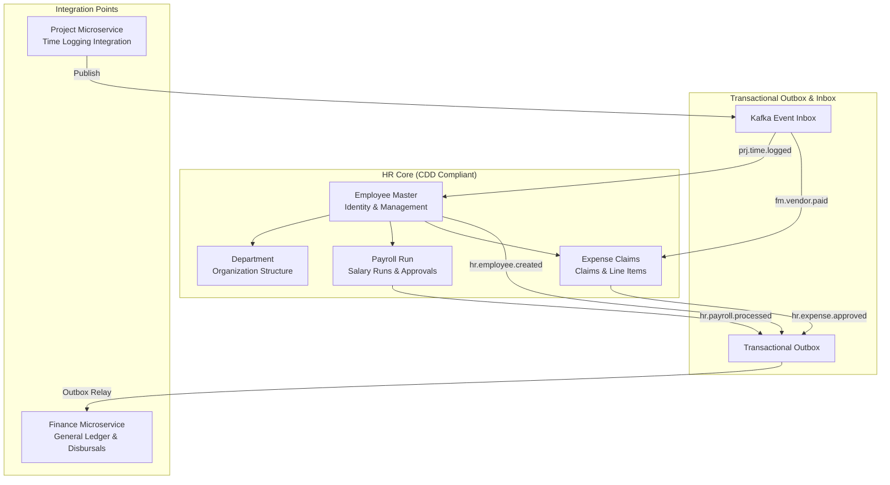

# Human Resources Module (Reconciled V1.0)

Workforce Identity, Core Payroll processing, and Expense Claim management. Implemented in Go using Gin, GORM (PostgreSQL), and Apache Kafka. Exposes port **8003**.

## Module Overview

---

## Domain Models (7 entities, per hr.cdd)

| Model | Table Name | Key Fields | Purpose |
| :--- | :--- | :--- | :--- |
| `Department` | `hr_departments` | ID, LegalEntityID, DepartmentCode, Name, IsActive | Represents physical organization departments. |
| `EmployeeMaster` | `hr_employees` | ID, LegalEntityID, DepartmentID, ManagerHrID, OrgDepthLevel, EmployeeNumber, FirstName, LastName, Email, Status, Type, BaseSalary, Version | Represents employees and organization structure (adjacency list). |
| `PayrollRun` | `hr_payroll_runs` | ID, LegalEntityID, FiscalYear, PeriodNumber, Status, TotalGrossPay, TotalDeductions, TotalNetPay, Version | Tracks periodic payroll calculations. |
| `ExpenseClaim` | `hr_expense_claims` | ID, LegalEntityID, EmployeeID, ClaimNumber, Purpose, TotalAmount, Status, CostCenterTag, Version | Tracks employee business expense reimbursements. |
| `ExpenseClaimLine` | `hr_expense_claim_lines` | ID, ExpenseClaimID, Description, LineAmount | Itemized expense lines under an expense claim. |
| `TransactionalOutbox` | `hr_transactional_outbox` | ID, EventType, AggregateID, Payload, Status | Guarantees reliable publishing of produced events. |
| `KafkaEventInbox` | `hr_kafka_event_inbox` | EventID, EventType, ProcessedAt, ProcessingStatus, Payload | Guarantees exactly-once processing of consumed events. |

---

## Business Services (5)

| Service | Key Methods | Description |
| :--- | :--- | :--- |
| `EmployeeService` | `HireEmployee`, `TerminateEmployee`, `AdjustCompensation`, `FetchManagementChain` | Manages employee hiring, termination, salary adjustments, and organizational hierarchies. |
| `PayrollService` | `InitiatePeriodRun`, `ExecuteCalculations`, `CloseAndApprovePayroll` | Initializes periodic payroll runs, computes gross/net salaries, and finalizes runs. |
| `ExpenseService` | `SubmitClaim`, `VerifyAndApproveClaim`, `ClearClaimForPayment` | Handles claim filings, approval routing, and payments. |
| `OutboxRelayWorker` | `GetUnsentMessages`, `LogProcessingAttempt`, `UpdateOutboxStatus` | Processes and updates transactional outbox events to prevent publishing failures. |
| `ReliableMessagingService` | `IsEventProcessed`, `ExecuteIdempotentTransaction` | Ensures consumed Kafka events are executed exactly-once under database transaction locks. |

---

## API Endpoints (22 routes)

### 1. Department Routes
* `POST /api/v1/departments` — Create a department
* `GET /api/v1/departments` — List all departments
* `GET /api/v1/departments/:id` — Fetch department details
* `PUT /api/v1/departments/:id` — Update department info

### 2. Employee Routes
* `POST /api/v1/employees` — Hire a new employee (emits `hr.employee.created`)
* `GET /api/v1/employees` — List all employees
* `GET /api/v1/employees/:id` — Fetch employee details
* `PUT /api/v1/employees/:id` — Update employee profile details
* `DELETE /api/v1/employees/:id` — Terminate employee (emits `hr.employee.terminated`)
* `PUT /api/v1/employees/:id/compensation` — Adjust compensation/base salary
* `GET /api/v1/employees/:id/management-chain` — Fetch organization management tree

### 3. Payroll Routes
* `POST /api/v1/payroll/initiate` — Create a draft payroll period run
* `POST /api/v1/payroll/calculate/:id` — Calculate gross, deductions, and net payouts for active employees
* `POST /api/v1/payroll/approve/:id` — Close and approve the payroll run (emits `hr.payroll.processed`)
* `GET /api/v1/payroll/runs` — List all payroll runs
* `GET /api/v1/payroll/runs/:id` — Fetch details of a specific payroll run

### 4. Expense Claim Routes
* `POST /api/v1/expenses` — Submit an expense claim with itemized lines
* `GET /api/v1/expenses` — List all expense claims
* `GET /api/v1/expenses/:id` — Fetch claim details
* `GET /api/v1/expenses/:id/lines` — List line items under a claim
* `POST /api/v1/expenses/:id/approve` — Approve an expense claim (emits `hr.expense.approved`)
* `POST /api/v1/expenses/:id/pay` — Clear an approved claim for payment (sets status to PAID)

---

## Kafka Integration

### Events Published (4 topics, per hr.cdd)
* `hr.employee.created` — Fired on hiring completion. Used by Finance (FM) to provision payroll accounts.
* `hr.employee.terminated` — Fired on employee termination.
* `hr.payroll.processed` — Fired on payroll approval. Used by FM to record General Ledger salary journal entries.
* `hr.expense.approved` — Fired on claim approval. Used by FM to record accounts payable/expense entries.

### Events Consumed (2 topics, per hr.cdd)
* `prj.time.logged` — Logged for contractor billing tracking.
* `fm.vendor.paid` — Automatically transitions the matching `ExpenseClaim` (referenced via `target_document_id`) to `PAID` state idempotently.

---

## Implementation Details & Security
* **Persistence**: Runs on persistent PostgreSQL database. Utilizes GORM's `AutoMigrate` at startup to build schema tables.
* **Transactional Reliability**: Outbox publishing is locked inside the database transaction boundary. If database write fails, the event is not written, ensuring zero data desync.
* **Idempotent Ingestion**: Event inbox tracking prevents duplicates. Events with identical `event_id` are ignored if they have already been successfully processed.
