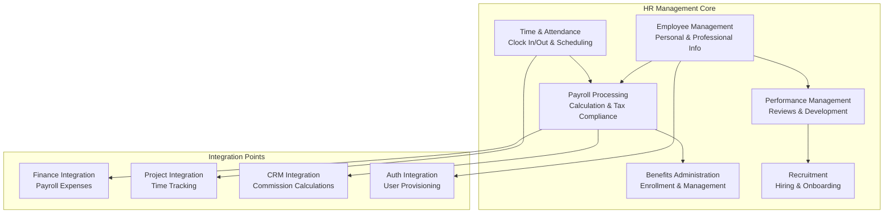
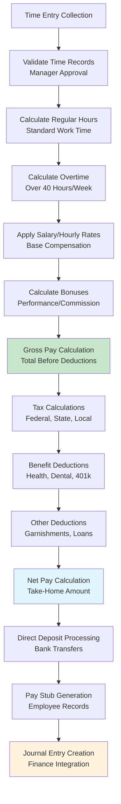
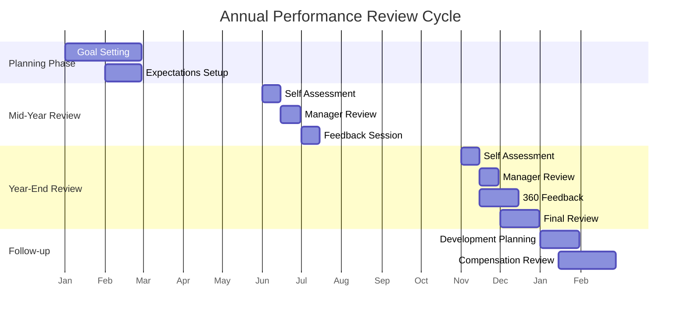
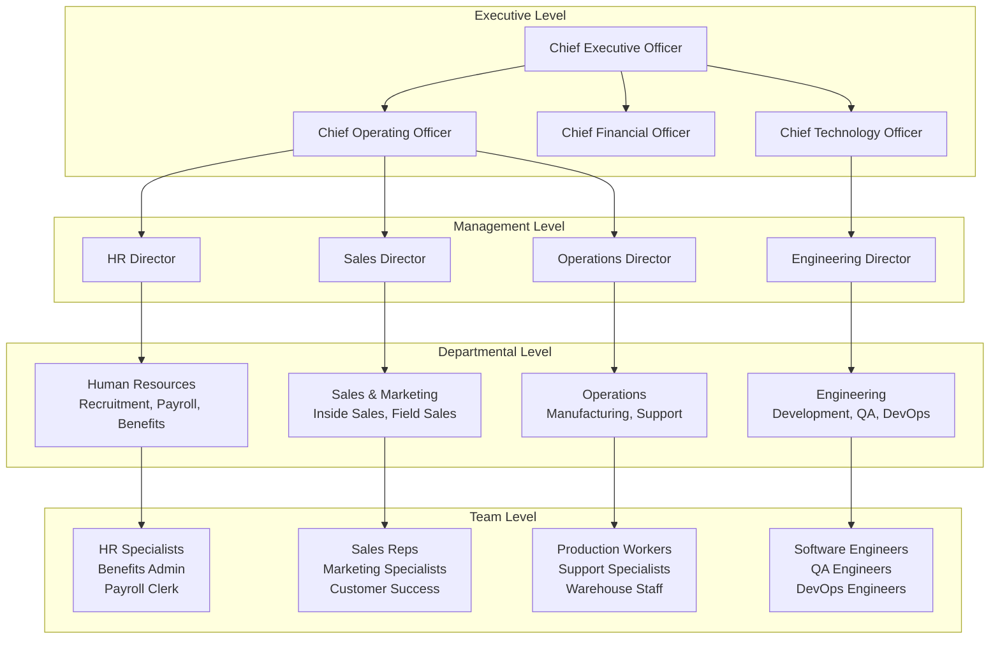
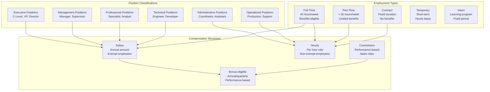
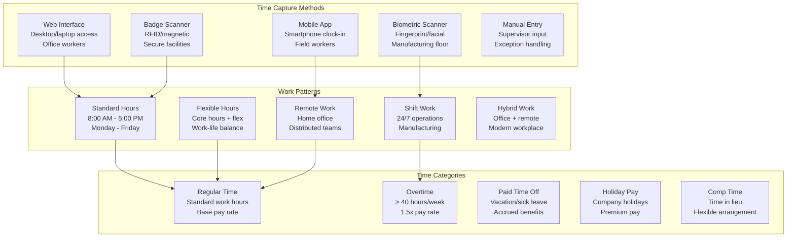
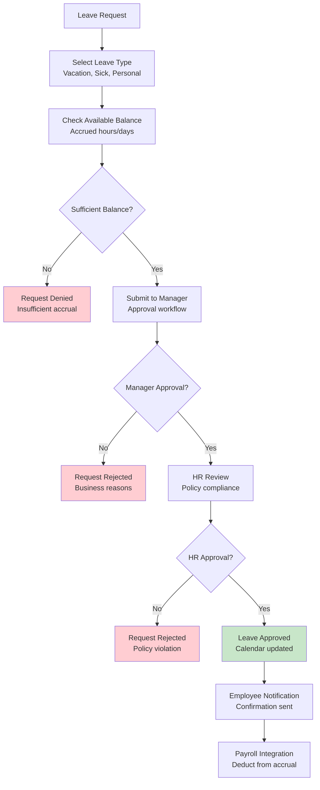
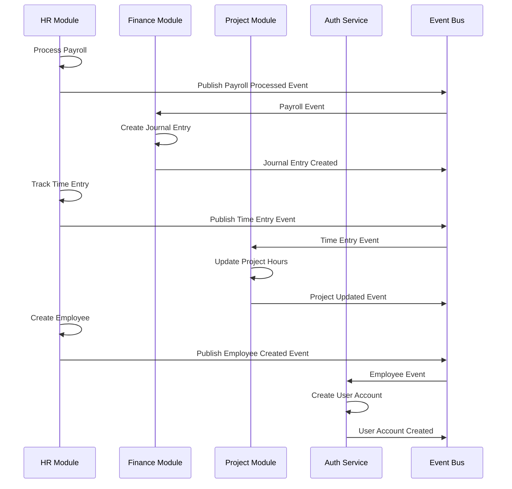
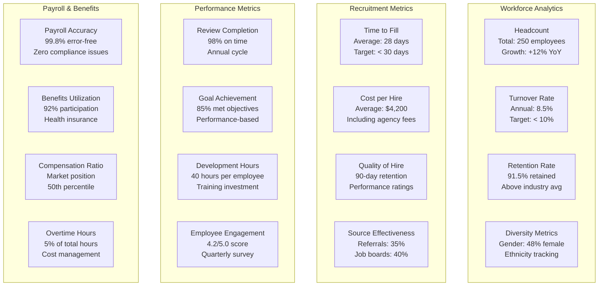

# Human Resources Module

Complete employee lifecycle management from recruitment through retirement, providing comprehensive workforce management capabilities.

## Module Overview



## Documentation Structure

### Core Features
- [Employee Management](employee-management.md) - Employee profiles and organizational structure
- [Payroll Processing](payroll-processing.md) - Automated payroll with tax compliance
- [Time and Attendance](time-attendance.md) - Time tracking and scheduling
- [Benefits Administration](benefits-administration.md) - Benefits enrollment and management
- [Performance Management](performance-management.md) - Performance reviews and development
- [Recruitment](recruitment.md) - Hiring and onboarding processes

### Integration and APIs
- [API Reference](api-reference.md) - Complete REST API documentation
- [Integration Patterns](integration-patterns.md) - External system connections
- [Event Architecture](event-architecture.md) - Domain events and messaging

### Implementation
- [Database Schema](database-schema.md) - Data models and relationships
- [Business Rules](business-rules.md) - HR policies and validations
- [Compliance](compliance.md) - Regulatory compliance and security

## Key HR Processes

### Employee Lifecycle

```mermaid
flowchart LR
    A[Recruitment<br/>Job Posting] --> B[Application<br/>Resume Review]
    B --> C[Interview Process<br/>Multiple Rounds]
    C --> D[Background Check<br/>Reference Verification]
    D --> E[Job Offer<br/>Salary Negotiation]
    E --> F[Onboarding<br/>First Day Setup]
    F --> G[Training<br/>Skill Development]
    G --> H[Performance Reviews<br/>Regular Evaluations]
    H --> I[Career Development<br/>Promotions/Transfers]
    I --> J[Retirement/Separation<br/>Exit Process]
    
    style A fill:#e3f2fd
    style F fill:#e8f5e8
    style H fill:#fff3e0
    style J fill:#fce4ec
```


### Payroll Processing Workflow


### Performance Review Cycle


## Organizational Structure

### Department Hierarchy


### Position Management


## Time and Attendance Tracking

### Time Entry Methods


### Leave Management


## Payroll Calculation Details

### Tax Calculation Engine
```mermaid
graph TB
    subgraph "Federal Taxes"
        FIT[Federal Income Tax<br/>Progressive rates<br/>W-4 allowances]
        FICA_SS[Social Security<br/>6.2% up to wage base<br/>$160,200 limit (2023)]
        FICA_MED[Medicare<br/>1.45% unlimited<br/>Additional 0.9% over $200k]
        FUTA[Federal Unemployment<br/>Employer paid<br/>0.6% on first $7k]
    end
    
    subgraph "State Taxes"
        SIT[State Income Tax<br/>Varies by state<br/>0% to 13.3%]
        SDI[State Disability<br/>Employee contribution<br/>Varies by state]
        SUTA[State Unemployment<br/>Employer paid<br/>Varies by state]
        WC[Workers Compensation<br/>Employer paid<br/>Risk-based rates]
    end
    
    subgraph "Local Taxes"
        CITY[City Income Tax<br/>Local municipalities<br/>Additional withholding]
        COUNTY[County Taxes<br/>Special assessments<br/>Regional variations]
        SCHOOL[School District<br/>Education funding<br/>Property-based]
    end
    
    subgraph "Pre-tax Deductions"
        HEALTH[Health Insurance<br/>Medical premiums<br/>Employer/employee split]
        DENTAL[Dental Insurance<br/>Dental premiums<br/>Optional coverage]
        K401[401(k) Contributions<br/>Retirement savings<br/>Employee deferrals]
        FSA[Flexible Spending<br/>Medical/dependent care<br/>Pre-tax dollars]
    end
    
    HEALTH --> FIT
    DENTAL --> FIT
    K401 --> FIT
    FSA --> FIT
    
    FIT -.->|Reduces| FICA_SS
    FIT -.->|Reduces| FICA_MED
```

### Benefits Administration
```mermaid
graph TD
    subgraph "Health & Wellness"
        MED[Medical Insurance<br/>PPO, HMO, HDHP plans<br/>Employee + family coverage]
        DENT[Dental Insurance<br/>Preventive + major<br/>Orthodontic coverage]
        VIS[Vision Insurance<br/>Exams + glasses<br/>Contact lens coverage]
        LIFE[Life Insurance<br/>Basic + supplemental<br/>AD&D coverage]
        DIS[Disability Insurance<br/>Short-term + long-term<br/>Income replacement]
    end
    
    subgraph "Retirement & Financial"
        K401_PLAN[401(k) Plan<br/>Traditional + Roth<br/>Employer matching]
        STOCK[Stock Purchase Plan<br/>Employee discount<br/>Company shares]
        HSA[Health Savings Account<br/>Triple tax advantage<br/>High-deductible plans]
        COMMUTER[Commuter Benefits<br/>Transit + parking<br/>Pre-tax deduction]
    end
    
    subgraph "Time Off & Leave"
        PTO_POL[Paid Time Off<br/>Vacation + sick<br/>Accrual-based]
        HOL_POL[Holiday Schedule<br/>Company holidays<br/>Floating holidays]
        FMLA[Family Leave<br/>FMLA compliance<br/>Job protection]
        PARENTAL[Parental Leave<br/>Maternity/paternity<br/>Bonding time]
        SABBATICAL[Sabbatical<br/>Extended leave<br/>Long-term employees]
    end
    
    subgraph "Professional Development"
        TRAIN[Training Budget<br/>Skills development<br/>Certification support]
        TUITION[Tuition Reimbursement<br/>Degree programs<br/>Career advancement]
        CONF[Conference Attendance<br/>Industry events<br/>Networking opportunities]
        MENTOR[Mentorship Program<br/>Career guidance<br/>Leadership development]
    end
```

## Integration Architecture

### Data Flow Integration


## Key Performance Indicators

### HR Metrics Dashboard


## Next Steps

Explore specific areas of the Human Resources module:

### For HR Professionals
1. [Employee Management](employee-management.md) - Personnel record management
2. [Benefits Administration](benefits-administration.md) - Enrollment and compliance
3. [Performance Management](performance-management.md) - Review processes

### For Managers
1. [Time and Attendance](time-attendance.md) - Team time tracking
2. [Payroll Processing](payroll-processing.md) - Compensation management
3. [Recruitment](recruitment.md) - Hiring workflows

### For Developers
1. [Database Schema](database-schema.md) - Data model implementation
2. [API Reference](api-reference.md) - Integration specifications
3. [Event Architecture](event-architecture.md) - Messaging patterns

## Related Modules

- [📊 Financial Management](../financial-management/) - Payroll expense integration
- [📋 Project Management](../project-management/) - Time tracking and resource allocation
- [🤝 Customer Relations](../customer-relationship-management/) - Sales team management