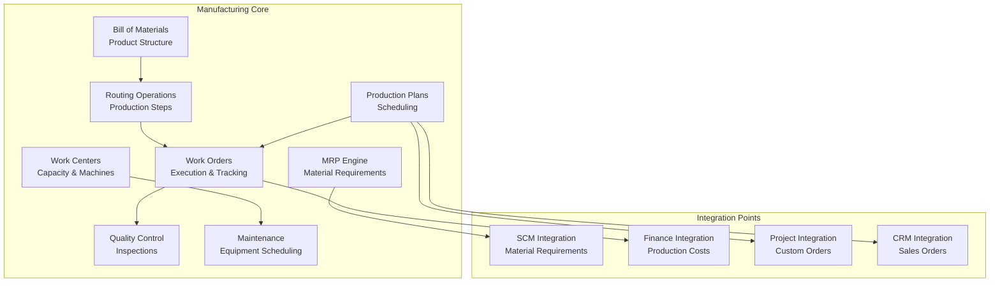
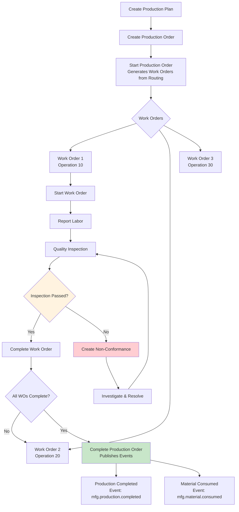
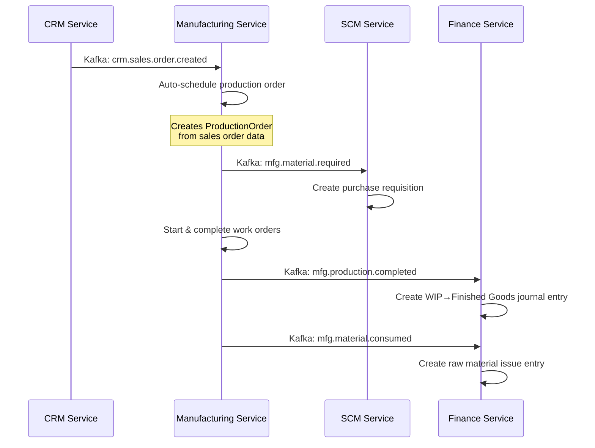

# Manufacturing Module

Production planning and execution with bill of materials, work orders, quality control, and equipment maintenance. Port **8004** (docker-compose: 8004).

## Module Overview



## Documentation Structure

### Core Features
- [Bill of Materials](bill-of-materials.md) - Product structure and component management
- [Routing Operations](routing-operations.md) - Production steps and work centers
- [Work Orders](work-orders.md) - Execution tracking and labor reporting
- [Production Planning](production-planning.md) - Scheduling and MRP
- [Quality Control](quality-control.md) - Inspections and non-conformance
- [Equipment Maintenance](equipment-maintenance.md) - Maintenance scheduling
- [Costing](costing.md) - Production cost tracking

### Integration and APIs
- [API Reference](api-reference.md) - Complete REST API documentation
- [Integration Patterns](integration-patterns.md) - Cross-module event flows
- [Event Architecture](event-architecture.md) - Domain events and messaging

### Implementation
- [Database Schema](database-schema.md) - Data models and relationships
- [Workflows](workflows.md) - Production process workflows

## Domain Models (14 types)

| Model | Key Fields | Description |
|-------|-----------|-------------|
| `BillOfMaterials` | ID, ProductID, Name, Version, Status (Draft/Active/Inactive), Components[] | Product structure definition |
| `BOMComponent` | ID, BOMID, ComponentProductID, Quantity, ScrapPercentage, UnitOfMeasure | Component within a BOM |
| `WorkCenter` | ID, Name, Code, Capacity, Efficiency, Status (Active/Inactive/Maintenance) | Production resource group |
| `RoutingOperation` | ID, BOMID, SequenceNo, WorkCenterID, SetupTime, RunTime, Description | Production step definition |
| `ProductionOrder` | ID, ProductID, Quantity, DueDate, Priority (Low/Medium/High/Critical), Status (Draft/Planned/Scheduled/InProgress/Completed/Cancelled) | Production request |
| `WorkOrder` | ID, ProductionOrderID, OperationID, Status (Pending/InProgress/Completed/Cancelled), StartTime, EndTime | Individual operation execution |
| `LaborReport` | ID, WorkOrderID, EmployeeID, HoursWorked, Date, Description | Labor tracking against work orders |
| `MachineLog` | ID, WorkCenterID, StartTime, EndTime, Status (Operational/Down/Maintenance) | Machine operational logging |
| `QualityInspection` | ID, WorkOrderID, InspectedBy, InspectionDate, Result (Pass/Fail), Notes, Defects[] | Quality check |
| `NonConformance` | ID, QualityInspectionID, Description, Severity (Minor/Major/Critical), Status (Open/Investigating/Resolved/Closed) | Quality issue tracking |
| `Equipment` | ID, WorkCenterID, Name, Model, SerialNumber, Status (Operational/Down/UnderMaintenance) | Physical machinery |
| `MaintenanceOrder` | ID, EquipmentID, ScheduleDate, Type (Preventive/Corrective/Predictive), Status (Scheduled/InProgress/Completed/Cancelled) | Maintenance task |
| `CostingRecord` | ID, ProductionOrderID, MaterialCost, LaborCost, OverheadCost, TotalCost | Production cost summary |

## Business Services (5)

### BOMService

| Method | Description | Side Effects |
|--------|-------------|-------------|
| `Create` | Create BOM with components | — |
| `GetByID` | Get BOM by ID | — |
| `GetAll` | List all BOMs | — |
| `Update` | Update BOM | — |
| `Delete` | Delete BOM | — |
| `CreateWorkCenter` | Create work center | — |
| `GetWorkCenter` | Get work center | — |
| `GetAllWorkCenters` | List work centers | — |
| `UpdateWorkCenter` | Update work center | — |
| `DeleteWorkCenter` | Delete work center | — |
| `CreateRoutingOperation` | Create routing | — |
| `GetAllRoutingOperations` | List routings | — |
| `UpdateRoutingOperation` | Update routing | — |
| `DeleteRoutingOperation` | Delete routing | — |

### ProductionService

| Method | Description | Side Effects |
|--------|-------------|-------------|
| `CreateProductionOrder` | Create production order from plan | Publishes `mfg.production.scheduled` |
| `GetProductionOrder` | Get production order | — |
| `GetAllProductionOrders` | List production orders | — |
| `UpdateProductionOrder` | Update production order | — |
| `DeleteProductionOrder` | Delete production order | — |
| `StartWorkOrder` | Start work order execution | Publishes `mfg.work.order.started` |
| `CompleteWorkOrder` | Complete work order | Publishes `mfg.work.order.completed` |
| `CancelWorkOrder` | Cancel work order | Publishes `mfg.work.order.cancelled` |
| `CompleteProductionOrder` | Complete all work orders, publish completion events | Publishes `mfg.production.completed`, `mfg.material.consumed` |
| `StartProductionOrder` | Start production (creates work orders from routing) | — |
| `ReportLabor` | Log labor hours against work order | — |
| `LogMachineLog` | Record machine operational status | — |
| `ScheduleMaintenance` | Create maintenance order | — |
| `CompleteMaintenance` | Complete maintenance | — |
| `DeleteMaintenance` | Delete maintenance order | — |
| `RunMRP` | Run material requirements planning | Publishes `mfg.material.required` for planned orders |
| `GetCostingRecord` | Get production costing summary | — |

### QualityService

| Method | Description | Side Effects |
|--------|-------------|-------------|
| `RecordQualityInspection` | Record inspection; on FAIL creates NonConformance | Publishes `mfg.quality.inspection.passed` or `mfg.quality.inspection.failed` |
| `GetQualityInspection` | Get inspection by ID | — |
| `GetAllQualityInspections` | List inspections | — |
| `UpdateQualityInspection` | Update inspection | — |

### MaintenanceService

| Method | Description |
|--------|-------------|
| `LogMachineStatus` | Log machine status for work center monitoring |
| `CreateEquipment` | Create an equipment record for work center |
| `ScheduleMaintenance` | Schedule maintenance order |
| `CompleteMaintenance` | Complete maintenance order |
| `ListMaintenanceSchedules` | List all maintenance schedules |
| `GetMaintenanceSchedule` | Get maintenance schedule |
| `UpdateMaintenanceSchedule` | Update maintenance schedule |

### CostingService (not wired)

| Method | Description |
|--------|-------------|
| `GetCostingRecord` | Get variance and costing record for production order |
| `RunMRP` | Run material requirements planning |

> **Note**: CostingService is CDD-defined but NOT wired in code. MRP logic is handled by ProductionService instead.

## API Endpoints (30 routes)

### Bill of Materials
```http
GET    /api/v1/boms              # List all BOMs
POST   /api/v1/boms              # Create BOM
GET    /api/v1/boms/:id          # Get BOM by ID
PUT    /api/v1/boms/:id          # Update BOM
DELETE /api/v1/boms/:id          # Delete BOM
```

### Routing Operations
```http
GET    /api/v1/routings           # List routing operations
POST   /api/v1/routings           # Create routing
GET    /api/v1/routings/:id       # Get routing
PUT    /api/v1/routings/:id       # Update routing
DELETE /api/v1/routings/:id       # Delete routing
```

### Work Orders
```http
GET    /api/v1/work-orders            # List work orders
POST   /api/v1/work-orders            # Create work order
GET    /api/v1/work-orders/:id        # Get work order
PUT    /api/v1/work-orders/:id        # Update work order
DELETE /api/v1/work-orders/:id        # Delete work order
POST   /api/v1/work-orders/:id/start  # Start work order execution
POST   /api/v1/work-orders/:id/complete # Complete work order
POST   /api/v1/work-orders/:id/labor  # Report labor hours
POST   /api/v1/work-orders/:id/inspect # Record quality inspection
```

### Production Plans
```http
GET    /api/v1/production-plans       # List production plans
POST   /api/v1/production-plans       # Create production plan
GET    /api/v1/production-plans/:id   # Get production plan
PUT    /api/v1/production-plans/:id   # Update production plan
DELETE /api/v1/production-plans/:id   # Delete production plan
```

### MRP
```http
POST   /api/v1/mrp/run               # Run MRP engine
```

### Quality Inspections
```http
GET    /api/v1/quality-inspections    # List inspections
POST   /api/v1/quality-inspections    # Record inspection
GET    /api/v1/quality-inspections/:id  # Get inspection
PUT    /api/v1/quality-inspections/:id  # Update inspection
DELETE /api/v1/quality-inspections/:id  # Delete inspection
```

### Work Centers
```http
GET    /api/v1/work-centers           # List work centers
POST   /api/v1/work-centers           # Create work center
GET    /api/v1/work-centers/:id       # Get work center
PUT    /api/v1/work-centers/:id       # Update work center
DELETE /api/v1/work-centers/:id       # Delete work center
POST   /api/v1/work-centers/:id/machine-log # Record machine log
```

### Maintenance Schedules
```http
GET    /api/v1/maintenance-schedules       # List maintenance schedules
POST   /api/v1/maintenance-schedules       # Create maintenance schedule
GET    /api/v1/maintenance-schedules/:id   # Get maintenance schedule
PUT    /api/v1/maintenance-schedules/:id   # Update maintenance schedule
DELETE /api/v1/maintenance-schedules/:id   # Delete maintenance schedule
```

## Production Workflow

### Standard Production Lifecycle


### Make-to-Order Flow (CRM → Manufacturing)


## Kafka Integration

### Events Published (24 topics)

**Production Lifecycle:**
| Topic | Trigger | Event Payload |
|-------|---------|---------------|
| `mfg.production.scheduled` | CreateProductionOrder | `ProductionScheduledEvent{OrderID, ProductID, Quantity, ScheduledDate}` |
| `mfg.production.started` | StartProductionOrder | `ProductionStartedEvent{OrderID, StartTime}` |
| `mfg.production.completed` | CompleteProductionOrder | `ProductionCompletedEvent{OrderID, ProductID, Quantity, CompletionDate}` |
| `mfg.production.delayed` | — | `ProductionDelayedEvent{OrderID, DelayDays, Reason}` |
| `mfg.work.order.created` | StartProductionOrder | `WorkOrderCreatedEvent{OrderID, WorkOrderID, OperationID}` |
| `mfg.work.order.started` | StartWorkOrder | `WorkOrderStartedEvent{WorkOrderID, StartTime}` |
| `mfg.work.order.completed` | CompleteWorkOrder | `WorkOrderCompletedEvent{WorkOrderID, CompletionTime}` |
| `mfg.work.order.cancelled` | CancelWorkOrder | `WorkOrderCancelledEvent{WorkOrderID, Reason}` |

**Quality:**
| Topic | Trigger | Event Payload |
|-------|---------|---------------|
| `mfg.quality.inspection.passed` | RecordQualityInspection (PASS) | `QualityInspectionPassedEvent{WorkOrderID, Inspector}` |
| `mfg.quality.inspection.failed` | RecordQualityInspection (FAIL) | `QualityInspectionFailedEvent{WorkOrderID, Defects}` |
| `mfg.quality.non.conformance.detected` | Auto-created on FAIL | `NonConformanceEvent{InspectionID, Severity, Description}` |

**Equipment:**
| Topic | Trigger |
|-------|---------|
| `mfg.equipment.down` | MachineLog with Down status |
| `mfg.equipment.up` | MachineLog with Operational status |
| `mfg.maintenance.scheduled` | ScheduleMaintenance |
| `mfg.maintenance.completed` | CompleteMaintenance |

**Material:**
| Topic | Trigger |
|-------|---------|
| `mfg.material.consumed` | CompleteProductionOrder |
| `mfg.material.wasted` | — |
| `mfg.material.required` | RunMRP |

### Events Consumed (6 topics, per CDD)

| Topic | Publisher | Logic |
|-------|-----------|-------|
| `scm.material.received` | SCM | Logged only |
| `scm.inventory.updated` | SCM | Logged only |
| `crm.sales.order.created` | CRM | Auto-schedule production order |
| `fin.cost.budget.allocated` | FM | Adjust production schedules |
| `hr.employee.scheduled` | HR | Logged only |
| `prj.custom.order.created` | PM | Schedule custom production |

## Seed Data

On startup, the service seeds a default BOM for a "Widget Assembly" product:

- **BOM**: "Widget Assembly BOM" v1.0 (Status: Active)
- **Components**: Component A (qty 2), Component B (qty 1), Sub-Assembly C (qty 1)
- **Work Center**: "Assembly Line 1" (Capacity: 100, Efficiency: 95%)
- **Routing**: "Assembly Routing" with operation "Final Assembly" (SetupTime: 30min, RunTime: 15min per unit)

## Relation to Other Modules

| Module | Integration | Direction |
|--------|-------------|-----------|
| **CRM** | Sales orders trigger production | Inbound (crm.sales.order.created) |
| **PM** | Custom production orders via project requests | Inbound (prj.custom.order.created) |
| **SCM** | Material requirements sent for procurement | Outbound (mfg.material.required) |
| **FM** | Production completion triggers cost accounting | Outbound (mfg.production.completed) |

## Known Limitations

- **MRP run is a stub** — `RunMRP` publishes material required events for planned orders but does not calculate actual requirements from BOM explosion
- **Costing is read-only** — `CostingRecord` fields are never populated by actual cost roll-up logic
- **No backflushing** — material consumption is not automatically deducted from inventory
- **No scheduling algorithm** — work order start/end times are manually set, no capacity-constrained scheduling
- **Single work center per routing** — no support for parallel or alternative operations
- **No batch/lot tracking** — production batches and lot numbers are not tracked
