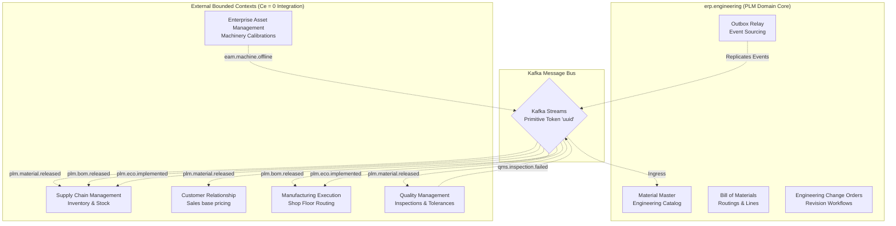

# Product Lifecycle Management (PLM) Module

Product specifications, base catalogs, Bill of Materials (BOM), Engineering Change Orders (ECO), and design revision tracking. Port **8008** (docker-compose: 8008).

## Module Overview

Within the enterprise ERP architecture, the Product Lifecycle Management (PLM) module operates as the **absolute engineering design authority** (managing EBOM, ECO, and CAD references), while the core ERP serves as the system of record for execution (MBOM, routing, inventory, costing).

```
[ Engineering / CAD ] ──> [ PLM Domain (EBOM, ECO) ]
                                  │
                                  ▼  (Architectural Boundary)
[ Sourcing / Costing ] ──> [ ERP Domain (MBOM, Routing) ]
```

By enforcing an efferent coupling metric of zero ($C_e = 0$) at its database tier, the module eliminates compile-time dependencies on downstream operational systems. It interacts with peer operational modules exclusively via asynchronous, single-direction Kafka event streams using primitive identifiers (`uuid`) as data tokens.



---

## PLM-ERP Boundary Quantitative Metric Evaluation

Applying structural metric taxonomy to the PLM-ERP interface establishes clear boundaries between engineering data and transactional execution.

| Metric Category | Target Indicator | PLM-ERP Architectural Application & Standards |
| :--- | :--- | :--- |
| **Efferent Coupling ($C_e$)** | Outbound dependencies | Measures how many ERP transactional tables (e.g. Sourcing, Inventory Master) an Engineering Change Order (ECO) service directly calls. **Standard:** $C_e = 0$ is enforced by decoupling via the Kafka event broker. |
| **Afferent Coupling ($C_a$)** | Inbound dependencies | Measures how many downstream ERP modules (e.g. MRP, MES, Procurement) depend on the PLM Material Master or BOM synchronization service. **Standard:** $C_a$ is high, requiring rigid schema contracts to prevent downstream structural breakage. |
| **Instability Index ($I$)** | Resiliency to change | Calculated as: $I = \frac{C_e}{C_a + C_e}$. The **Engineering Bill of Materials (EBOM)** core maintains an index of $I = 0.0$ (Highly Stable). Procurement/routing changes do not destabilize engineering blueprints. |
| **Component Balance (CB)** | Structural uniformity | Distribution of logic between EBOM management, Routing, and Change Management is balanced ($CB = 9.9/10$), avoiding a "God-Module" scenario inside the Material Master. |

---

## Topographical Domain Interaction Map

The diagram below outlines the runtime boundary of the `erp.engineering` module, illustrating how it consumes external events from QMS and EAM systems while publishing released engineering revisions downstream.

```
       [ QMS Core ]               [ EAM Tooling ]             
            │                          │                          
            │ qms.inspection.failed    │ eam.machine.offline        
            ▼                          ▼                          
┌───────────────────────────────────────────────────────────────────────────────────────┐
│ erp.engineering BOUNDED CONTEXT (Go / Gin)                                            │
│                                                                                       │
│  ┌─────────────────────────┐     ┌─────────────────────────┐     ┌─────────────────┐  │
│  │   KafkaEventInbox       │     │   MaterialMaster        │     │   BomHeader     │  │
│  │   (Idempotent Receiver) │     │   (OCC Versioning)      │     │   & BomLine     │  │
│  └───────────┬─────────────┘     └─────────────────────────┘     └─────────────────┘  │
│              │                                                                        │
│              ▼                                                                        │
│  ┌─────────────────────────┐             ┌────────────────────────────────────────┐  │
│  │   EngineeringChange     │────────────►│   TransactionalOutbox                  │  │
│  │   Order (ECO Status)    │             │   (Atomic Event Log)                   │  │
│  └─────────────────────────┘             └───────────────────┬────────────────────┘  │
│                                                              │                        │
└──────────────────────────────────────────────────────────────┼────────────────────────┘
                                                               │
                               ┌───────────────────────────────┴────────────────────────┐
                               │ plm.material.released                                  │ plm.bom.released / eco.implemented
                               ▼                                                        ▼
                    [ SCM / CRM / QMS ]                                            [ MFG / SCM ]
```

---

## Event Ingress & Egress Pipelines

### 1. Inbound Message Streams (Ingress Pipeline)

Inbound payloads are intercepted by the `plm_kafka_event_inbox` engine. The inbox worker forces exact event deduplication (idempotency check) and encapsulates state modification within a single database transaction block.

#### A. `qms.inspection.failed`
* **Source:** Quality Management System (QMS)
* **Payload Intent:** Indicates that a specific material batch or component lot has dropped below structural tolerance limits during standard quality inspection runs.
* **PLM Execution Logic:** The inbox processor intercepts the event payload, maps the item identifier to the target `MaterialMaster` record, and updates the technical specifications to log a suspected design flaw warning. This alerts the engineering group and stages a potential corrective Engineering Change Order (ECO) loop to fix a suspected design flaw.

#### B. `eam.machine.offline`
* **Source:** Enterprise Asset Management (EAM)
* **Payload Intent:** Broadcasts a notification that critical production machinery or tooling on the factory floor has gone offline due to calibration drifts or structural wear.
* **PLM Execution Logic:** Registers temporary production constraints directly inside the active engineering workspace. This metadata alerts design engineers to modify part tolerances or processing parameters for subsequent component revisions to accommodate alternative machinery configurations.

---

### 2. Outbound Message Streams (Egress Pipeline)

To protect the system from data loss during unexpected broker network drops, outbound events are captured inside the `plm_transactional_outbox` table as part of the primary business database transaction. An asynchronous background worker thread polls this table to publish messages to the Kafka cluster.

#### A. `plm.material.released`
* **Downstream Contexts:** SCM (Inventory), CRM (Sales Catalog), QMS (Quality Assurance)
* **Functional Impact:**
  * **SCM:** Allocates zero-balance records inside `scm_stock_balances` across primary warehouse logistics sites to enable immediate material purchasing.
  * **CRM:** Appends the raw item token to the product catalog, allowing pricing analysts to assign sales configurations.
  * **QMS:** Triggers automated template parsing routines to create baseline inspection records matched to the new material's engineering specifications.

#### B. `plm.bom.released`
* **Downstream Contexts:** MFG (Shop Floor Control), SCM (Material Requirements Planning / MRP)
* **Functional Impact:**
  * **MFG:** Updates master shop floor routing trees, ensuring that future component picklists for upcoming production work orders pull the exact part revisions designated in the new BOM version.
  * **SCM:** Feeds automated Material Requirements Planning (MRP) calculations. This enables the scheduling engine to analyze multi-level part explosions and calculate sub-component manufacturing lead times based on the new assembly structures.

#### C. `plm.eco.implemented`
* **Downstream Contexts:** All Peer Operational Modules
* **Functional Impact:** Confirms that an Engineering Change Order has cleared final sign-off, making the older item revision obsolete and activating its replacement version. Operational consumer systems use this event to shift open purchase requisitions, active quality test matrices, and shop floor work order routes to the newest revision, eliminating backward-compatibility data conflicts.

---

## ISO/IEC 25010 Quality Axes Benchmarks

### A. Performance Efficiency
* **Time Behavior:** Engineering Change Orders (ECO) releasing 10,000+ line items must execute deep-tree validation against the ERP Item Master within defined processing caps. Database locking duration during BOM serialization is minimized to avoid blocking active Material Requirements Planning (MRP) calculations.
* **Capacity:** The system architecture sustains parallel CAD metadata deployments and bulk visual rendering conversions (e.g. JT or STEP transformation pipelines) without starving the execution memory pool of concurrent transactional ERP users.

### B. Maintainability & Portability
* **Modularity (EBOM-MBOM Separation):** Separation of the **EBOM (As-Designed)** and **MBOM (As-Manufactured)** domains. A modification in plant-specific routing or sourcing variants executes cleanly within the ERP perimeter without triggering schema mutations or version rollbacks in the PLM database.
* **Testability:** Implementation of isolated execution verification via service stubs. Engineering change validation logic is fully verifiable via mocked ERP inventory and vendor masters, enabling independent testing of PLM workflows without connecting to a live ERP instance.

### C. Reliability & Security
* **Fault Tolerance & Recoverability:** If the ERP core goes offline during a massive engineering release sync, the PLM outbox pattern guarantees transactional integrity (RPO of zero).
* **Accountability & Integrity:** All state changes to the product structure use cryptographic linear chaining within the audit trail to prevent retroactive tampering with technical data packages.

---

## Scenario-Based Evaluation Frameworks

### ATAM Scenario: EBOM-to-MBOM Translation Matrix
* **Architectural Choice:** Shared Unified Database Schema vs. Asynchronous Event-Driven Decoupled Architecture.
* **Sensitivity Point:** Data Consistency vs. System Autonomy.
* **Trade-off Analysis:**
  ```
  ┌─── Shared Schema (High Consistency / Fragile Boundaries)
  │
  [ Architectural Choice ] ──────┤
  │
  └─── Event-Driven (High Autonomy / Eventual Consistency)
  ```
  * *Shared Schema:* Optimizes Performance Efficiency (zero latency sync) but severely degrades Maintainability ($C_e$ and $C_a$ metrics spike, causing high structural fragility) and limits independent scalability.
  * *Event-Driven:* Optimizes Modularity and Fault Tolerance (ERP downtime does not lock PLM engineering operations). The trade-off is introduced complexity in maintaining **Eventual Consistency** and handling out-of-order execution packets.

### CBAM (Cost-Benefit Analysis Method)
* **Economic ROI Context:** Migrating from legacypoint-to-point hardcoded PLM-ERP synchronous interfaces to an event broker compliance layer.
* **ROI Metric:** The development cost of constructing the canonical abstraction layer is balanced against the reduction in maintenance hours reclaimed during ERP version upgrades.

---

## Generative / Automation Benchmarks (ArchBench)

* **ADR (Architecture Decision Record) Alignment:** Auto-generated microservices handling CAD file extraction and EBOM parsing are analyzed via semantic similarity metrics (such as BERTScore). The pipeline validates that generated designs strictly adhere to established organizational ADRs regarding payload encryption, file chunking strategies, and RESTful statelessness.
* **Traceability Link Recovery ($F_1$ Score):** The pipeline maps logical entity relationships (e.g. `EngineeringPart` in PLM to `MaterialMaster` in ERP) and enforces exact set matching via **$F_1$ score tracking** with a rejection threshold below $F_1 = 0.95$.

---

## Domain Models

| Model | CDD Table Reference | Description |
|-------|---------------------|-------------|
| `MaterialMaster` | `plm_materials` | Master product catalog entry representing physical items with base units of measure (UOM) and specifications. |
| `BomHeader` | `plm_bom_headers` | Header representing the bill of materials parent structure version (e.g. REV-1.0) and status. |
| `BomLine` | `plm_bom_lines` | Child component line detailing material item quantity required, sequence, and expected scrap margins. |
| `EngineeringChangeOrder` | `plm_engineering_change_orders` | Workflow tracking document staging revision changes (Draft, Review, Implemented). |
| `TransactionalOutbox` | `plm_transactional_outbox` | Outbox pattern message store ensuring at-least-once message delivery to Kafka. |
| `KafkaEventInbox` | `plm_kafka_event_inbox` | Idempotency log tracking processed Kafka message IDs and execution statuses. |

---

## Business Services

#### MaterialService
- `createMaterial`: Define a new material under a legal entity with a SKU and unit of measure.
- `updateTechnicalSpecs`: Update tech specification properties dynamically (stored as specs metadata).
- `transitionStatus`: Update material lifecycle statuses (Active, Inactive, Obsolete).

#### BomService
- `establishBomHeader`: Create a new Bill of Materials recipe version.
- `releaseBom`: Validate and activate a BOM header, publishing the components list.
- `explodeBillOfMaterials`: Run a recursive depth traversal of the BOM structure to yield components logs.

#### EngineeringChangeService
- `initiateChangeRequest`: Issue a change request ECO for review.
- `processApprovalAction`: Reject, approve, or implement the ECO sequence (publishes implemented events).

---

## API Endpoints (8 routes)

### Materials
```http
POST   /api/v1/plm/materials              # Create Material
PUT    /api/v1/plm/materials/:id/specs    # Update Technical Specs
PUT    /api/v1/plm/materials/:id/status   # Transition Lifecycle Status
```

### Bill of Materials (BOM)
```http
POST   /api/v1/plm/boms                   # Establish BOM Header
POST   /api/v1/plm/boms/:id/release       # Release BOM
GET    /api/v1/plm/boms/:id/explode       # Explode Bill of Materials
```

### Engineering Change Orders (ECO)
```http
POST   /api/v1/plm/ecos                   # Initiate Change Request (ECO)
POST   /api/v1/plm/ecos/:id/action        # Process Approval Action
```
