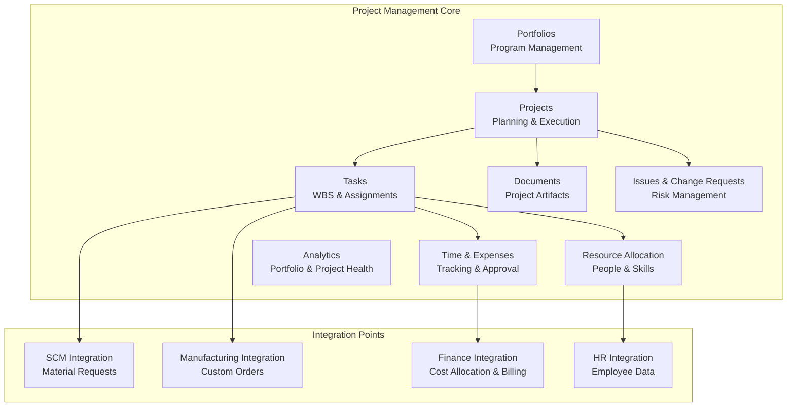
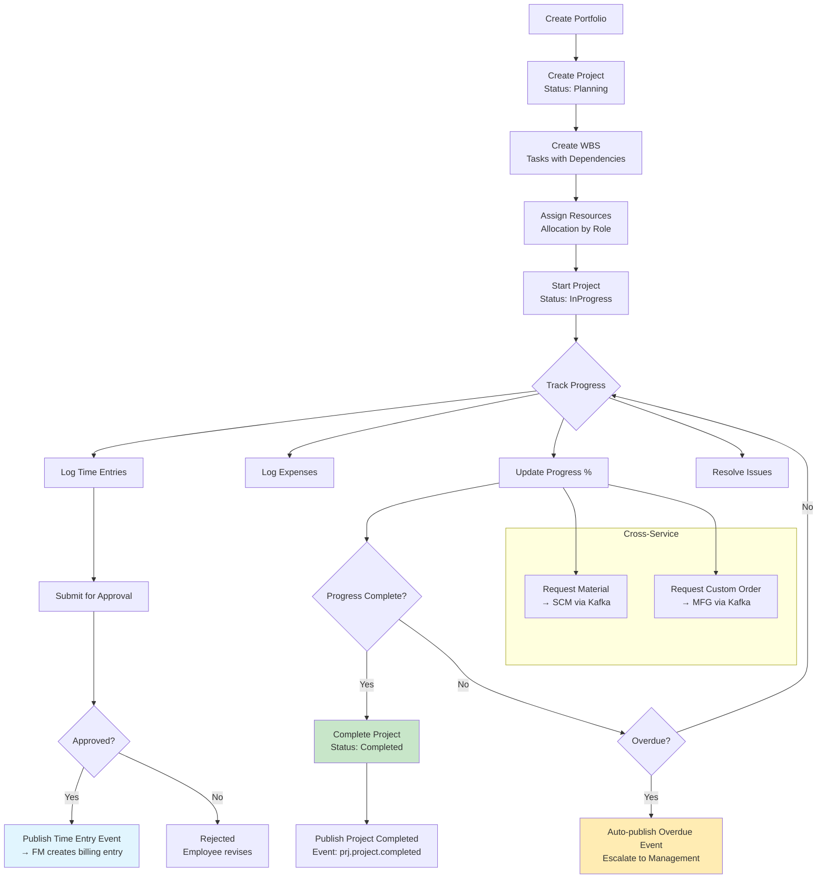
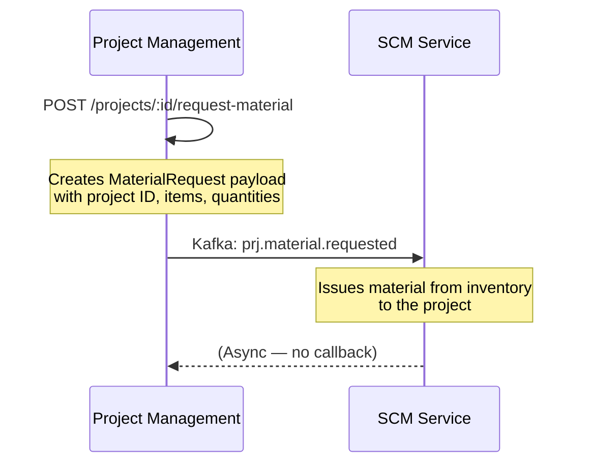
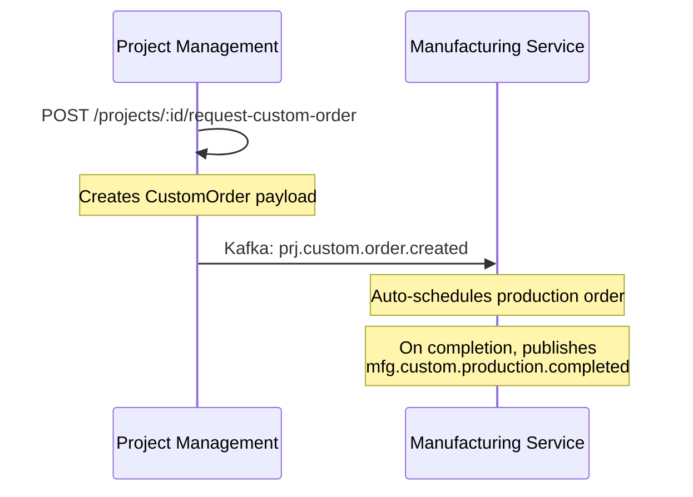

# Project Management Module

Portfolios, projects, tasks, resource allocation, time/expense tracking, documents, issues, change requests, and cross-service integration. Port **8005** (docker-compose: 8005).

## Module Overview



## Documentation Structure

### Features Covered in This Document

This README documents the following PM features inline:
- Portfolio Management — Program and portfolio oversight
- Project Planning — Project creation and lifecycle
- Task Management — WBS, dependencies, and assignments
- Resource Management — Allocation and capacity
- Time & Expense Tracking — Time entries, expenses, approvals
- Collaboration — Documents, issues, change requests

## Domain Models (12 types)

| Model | Key Fields | Description |
|-------|-----------|-------------|
| `Portfolio` | ID, Name, Description, Budget, Status (Active/Inactive) | Program or project grouping |
| `Project` | ID, PortfolioID, Name, Description, StartDate, EndDate, Budget, Status (Planning/InProgress/OnHold/Completed/Cancelled) | Project definition |
| `Task` | ID, ProjectID, ParentTaskID, Name, Description, Status (Open/InProgress/Completed/OnHold/Cancelled), AssignedTo, StartDate, DueDate, Progress, Priority, EstimatedHours, ActualHours | Work breakdown element |
| `TaskDependency` | ID, TaskID, DependsOnTaskID, DependencyType (FS/FF/SS/SF) | Predecessor relationship |
| `ResourceAllocation` | ID, ProjectID, EmployeeID, Role, AllocationPercentage, StartDate, EndDate | Person assignment to project |
| `ProjectTimeEntry` | ID, ProjectID, EmployeeID, Date, Hours, Description, Status (Draft/Submitted/Approved/Rejected) | Time logged against project |
| `ProjectExpense` | ID, ProjectID, Category, Amount, Description, Date, Status (Draft/Submitted/Approved/Rejected) | Expense incurred for project |
| `ProjectDocument` | ID, ProjectID, Name, Type (Contract/Report/Specification/Other), FileURL, UploadedBy | Project artifact |
| `ProjectIssue` | ID, ProjectID, Title, Description, Priority (Low/Medium/High/Critical), Status (Open/InProgress/Resolved/Closed), AssignedTo | Project risk/blocker |
| `ChangeRequest` | ID, ProjectID, Title, Description, Impact, Status (Draft/Submitted/Approved/Rejected/Implemented) | Scope change request |
| `ProjectActivity` | ID, ProjectID, ActivityType, Description, PerformedBy, Timestamp | Audit log entry |

## Business Services (6)

### ProjectPlanningService

| Method | Description | Side Effects |
|--------|-------------|-------------|
| `CreatePortfolio` | Create portfolio | — |
| `GetPortfolio` | Get portfolio by ID | — |
| `GetAllPortfolios` | List all portfolios | — |
| `UpdatePortfolio` | Update portfolio | — |
| `DeletePortfolio` | Delete portfolio | — |
| `CreateProject` | Create project, auto-assign to portfolio | Publishes `prj.project.created` |
| `GetProject` | Get project by ID | — |
| `GetAllProjects` | List all projects | — |
| `UpdateProjectStatus` | Update project status, publish lifecycle events | Publishes `prj.project.started`, `prj.project.completed`, `prj.project.cancelled`, or `prj.project.delayed` |
| `UpdateProject` | Update project details | Publishes `prj.project.updated` |

### TaskManagementService

| Method | Description | Side Effects |
|--------|-------------|-------------|
| `CreateTask` | Create task within project | Publishes `prj.task.created` |
| `GetAllTasks` | List tasks for project | — |
| `AddDependency` | Add task dependency | — |
| `UpdateTaskProgress` | Update progress %, check over-due | Publishes `prj.task.completed` or `prj.task.overdue` |
| `AssignTask` | Assign task to employee | Publishes `prj.task.assigned` |

### ResourceManagementService

| Method | Description | Side Effects |
|--------|-------------|-------------|
| `CreateAllocation` | Allocate resource to project | Publishes `prj.resource.allocated` |
| `GetAllocations` | List allocations for project | — |

### TimeExpenseService

| Method | Description | Side Effects |
|--------|-------------|-------------|
| `CreateTimeEntry` | Log time entry | Publishes `prj.time.logged` |
| `GetTimeEntries` | List time entries for project | — |
| `ApproveTimeEntry` | Approve time entry | Publishes `prj.time.approved` |
| `RejectTimeEntry` | Reject time entry | Publishes `prj.time.rejected` |
| `CreateExpense` | Log expense | Publishes `prj.expense.submitted` |
| `GetExpenses` | List expenses for project | — |
| `ApproveExpense` | Approve expense | Publishes `prj.expense.approved` |
| `RejectExpense` | Reject expense | Publishes `prj.expense.rejected` |

### CollaborationService

| Method | Description | Side Effects |
|--------|-------------|-------------|
| `AddDocument` | Upload project document | — |
| `GetDocuments` | List documents for project | — |
| `CreateIssue` | Create issue | — |
| `GetIssues` | List issues for project | — |
| `ResolveIssue` | Resolve issue | — |
| `CreateChangeRequest` | Create change request | — |
| `GetChangeRequests` | List change requests for project | — |
| `ApproveChangeRequest` | Approve change request | — |

### PortfolioAnalyticsService

| Method | Description |
|--------|-------------|
| `GetPortfolioSummary` | Aggregate portfolio metrics (total projects, budget, timeline) |

## API Endpoints (23 routes)

### Portfolios
```http
GET    /api/v1/projects/portfolios                     # List portfolios
POST   /api/v1/projects/portfolios                     # Create portfolio
GET    /api/v1/projects/portfolios/:id                 # Get portfolio
PUT    /api/v1/projects/portfolios/:id                 # Update portfolio
DELETE /api/v1/projects/portfolios/:id                 # Delete portfolio
GET    /api/v1/projects/portfolios/:id/summary         # Portfolio summary
```

### Projects
```http
GET    /api/v1/projects                                # List all projects
POST   /api/v1/projects                                # Create project
GET    /api/v1/projects/:id                            # Get project
PUT    /api/v1/projects/:id                            # Update project
```

### Tasks
```http
GET    /api/v1/projects/:id/tasks                      # List tasks
POST   /api/v1/projects/:id/tasks                      # Create task
PUT    /api/v1/projects/tasks/:task_id/progress        # Update progress
PUT    /api/v1/projects/tasks/:task_id/assign          # Assign task
POST   /api/v1/projects/tasks/:task_id/dependencies    # Add dependency
```

### Resource Allocations
```http
GET    /api/v1/projects/:id/allocations                # List allocations
POST   /api/v1/projects/:id/allocations                # Create allocation
```

### Time & Expense
```http
GET    /api/v1/projects/:id/time                       # List time entries
POST   /api/v1/projects/:id/time                       # Create time entry
PUT    /api/v1/projects/time/:time_id/approve          # Approve time entry
GET    /api/v1/projects/:id/expenses                   # List expenses
POST   /api/v1/projects/:id/expenses                   # Create expense
PUT    /api/v1/projects/expenses/:expense_id/approve   # Approve expense
```

### Documents
```http
GET    /api/v1/projects/:id/documents                  # List documents
POST   /api/v1/projects/:id/documents                  # Add document
```

### Issues
```http
GET    /api/v1/projects/:id/issues                     # List issues
POST   /api/v1/projects/:id/issues                     # Create issue
PUT    /api/v1/projects/issues/:issue_id/resolve       # Resolve issue
```

### Change Requests
```http
GET    /api/v1/projects/:id/change-requests            # List change requests
POST   /api/v1/projects/:id/change-requests            # Create change request
PUT    /api/v1/projects/change-requests/:request_id/approve # Approve change request
```

### Cross-Service Integration
```http
POST   /api/v1/projects/:id/request-material           # Request material from SCM
POST   /api/v1/projects/:id/request-custom-order       # Request custom order from MFG
```

## Project Lifecycle



## Kafka Integration

### Events Published (25 topics)

**Project Lifecycle:**
| Topic | Trigger | Event Payload |
|-------|---------|---------------|
| `prj.project.created` | CreateProject | `ProjectCreatedEvent{ProjectID, Name, Budget}` |
| `prj.project.updated` | UpdateProject | — |
| `prj.project.started` | UpdateProjectStatus (→InProgress) | — |
| `prj.project.completed` | UpdateProjectStatus (→Completed) | `ProjectCompletedEvent{ProjectID}` |
| `prj.project.cancelled` | UpdateProjectStatus (→Cancelled) | — |
| `prj.project.delayed` | Checked during progress update | `ProjectDelayedEvent{ProjectID, DelayDays}` |

**Task Events:**
| Topic | Trigger | Event Payload |
|-------|---------|---------------|
| `prj.task.created` | CreateTask | `TaskCreatedEvent{TaskID, ProjectID, AssignedTo}` |
| `prj.task.assigned` | AssignTask | `TaskAssignedEvent{TaskID, EmployeeID}` |
| `prj.task.started` | — | — |
| `prj.task.completed` | UpdateTaskProgress (→100%) | `TaskCompletedEvent{TaskID}` |
| `prj.task.overdue` | UpdateTaskProgress (past due date) | `TaskOverdueEvent{TaskID, OverdueDays}` |

**Resource Events:**
| Topic | Trigger |
|-------|---------|
| `prj.resource.allocated` | CreateAllocation |
| `prj.resource.released` | — |
| `prj.resource.overallocated` | — |

**Time & Expense Events:**
| Topic | Trigger | Consumer |
|-------|---------|----------|
| `prj.time.logged` | CreateTimeEntry | FM (create unbilled receivable entry) |
| `prj.time.approved` | ApproveTimeEntry | — |
| `prj.time.rejected` | RejectTimeEntry | — |
| `prj.expense.submitted` | CreateExpense | — |
| `prj.expense.approved` | ApproveExpense | — |
| `prj.expense.rejected` | RejectExpense | — |
| `prj.expense.incurred` | — | FM (capitalize project cost) |

**Integration Events:**
| Topic | Trigger | Consumer |
|-------|---------|----------|
| `prj.material.requested` | RequestMaterial endpoint | SCM (issue material from inventory) |
| `prj.custom.order.created` | RequestCustomOrder endpoint | MFG (schedule custom production) |
| `prj.milestone.achieved` | — | — |
| `prj.milestone.delayed` | — | — |

### Events Consumed (8 topics, per CDD)

| Topic | Publisher | Consumer Logic |
|-------|-----------|----------------|
| `hr.employee.available` | HR | Logged only |
| `hr.employee.skills.updated` | HR | Logged only |
| `fin.budget.approved` | FM | Release project funding upon budget approval |
| `fin.payment.received` | FM | Logged only |
| `crm.sales.order.received` | CRM | Auto-create project + kickoff task |
| `scm.material.delivered` | SCM | Logged only |
| `mfg.custom.production.completed` | MFG | Logged only |

## Cross-Service Integration

### Material Request Flow


### Custom Order Flow


## Seed Data

On startup, the service seeds comprehensive mock data:

| Entity | Records | Key Details |
|--------|---------|-------------|
| **Portfolios** | 1 | "Corporate Projects" (Budget: $5M) |
| **Projects** | 1 | "Website Redesign" (Portfolio: Corporate, Budget: $500K, Status: InProgress) |
| **Tasks** | 2 | "Design Mockups" (AssignedTo: user1, Status: InProgress, Progress: 80%), "Frontend Implementation" (AssignedTo: user2, Status: Open, Progress: 0%) |
| **Dependencies** | 1 | Frontend depends on Design (FS — Finish-to-Start) |
| **Time Entries** | 2 | 8h on Design Mockups, 6h on Frontend Implementation |
| **Expenses** | 2 | Software Licenses ($1,200), Travel Expenses ($850) |
| **Documents** | 2 | Project Charter (Contract), Requirements Document (Specification) |
| **Issues** | 2 | "Design Approval Delayed" (High), "Missing API Documentation" (Medium) |
| **Change Requests** | 1 | "Add Mobile Responsiveness" (Submitted) |
| **Resource Allocations** | 1 | Employee user1 as Developer (80% allocation) |

## Relation to Other Modules

| Module | Integration | Direction | Topic |
|--------|-------------|-----------|-------|
| **FM** | Time logged → unbilled receivable | Outbound | `prj.time.logged` |
| **FM** | Expense incurred → project cost | Outbound | `prj.expense.incurred` |
| **FM** | Budget approved → release funding | Inbound | `fin.budget.approved` |
| **SCM** | Material request → issue from inventory | Outbound | `prj.material.requested` |
| **MFG** | Custom production request | Outbound | `prj.custom.order.created` |
| **HR** | Employee data via REST lookup | Outbound (REST) | — |

## Known Limitations

- **Resource allocation is a stub** — allocations are stored but not checked for conflicts or overallocation; no capacity planning
- **No Gantt/baseline scheduling** — no critical path calculation or schedule baseline tracking
- **No budget tracking** — `Project.Budget` field exists but no actual spend vs. budget calculation (that would require FM integration)
- **No role-based resource matching** — allocation assigns a specific employee directly, no skill/role matching
- **No activity/audit log persistence** — `ProjectActivity` model exists but is not populated in handlers
- **Integration triggers are fire-and-forget** — `RequestMaterial` and `RequestCustomOrder` publish Kafka events but provide no confirmation or tracking of the downstream action
- **No project templates** — projects are always created from scratch with no template support
