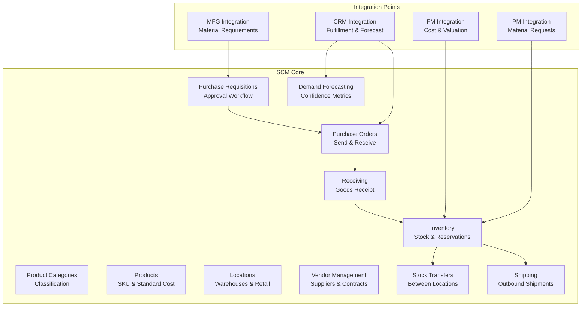

# Supply Chain Management Module

Product catalog, inventory, procurement, vendor management, warehouse operations, and demand forecasting. Port **8003** (docker-compose: 8006).

## Module Overview

## Documentation Structure

### Core Features
- [README](README.md) — Module overview, models, services, and endpoints list
- [API Reference](api-reference.md) — Complete REST API documentation with examples

---

## Domain Models

| Model | Key Fields | Description |
|-------|-----------|-------------|
| `Product` | ID, ProductCode, ProductName, Description, ProductType, CategoryID, UnitOfMeasure, StandardCost, ListPrice, IsActive | Product master catalog definition |
| `ProductCategory` | ID, Code, Name, Description | Hierarchical category definitions (flat storage) |
| `Location` | ID, LocationCode, LocationName, LocationType, IsActive | Warehouse, retail center, or transit location |
| `Supplier` | ID, SupplierCode, SupplierName, ContactName, Email, Phone, IsActive | Supplier register details |
| `VendorContract` | ID, ContractNumber, SupplierID, StartDate, EndDate, Terms, Status | Contract agreements with vendors |
| `PurchaseRequisition` | ID, ReqNumber, RequesterID, RequestDate, Status, TotalAmount, Notes | Internal purchase request header |
| `PurchaseRequisitionLine` | ID, PurchaseRequisitionID, ProductID, QuantityRequested, EstimatedUnitPrice, LineTotal | Purchase request line item |
| `PurchaseOrder` | ID, PoNumber, SupplierID, OrderDate, ExpectedDelivery, Status, TotalAmount, Notes | Outbound purchase order header |
| `PurchaseOrderLine` | ID, PurchaseOrderID, ProductID, QuantityOrdered, QuantityReceived, UnitPrice, LineTotal, Description | Purchase order line item |
| `InventoryItem` | ID, ProductID, LocationID, QuantityOnHand, QuantityReserved, QuantityAvailable, ReorderPoint, MaximumStock, UnitCost | Real-time stock status per product and location |
| `InventoryMovement` | ID, ProductID, LocationID, MovementType, Quantity, UnitCost, ReferenceType, ReferenceID, Notes | Immutable stock movement journal entry |
| `StockTransfer` | ID, FromLocationID, ToLocationID, ProductID, Quantity, Status, TransferredAt | Intra-company inventory transfer record |
| `Receipt` | ID, PurchaseOrderID, ReceivedDate, Status, Notes | Goods receipt header |
| `ReceiptLine` | ID, ReceiptID, ProductID, QuantityReceived, LocationID | Received items line details |
| `Shipment` | ID, Carrier, TrackingNumber, EstimatedDelivery, Status, Notes | Outbound shipment header |
| `ShipmentLine` | ID, ShipmentID, ProductID, QuantityShipped, LocationID | Shipped items line details |
| `DemandForecast` | ID, ProductID, ForecastDate, ForecastQuantity, ConfidenceLevel, Notes | Demand forecasting allocation |

---

## Business Services

### ProductManagementService
- CRUD operations for products, categories, and locations.
- Seed startup location: `"Main Warehouse"` (Code: `MAIN-WH`, Type: `WAREHOUSE`).

### SupplierManagementService
- CRUD operations for suppliers and vendor contracts.

### PurchaseOrderService
- Purchase Requisition lifecycle (create, update, approve, reject).
- Purchase Order lifecycle (create, update, send, delete).
- Generates outbound PO events and coordinates reservations.

### InventoryService
- Create inventory items, reserve stock, and release reservations.
- Record inventory movements.
- Request and execute Stock Transfers between locations.

### WarehouseService
- ProcessGoodsReceipt (receipts CRUD) and outbound shipments.

### DemandPlanningService
- Manage demand forecasts.

---

## API Endpoints (47 routes)

### Product Categories
- `GET /api/v1/product-categories` — List categories
- `POST /api/v1/product-categories` — Create category
- `GET /api/v1/product-categories/:id` — Get category details
- `PUT /api/v1/product-categories/:id` — Update category
- `DELETE /api/v1/product-categories/:id` — Delete category

### Products
- `GET /api/v1/products` — List products
- `POST /api/v1/products` — Create product
- `GET /api/v1/products/:id` — Get product details
- `PUT /api/v1/products/:id` — Update product
- `DELETE /api/v1/products/:id` — Delete product

### Locations
- `GET /api/v1/locations` — List locations
- `POST /api/v1/locations` — Create location
- `GET /api/v1/locations/:id` — Get location details
- `PUT /api/v1/locations/:id` — Update location
- `DELETE /api/v1/locations/:id` — Delete location

### Vendors
- `GET /api/v1/vendors` — List vendors
- `POST /api/v1/vendors` — Create vendor
- `GET /api/v1/vendors/:id` — Get vendor details
- `PUT /api/v1/vendors/:id` — Update vendor
- `DELETE /api/v1/vendors/:id` — Delete vendor

### Vendor Contracts
- `GET /api/v1/vendor-contracts` — List contracts
- `POST /api/v1/vendor-contracts` — Create contract
- `GET /api/v1/vendor-contracts/:id` — Get contract details
- `PUT /api/v1/vendor-contracts/:id` — Update contract
- `DELETE /api/v1/vendor-contracts/:id` — Delete contract

### Purchase Requisitions
- `GET /api/v1/purchase-requisitions` — List requisitions
- `POST /api/v1/purchase-requisitions` — Create requisition
- `GET /api/v1/purchase-requisitions/:id` — Get requisition details
- `PUT /api/v1/purchase-requisitions/:id` — Update requisition
- `DELETE /api/v1/purchase-requisitions/:id` — Delete requisition
- `POST /api/v1/purchase-requisitions/:id/approve` — Approve requisition
- `POST /api/v1/purchase-requisitions/:id/reject` — Reject requisition
- `GET /api/v1/purchase-requisitions/:id/lines` — Get requisition line items

### Purchase Orders
- `GET /api/v1/purchase-orders` — List purchase orders
- `POST /api/v1/purchase-orders` — Create purchase order
- `GET /api/v1/purchase-orders/:id` — Get purchase order details
- `PUT /api/v1/purchase-orders/:id` — Update purchase order
- `DELETE /api/v1/purchase-orders/:id` — Delete purchase order
- `POST /api/v1/purchase-orders/:id/send` — Send PO to supplier
- `GET /api/v1/purchase-orders/:id/lines` — Get PO line items

### Inventory
- `GET /api/v1/inventory` — List inventory items
- `POST /api/v1/inventory` — Create inventory item
- `GET /api/v1/inventory/:id` — Get inventory item details
- `PUT /api/v1/inventory/:id` — Update inventory item
- `DELETE /api/v1/inventory/:id` — Delete inventory item
- `POST /api/v1/inventory/reserve` — Reserve stock for sales orders
- `POST /api/v1/inventory/release` — Release stock reservations
- `GET /api/v1/inventory/movements` — List inventory movements

### Stock Transfers
- `GET /api/v1/stock-transfers` — List transfers
- `POST /api/v1/stock-transfers` — Create stock transfer
- `GET /api/v1/stock-transfers/:id` — Get transfer details
- `POST /api/v1/stock-transfers/:id/execute` — Execute stock transfer

### Receipts (Goods Receipts)
- `GET /api/v1/receipts` — List receipts
- `POST /api/v1/receipts` — Create goods receipt
- `GET /api/v1/receipts/:id` — Get receipt details
- `PUT /api/v1/receipts/:id` — Update receipt details
- `GET /api/v1/receipts/:id/lines` — Get receipt line items

### Shipments
- `GET /api/v1/shipments` — List shipments
- `POST /api/v1/shipments` — Create shipment
- `GET /api/v1/shipments/:id` — Get shipment details
- `PUT /api/v1/shipments/:id` — Update shipment details
- `GET /api/v1/shipments/:id/lines` — Get shipment line items

### Demand Planning
- `GET /api/v1/demand-forecasts` — List forecasts
- `POST /api/v1/demand-forecasts` — Create demand forecast
- `GET /api/v1/demand-forecasts/:id` — Get forecast details
- `PUT /api/v1/demand-forecasts/:id` — Update forecast details

### Reports
- `GET /api/v1/reports/inventory-levels` — Current stock levels report
- `GET /api/v1/reports/vendor-performance` — Supplier performance scorecards
- `GET /api/v1/reports/procurement-metrics` — Procurement metrics
- `GET /api/v1/reports/safety-stock` — Safety stock warning report

---

## Kafka Integration

### Events Published
Topics are prefixed with `scm.*`:
- `scm.product.created` | Triggers when product is created
- `scm.product.updated` | Triggers when product is updated
- `scm.product.discontinued` | Triggers when product is discontinued
- `scm.inventory.received` | Triggers on goods receipt execution
- `scm.inventory.shipped` | Triggers on shipment dispatch
- `scm.inventory.adjusted` | Triggers on stock adjustments
- `scm.inventory.low.stock` | Triggers when stock levels fall below reorder points
- `scm.inventory.out.of.stock` | Triggers when stock hits zero
- `scm.inventory.valued` | Triggers on inventory cost valuation changes
- `scm.purchase.order.created` | Triggers when PO is created
- `scm.purchase.order.sent` | Triggers when PO is sent to supplier
- `scm.purchase.order.received` | Triggers when items on PO are received
- `scm.purchase.order.cancelled` | Triggers when PO is cancelled
- `scm.vendor.created` | Triggers when supplier is added
- `scm.vendor.updated` | Triggers when supplier is updated
- `scm.vendor.performance.evaluated` | Triggers on supplier score updates
- `scm.shipment.created` | Triggers on shipment creation
- `scm.shipment.dispatched` | Triggers on carrier dispatch
- `scm.shipment.delivered` | Triggers on customer delivery
- `scm.shipment.delayed` | Triggers on transit delays
- `scm.training.required` | Triggers training requirement event
- `scm.material.delivered` | Triggers on delivery completion

### Events Consumed
- `crm.sales.order.created` | Logged for metrics
- `crm.customer.demand.forecast` | Creates demand forecast records
- `mfg.material.required` | Generates auto purchase requisitions
- `mfg.material.consumed` | Deducts raw materials from location inventory
- `mfg.production.completed` | Adds finished goods to location inventory
- `fin.vendor.payment.processed` | Logged for payment status sync
- `prj.material.requested` | Deducts allocated inventory items for project tasks
