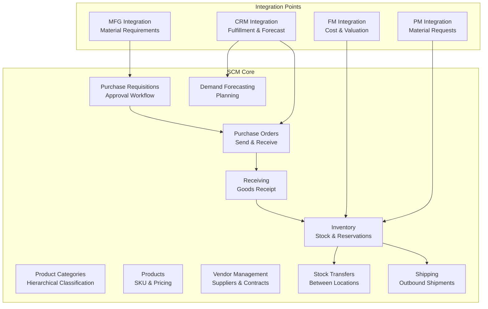
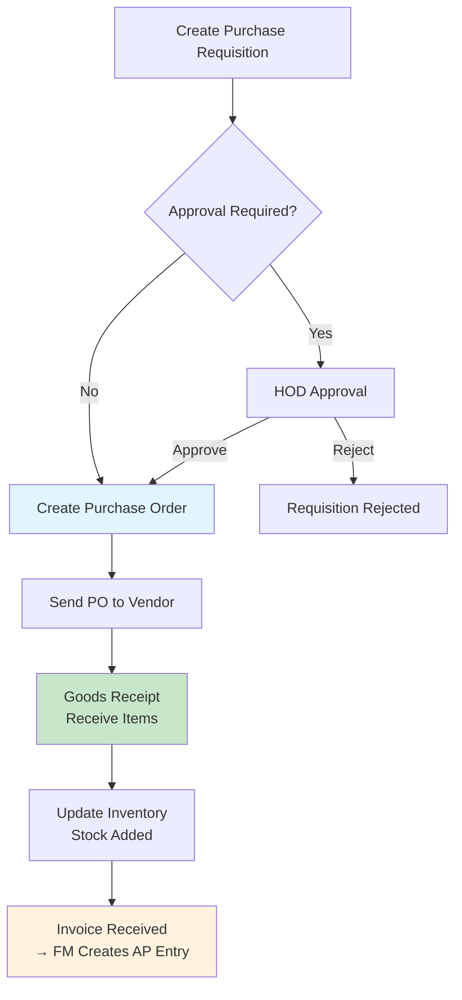

# Supply Chain Management Module

Product catalog, inventory, procurement, vendor management, warehouse operations, and demand forecasting. Port **8003** (docker-compose: 8006).

## Module Overview

## Documentation Structure

### Core Features
- `product-catalog.md` — Products and categories
- `vendor-management.md` — Suppliers and contracts
- `procurement.md` — Requisitions and purchase orders
- `inventory-management.md` — Stock, reservations, transfers
- `warehouse-operations.md` — Receiving and shipping
- `demand-forecasting.md` — Planning and safety stock
- `reports.md` — Inventory, vendor, procurement reports

### Integration and APIs
- `api-reference.md` — REST API documentation
- `event-architecture.md` — Kafka event catalog

### Implementation
- `database-schema.md` — Data models

## Domain Models (18 types)

| Model | Key Fields |
|-------|-----------|
| `Product` | ID, SKU, Name, Description, CategoryID, UnitPrice, UnitCost, ReorderPoint |
| `ProductCategory` | ID, Name, Description, ParentCategoryID |
| `Supplier` | ID, Code, Name, ContactPerson, Email, Phone, PaymentTerms, Status |
| `VendorContract` | ID, SupplierID, StartDate, EndDate, Terms, DiscountRate |
| `PurchaseRequisition` | ID, RequesterID, DepartmentID, Status, Items[], TotalAmount |
| `PurchaseRequisitionLine` | ProductID, Quantity, EstimatedUnitPrice |
| `PurchaseOrder` | ID, SupplierID, OrderDate, ExpectedDelivery, Status, Items[] |
| `PurchaseOrderLine` | ProductID, Quantity, UnitPrice, ReceivedQuantity |
| `InventoryItem` | ID, ProductID, LocationID, QuantityOnHand, QuantityReserved, ReorderPoint, MaxStock |
| `InventoryMovement` | ID, ProductID, LocationID, MovementType, Quantity, ReferenceID, UnitCost |
| `StockTransfer` | ID, FromLocationID, ToLocationID, Status, Items[] |
| `Location` | ID, Name, Code, Type, Address |
| `Receipt` | ID, PurchaseOrderID, ReceivedDate, Items[], Status |
| `ReceiptLine` | ProductID, QuantityReceived, QuantityAccepted, Notes |
| `Shipment` | ID, CustomerID, ShippedDate, Status, Items[] |
| `ShipmentLine` | ProductID, QuantityShipped |
| `DemandForecast` | ID, ProductID, PeriodStart, PeriodEnd, ForecastQuantity, ActualQuantity |

## Business Services (7)

| Service | Key Methods | Description |
|---------|-------------|-------------|
| `ProductManagementService` | CRUD products, CRUD categories | Product catalog with category hierarchy |
| `SupplierManagementService` | CRUD suppliers, CRUD contracts | Vendor relationships and agreements |
| `PurchaseOrderService` | CRUD requisitions (with approve/reject), CRUD orders (with send), stock reservation on order send | Full procurement lifecycle |
| `InventoryService` | CRUD items, reserve/release stock, CRUD transfers (with execute) | Stock tracking and movements |
| `WarehouseService` | CRUD receipts, CRUD shipments | Inbound/outbound logistics |
| `DemandPlanningService` | CRUD forecasts | Demand planning |
| `ReportService` | Inventory levels, vendor performance, procurement metrics, safety stock | Reporting |

## API Endpoints (47 routes)

### Product Categories
| Method | Path |
|--------|------|
| GET | `/api/v1/product-categories` |
| POST | `/api/v1/product-categories` |
| GET | `/api/v1/product-categories/:id` |
| PUT | `/api/v1/product-categories/:id` |
| DELETE | `/api/v1/product-categories/:id` |

### Products
| Method | Path |
|--------|------|
| GET | `/api/v1/products` |
| POST | `/api/v1/products` |
| GET | `/api/v1/products/:id` |
| PUT | `/api/v1/products/:id` |
| DELETE | `/api/v1/products/:id` |

### Vendors
| Method | Path |
|--------|------|
| GET | `/api/v1/vendors` |
| POST | `/api/v1/vendors` |
| GET | `/api/v1/vendors/:id` |
| PUT | `/api/v1/vendors/:id` |
| DELETE | `/api/v1/vendors/:id` |

### Vendor Contracts
| Method | Path |
|--------|------|
| GET | `/api/v1/vendor-contracts` |
| POST | `/api/v1/vendor-contracts` |
| GET | `/api/v1/vendor-contracts/:id` |
| PUT | `/api/v1/vendor-contracts/:id` |
| DELETE | `/api/v1/vendor-contracts/:id` |

### Purchase Requisitions
| Method | Path |
|--------|------|
| GET | `/api/v1/purchase-requisitions` |
| POST | `/api/v1/purchase-requisitions` |
| GET | `/api/v1/purchase-requisitions/:id` |
| PUT | `/api/v1/purchase-requisitions/:id` |
| DELETE | `/api/v1/purchase-requisitions/:id` |
| POST | `/api/v1/purchase-requisitions/:id/approve` |
| POST | `/api/v1/purchase-requisitions/:id/reject` |

### Purchase Orders
| Method | Path |
|--------|------|
| GET | `/api/v1/purchase-orders` |
| POST | `/api/v1/purchase-orders` |
| GET | `/api/v1/purchase-orders/:id` |
| PUT | `/api/v1/purchase-orders/:id` |
| DELETE | `/api/v1/purchase-orders/:id` |
| POST | `/api/v1/purchase-orders/:id/send` |

### Inventory
| Method | Path |
|--------|------|
| GET | `/api/v1/inventory` |
| POST | `/api/v1/inventory` |
| GET | `/api/v1/inventory/:id` |
| PUT | `/api/v1/inventory/:id` |
| DELETE | `/api/v1/inventory/:id` |
| POST | `/api/v1/inventory/reserve` |
| POST | `/api/v1/inventory/release` |

### Stock Transfers
| Method | Path |
|--------|------|
| GET | `/api/v1/stock-transfers` |
| POST | `/api/v1/stock-transfers` |
| GET | `/api/v1/stock-transfers/:id` |
| POST | `/api/v1/stock-transfers/:id/execute` |

### Receipts
| Method | Path |
|--------|------|
| GET | `/api/v1/receipts` |
| POST | `/api/v1/receipts` |
| GET | `/api/v1/receipts/:id` |
| PUT | `/api/v1/receipts/:id` |

### Shipments
| Method | Path |
|--------|------|
| GET | `/api/v1/shipments` |
| POST | `/api/v1/shipments` |
| GET | `/api/v1/shipments/:id` |
| PUT | `/api/v1/shipments/:id` |

### Demand Forecasts
| Method | Path |
|--------|------|
| GET | `/api/v1/demand-forecasts` |
| POST | `/api/v1/demand-forecasts` |
| GET | `/api/v1/demand-forecasts/:id` |
| PUT | `/api/v1/demand-forecasts/:id` |

### Reports
| Method | Path | Description |
|--------|------|-------------|
| GET | `/api/v1/reports/inventory-levels` | Current stock levels |
| GET | `/api/v1/reports/vendor-performance` | Vendor metrics |
| GET | `/api/v1/reports/procurement-metrics` | Procurement stats |
| GET | `/api/v1/reports/safety-stock` | Safety stock calculations |

## Procurement Workflow

## Kafka Integration

### Events Published (22 topic constants)

**Inventory:** `scm.inventory.received`, `scm.inventory.shipped`, `scm.inventory.adjusted`, `scm.inventory.low.stock`, `scm.inventory.out.of.stock`, `scm.inventory.valued`, `scm.inventory.updated`

**Purchase Orders:** `scm.purchase.order.created`, `scm.purchase.order.sent`, `scm.purchase.order.received`, `scm.purchase.order.cancelled`

**Vendors:** `scm.vendor.created`, `scm.vendor.updated`, `scm.vendor.performance.evaluated`

**Shipments:** `scm.shipment.created`, `scm.shipment.dispatched`, `scm.shipment.delivered`, `scm.shipment.delayed`

**Other:** `scm.training.required` (→ HR), `scm.material.delivered`, `scm.material.received`, `scm.invoice.received` (→ FM)

### Events Consumed (8 topics, per CDD)

| Topic | Publisher | Logic |
|-------|-----------|-------|
| `crm.sales.order.created` | CRM | Logged only |
| `crm.customer.demand.forecast` | CRM | Create demand forecast record |
| `mfg.material.required` | MFG | Auto-create purchase requisition |
| `mfg.material.consumed` | MFG | Issue raw material from inventory |
| `mfg.production.completed` | MFG | Receive finished goods into inventory |
| `fin.vendor.payment.processed` | FM | Logged only |
| `prj.material.requested` | PM | Issue material from inventory |

## Seed Data

On startup, the service seeds one location:
- **Location**: "Main Warehouse" (Code: MAIN-WH, Type: WAREHOUSE)

## Implementation Status vs Documentation

| Feature Claimed | Actual Status |
|----------------|--------------|
| Product CRUD | Fully implemented |
| Product categories (hierarchical) | Implemented |
| Vendor management with contracts | Implemented |
| Purchase requisition → PO → receipt | Fully implemented with approve/reject workflow |
| Inventory with stock reservations | Implemented |
| Stock transfers between locations | Implemented (create → execute) |
| Demand forecasting with safety stock | Implemented |
| Inventory reports | Implemented (basic level/valuation) |
| Vendor performance reports | Implemented (basic metrics) |
| Procurement metrics | Implemented (basic stats) |
| Real-time inventory valuation | Not implemented |
| Bin/shelf location tracking | Not implemented |
| Pick/pack/ship optimization | Not implemented |
| EDI integration | Not implemented |
| Supplier portal | Not implemented |
| ABC analysis | Not implemented |
| Lot/serial number tracking | Not implemented |
| Three-way matching | Event-based stub only |

## Known Limitations

| Gap | Detail |
|-----|--------|
| No inventory valuation | `scm.inventory.valued` event published but no actual costing logic |
| No bin/shelf management | Location is a single string, no warehouse layout |
| No pick path optimization | Warehouse operations are simple CRUD |
| No supplier portal | Vendors managed through API only |
| No EDI | No electronic data interchange |
| No lot/serial tracking | Inventory items have no lot tracking |
| No auto-reorder | ReorderPoint model field exists but no automatic PO generation |
| Demand forecast is basic | Manual CRUD — no ML/statistical forecasting |
| In-memory only | All data lost on restart |
| No pagination | List endpoints return all records |
| Fire-and-forget events | `_ = publisher.Publish(...)` ignores errors |

## Related Modules

- [Financial Management](../financial-management/) — Purchase order costs, inventory valuation via Kafka
- [Manufacturing](../manufacturing/) — Material requirements (mfg.material.required)
- [Customer Relations](../customer-relationship-management/) — Demand forecasts, order fulfillment
- [Project Management](../project-management/) — Material requests from projects
