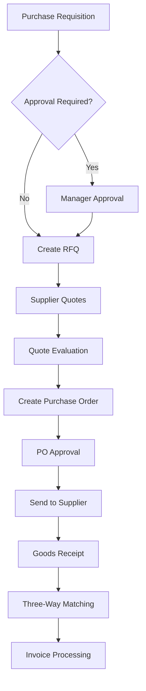

# Supply Chain Management Module

Comprehensive supply chain optimization from suppliers to customers, managing inventory, procurement, and logistics operations.

## Overview

The Supply Chain Management module optimizes the flow of goods and materials throughout the organization. It provides real-time inventory tracking, automated procurement processes, and supplier relationship management to ensure efficient operations and cost control.

**Key Capabilities:**
- Multi-location inventory management with real-time tracking
- Procurement processes with supplier management
- Warehouse operations and logistics coordination
- Demand planning and forecasting
- Quality management and compliance tracking
- Supplier relationship management and performance monitoring

## Core Features

### Inventory Management

**Purpose**: Track and manage inventory across multiple locations with real-time visibility

**Key Features:**
- **Multi-Location Inventory**: Track stock across warehouses, stores, and distribution centers
- **Real-Time Tracking**: Live inventory updates with every transaction
- **Serial/Lot Tracking**: Full traceability for recalled or expired products
- **Reorder Management**: Automatic reorder points and quantity calculations
- **Cycle Counting**: Scheduled and ad-hoc inventory counting procedures
- **Valuation Methods**: FIFO, LIFO, weighted average costing

**Implementation Example:**
```go
type InventoryItem struct {
    ID                string          `json:"id"`
    ProductID         string          `json:"product_id"`
    LocationID        string          `json:"location_id"`
    QuantityOnHand    int             `json:"quantity_on_hand"`
    QuantityReserved  int             `json:"quantity_reserved"`
    QuantityAvailable int             `json:"quantity_available"`
    ReorderPoint      int             `json:"reorder_point"`
    MaximumStock      int             `json:"maximum_stock"`
    UnitCost          decimal.Decimal `json:"unit_cost"`
    LastReceived      *time.Time      `json:"last_received,omitempty"`
    LastSold          *time.Time      `json:"last_sold,omitempty"`
}

type InventoryMovement struct {
    ID            string              `json:"id"`
    ProductID     string              `json:"product_id"`
    LocationID    string              `json:"location_id"`
    MovementType  InventoryMovementType `json:"movement_type"`
    Quantity      int                 `json:"quantity"`
    UnitCost      decimal.Decimal     `json:"unit_cost"`
    ReferenceType string              `json:"reference_type"`
    ReferenceID   string              `json:"reference_id"`
    Notes         string              `json:"notes,omitempty"`
    CreatedAt     time.Time           `json:"created_at"`
    CreatedBy     string              `json:"created_by"`
}

func (s *InventoryService) ProcessMovement(ctx context.Context, movement InventoryMovement) error {
    // Get current inventory item
    item, err := s.repo.GetInventoryItem(ctx, movement.ProductID, movement.LocationID)
    if err != nil {
        return err
    }
    
    // Calculate new quantities based on movement type
    var newQuantity int
    switch movement.MovementType {
    case MovementTypeReceipt:
        newQuantity = item.QuantityOnHand + movement.Quantity
    case MovementTypeShipment:
        if item.QuantityAvailable < movement.Quantity {
            return ErrInsufficientInventory
        }
        newQuantity = item.QuantityOnHand - movement.Quantity
    case MovementTypeAdjustment:
        newQuantity = movement.Quantity // Set to specific quantity
    case MovementTypeTransfer:
        return s.processTransfer(ctx, movement)
    default:
        return ErrInvalidMovementType
    }
    
    // Update inventory item
    item.QuantityOnHand = newQuantity
    item.QuantityAvailable = newQuantity - item.QuantityReserved
    
    // Save updates in transaction
    return s.repo.UpdateInventoryWithMovement(ctx, item, &movement)
}
```

### Procurement Management

**Purpose**: Manage the complete procurement process from requisition to receipt

**Key Features:**
- **Purchase Requisitions**: Employee requests for purchases with approval workflows
- **Request for Quotes**: RFQ process with supplier comparison
- **Purchase Orders**: Generate and manage POs with delivery tracking
- **Supplier Management**: Comprehensive supplier database with performance tracking
- **Contract Management**: Track supplier contracts and terms
- **Three-Way Matching**: Automated matching of PO, receipt, and invoice

**Purchase Order Workflow:**


### Warehouse Operations

**Purpose**: Optimize warehouse efficiency and accuracy

**Key Features:**
- **Receiving**: Goods receipt with quality inspection and put-away
- **Put-Away**: Optimal storage location assignment
- **Picking**: Batch picking and pick path optimization
- **Packing**: Packing slip generation and shipping label creation
- **Shipping**: Carrier selection and shipment tracking
- **Cycle Counting**: Perpetual inventory counting programs

**Warehouse Management Example:**
```go
type WarehouseOperation struct {
    ID              string            `json:"id"`
    Type            OperationType     `json:"type"`
    Status          OperationStatus   `json:"status"`
    Priority        Priority          `json:"priority"`
    LocationID      string            `json:"location_id"`
    AssignedTo      *string           `json:"assigned_to,omitempty"`
    Items           []OperationItem   `json:"items"`
    Instructions    string            `json:"instructions"`
    CreatedAt       time.Time         `json:"created_at"`
    CompletedAt     *time.Time        `json:"completed_at,omitempty"`
}

func (s *WarehouseService) CreatePickingOperation(ctx context.Context, orderID string) (*WarehouseOperation, error) {
    // Get order items
    orderItems, err := s.orderService.GetOrderItems(ctx, orderID)
    if err != nil {
        return nil, err
    }
    
    // Optimize pick path
    optimizedItems := s.optimizePickPath(orderItems)
    
    operation := &WarehouseOperation{
        ID:           uuid.New().String(),
        Type:         OperationTypePicking,
        Status:       StatusPending,
        Priority:     s.calculatePriority(orderItems),
        LocationID:   s.selectOptimalLocation(orderItems),
        Items:        optimizedItems,
        Instructions: s.generatePickInstructions(optimizedItems),
        CreatedAt:    time.Now(),
    }
    
    return s.repo.CreateOperation(ctx, operation)
}
```

### Supplier Relationship Management

**Purpose**: Manage supplier relationships and performance

**Key Features:**
- **Supplier Portal**: Self-service portal for suppliers
- **Performance Scorecards**: Track delivery, quality, and pricing metrics
- **Supplier Development**: Improvement programs and audits
- **Risk Management**: Supplier risk assessment and mitigation
- **Diversity Programs**: Minority and women-owned business tracking
- **Contract Compliance**: Monitor adherence to contract terms

### Demand Planning and Forecasting

**Purpose**: Predict future demand and optimize inventory levels

**Key Features:**
- **Demand Forecasting**: Statistical forecasting models
- **Seasonal Analysis**: Account for seasonal demand patterns
- **Trend Analysis**: Identify and project demand trends
- **Safety Stock Calculations**: Optimize safety stock levels
- **ABC Analysis**: Categorize items by importance
- **Economic Order Quantity**: Calculate optimal order quantities

## API Endpoints

### Inventory Management
```http
# Get inventory levels
GET /api/v1/scm/inventory
Query Parameters:
  - location_id: Filter by location
  - product_id: Filter by product
  - low_stock: Show only low stock items (true/false)

# Process inventory movement
POST /api/v1/scm/inventory/movements
{
  "product_id": "prod-123",
  "location_id": "loc-456",
  "movement_type": "RECEIPT",
  "quantity": 100,
  "unit_cost": "25.50",
  "reference_type": "PURCHASE_ORDER",
  "reference_id": "po-789",
  "notes": "Weekly inventory receipt"
}

# Get inventory by location
GET /api/v1/scm/inventory/locations/{location_id}

# Adjust inventory levels
POST /api/v1/scm/inventory/adjustments
{
  "items": [
    {
      "product_id": "prod-123",
      "location_id": "loc-456", 
      "new_quantity": 150,
      "reason": "Cycle count adjustment"
    }
  ]
}
```

### Purchase Order Management
```http
# Create purchase order
POST /api/v1/scm/purchase-orders
{
  "supplier_id": "sup-123",
  "order_date": "2024-03-15",
  "expected_delivery": "2024-03-25",
  "items": [
    {
      "product_id": "prod-456",
      "quantity": 100,
      "unit_price": "25.00",
      "description": "Widget Component A"
    }
  ]
}

# List purchase orders
GET /api/v1/scm/purchase-orders
Query Parameters:
  - status: Filter by order status
  - supplier_id: Filter by supplier
  - date_from: Start date filter
  - date_to: End date filter

# Get purchase order details
GET /api/v1/scm/purchase-orders/{id}

# Receive goods against PO
POST /api/v1/scm/purchase-orders/{id}/receive
{
  "received_items": [
    {
      "product_id": "prod-456",
      "quantity_received": 95,
      "quality_passed": true,
      "notes": "5 units damaged in shipping"
    }
  ]
}
```

### Supplier Management
```http
# List suppliers
GET /api/v1/scm/suppliers
Query Parameters:
  - status: Filter by supplier status
  - category: Filter by supplier category
  - performance_rating: Filter by rating

# Create supplier
POST /api/v1/scm/suppliers
{
  "name": "ABC Suppliers Inc",
  "contact_name": "John Smith",
  "email": "john@abcsuppliers.com",
  "phone": "+1-555-123-4567",
  "address": {
    "street": "123 Industrial Blvd",
    "city": "Manufacturing City",
    "state": "CA",
    "postal_code": "12345"
  },
  "payment_terms": "NET_30",
  "categories": ["ELECTRONICS", "COMPONENTS"]
}

# Get supplier performance
GET /api/v1/scm/suppliers/{id}/performance
Query Parameters:
  - period: Time period for performance data
  - metrics: Specific metrics to include
```

### Warehouse Operations
```http
# Create warehouse operation
POST /api/v1/scm/warehouse/operations
{
  "type": "PICKING",
  "priority": "HIGH",
  "location_id": "loc-main",
  "reference_id": "order-789",
  "items": [
    {
      "product_id": "prod-123",
      "quantity": 5,
      "location": "A1-B2-C3"
    }
  ]
}

# Get warehouse operations
GET /api/v1/scm/warehouse/operations
Query Parameters:
  - type: Filter by operation type
  - status: Filter by status
  - assigned_to: Filter by assignee

# Complete warehouse operation
POST /api/v1/scm/warehouse/operations/{id}/complete
{
  "completed_items": [
    {
      "product_id": "prod-123",
      "quantity_completed": 5,
      "notes": "All items picked successfully"
    }
  ]
}
```

## Integration Points

### Internal Module Integration
- **Finance Module**: Purchase order processing, invoice matching, payment processing, inventory valuation
- **Manufacturing Module**: Material requirements planning, production scheduling, bill of materials integration
- **Sales/CRM Module**: Available-to-promise calculations, order fulfillment, customer delivery tracking
- **Project Module**: Project-specific inventory allocation, material cost tracking

### External System Integration
- **Supplier Systems**: EDI integration for orders, invoices, and shipping notifications
- **Shipping Carriers**: Rate shopping, shipment tracking, delivery confirmation
- **Warehouse Management Systems**: Advanced warehouse operations integration
- **ERP Systems**: Integration with existing enterprise systems

## Business Rules and Automation

### Inventory Rules
- Automatic reorder when stock falls below reorder point
- Safety stock calculations based on lead time and demand variability
- Lot/serial number tracking for regulated products
- First-in-first-out (FIFO) inventory rotation

### Procurement Rules
- Approval workflows based on purchase amount thresholds
- Preferred supplier selection based on performance metrics
- Contract compliance monitoring and alerts
- Three-way matching requirements for invoice processing

### Warehouse Rules
- Optimal location assignment based on product characteristics
- Pick path optimization to minimize travel time
- Cycle counting frequency based on product classification
- Quality inspection requirements for incoming goods

## Analytics and Reporting

### Inventory Reports
- Inventory valuation by location and product
- Stock aging analysis and obsolescence reports
- Inventory turnover and velocity analysis
- Stockout frequency and impact reports

### Procurement Reports  
- Supplier performance scorecards
- Purchase price variance analysis
- Contract compliance reports
- Spend analysis by category and supplier

### Warehouse Reports
- Warehouse productivity and efficiency metrics
- Pick accuracy and cycle time reports
- Storage utilization and capacity planning
- Order fulfillment performance

## Next Steps

Learn about other integrated business modules:
- [Manufacturing](manufacturing.md) - Production planning and BOM management
- [Financial Management](financial-management.md) - Purchase accounting and cost tracking
- [Customer Relationship Management](customer-relationship-management.md) - Sales and order management