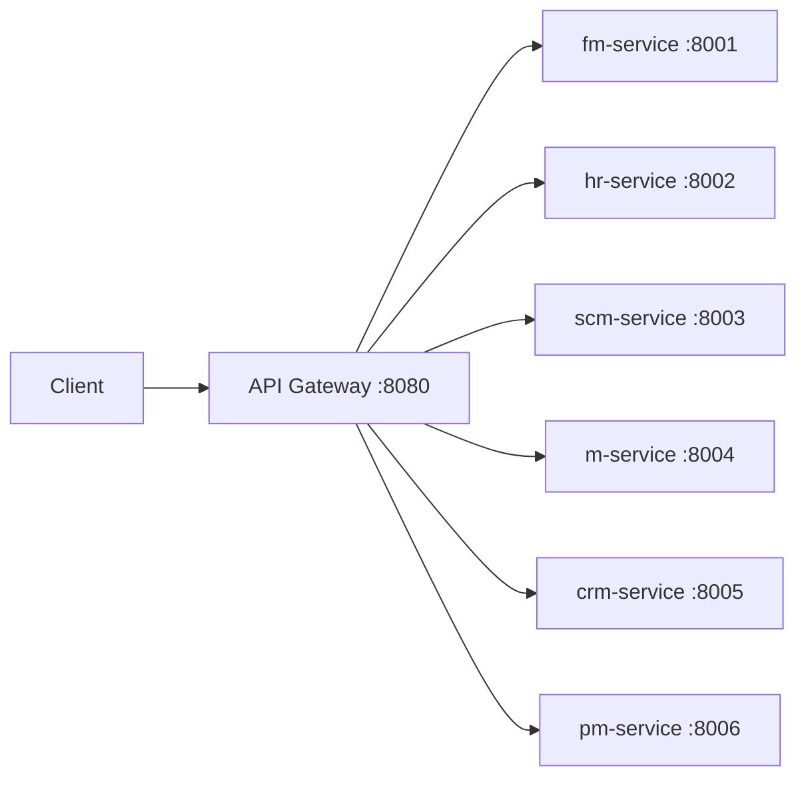

# Integration Patterns

## Synchronous Communication (HTTP/REST)

All synchronous integration flows through the **API Gateway** (port 8080), which reverse-proxies to backend services.



The gateway forwards the full request path as-is. No request transformation occurs in the deployed path.

## Asynchronous Communication (Kafka Events)

All services use Kafka for event-driven integration. The pattern is:

```
Service A publishes event → Kafka topic → Service B consumes event
```

### Producer Pattern

```go
type EventPublisher interface {
    Publish(ctx context.Context, topic string, key string, payload interface{}) error
}
```

Implemented via `segmentio/kafka-go` with fire-and-forget semantics:

```go
_ = publisher.Publish(ctx, "mfg.production.completed", orderID, event)
```

### Consumer Pattern

Each service runs a background goroutine that blocks on `ReadMessage()` and routes by topic:

```go
switch msg.Topic {
case "crm.sales.order.created":
    // auto-schedule production
case "scm.material.received":
    // log only
}
```

### Kafka Configuration

| Setting | Value |
|---------|-------|
| Kafka Version | Confluent CP 7.0.1 |
| Go Client | `segmentio/kafka-go` v0.4.51 |
| Producer Balancer | `LeastBytes` |
| Consumer Group | Per-service (e.g., `m-service`, `fm-service`) |

## Cross-Service Integration Flows

### Make-to-Order

```
CRM creates Sales Order
  → publishes crm.sales.order.created
  → Manufacturing consumes: auto-schedules production
  → SCM consumes: logs (future: checks inventory)
```

### Material Planning

```
Manufacturing creates Production Order
  → publishes mfg.material.required (per BOM component)
  → SCM consumes: auto-creates purchase requisition
```

### Production Completion

```
Manufacturing completes Production Order
  → publishes mfg.production.completed + mfg.material.consumed
  → SCM consumes: receives finished goods, issues raw materials
  → FM consumes: creates WIP → finished goods journal entries
```

### Procurement to Financial

```
SCM sends Purchase Order
  → publishes scm.purchase.order.created
  → FM consumes: creates inventory-in-transit journal entry
```

### Payroll to Financial

```
HR processes Payroll
  → publishes hr.payroll.processed
  → FM consumes: creates salary expense journal entry
```

### Project to Financial

```
PM logs Time
  → publishes prj.time.logged
  → FM consumes: creates unbilled receivables journal entry
```

### Project to Supply Chain

```
PM requests Material
  → publishes prj.material.requested
  → SCM consumes: issues material from inventory
```

### Project to Manufacturing

```
PM requests Custom Order
  → publishes prj.custom.order.created
  → Manufacturing consumes: auto-schedules production
```

### Sales Order to Project

```
CRM receives Sales Order
  → publishes crm.sales.order.received
  → PM consumes: auto-creates project + kickoff task
```

### Training Trigger

```
SCM requires Training
  → publishes scm.training.required
  → HR consumes: auto-creates training program
```

## Integration Patterns Not Implemented

- **No circuit breakers** — no protection against cascading failures
- **No retry logic** — failed Kafka messages are dropped after logging
- **No dead-letter queues** — unprocessable events are lost
- **No idempotency keys** — duplicate events may cause duplicate side-effects
- **No saga pattern** — no compensating transactions for distributed operations
- **No webhooks** — no outbound HTTP callbacks to external systems
