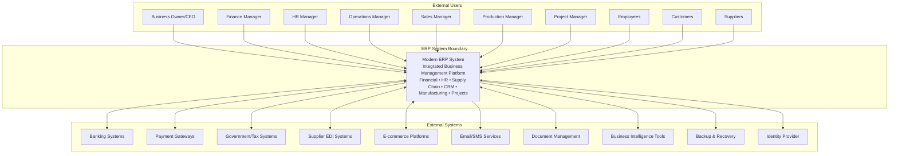
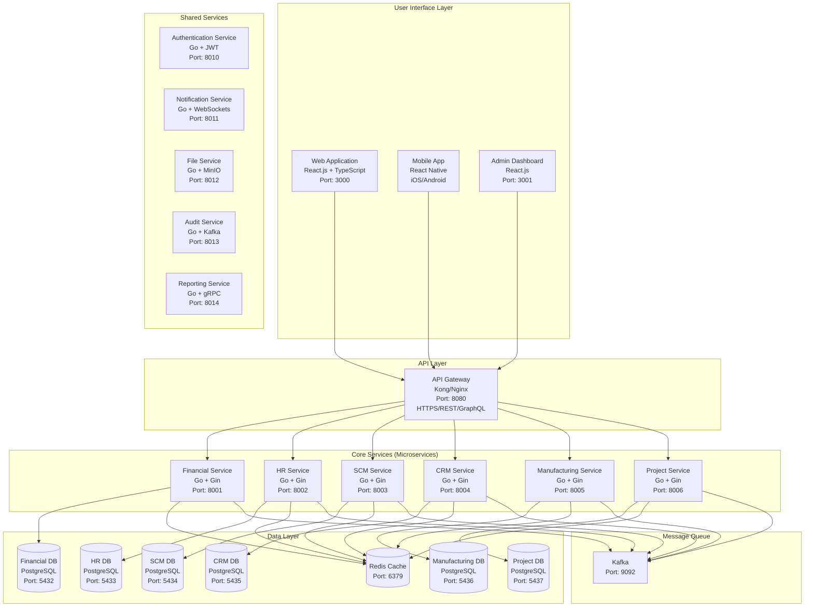

# System Architecture Documentation

This document provides comprehensive coverage of the ERP system architecture, including system design, technical specifications, infrastructure, and deployment considerations.

## Table of Contents

- [System Overview](#system-overview)
- [C4 Architecture Model](#c4-architecture-model)
- [Microservices Architecture](#microservices-architecture)
- [Technology Stack](#technology-stack)
- [Data Architecture](#data-architecture)
- [Security Architecture](#security-architecture)
- [Integration Architecture](#integration-architecture)
- [Performance and Scalability](#performance-and-scalability)
- [Deployment Architecture](#deployment-architecture)
- [Monitoring and Observability](#monitoring-and-observability)

---

## System Overview

The ERP system follows a modern microservices architecture designed to support six core business domains: Financial Management (FIN), Human Resources Management (HRM), Supply Chain Management (SCM), Customer Relationship Management (CRM), Manufacturing (MFG), and Project Management (PRJ).

### Architecture Principles

- **Domain-Driven Design (DDD)**: Clear bounded contexts for each business domain
- **Microservices Pattern**: Independent, deployable services with clear responsibilities
- **Event-Driven Architecture**: Asynchronous communication using messaging patterns
- **API-First Design**: Well-defined REST APIs with comprehensive documentation
- **Cloud-Native**: Containerized applications designed for modern cloud infrastructure
- **Scalability**: Horizontal scaling capabilities with load balancing and auto-scaling
- **Resilience**: Circuit breaker patterns, graceful degradation, and fault tolerance

---

## C4 Architecture Model

### Level 1: System Context Diagram

The ERP system serves as a unified business management platform with clear boundaries separating internal business operations from external systems and users.



### External Systems Integration

**Financial Systems:**
- Banking APIs for real-time account balances, transaction processing, ACH/wire transfers
- Payment gateways for credit card processing, online payments, recurring billing
- Tax systems for automated tax filing, compliance reporting, rate updates

**Operational Systems:**
- Supplier EDI for electronic data interchange (purchase orders, invoices, shipping notices)
- E-commerce platforms for inventory synchronization, order import, customer data sync
- Shipping carriers for rate calculation, label generation, tracking updates

**Infrastructure Systems:**
- Identity providers for single sign-on (SSO), multi-factor authentication, user provisioning
- Document management for contract storage, compliance documents, audit trails
- Communication services for email notifications, SMS alerts, workflow communications

### Level 2: Container Diagram



---

## Microservices Architecture

### Service Structure

Each microservice follows Clean Architecture patterns with the following structure:

```
services/{service-name}/
├── cmd/
│   ├── main.go              # Application entry point (some services)
│   └── server/main.go       # Alternative entry point (some services)
├── internal/
│   ├── api/
│   │   ├── handlers/        # HTTP request handlers
│   │   └── routes/          # Route definitions
│   ├── business/domain/     # Business logic and domain models
│   ├── config/              # Service configuration
│   └── data/migrations/     # Database migrations (when applicable)
├── common-utils/            # Shared utilities (symlinked from shared/)
├── go.mod
├── go.sum
├── Makefile                 # Service-specific build commands
└── Dockerfile
```

### Service Responsibilities

| Service | Port | Database | Primary Responsibilities |
|---------|------|----------|-------------------------|
| **Financial Service** | 8001 | PostgreSQL (5432) | General Ledger, Accounts Payable/Receivable, budgeting, financial reporting |
| **HR Service** | 8002 | PostgreSQL (5433) | Employee management, payroll, time tracking, performance management |
| **SCM Service** | 8003 | PostgreSQL (5434) | Inventory management, purchasing, supplier relationships, logistics |
| **CRM Service** | 8004 | PostgreSQL (5435) | Customer management, sales pipeline, marketing campaigns, support |
| **Manufacturing Service** | 8005 | PostgreSQL (5436) | Production planning, BOM management, quality control, capacity planning |
| **Project Service** | 8006 | PostgreSQL (5437) | Project management, resource allocation, time tracking, billing |

### Shared Services

**Authentication Service (Port 8010)**
- Centralized authentication and authorization using JWT tokens
- Role-based access control (RBAC) implementation
- Single Sign-On (SSO) integration capabilities
- User session management and token refresh

**Notification Service (Port 8011)**
- Real-time notifications via WebSockets
- Email and SMS notification delivery
- Push notifications for mobile applications
- Event-driven notification workflows

**File Service (Port 8012)**
- Document and file management using MinIO object storage
- File upload/download with access controls
- Document versioning and metadata management
- Integration with document workflows

**Audit Service (Port 8013)**
- Comprehensive audit trail for all system activities
- Event sourcing for critical business events
- Compliance reporting and data lineage
- Security monitoring and anomaly detection

**Reporting Service (Port 8014)**
- Advanced reporting and analytics capabilities
- Custom report generation and scheduling
- Data export in multiple formats (PDF, Excel, CSV)
- Business intelligence dashboard support

---

## Technology Stack

### Backend Technologies

**Core Runtime:**
- **Language**: Go 1.21+ for high performance and strong typing
- **Web Framework**: Gin for lightweight, fast HTTP services
- **ORM**: GORM for database operations with migration support
- **Validation**: Go Playground Validator for request validation

**Database and Storage:**
- **Primary Database**: PostgreSQL 15+ for ACID compliance and advanced features
- **Cache Layer**: Redis 7+ for session storage and application caching
- **Object Storage**: MinIO for document and file management
- **Search Engine**: Elasticsearch for advanced search and analytics (optional)

**Message Queue and Event Processing:**
- **Message Broker**: Apache Kafka for event streaming and async communication
- **Event Processing**: Kafka Streams for real-time event processing
- **Dead Letter Queues**: For handling failed message processing

**Monitoring and Observability:**
- **Metrics**: Prometheus for metrics collection
- **Logging**: Structured logging with JSON format
- **Tracing**: OpenTelemetry for distributed tracing
- **Health Checks**: Built-in health check endpoints

### Frontend Technologies

**Web Application:**
- **Framework**: React 18+ with TypeScript for type safety
- **UI Library**: Material-UI or Ant Design for consistent design
- **State Management**: Zustand or Redux Toolkit for predictable state
- **API Client**: React Query + Axios for data fetching and caching
- **Build Tool**: Vite for fast development and optimized builds

**Mobile Application:**
- **Framework**: React Native for cross-platform development
- **Navigation**: React Navigation for declarative routing
- **State Management**: Shared business logic with web application
- **Offline Support**: Redux Persist for offline data synchronization

### Infrastructure Technologies

**Containerization:**
- **Runtime**: Docker with multi-stage builds for optimized images
- **Orchestration**: Kubernetes with Helm charts for package management
- **Service Mesh**: Istio for advanced traffic management (optional)

**API Gateway:**
- **Technology**: Kong or Nginx with Lua scripting
- **Features**: Rate limiting, authentication, request/response transformation
- **Monitoring**: Built-in analytics and monitoring capabilities

---

## Data Architecture

### Database Design Principles

- **Database per Service**: Each microservice owns its data
- **ACID Compliance**: PostgreSQL ensures data consistency
- **Schema Evolution**: Flyway migrations for version control
- **Performance Optimization**: Proper indexing and query optimization
- **Backup and Recovery**: Automated daily backups with point-in-time recovery

### Data Consistency Patterns

**Eventual Consistency:**
- Asynchronous event processing for cross-service data updates
- Saga pattern for distributed transactions
- Event sourcing for critical business events

**Data Synchronization:**
- Event-driven updates between services
- CQRS (Command Query Responsibility Segregation) for read/write separation
- Materialized views for complex queries

### Caching Strategy

**Multi-Level Caching:**
- **L1 Cache**: In-memory application cache for frequently accessed data
- **L2 Cache**: Redis for shared cache across service instances
- **CDN**: CloudFront or similar for static asset caching

**Cache Invalidation:**
- Time-based expiration for frequently changing data
- Event-based invalidation for critical data updates
- Write-through and write-behind patterns based on use case

---

## Security Architecture

### Authentication and Authorization

**Authentication Flow:**
1. User credentials validated against identity provider
2. JWT tokens issued with appropriate claims and expiration
3. Refresh tokens for seamless session management
4. Multi-factor authentication for sensitive operations

**Authorization Model:**
- **Role-Based Access Control (RBAC)**: Users assigned to roles with specific permissions
- **Resource-Based Authorization**: Fine-grained permissions on specific resources
- **Attribute-Based Access Control (ABAC)**: Context-aware authorization decisions

### Data Protection

**Encryption:**
- **At Rest**: Database encryption with transparent data encryption (TDE)
- **In Transit**: TLS 1.3 for all external communications, mTLS for inter-service
- **Application Level**: Sensitive field encryption for PII and financial data

**Privacy and Compliance:**
- **GDPR Compliance**: Right to be forgotten, data portability, consent management
- **SOX Compliance**: Financial data controls and audit trails
- **HIPAA Considerations**: Healthcare data protection where applicable

### Security Monitoring

**Audit and Logging:**
- Comprehensive audit trails for all user actions
- Security event monitoring and alerting
- Centralized log aggregation with ELK stack
- Regular security assessments and penetration testing

---

## Integration Architecture

### External System Integration

**Integration Patterns:**
- **API-First**: RESTful APIs for synchronous integration
- **Event-Driven**: Kafka events for asynchronous integration
- **Message Queues**: Dead letter queues and retry mechanisms
- **Circuit Breaker**: Resilience patterns for external service calls

**Common Integrations:**
- Banking systems for payment processing
- Tax calculation services for compliance
- Shipping carriers for logistics management
- Email and SMS providers for notifications
- Document management systems for file storage

### API Design Standards

**REST API Guidelines:**
- Consistent URL patterns and HTTP methods
- Comprehensive input validation and error handling
- Pagination for large data sets
- Versioning strategy for backward compatibility
- OpenAPI documentation for all endpoints

**GraphQL Implementation:**
- Query optimization and complexity analysis
- Real-time subscriptions for live data updates
- Schema federation for distributed GraphQL
- Security considerations for query depth and rate limiting

---

## Performance and Scalability

### Horizontal Scaling

**Service Scaling:**
- Kubernetes Horizontal Pod Autoscaler (HPA) for automatic scaling
- Load balancing across multiple service instances
- Database read replicas for read-heavy workloads
- Connection pooling for database connections

**Data Partitioning:**
- Horizontal database partitioning (sharding) for large datasets
- Time-based partitioning for historical data
- Geographic partitioning for multi-region deployment

### Performance Optimization

**Database Performance:**
- Query optimization and index tuning
- Connection pooling and prepared statements
- Read replicas for read-heavy operations
- Database monitoring and slow query analysis

**Application Performance:**
- Efficient Go routines for concurrent processing
- Memory management and garbage collection optimization
- HTTP/2 and gRPC for improved network performance
- CDN integration for static asset delivery

---

## Deployment Architecture

### Cloud Infrastructure

**AWS Deployment Example:**
- **Compute**: Amazon EKS (Kubernetes) for container orchestration
- **Database**: Amazon RDS PostgreSQL with Multi-AZ deployment
- **Cache**: Amazon ElastiCache Redis with cluster mode
- **Storage**: Amazon S3 for object storage, EBS for database storage
- **Load Balancing**: Application Load Balancer (ALB) with SSL termination
- **CDN**: Amazon CloudFront for content delivery
- **Monitoring**: Amazon CloudWatch for metrics and logging

**Alternative Cloud Providers:**
- **Google Cloud**: GKE, Cloud SQL, Cloud Storage, Cloud Load Balancing
- **Microsoft Azure**: AKS, Azure Database, Blob Storage, Application Gateway
- **Multi-Cloud**: Kubernetes-based deployment for cloud portability

### Deployment Pipeline

**CI/CD Pipeline:**
- **Source Control**: Git with GitFlow branching strategy
- **Build**: Automated testing and Docker image building
- **Security Scanning**: Container vulnerability scanning
- **Quality Gates**: Code coverage, security scans, performance tests
- **Deployment**: Blue-green or canary deployments for zero downtime
- **Rollback**: Automated rollback capabilities for failed deployments

### Environment Management

**Environment Strategy:**
- **Development**: Full-featured development environment for testing
- **Staging**: Production-like environment for integration testing
- **Production**: High-availability production deployment
- **Infrastructure as Code**: Terraform or CloudFormation for reproducible infrastructure

---

## Monitoring and Observability

### Metrics and Monitoring

**Application Metrics:**
- Business metrics (transactions per minute, revenue, user activity)
- Technical metrics (response times, error rates, throughput)
- Infrastructure metrics (CPU, memory, disk, network usage)
- Custom metrics for business KPIs and SLAs

**Monitoring Stack:**
- **Metrics Collection**: Prometheus with custom exporters
- **Visualization**: Grafana dashboards for metrics visualization
- **Alerting**: AlertManager for threshold-based alerting
- **Log Aggregation**: ELK Stack (Elasticsearch, Logstash, Kibana)

### Distributed Tracing

**Tracing Implementation:**
- OpenTelemetry for standardized tracing instrumentation
- Jaeger for trace collection and visualization
- Correlation IDs for request tracking across services
- Performance bottleneck identification and optimization

### Health Checks and SLAs

**Service Health:**
- Kubernetes liveness and readiness probes
- Deep health checks for dependencies (database, cache, external services)
- Circuit breaker patterns for service resilience
- Graceful degradation for non-critical service failures

**Service Level Objectives:**
- 99.9% uptime SLA for critical business functions
- < 200ms response time for API endpoints
- < 1% error rate for all operations
- Recovery Time Objective (RTO) and Recovery Point Objective (RPO) definitions

This comprehensive architecture documentation provides the foundation for building a scalable, secure, and maintainable ERP system that can grow with business needs while maintaining high performance and reliability standards.